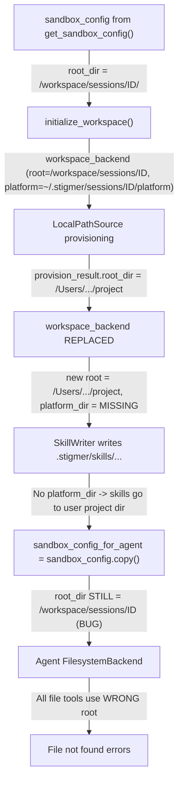

# Fix LocalPathSource Agent File Tool Failures

## Domain Analysis (Architect's Critique)

The recent Docker mount fix (bind-mounting `$HOME:$HOME`) correctly solved Phase 1: the host filesystem is now visible inside the container. But Phase 2 -- wiring the provisioned workspace root through to the agent's sandbox backend -- was never completed. The code has a **local-mode/cloud-mode asymmetry** that silently breaks LocalPathSource.

## Root Cause Trace

When `stigmer draft skill --workspace /path/to/project` runs, the execution flows through three stages:




## Bugs Found (3 interconnected)

### Bug 1 (Primary) -- `sandbox_config_for_agent` root_dir not updated in local mode

**File**: `[backend/services/agent-runner/worker/activities/execute_graphton.py](backend/services/agent-runner/worker/activities/execute_graphton.py)` lines 1814-1822

Cloud mode explicitly sets `workspace_root` from `workspace_backend.root_dir`:

```1802:1807:backend/services/agent-runner/worker/activities/execute_graphton.py
        if sandbox is not None:
            sandbox_config_for_agent: dict[str, Any] = {
                "type": "daytona",
                "sandbox_id": sandbox.id,
                "workspace_root": workspace_backend.root_dir,
            }
```

But local mode blindly copies the original sandbox_config, which still has the pre-provisioning root:

```1814:1822:backend/services/agent-runner/worker/activities/execute_graphton.py
        else:
            sandbox_config_for_agent = sandbox_config.copy()
            if workspace_init.platform_dir:
                sandbox_config_for_agent["platform_dir"] = workspace_init.platform_dir
```

The `root_dir` in `sandbox_config_for_agent` is never updated from `workspace_backend.root_dir`. This flows through to `create_sandbox_backend()` in `[sandbox_factory.py](backend/libs/python/graphton/src/graphton/core/sandbox_factory.py)` line 94:

```94:96:backend/libs/python/graphton/src/graphton/core/sandbox_factory.py
        root_dir = config.get("root_dir", ".")
        platform_dir = config.get("platform_dir")
        return FilesystemBackend(root_dir=root_dir, platform_dir=platform_dir)
```

**Result**: The Graphton `FilesystemBackend` gets `root_dir = /workspace/sessions/{id}/` (an empty directory) instead of `/Users/suresh/.../stigmer` (the user's project). Every `read`, `ls`, `glob`, and `grep` call fails.

**Impact**: This is the root cause of **every** error in the screenshot -- workspace file refs, attached file reads, directory listings -- all resolve against the empty session directory.

**Fix**: After `sandbox_config.copy()`, set `root_dir` from the (potentially updated) workspace_backend:

```python
sandbox_config_for_agent = sandbox_config.copy()
sandbox_config_for_agent["root_dir"] = workspace_backend.root_dir
if workspace_init.platform_dir:
    sandbox_config_for_agent["platform_dir"] = workspace_init.platform_dir
```

---

### Bug 2 -- Replacement workspace_backend loses platform_dir

**File**: `[execute_graphton.py](backend/services/agent-runner/worker/activities/execute_graphton.py)` lines 1272-1274

When LocalPathSource changes the workspace root, a new backend is created **without** `platform_dir`:

```1272:1274:backend/services/agent-runner/worker/activities/execute_graphton.py
                    workspace_backend = LocalWorkspaceBackend(
                        root_dir=provision_result.root_dir,
                    )
```

The original backend (from `initialize_workspace`) had `platform_dir = ~/.stigmer/sessions/{id}/platform/`. The replacement does not.

**Result**: `SkillWriter` (line 1429) uses the replacement backend to write skills to `.stigmer/skills/{name}/`. Without platform_dir, the platform mount is inactive, so skills are written directly into the user's project directory (`{project}/.stigmer/skills/...`). Meanwhile, the agent's `FilesystemBackend` (which gets platform_dir from sandbox_config_for_agent) routes `.stigmer/` reads to the platform_dir. Skills are written to one location but read from another.

**Impact**: Even after fixing Bug 1, skills written by the pre-agent setup would be invisible to the agent.

**Fix**: Preserve `platform_dir` from `workspace_init` when replacing the backend:

```python
workspace_backend = LocalWorkspaceBackend(
    root_dir=provision_result.root_dir,
    platform_dir=workspace_init.platform_dir,
)
```

---

### Bug 3 -- `file_exists` in LocalWorkspaceBackend is broken

**File**: `[backend/services/agent-runner/worker/workspace/local.py](backend/services/agent-runner/worker/workspace/local.py)` line 97

```python
def file_exists(self, rel_path: str) -> bool:
    return self._platform_root.resolve(rel_path).exists()
```

This has two defects:

1. **Wrong method**: `pathlib.Path.resolve()` resolves symlinks and makes the path absolute; it does not join paths. `self._platform_root.resolve(rel_path)` interprets `rel_path` as the `strict` parameter (a truthy string). The method effectively checks whether `self._platform_root` itself exists, ignoring `rel_path` entirely.
2. **NoneType crash**: When `platform_dir` is not set (which happens on the replacement backend from Bug 2), `self._platform_root` is `None`, and calling `.resolve()` on it raises `AttributeError`.

**Fix**: Use the same `_resolve` helper as `read_file` and `write_file`:

```python
def file_exists(self, rel_path: str) -> bool:
    return self._resolve(rel_path).exists()
```

---

## Design Observation: Cloud/Local Asymmetry

The cloud-mode path explicitly constructs `sandbox_config_for_agent` with `workspace_root` from `workspace_backend.root_dir`. The local-mode path copies the original config and hopes it is still correct. This asymmetry is the structural reason the bug exists. The fix should make both paths derive the agent's workspace root from the same source: `workspace_backend.root_dir`.

## Testing Strategy

- Run `stigmer draft skill --workspace .` from the repo root and verify the agent can read workspace files (apis/, docs/, _changelog/).
- Verify skills written by SkillWriter appear under `platform_dir` (not the user's project).
- Verify `file_exists` correctly handles paths with and without `platform_dir`.

