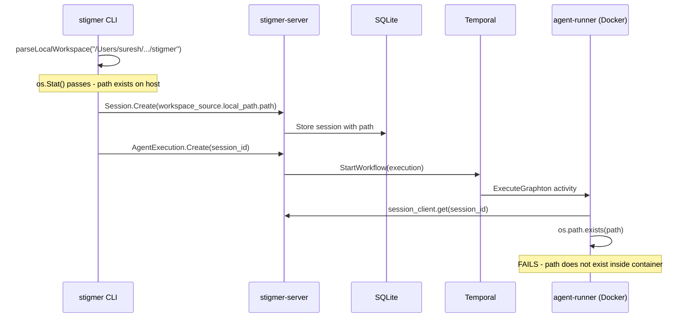

# Fix: LocalPathSource Fails Because Agent-Runner Docker Container Lacks Host Filesystem Access

## Root Cause Analysis

The `stigmer draft skill --workspace $REPO_ROOT` command fails because the agent-runner Python process runs **inside a Docker container** that has no visibility into the user's host filesystem.

### The Full Data Flow




### Why It Fails

The agent-runner Docker container is started with only three volume mounts (confirmed in both startup paths):

**[supervisor.go](backend/services/stigmer-server/pkg/supervisor/supervisor.go)** (lines 317-321):

```go
args = append(args,
    "-v", fmt.Sprintf("%s:/workspace", workspaceDir),   // {dataDir}/workspace
    "-v", fmt.Sprintf("%s:/artifacts", artifactsDir),    // {dataDir}/artifacts
    "-v", fmt.Sprintf("%s:/logs", s.config.LogDir),      // logDir
)
```

**[daemon.go](client-apps/cli/internal/cli/daemon/daemon.go)** (lines 624-631):

```go
"-v", fmt.Sprintf("%s:/workspace", workspaceDir),
"-v", fmt.Sprintf("%s:/artifacts", artifactsDir),
"-v", "/var/run/docker.sock:/var/run/docker.sock",
```

The user's project directory (`/Users/suresh/scm/github.com/stigmer/stigmer`) is **never mounted** into the container. When the agent-runner's [local_path.py](backend/services/agent-runner/worker/workspace/sources/local_path.py) calls `os.path.exists(path)` on line 56, the path doesn't exist inside the container.

### Why CLI Validation Doesn't Catch It

The CLI validates the path exists on the **host** in [run_workspace.go](client-apps/cli/cmd/stigmer/root/run_workspace.go) (line 78: `os.Stat(resolved)`). This passes because the path does exist on the host. The disconnect happens because the container filesystem is isolated from the host.

## Proposed Solution

**Bind-mount the user's home directory into the agent-runner container in local mode.**

### Rationale

- **Path identity preserved**: By mounting `$HOME:$HOME`, host paths work identically inside the container. No path translation or rewriting needed.
- **Safe for local mode**: Local mode is single-user on their own machine. The `LocalPathSource` module already gates itself to local-mode only (line 43-48 of `local_path.py`). Mounting `$HOME` is consistent with this trust boundary.
- **No container restarts**: The mount is added at container creation, covering any future workspace path under `$HOME`.
- **macOS compatible**: Docker Desktop shares `/Users/` by default, so this works out of the box.
- **Linux compatible**: Bind mounts work natively, and `--network host` is already used on Linux.
- **Read-write by design**: The [local_path.py](backend/services/agent-runner/worker/workspace/sources/local_path.py) contract (line 73-77) states the agent operates directly on the user's files with persistent changes, which requires write access (Docker's default).

### Alternatives Considered and Rejected

- **Copy workspace into container's /workspace volume**: Contradicts the `local_path.py` contract ("operating directly on user's files"), expensive for large repos, and changes don't persist back.
- **Mount only the specific workspace path**: Unknown at container startup time (container is started once by `stigmer server`, workspace path comes later from `stigmer draft/run`).
- **Run agent-runner as native Python process**: Would require Python + all dependencies installed locally, defeating the purpose of Docker isolation and ease of setup.
- **Dynamic container restart per workspace**: Disrupts running executions, complex coordination logic, architecturally fragile.

## Implementation

### File 1: [supervisor.go](backend/services/stigmer-server/pkg/supervisor/supervisor.go)

In `startAgentRunner()`, after the existing volume mounts (line 317-321), add the home directory mount:

```go
homeDir, err := os.UserHomeDir()
if err != nil {
    log.Warn().Err(err).Msg("Cannot resolve home directory; LocalPathSource workspaces may not work")
} else {
    args = append(args, "-v", fmt.Sprintf("%s:%s", homeDir, homeDir))
}
```

### File 2: [daemon.go](client-apps/cli/internal/cli/daemon/daemon.go)

In `startAgentRunner()`, add the same home directory mount after the existing volume mounts (around line 624-631):

```go
homeDir, err := os.UserHomeDir()
if err != nil {
    log.Warn().Err(err).Msg("Cannot resolve home directory; LocalPathSource workspaces may not work")
} else {
    args = append(args, "-v", fmt.Sprintf("%s:%s", homeDir, homeDir))
}
```

### Post-Change Requirement

After making these changes, the user needs to restart the server for the new container to pick up the mount:

```bash
stigmer server stop && stigmer server
```

## Scope and Risk Assessment

- **Scope**: Two Go files, ~6 lines each. No proto changes, no Python changes, no API changes.
- **Risk**: Low. This only affects local mode container startup. The mount is additive (existing mounts unchanged). If `os.UserHomeDir()` fails, we log a warning and continue without the mount (graceful degradation).
- **Testing**: Run `stigmer server stop && stigmer server`, then re-run the draft script. The `LocalPathSource` should now resolve successfully inside the container.

