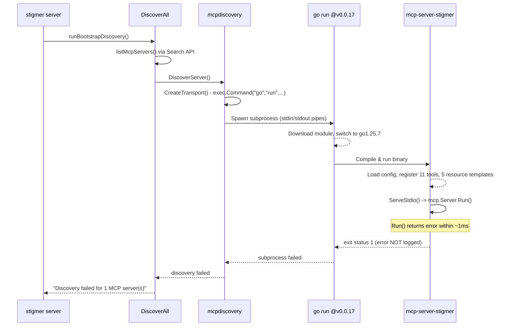

# Fix MCP Server Discovery Failure and Clean Up Output

## Root Cause Analysis

The full discovery flow during `stigmer server` startup:




**Two problems interacting:**

**Problem 1: Silent error swallowing.** The MCP server's [main.go](mcp-server/cmd/mcp-server-stigmer/main.go) calls `os.Exit(1)` without logging the error from `mcpserver.Run()`. The [run.go](mcp-server/pkg/mcpserver/run.go) logs "mcp-server-stigmer stopped" but not the actual error. We are flying blind.

```9:11:mcp-server/cmd/mcp-server-stigmer/main.go
	if err := mcpserver.Run(ctx, cfg); err != nil {
		os.Exit(1)
	}
```

**Problem 2: `mcp.Server.Run()` likely returns error on normal client disconnect.** When the discovery client closes the session (stdin EOF), the MCP SDK's `Run()` method likely returns an error (e.g., `io.EOF` or broken pipe). The server treats this as a fatal error and exits with code 1. The `CommandTransport` then sees the non-zero exit code and reports the discovery as failed.

From the logs, the server runs `ServeStdio()` and it returns within ~1ms. This is consistent with either: (a) `Run()` processing all pre-buffered messages very quickly then hitting EOF, or (b) `Run()` failing immediately during initialization.

**Problem 3: Noisy subprocess output.** In [transport.go](backend/libs/go/mcpdiscovery/transport.go), `cmd.Stderr = os.Stderr` pipes all subprocess output directly to the user's terminal:

- `go: downloading github.com/stigmer/stigmer/mcp-server v0.0.17`
- `go: github.com/stigmer/stigmer/mcp-server@v0.0.17 requires go >= 1.25.6; switching to go1.25.7`
- Internal slog messages (tools registered, resource templates registered, etc.)
- `exit status 1`

None of this is useful to the end user.

## Implementation Plan

### Phase 1: Make the error visible (diagnostic fix)

**File: [mcp-server/cmd/mcp-server-stigmer/main.go](mcp-server/cmd/mcp-server-stigmer/main.go)**

- Log the error to stderr before `os.Exit(1)`:

```go
if err := mcpserver.Run(ctx, cfg); err != nil {
    fmt.Fprintf(os.Stderr, "fatal: %v\n", err)
    os.Exit(1)
}
```

**File: [mcp-server/pkg/mcpserver/run.go](mcp-server/pkg/mcpserver/run.go)**

- Log the actual error from `ServeStdio()` at ERROR level (currently only logs "stopped" at INFO):

```go
if serveErr != nil {
    slog.Error("mcp-server-stigmer stopped", "error", serveErr)
} else {
    slog.Info("mcp-server-stigmer stopped")
}
```

### Phase 2: Handle normal shutdown gracefully

**File: [mcp-server/pkg/mcpserver/run.go](mcp-server/pkg/mcpserver/run.go)**

- After `ServeStdio()` returns, check if the error represents a normal client disconnect (EOF, context cancellation, broken pipe) and suppress it:

```go
if serveErr != nil && isNormalShutdown(serveErr) {
    slog.Info("mcp-server-stigmer stopped")
    return nil
}
```

- `isNormalShutdown` checks for: `context.Canceled`, `io.EOF`, `io.ErrUnexpectedEOF`, `io.ErrClosedPipe`, and `syscall.EPIPE`
- This ensures the MCP server exits with code 0 when a discovery client (or any MCP client) connects, queries, and disconnects -- which is completely normal behavior

### Phase 3: Capture subprocess stderr

**File: [backend/libs/go/mcpdiscovery/transport.go](backend/libs/go/mcpdiscovery/transport.go)**

- Change `CreateTransport` signature to accept an `io.Writer` for stderr:

```go
func CreateTransport(spec *mcpserverv1.McpServerSpec, envOverrides []string, stderr io.Writer) (mcp.Transport, error)
```

- Default to `io.Discard` if `stderr` is nil (for HTTP transports, stderr is unused)
- Replace `cmd.Stderr = os.Stderr` with `cmd.Stderr = stderr`

**File: [backend/libs/go/mcpdiscovery/discover.go](backend/libs/go/mcpdiscovery/discover.go)**

- In `Discover()`, create a `*bytes.Buffer` for stderr capture
- Pass it to `CreateTransport()`
- On error, include the captured stderr in the error message so the caller can see what the subprocess actually said:

```go
return nil, errors.Wrapf(err, "...\nsubprocess stderr:\n%s", stderrBuf.String())
```

- On success, stderr is discarded (buffer goes out of scope)

### Phase 4: User-friendly CLI output

**File: [client-apps/cli/cmd/stigmer/root/server.go*](client-apps/cli/cmd/stigmer/root/server.go)*

- In `runBootstrapDiscovery()`, add a user-friendly status line before discovery starts (e.g., a simple `PrintInfo("Discovering MCP server capabilities...")` message)
- The existing success/warning messages after discovery are already appropriate

## Design Concern to Discuss

The built-in MCP server is started via `go run github.com/stigmer/stigmer/mcp-server/cmd/mcp-server-stigmer@v0.0.17` (defined in [stigmer-mcp-server.yaml](backend/services/stigmer-server/pkg/seedpack/mcp-servers/stigmer-mcp-server.yaml)). This approach has fragilities:

1. **Network dependency**: Requires internet to download the module on first use
2. **Go version switching**: The `switching to go1.25.7` log indicates Go is downloading and using a different toolchain version, adding subprocess layers that may interfere with stdin/stdout pipes
3. **Slow cold start**: First invocation involves module download + compilation (potentially 10-30s)
4. **External version pinning**: The `@v0.0.17` version in the YAML must be manually kept in sync with releases

A more robust alternative for the built-in server could be pre-compiling the binary during `make release-local-full` (which already builds the CLI binary). However, the generic subprocess-based discovery must remain for external/user-configured MCP servers. This is a design decision worth discussing after the immediate fixes are in place.

## Files Changed


| File                                         | Change                                                 |
| -------------------------------------------- | ------------------------------------------------------ |
| `mcp-server/cmd/mcp-server-stigmer/main.go`  | Log error before os.Exit(1)                            |
| `mcp-server/pkg/mcpserver/run.go`            | Handle normal shutdown; log errors at ERROR level      |
| `backend/libs/go/mcpdiscovery/transport.go`  | Accept `io.Writer` for stderr; stop piping to terminal |
| `backend/libs/go/mcpdiscovery/discover.go`   | Capture stderr; include in error messages              |
| `client-apps/cli/cmd/stigmer/root/server.go` | Add discovery status message                           |


