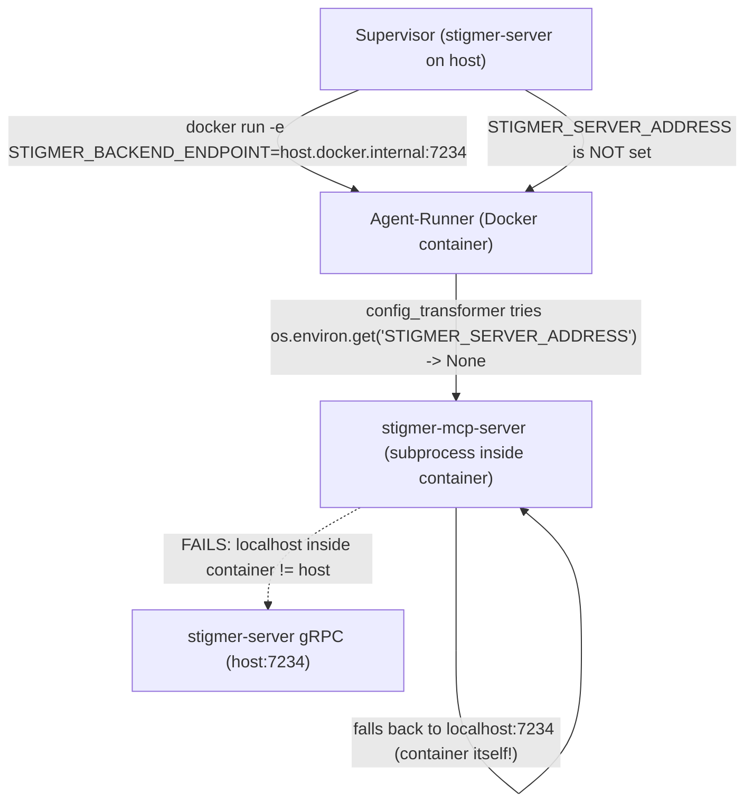

# Fix: MCP tool 'search' fails with "Stigmer server is unavailable"

## Root Cause

The connection flow from agent-runner to stigmer-server via MCP has a gap in environment variable propagation:




Specifically:

1. **Supervisor** (`[supervisor.go](backend/services/stigmer-server/pkg/supervisor/supervisor.go)` line 281) sets `STIGMER_BACKEND_ENDPOINT=host.docker.internal:7234` in the container — the agent-runner's own Python code uses this to talk to stigmer-server. Works fine.
2. **Supervisor does NOT set `STIGMER_SERVER_ADDRESS`** — this is the env var the Go-based MCP server binary (`mcp-server-stigmer`) reads to connect to stigmer-server.
3. **Auto-injection mechanism** (`[config_transformer.py](backend/services/agent-runner/worker/mcp/config_transformer.py)` line 90) tries to inject `STIGMER_SERVER_ADDRESS` from `os.environ` into MCP subprocess env — but since the supervisor never set it, `os.environ.get("STIGMER_SERVER_ADDRESS")` returns `None`, and injection silently does nothing.
4. **MCP server defaults to `localhost:7234`** (`[config.go](mcp-server/internal/config/config.go)` line 91) — inside a Docker bridge-network container on macOS, `localhost` is the container, not the host. Connection fails.

## Fix

Add `STIGMER_SERVER_ADDRESS` to the environment variables the supervisor passes to the agent-runner container. The resolved value is already computed as `backendAddr` (which is `host.docker.internal:7234` on macOS, `localhost:7234` on Linux with `--network host`).

**File:** `[backend/services/stigmer-server/pkg/supervisor/supervisor.go](backend/services/stigmer-server/pkg/supervisor/supervisor.go)`

In the `startAgentRunner()` function, add one line after the existing env vars (around line 291):

```go
"-e", fmt.Sprintf("STIGMER_SERVER_ADDRESS=%s", backendAddr),
```

This slots naturally alongside `STIGMER_BACKEND_ENDPOINT` which already uses the same `backendAddr` value. The auto-injection in `config_transformer.py` will then find the variable in `os.environ` and propagate it to MCP server subprocesses.

## Why this is the right fix

- The auto-injection mechanism in `config_transformer.py` was designed exactly for this purpose — it bridges the agent-runner's environment into MCP subprocess environments. The mechanism works correctly; it was simply never given the variable to inject.
- Both `STIGMER_BACKEND_ENDPOINT` (agent-runner's own gRPC calls) and `STIGMER_SERVER_ADDRESS` (MCP server's gRPC calls) point to the same stigmer-server endpoint, so using the same `backendAddr` is correct.
- The platform-aware address resolution (`localhost` on Linux/host-network, `host.docker.internal` on macOS/bridge-network) is already handled by `resolveDockerHostAddress()`.

## Scope

- One line added to one file.
- No new abstractions, no behavioral changes to the auto-injection logic.
- No changes needed in the agent-runner Python code or the MCP server Go code — both are already wired correctly, they just need the env var to exist.

