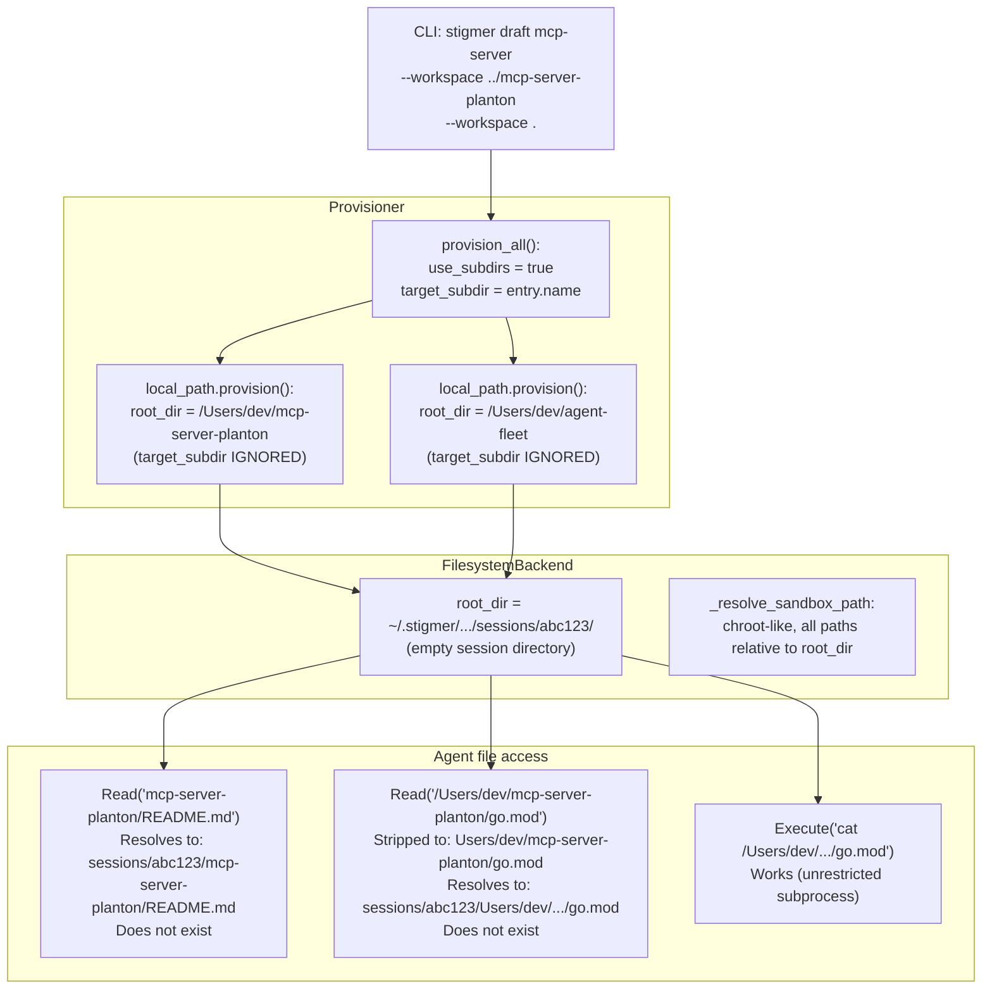
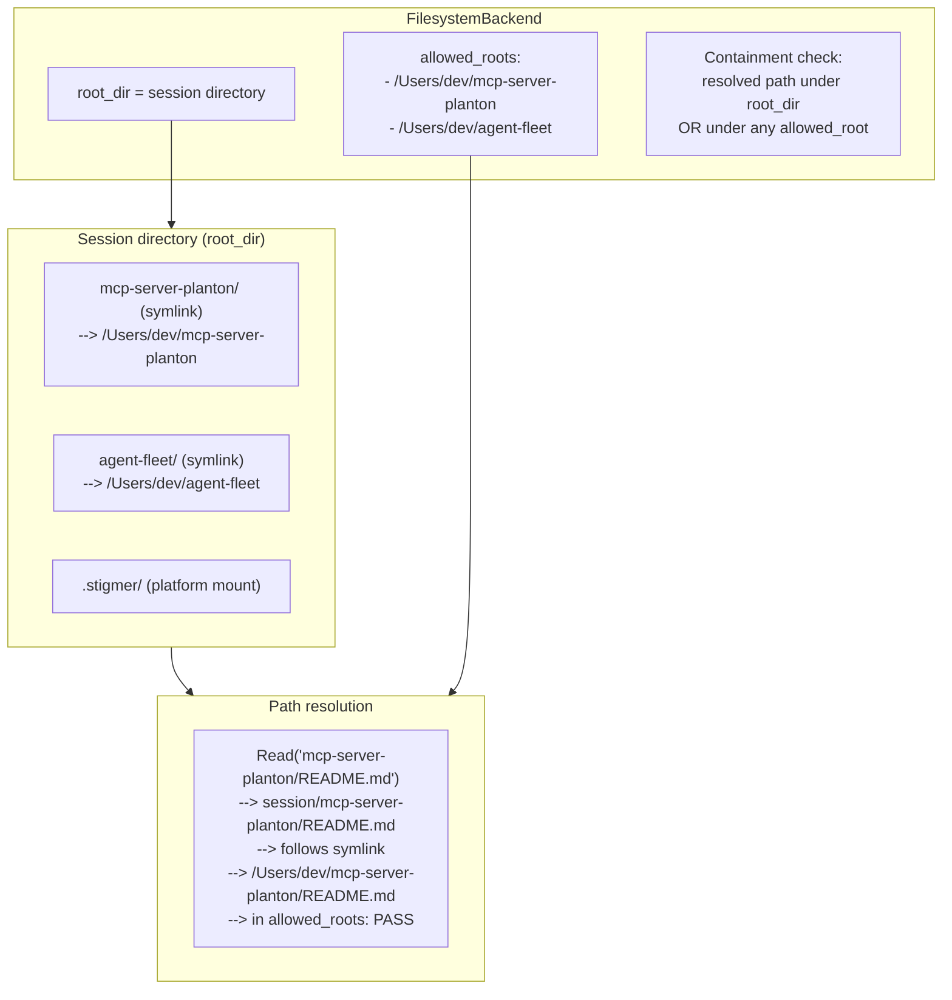

# Fix Multi-Local-Path Workspace File Access

## Root Cause Analysis

The multi-workspace feature was built with **git sources** as the primary design target. Git entries are cloned INTO `{session_dir}/{entry_name}/`, creating a directory tree under the sandbox root that the `FilesystemBackend` can navigate. **Local-path entries** were bolted on without equivalent bridging.

### What happens today with two `--workspace` local paths




### Why it works for git, fails for local_path

- **Git multi-entry**: `git.py` clones into `{backend_root}/{target_subdir}/`. Files physically exist under `root_dir`.
- **Single local_path**: Backend is replaced (`root_dir = actual_path`). Works fine.
- **Multi local_path**: Backend stays at session directory. `local_path.provision()` ignores `target_subdir`. No symlinks created. Session directory is empty. All file tool calls fail.

The provisioner's `provision()` dispatch for `local_path` doesn't forward `target_subdir` or `backend.root_dir`:

```339:347:backend/services/agent-runner/worker/workspace/provisioner.py
if workspace_source.HasField("local_path"):
    ...
    return local_path_source.provision(
        workspace_source.local_path,
        is_local_mode=is_local_mode,
    )
```

Compare with git, which receives and uses `target_subdir` to clone into the right subdirectory.

### Cascading issues from this gap

- `List(".")` returns only `.stigmer` (1 entry) -- the session dir is empty
- File trees in the workspace prompt section can't be built for entries outside root_dir
- `.gitignore` auto-discovery can't find entries outside container root (noted in T03)
- Agent falls back to `Execute(cat ...)` as a workaround, bypassing the sandbox model

## Proposed Design: Symlinks + Allowed Roots

The fix should make local_path multi-entry behave identically to git multi-entry from the FilesystemBackend's perspective: every entry appears as a named subdirectory under the session root.




### Why symlinks + allowed_roots (not alternatives)

- **Common ancestor as root_dir**: Dangerous -- could expose `/` if paths are far apart. Breaks sandbox model.
- **Composite/multi-root backend**: Over-engineered -- requires rewriting all backend operations to dispatch per-entry.
- **Symlinks only (no allowed_roots)**: `Path.resolve()` follows symlinks, so the resolved path would be outside `root_dir`. The containment check (`str(resolved).startswith(str(root_dir))`) would reject it. We need `allowed_roots` to accept these resolved targets.
- **Symlinks + allowed_roots**: Clean, minimal-surface-area change. Mirrors how `platform_dir` already provides a second allowed root for `.stigmer/*` paths. Entry-relative paths work naturally through the symlinks.

## Implementation Layers

### Layer 1: `local_path.py` -- Create symlinks in multi-entry mode

**File**: `[backend/services/agent-runner/worker/workspace/sources/local_path.py](backend/services/agent-runner/worker/workspace/sources/local_path.py)`

- Accept optional `target_subdir: str | None` and `backend_root_dir: str | None` parameters
- When both are provided (multi-entry mode): create symlink `{backend_root_dir}/{target_subdir} -> path`
- Return `ProvisionResult` unchanged (root_dir = actual host path)
- Handle edge cases: symlink already exists, target_subdir name collision

### Layer 2: `provisioner.py` -- Forward target_subdir to local_path

**File**: `[backend/services/agent-runner/worker/workspace/provisioner.py](backend/services/agent-runner/worker/workspace/provisioner.py)`

- Pass `target_subdir` and `backend.root_dir` to `local_path_source.provision()` in the dispatch code (line ~344)

### Layer 3: `filesystem.py` -- Add allowed_roots to containment check

**File**: `[backend/libs/python/graphton/src/graphton/core/backends/filesystem.py](backend/libs/python/graphton/src/graphton/core/backends/filesystem.py)`

- Add `allowed_roots: Sequence[str | Path] | None = None` to `__init`__
- Store as `self._allowed_roots: list[Path]`
- In `_resolve_sandbox_path`: after resolution, check containment against `root_dir` OR any `allowed_root`
- Add absolute-path rewriting: if incoming path starts with an allowed_root's string, rewrite it to the entry-relative form (so `_resolve_sandbox_path("/Users/dev/mcp-server-planton/go.mod")` becomes `"mcp-server-planton/go.mod"` before resolution). This requires a mapping from host_path -> entry_name, so `allowed_roots` should be `dict[str, Path]` (entry_name -> host_path) rather than a flat list.

### Layer 4: `sandbox_factory.py` -- Thread allowed_roots through config

**File**: `[backend/libs/python/graphton/src/graphton/core/sandbox_factory.py](backend/libs/python/graphton/src/graphton/core/sandbox_factory.py)`

- Accept `allowed_roots` key in the config dict
- Pass to `FilesystemBackend(allowed_roots=...)`

### Layer 5: `execute_graphton.py` -- Collect and pass allowed_roots

**File**: `[backend/services/agent-runner/worker/activities/execute_graphton.py](backend/services/agent-runner/worker/activities/execute_graphton.py)`

- In the multi-entry branch (around line 1455): collect `{entry_name: root_dir}` for all LOCAL_PATH provision results
- Add to `sandbox_config_for_agent["allowed_roots"]`

### Layer 6: Tests

- **filesystem.py tests**: Symlink-backed entries, containment check with allowed_roots, absolute-path rewriting, traversal-via-symlink rejection
- **local_path.py tests**: Symlink creation in multi-entry mode, idempotency, cleanup
- **provisioner.py tests**: target_subdir forwarding for local_path
- **Integration**: Two local_path entries, verify Read/Write/List all work

## Open Design Questions (need your input before implementation)

1. **allowed_roots data structure**: Should it be `dict[str, Path]` (entry_name -> host_path) for path rewriting, or just `list[Path]` for containment only? The dict enables rewriting absolute host paths to entry-relative, but adds complexity. If we only accept entry-relative paths and error on absolute host paths, a simple list suffices.
2. **System prompt for local_path entries**: Currently shows absolute host paths like `### mcp-server-planton (/Users/dev/mcp-server-planton)`. Should we change this to show entry-relative paths instead, to discourage agents from using absolute paths? Or show both?
3. **Write safety**: Symlinks mean the agent can write to the user's actual directories through the sandbox. For git sources this isn't an issue (clones are disposable). For local_path, this is by design (the user explicitly provided their local path), but should we add any additional safety measures?
4. **Mixed sources**: When entries mix git + local_path, git entries are cloned into session subdirs and local_path entries would be symlinked. This should work naturally, but we should verify the combined file tree and prompt section.

## Files Modified (summary)

- `backend/services/agent-runner/worker/workspace/sources/local_path.py` -- symlink creation
- `backend/services/agent-runner/worker/workspace/provisioner.py` -- forward target_subdir
- `backend/libs/python/graphton/src/graphton/core/backends/filesystem.py` -- allowed_roots
- `backend/libs/python/graphton/src/graphton/core/sandbox_factory.py` -- thread config
- `backend/services/agent-runner/worker/activities/execute_graphton.py` -- collect + pass roots
- Test files for all above

