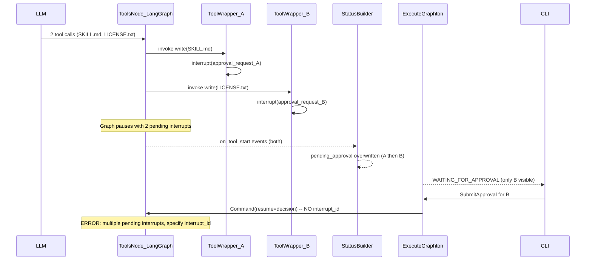
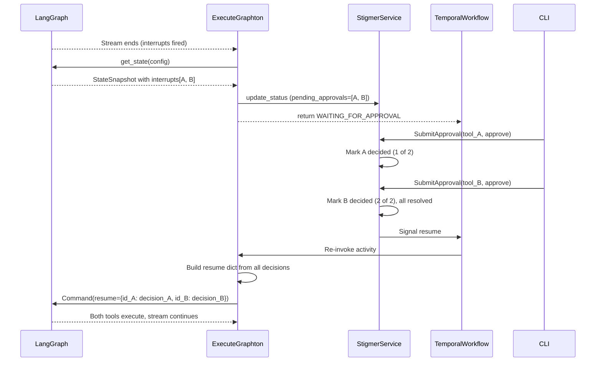

# Fix Multiple Pending Interrupts Crash

## Root Cause

When the LLM returns multiple tool calls in one response (e.g., write `SKILL.md` + write `LICENSE.txt`), and both require human approval, the tools node in LangGraph calls `interrupt()` for **each** tool. This creates **multiple pending interrupts** simultaneously.

The current system was built assuming at most one interrupt at a time:

1. `**StatusBuilder.set_tool_waiting_approval()**` ([status_builder.py:830-914](backend/services/agent-runner/worker/activities/graphton/status_builder.py)) tracks a single `_pending_tool_approval` and **overwrites** it when a second one arrives (line 863-867).
2. **Proto `PendingApproval**` ([api.proto:876-932](apis/ai/stigmer/agentic/agentexecution/v1/api.proto)) is a singular message on `AgentExecutionStatus`, not a repeated field.
3. **Resume logic** ([execute_graphton.py:1251-1255](backend/services/agent-runner/worker/activities/execute_graphton.py)) calls `Command(resume=decision)` without specifying which interrupt to resume.

LangGraph requires `Command(resume={interrupt_id: value})` (a dict mapping IDs to values) when multiple interrupts are pending. Without it, the error fires.

## Architecture Diagram

## Recommended Approach: Batch Approval with Interrupt ID Tracking

Rather than a band-aid fix, this approach properly models multiple concurrent interrupts. The user still approves one at a time (current UX), but the system **collects all decisions before resuming** with a single `Command(resume={id_A: val_A, id_B: val_B, ...})`. This avoids the idempotency problem where already-approved tools re-execute on each one-at-a-time resume cycle.

### Corrected flow:

## Changes Required

### 1. Proto: Add `interrupt_id` to `PendingApproval` + add `pending_approvals` list

**File:** [apis/ai/stigmer/agentic/agentexecution/v1/api.proto](apis/ai/stigmer/agentic/agentexecution/v1/api.proto)

- Add `string interrupt_id = 9` to `PendingApproval` message (LangGraph-assigned ID for targeted resume)
- Add `repeated PendingApproval pending_approvals` to `AgentExecutionStatus` (alongside existing singular `pending_approval` for backward compatibility)
- Keep the existing singular `pending_approval` field for backward compatibility; deprecate it later

### 2. Backend: Capture interrupt IDs from graph state after stream ends

**File:** [backend/services/agent-runner/worker/activities/execute_graphton.py](backend/services/agent-runner/worker/activities/execute_graphton.py)

**Post-stream interrupt capture (after line ~1485, before phase determination):**

- Call `agent_graph.get_state(config)` to get `StateSnapshot`
- Read `state.interrupts` -- a tuple of `Interrupt(id=..., value=...)` objects
- For each interrupt, match it to a tool call using `interrupt.value["tool_name"]` (the approval_request dict passed to `interrupt()`)
- Populate `pending_approvals` repeated field on `status_builder.current_status` with each interrupt's ID and tool info
- Also set the singular `pending_approval` to the first interrupt for backward compatibility

**Resume logic (line ~1249-1255):**

- Instead of building a single resume value, build a dict mapping interrupt IDs to decisions
- Iterate `execution.status.pending_approvals` (or fall back to singular `pending_approval`)
- For each resolved pending approval, look up the tool call's decision
- Build: `Command(resume={pa.interrupt_id: {"action": action_str, "approved_by": approved_by} for pa in resolved_approvals})`

### 3. Backend: StatusBuilder improvements

**File:** [backend/services/agent-runner/worker/activities/graphton/status_builder.py](backend/services/agent-runner/worker/activities/graphton/status_builder.py)

- In `set_tool_waiting_approval()`: Instead of overwriting `_pending_tool_approval`, append to a list `_pending_tool_approvals`
- Still set the singular `pending_approval` on `current_status` for backward compat, but also populate `pending_approvals` repeated field
- Adjust `set_tool_approval_decision()` to handle decisions for items in the list

### 4. Backend: SubmitApproval service logic

The SubmitApproval RPC handler needs to know whether all pending approvals have been resolved before signaling the Temporal workflow to resume. Currently it signals resume immediately after each approval.

**Change:** After recording an approval decision, check if ALL items in `pending_approvals` have decisions. Only signal the workflow to resume when all are resolved. This prevents premature resume with unresolved interrupts.

### 5. CLI: Minimal changes -- handle multiple pending approvals

**File:** [client-apps/cli/cmd/stigmer/root/run_stream_approval.go](client-apps/cli/cmd/stigmer/root/run_stream_approval.go)

- `findUnpromptedApproval()` already returns the first unprompted approval and marks it in `promptedIDs` -- this loop naturally handles multiple approvals across successive stream updates
- After approving one, the next stream update will contain the remaining approvals (because all are in `pending_approvals`)
- May need to iterate `pending_approvals` instead of just looking at the singular `pending_approval`

**File:** [client-apps/cli/cmd/stigmer/root/run_stream_events.go](client-apps/cli/cmd/stigmer/root/run_stream_events.go)

- Update `emitAndWaitApproval` to read from `pending_approvals` if available
- The core loop logic (detect pending -> prompt -> wait -> submit) stays the same since we process one at a time

### 6. Generated Code

- Regenerate Go proto stubs for the updated `PendingApproval` and `AgentExecutionStatus`
- Regenerate Python proto stubs

## Risk: Idempotency of Tool Execution on Re-run

A critical LangGraph behavior to be aware of: when `Command(resume=...)` is invoked, the node **re-executes from the beginning**. With the batch approach (resume all at once), each tool's `interrupt()` returns its decision, and each tool executes exactly once. This is why the batch approach is preferred over one-at-a-time.

If we were to do one-at-a-time (resume interrupt A, let B re-interrupt), Tool A would execute again when we later resume for B. For file writes this is idempotent, but for non-idempotent operations (API calls, etc.) it could be dangerous. The batch approach avoids this entirely.

## Scope Boundary

This plan does NOT cover:

- Batch approval UI (e.g., "Approve All" button) -- that's a UX enhancement for later
- Changes to the deepagents library or how it parallelizes tool calls
- Workflow-level approval forwarding changes (the existing child_agent_execution_id pattern is unaffected)

