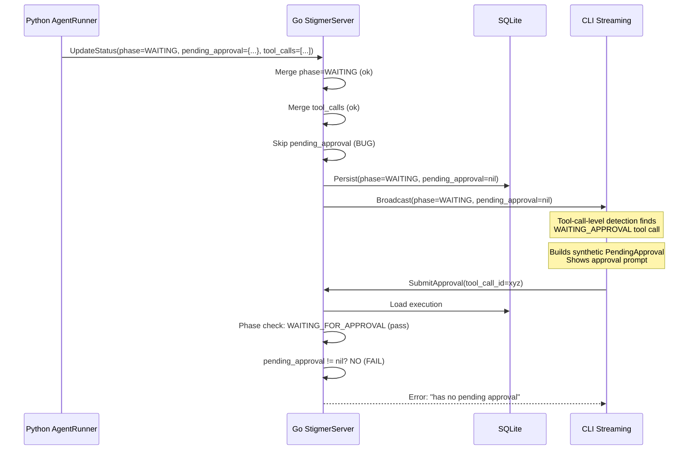

# Fix: `pending_approval` Not Persisted in UpdateStatus Merge

## Root Cause

The bug is in [update_status.go](backend/services/stigmer-server/pkg/domain/agentexecution/controller/update_status.go), specifically the `BuildNewStateWithStatusStep` (lines 128-221).

This step performs field-by-field merging of the Python agent-runner's status update into the existing execution. It merges `messages`, `tool_calls`, `sub_agent_executions`, `todos`, `artifacts`, `phase`, `error`, and timestamps -- but it **does not merge `pending_approval**` (field 13 on `AgentExecutionStatus`).

### What Happens




The phase is persisted correctly (`EXECUTION_WAITING_FOR_APPROVAL`), so the first validation check passes. But `pending_approval` is nil because it was never copied during the merge, so the second check fails.

The CLI still shows the approval prompt because its **defense-in-depth** track detects the tool call in `TOOL_CALL_WAITING_APPROVAL` status (tool_calls ARE merged). But when the user approves and the CLI submits, the server rejects it.

### Confirmation

The correct pattern already exists in the codebase. The Java `WorkflowExecutionUpdateStatusHandler` ([lines 226-241](../stigmer-cloud/backend/services/stigmer-service/src/main/java/ai/stigmer/domain/agentic/workflowexecution/request/handler/WorkflowExecutionUpdateStatusHandler.java)) correctly handles `pending_approval` with set/clear semantics:

- Non-empty `tool_call_id` --> set `pending_approval` (real approval request)
- Empty `tool_call_id` --> clear `pending_approval` (approval resolved)
- Field absent --> preserve existing (unrelated status update)

**The same bug also exists in the Java `AgentExecutionUpdateStatusHandler**` ([lines 171-249](../stigmer-cloud/backend/services/stigmer-service/src/main/java/ai/stigmer/domain/agentic/agentexecution/request/handler/AgentExecutionUpdateStatusHandler.java)) -- it also skips `pending_approval`. This is a latent bug in stigmer-cloud that may not yet surface due to Temporal workflow's in-memory state handling the approval flow differently.

## Fix

### File 1: Go -- `update_status.go`

In [update_status.go](backend/services/stigmer-server/pkg/domain/agentexecution/controller/update_status.go), add `pending_approval` merge logic after the timestamps block (after line 207), following the same set/clear pattern as the Java `WorkflowExecutionUpdateStatusHandler`:

```go
// Merge pending_approval (HITL approval flow)
//
// Python agent-runner sends pending_approval when:
// 1. A tool requires approval: non-empty tool_call_id = set pending_approval
// 2. Approval resolved/cleared: empty tool_call_id = clear pending_approval
// 3. Unrelated status update: field absent (nil) = preserve existing
//
// This mirrors the pattern in WorkflowExecutionUpdateStatusHandler (Java).
if requestStatus.PendingApproval != nil {
    if requestStatus.PendingApproval.ToolCallId != "" {
        updated.Status.PendingApproval = requestStatus.PendingApproval
    } else {
        updated.Status.PendingApproval = nil
    }
}
```

Also update the debug log on line 209 to include `pending_approval` presence for observability:

```go
log.Debug().
    Str("execution_id", input.ExecutionId).
    Str("phase", updated.Status.Phase.String()).
    Int("messages_count", len(updated.Status.Messages)).
    Int("tool_calls_count", len(updated.Status.ToolCalls)).
    Int("artifacts_count", len(updated.Status.Artifacts)).
    Bool("has_pending_approval", updated.Status.PendingApproval != nil).
    Msg("Merged status fields")
```

### File 2: Java -- `AgentExecutionUpdateStatusHandler.java`

In [AgentExecutionUpdateStatusHandler.java](../stigmer-cloud/backend/services/stigmer-service/src/main/java/ai/stigmer/domain/agentic/agentexecution/request/handler/AgentExecutionUpdateStatusHandler.java), add the same `pending_approval` merge block after the timestamps block (after line 236), replicating the pattern from `WorkflowExecutionUpdateStatusHandler` (lines 226-241):

```java
// Merge pending_approval (HITL approval flow)
if (requestStatus.hasPendingApproval()) {
    String toolCallId = requestStatus.getPendingApproval().getToolCallId();
    if (!toolCallId.isEmpty()) {
        statusBuilder.setPendingApproval(requestStatus.getPendingApproval());
    } else {
        statusBuilder.clearPendingApproval();
    }
}
```

Also update the debug log (line 238) to include `has_pending_approval`.

## Scope and Boundaries

- **In scope**: Adding `pending_approval` merge to both Go and Java `UpdateStatus` handlers; updating debug logs.
- **Out of scope**: Other missing fields (`usage`, `context_info`) that don't cause failures -- these should be tracked as separate follow-up work. The field-by-field merge approach is inherently fragile (every new proto field requires a merge update), but redesigning the merge strategy is a larger refactor that should not be coupled with this bugfix.
- **No CLI changes needed**: The CLI's two-track approval detection already works correctly. With this fix, the primary track (phase-level with `PendingApproval`) will work as designed, and the secondary track remains as defense-in-depth.

