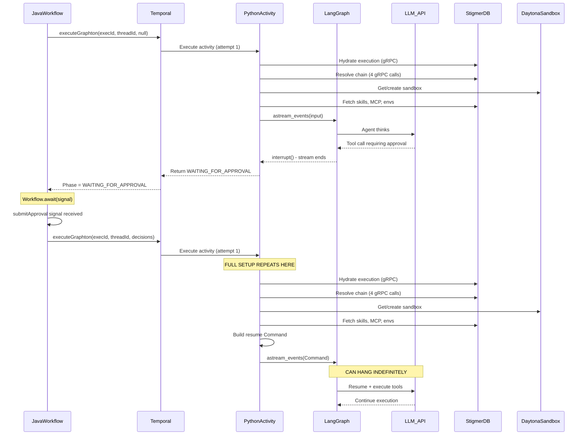

# Fix Post-Approval Agent Execution Hang

## Diagnosis

The Temporal workflow screenshot shows:

- First `ExecuteGraphton` completed (agent ran, hit HITL interrupt, returned WAITING_FOR_APPROVAL)
- `submitApproval` signal was sent and received
- Second `ExecuteGraphton` has been running 24+ minutes with no visible output

### Architecture of the Approval Resume Flow




### Root Causes Identified

**1. Full Setup Re-execution on Every Resume (Performance)**

Every time the activity is re-invoked after approval (`[execute_graphton.py:405-1295](backend/services/agent-runner/worker/activities/execute_graphton.py)`), it repeats the entire setup:

- 4+ gRPC calls to resolve execution chain (execution, session, agent_instance, agent)
- Sandbox creation/reuse via Daytona API
- Skill fetching, downloading artifacts, writing to sandbox, post-write verification
- Attachment injection
- Environment variable merging (ExecutionContext or legacy)
- MCP server fetching and transformation
- Full agent graph creation

This setup alone can take 30-60+ seconds, and any of these calls can hang without timeout.

**2. No Application-Level Timeout on `astream_events()` (Critical)**

The main streaming loop at `[execute_graphton.py:1524-1528](backend/services/agent-runner/worker/activities/execute_graphton.py)`:

```python
async for event in agent_graph.astream_events(
    graph_input,
    config=config,
    version="v2",
):
```

Has **no timeout**. The Temporal `startToCloseTimeout` is 10 minutes (`[InvokeAgentExecutionWorkflowImpl.java:181](../stigmer-cloud/backend/services/stigmer-service/src/main/java/ai/stigmer/domain/agentic/agentexecution/temporal/workflow/InvokeAgentExecutionWorkflowImpl.java)`), but the background heartbeat task (every 10s) keeps the activity alive. **Temporal's heartbeat timeout (30s) will not fire** because heartbeats are flowing. But the `startToCloseTimeout` of 10 minutes **will** fire and kill the activity, triggering retry.

With `maximumAttempts: 3` and each attempt taking up to 10 minutes, the worst case is **30 minutes of retrying** with no visible progress.

**3. Silent Retry Loop After Timeout**

When the 10-minute `startToCloseTimeout` fires:

1. Temporal kills the activity and retries (attempt 2)
2. The retry re-does **all** setup steps (40-60s)
3. The retry resumes from checkpoint with the same approval decisions
4. If the underlying issue persists (LLM hang, sandbox issue), it hangs again for 10 minutes
5. Third attempt: same thing
6. After 3 attempts, the workflow finally fails

The user sees **30 minutes of apparent hang** with no feedback.

**4. No Progress Watchdog**

There is no mechanism to detect "the agent is producing events but making no meaningful progress" (e.g., stuck in a file-path resolution loop as seen in `[_cursor/error.md](_cursor/error.md)` logs).

**5. gRPC Calls Without Timeouts**

The progressive status update at `[execute_graphton.py:1592](backend/services/agent-runner/worker/activities/execute_graphton.py)`:

```python
await execution_client.update_status(
    execution_id=execution_id,
    status=status_builder.current_status
)
```

Has **no timeout**. If this call hangs, it blocks the entire event processing loop because it's `await`ed inline.

## Proposed Fixes (Ordered by Impact)

### Fix 1: Add Phase-Aware Logging at Activity Start (Quick Win - Observability)

When the activity starts on a resume path (approval_decisions is not empty), emit a prominent log line indicating this is a resume and log the time spent in each setup phase. This immediately tells us whether the hang is in setup or in the streaming loop.

**Files:**

- `[execute_graphton.py:328-410](backend/services/agent-runner/worker/activities/execute_graphton.py)` - Add timing instrumentation to each setup step

### Fix 2: Add `asyncio.timeout` to `astream_events()` (Critical)

Wrap the streaming loop in an `asyncio.timeout()` context manager. If no events arrive within a configurable threshold (e.g., 5 minutes), raise a timeout error that the activity can catch and report as a meaningful failure.

This is distinct from Temporal's `startToCloseTimeout` - it's an application-level timeout that provides a clean error message rather than a hard kill.

**Files:**

- `[execute_graphton.py:1521-1528](backend/services/agent-runner/worker/activities/execute_graphton.py)` - Wrap `astream_events()` in `asyncio.timeout()`

### Fix 3: Add Timeout to gRPC Status Update Calls (Critical)

Wrap the inline `execution_client.update_status()` call with `asyncio.wait_for()` to prevent a hanging gRPC call from blocking the entire event loop.

**Files:**

- `[execute_graphton.py:1592-1595](backend/services/agent-runner/worker/activities/execute_graphton.py)` - Add timeout to `update_status()`

### Fix 4: Skip Redundant Setup Steps on Resume Path (Performance)

When the activity is invoked with `approval_decisions` (resume path), several setup steps are unnecessary:

- Sandbox already exists (reuse, don't create)
- Skills are already written to sandbox
- Attachments are already injected
- Subagents don't need re-transformation

Add a fast path that skips these when `approval_decisions` is not empty.

**Files:**

- `[execute_graphton.py:405-1295](backend/services/agent-runner/worker/activities/execute_graphton.py)` - Add `is_resume` flag and conditional setup

### Fix 5: Emit Resume-Specific Status Update Before Streaming (UX)

Before entering the streaming loop on a resume path, send a status update to the DB indicating "Resuming execution after approval". This gives the user immediate feedback that their approval was received and processing has started.

**Files:**

- `[execute_graphton.py:1441-1474](backend/services/agent-runner/worker/activities/execute_graphton.py)` - Add pre-stream status update on resume path

## Questions Before Implementation

1. **The `startToCloseTimeout` of 10 minutes** -- is this intentional for your workloads? Some agent executions may legitimately need more than 10 minutes. If we add an application-level timeout (Fix 2), should we also increase the Temporal timeout, or is 10 minutes the desired cap?
2. **The 3 retry attempts** -- when the activity times out, it retries with checkpoint resume. This is good for crash recovery but bad for "agent is stuck" scenarios. Should we differentiate between timeout (reduce retry count or fail fast) vs crash (keep retrying)?
3. **Fix 4 (skip redundant setup)** is the most impactful performance improvement but also the most architecturally significant change. The current approach of re-hydrating everything ensures fresh state but at high cost. Are you comfortable with a "trust the existing sandbox" approach for resume, or should we validate sandbox health with a quick heartbeat check?

