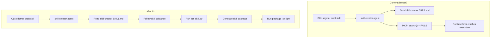

# Fix Skill-Creator Agent: MCP Crash and Design Issues

## Domain Analysis

Two distinct issues are tangled together here. Let me separate them clearly.

### Issue 1: The `search` RuntimeError (Infrastructure Bug)

**Root cause:** `mcp_manager.py` line 95 creates `MultiServerMCPClient(servers)` **without** the `async with` context manager. For stdio-based MCP servers (like `stigmer-mcp-server`), this means every tool invocation spawns a **brand new Go subprocess** that races with session teardown. The `stdout_reader` background task gets a `BrokenResourceError`, which surfaces as an anyio `TaskGroup` exception:

```
RuntimeError: MCP tool 'search' invocation failed: unhandled errors in a TaskGroup (1 sub-exception)
```

**Evidence:** A previous plan (`fix_mcp_stdio_crash_3c090721.plan.md`) correctly diagnosed this and marked all todos as "completed," but **the fix was never applied**. Proof:

- `[mcp_manager.py](backend/libs/python/graphton/src/graphton/core/mcp_manager.py)` still uses the ephemeral pattern (no `async with`)
- `[middleware.py](backend/libs/python/graphton/src/graphton/core/middleware.py)` has no `AsyncExitStack` for lifecycle management

This bug affects **all agents** that use stdio-based MCP servers, not just skill-creator.

### Issue 2: The Agent Is Doing Unnecessary Work (Design Problem)

The `[skill-creator.yaml](seedpack/agents/skill-creator.yaml)` agent has `mcp_server_usages` granting it `search`, `get_agent`, `get_mcp_server`, `get_skill`, and `get_workflow` MCP tools. The agent instructions then tell it to:

> **Query Available Resources**: Use the Stigmer MCP server tools to check what already exists before creating something new.

This is architecturally wrong for this agent's purpose. Here is why:

- **The skill-creator's job is singular**: take the `skill-creator` skill's guidance (injected via `skill_refs`) and produce a skill package (SKILL.md + scripts + references + assets). That is it.
- **Deduplication is the caller's responsibility**. When a user runs `stigmer draft skill`, they have explicitly asked to create a skill. Checking "does something similar exist?" is a pre-flight concern that belongs to the user or the CLI, not to the agent mid-execution.
- **Skills are self-contained packages**. They do not reference other platform resources (agents, workflows, MCP servers) -- so there is nothing to discover.
- **The MCP tools add failure modes, latency, and cost** for zero value. The Go subprocess startup alone adds ~365ms compilation overhead per invocation, plus the gRPC round-trip to the backend.
- **The agent's instructions become bloated** with MCP-related workflow steps that distract from the core task. The LLM then *dutifully* follows these steps (as seen in the screenshot: "Now let me check the Stigmer platform for existing skills before scaffolding"), wastes a turn on a tool call that fails, and the execution crashes.

**The structural fix**: Remove `mcp_server_usages` entirely from the skill-creator agent. Do not add negative instructions ("don't use search"). Simply remove the capability so the agent has exactly what it needs and nothing more. Clean the instructions accordingly.

---

## Fix Plan

### Part A: Fix the MCP Stdio Crash (Infrastructure)

Apply the persistent connection pattern from the existing (unapplied) plan.

**Files to change:**

1. `**[mcp_manager.py](backend/libs/python/graphton/src/graphton/core/mcp_manager.py)`** -- Split `load_mcp_tools()` into a persistent-connection-aware function:
  - New `connect_and_load_mcp_tools()` that enters `async with MultiServerMCPClient(servers)` and returns `(client, filtered_tools)` -- caller owns the lifecycle
  - Keep `load_mcp_tools()` as a backward-compatible wrapper for HTTP-only use cases (where ephemeral is fine)
2. `**[middleware.py](backend/libs/python/graphton/src/graphton/core/middleware.py)`** -- Manage persistent client lifecycle:
  - Add `self._mcp_client` and `self._exit_stack: contextlib.AsyncExitStack` to `McpToolsLoader.__init__()`
  - In `_load_tools_async()`: use `self._exit_stack.enter_async_context(mcp_client)` to keep the connection alive
  - In `aafter_agent()`: close the `AsyncExitStack` to cleanly shut down all MCP server subprocesses
  - The sync path also needs the persistent pattern (via `nest_asyncio` + same loop)
3. `**[tool_wrappers.py](backend/libs/python/graphton/src/graphton/core/tool_wrappers.py)`** (line 212-219) -- Improve error reporting by unwrapping `ExceptionGroup`:
  - When the caught exception is a `BaseExceptionGroup`, extract and surface the first sub-exception so the error message is actionable instead of the opaque "unhandled errors in a TaskGroup (1 sub-exception)"

### Part B: Redesign the Skill-Creator Agent (Design)

**Files to change:**

1. `**[seedpack/agents/skill-creator.yaml](seedpack/agents/skill-creator.yaml)`** -- Remove `mcp_server_usages` entirely and clean instructions:
  - Delete the entire `mcp_server_usages` block (lines 90-100)
  - Remove MCP-related instruction sections:
    - Delete the paragraph about "Stigmer MCP server which lets you discover existing resources" (lines 19-21)
    - Delete step 2 "Query Available Resources" (lines 35-39)
  - Renumber remaining workflow steps
  - Keep the agent focused: gather intent -> plan using skill-creator skill -> generate files -> validate -> present
2. `**[seedpack/tools/02_draft-agent-creator-skill.sh](seedpack/tools/02_draft-agent-creator-skill.sh)`** -- Clean up the prompt:
  - Lines 125-131 instruct the *generated* agent-creator skill to tell agents to "use the Stigmer MCP server tools -- specifically the search, get_mcp_server, and get_skill tools". This is a valid instruction for the **output** (the agent-creator skill being generated), NOT for the skill-creator agent itself. No change needed here -- this prompt content is input text to the agent, not the agent's own capabilities.
  - Confirm: no changes needed to this file.

---

## Architecture After Fix




## What Is NOT Changing

- The `skill-creator` skill itself (`[seedpack/skills/skill-creator/](seedpack/skills/skill-creator/)`) -- this is the Anthropic-vendored skill and remains untouched
- The `stigmer-mcp-server` Go implementation -- the server code is correct
- The `02_draft-agent-creator-skill.sh` prompt content -- the MCP discovery instructions there are for the *output skill*, not for the skill-creator agent
- The `init_skill.py`, `package_skill.py`, `quick_validate.py` scripts -- these are fine
- Other agents that legitimately use MCP server tools

## Risks and Mitigations

- **Part A affects all MCP-using agents**: The persistent connection pattern is a strict improvement -- it fixes stdio and makes HTTP more efficient. The `aafter_agent()` cleanup ensures no subprocess leaks.
- **Part B removes a capability**: If a future use case genuinely needs the skill-creator to query the platform, `mcp_server_usages` can be re-added. But that should be a deliberate decision, not a default.
- **Backward compatibility**: `load_mcp_tools()` remains available for any code path that only uses HTTP transport and does not need persistent connections.

