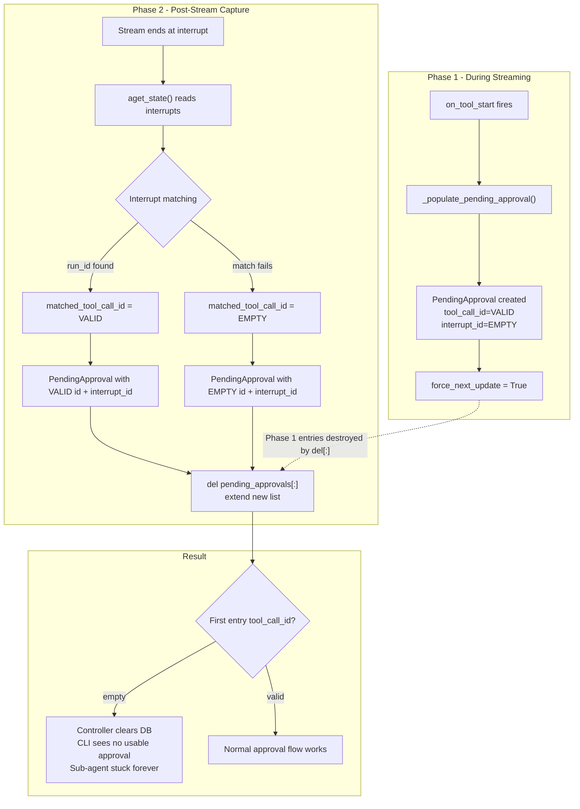

# Fix Sub-Agent Stuck in "Working..." Due to Pending Approvals Clobbering

## Root Cause

The approval flow has a two-phase design for populating `pending_approvals`:

- **Phase 1** (during streaming): `_populate_pending_approval` in `status_builder.py` creates entries with valid `tool_call_id` but no `interrupt_id`, sets `force_next_update=True`
- **Phase 2** (post-stream capture): `execute_graphton.py` lines 3030-3134 queries `graph_state.interrupts`, matches to tool calls, and does `del pending_approvals[:]; extend(new_list)` -- a **destructive replace**

The destructive replace fails for sub-agent tools because:

1. The interrupt-to-tool-call matching (`run_id`-based or name-based) can fail, producing `matched_tool_call_id = ""` (line 3043)
2. A `PendingApproval` with empty `tool_call_id` is still created and appended (lines 3104-3114)
3. The `del [:]; extend()` wipes Phase 1's valid entries and replaces them with the degraded ones
4. The final gRPC push (line 3182) and slim Temporal return both carry the degraded data
5. The controller/Temporal merge logic interprets `tool_call_id=""` as a "clear" signal, wiping the DB
6. The CLI's Step 3 skips the entry (no usable `dedupKey`), Step 3b doesn't run (`len > 0`), no prompt appears




## Fix Strategy

**Non-destructive merge/enrich** instead of destructive replace. Phase 1 entries are authoritative for `tool_call_id`; Phase 2 only adds `interrupt_id`. No `PendingApproval` with empty `tool_call_id` is ever created.

---

## Change 1: Non-destructive interrupt capture (Primary Fix)

**File:** [backend/services/agent-runner/worker/activities/execute_graphton.py](backend/services/agent-runner/worker/activities/execute_graphton.py) -- lines ~3030-3134

Replace the destructive `del [:]; extend()` with merge/enrich:

- **Skip unresolvable interrupts**: When `matched_tool_call_id` is empty, do NOT create a PendingApproval. Instead, attempt a fallback match against existing Phase 1 entries by `tool_name` + `from_sub_agent` (entries that lack `interrupt_id`). If even this fails, log a warning and move on. Phase 1 entries are preserved.
- **Merge by tool_call_id**: Build the new `pending_approvals` list as before (only with entries that have valid `tool_call_id`). Instead of `del [:]; extend()`, iterate over the new list and either enrich an existing Phase 1 entry (add `interrupt_id`) or append a genuinely new entry.
- **Preserve Phase 1 entries**: Phase 1 entries that weren't matched to any interrupt keep their valid `tool_call_id` and stay in the list (they just won't have `interrupt_id` yet, but LangGraph can handle single-interrupt resume without it).

Key code change -- replace the current block:

```python
if pending_approvals:
    del status_builder.current_status.pending_approvals[:]
    status_builder.current_status.pending_approvals.extend(pending_approvals)
```

With merge logic:

```python
if pending_approvals:
    existing_by_id = {
        pa.tool_call_id: pa
        for pa in status_builder.current_status.pending_approvals
        if pa.tool_call_id
    }
    for new_pa in pending_approvals:
        if new_pa.tool_call_id in existing_by_id:
            existing_by_id[new_pa.tool_call_id].interrupt_id = new_pa.interrupt_id
        else:
            status_builder.current_status.pending_approvals.append(new_pa)
```

And add a skip guard at the top of the interrupt loop body (before line 3104):

```python
if not matched_tool_call_id:
    # Fallback: enrich Phase 1 entry by tool_name + from_sub_agent
    fallback_enriched = _try_enrich_phase1_entry(
        status_builder, tool_name, from_sub_agent, intr.id
    )
    if not fallback_enriched:
        activity_logger.warning(
            f"[INTERRUPT_CAPTURE] execution={execution_id} "
            f"cannot match interrupt {intr.id} tool={tool_name} "
            f"from_sub_agent={from_sub_agent} — Phase 1 entries preserved"
        )
    continue
```

The `_try_enrich_phase1_entry` helper searches `current_status.pending_approvals` for an entry matching `tool_name` + `from_sub_agent` that doesn't yet have `interrupt_id`, and sets it.

---

## Change 2: CLI defense-in-depth (Secondary Fix)

**File:** [client-apps/cli/cmd/stigmer/root/run_stream_events.go](client-apps/cli/cmd/stigmer/root/run_stream_events.go) -- lines ~367-397

The Step 3b fallback currently only triggers when `len(pending_approvals) == 0`. It should also trigger when all entries are unusable (both `tool_call_id` and `interrupt_id` are empty).

Change the Step 3b condition from:

```go
if len(execution.Status.GetPendingApprovals()) == 0 &&
    execution.Status.Phase == agentexecutionv1.ExecutionPhase_EXECUTION_WAITING_FOR_APPROVAL {
```

To:

```go
if !hasUsableApproval(execution.Status.GetPendingApprovals(), promptedIDs) &&
    execution.Status.Phase == agentexecutionv1.ExecutionPhase_EXECUTION_WAITING_FOR_APPROVAL {
```

Where `hasUsableApproval` checks if any entry has a non-empty `approvalDedupKey` that hasn't been prompted yet. This ensures Step 3b's tool-call scan kicks in even if the backend sent degraded `PendingApproval` entries.

---

## Change 3: Diagnostic logging (Supporting)

**File:** [backend/services/agent-runner/worker/activities/execute_graphton.py](backend/services/agent-runner/worker/activities/execute_graphton.py)

Add INFO-level logging after the merge to report:

- How many Phase 1 entries existed before merge
- How many were enriched with `interrupt_id`
- How many new entries were added
- How many interrupts could not be matched (skipped)
- The final `pending_approvals` count and their `tool_call_id` / `interrupt_id` status

This makes future debugging faster without requiring code changes.

---

## What This Does NOT Change

- **Merge logic in Go/Java Temporal activities** (`update_status_impl.go`, `UpdateExecutionStatusActivityImpl.java`): The "empty tool_call_id = clear" convention stays. With the Python fix, empty `tool_call_id` entries are never produced, so this path is only triggered intentionally.
- **Resume reconciliation path** (line 2463): Still does `del [:]` for stale approvals on resume. This is correct behavior.
- **Phase 1 population** (`_populate_pending_approval`): No changes needed -- Phase 1 works correctly.
- **The relaxation fix** (Fix 3 from today): Not reverted. It remains useful as a safety net for DB consistency lag on the `SubmitApproval` handler path.

---

## Testing Strategy

- **Unit test**: Add a test to the interrupt capture logic that simulates a sub-agent interrupt where `run_id` and name-based matching both fail. Verify Phase 1 entries are preserved with valid `tool_call_id`, and that no PendingApproval with empty `tool_call_id` is created.
- **Unit test**: Add a test where matching succeeds. Verify Phase 1 entries are enriched with `interrupt_id` (not replaced).
- **Unit test**: CLI `hasUsableApproval` function -- verify it returns false for entries with empty `tool_call_id` and empty `interrupt_id`.
- **Integration check**: Run the same infra-chart review task that triggered the bug. Verify the sub-agent's `execute` tool call shows an approval prompt instead of "Working...".

