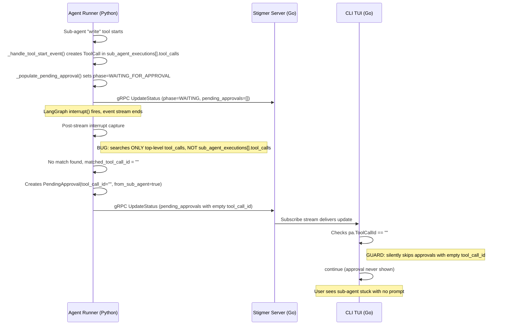

# Fix Sub-Agent Tool Approval Flow

## Domain Analysis (Architect Role)

The approval subsystem has a clear invariant: **every `PendingApproval` must carry a valid `tool_call_id`**. This invariant is enforced by the proto contract (`SubmitApprovalInput.tool_call_id` has `min_len = 1`) and by the CLI's deduplication guard. The bug exists because the backend violates this invariant for sub-agent tools, producing an invalid `PendingApproval` that cannot flow through the rest of the pipeline.

## Bug Trace

The approval lifecycle crosses three layers. Here is the exact failure chain:




## Defect 1 (Root Cause) -- Backend interrupt capture only searches top-level tool calls

**File:** `[backend/services/agent-runner/worker/activities/execute_graphton.py](backend/services/agent-runner/worker/activities/execute_graphton.py)` (lines 2780-2789)

```2780:2789:backend/services/agent-runner/worker/activities/execute_graphton.py
                        matched_tool_call_id = ""
                        for tc in status_builder.current_status.tool_calls:
                            tc_canonical = resolve_platform_tool_name(tc.name)
                            if (
                                (tc.name == tool_name or tc_canonical == tool_name)
                                and tc.status == ToolCallStatus.TOOL_CALL_WAITING_APPROVAL
                                and tc.id not in matched_tc_ids
                            ):
                                matched_tool_call_id = tc.id
                                matched_tc_ids.add(tc.id)
```

This loop searches `status_builder.current_status.tool_calls` -- the **top-level** tool calls only. Sub-agent tool calls live in `status_builder.current_status.sub_agent_executions[].tool_calls` and are never searched. For a sub-agent "write" tool, `matched_tool_call_id` stays `""`.

Notably, `_find_tool_call_by_id` (line 2108) already searches both levels correctly. The interrupt capture loop duplicates this logic but misses the sub-agent path.

**Fix:** After the top-level search, add a fallback search through `sub_agent_executions[].tool_calls`. The pattern already exists in `_find_tool_call_by_id` at line 2126-2130.

## Defect 2 (Compounding) -- CLI silently skips approvals with empty tool_call_id

**File:** `[client-apps/cli/cmd/stigmer/root/run_stream_events.go](client-apps/cli/cmd/stigmer/root/run_stream_events.go)` (line 140)

```139:142:client-apps/cli/cmd/stigmer/root/run_stream_events.go
			for _, pa := range pendingApprovals {
				if pa.ToolCallId == "" || promptedIDs[pa.ToolCallId] {
					continue
				}
```

When `ToolCallId` is empty (due to Defect 1), this guard silently drops the approval. No log, no error, no user-visible indication.

Even after Defect 1 is fixed, this guard is fragile:

- It conflates "no ID" (invalid state) with "already prompted" (valid state)
- `PendingApproval` carries `interrupt_id` which is always unique and could serve as a fallback dedup key

**Fix:** Use `interrupt_id` as a fallback deduplication key when `tool_call_id` is empty. Add a debug log when falling back.

## Defect 3 (Latent) -- Backend validation idempotency check only searches top-level

**File:** `[backend/services/stigmer-server/pkg/domain/agentexecution/controller/submit_approval.go](backend/services/stigmer-server/pkg/domain/agentexecution/controller/submit_approval.go)` (lines 180-201)

The idempotency check in `validateApprovalStep` only iterates `execution.GetStatus().GetToolCalls()` (top-level) when checking `existingAction`. Sub-agent tool calls are not checked. This means a re-submitted approval for a sub-agent tool would never be detected as idempotent. Not a blocker (Defect 1 fix prevents this path), but worth hardening.

**Fix:** Also search `execution.GetStatus().GetSubAgentExecutions()` tool calls in the idempotency check.

## Changes

### 1. Backend: Extend interrupt capture to search sub-agent tool calls

**File:** `backend/services/agent-runner/worker/activities/execute_graphton.py`

After the top-level loop (line 2789), add a fallback search:

- If `matched_tool_call_id` is still empty, iterate `status_builder.current_status.sub_agent_executions` and search each sub-agent's `tool_calls` with the same matching criteria
- This mirrors the pattern already used by `_find_tool_call_by_id` (lines 2126-2130)

### 2. CLI: Resilient deduplication with interrupt_id fallback

**File:** `client-apps/cli/cmd/stigmer/root/run_stream_events.go`

- Compute a `dedupKey` that prefers `ToolCallId` but falls back to `InterruptId`
- Log at debug level when falling back to `interrupt_id`
- Use `dedupKey` for both the `promptedIDs` check and the `promptedIDs` tracking

### 3. Backend: Idempotency check covers sub-agent tool calls

**File:** `backend/services/stigmer-server/pkg/domain/agentexecution/controller/submit_approval.go`

- Extend the `for _, toolCall := range execution.GetStatus().GetToolCalls()` loop (line 180) to also iterate sub-agent tool calls, following the same pattern as `findToolCallByID` in the CLI

