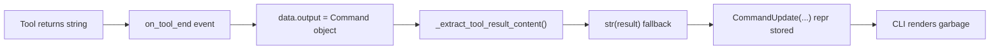

# Fix Approval-Gated Tool Result Extraction

## Problem

When tools go through the approval interrupt/resume cycle, the TUI displays a raw Python `CommandUpdate(...)` repr string instead of the clean tool result (e.g., "Successfully wrote 123 characters to 'foo.txt'"). This affects all approval-gated tools, not just Write.

## Root Cause

When LangGraph resumes from an `interrupt()`, the `on_tool_end` event's `data.output` contains a LangGraph `Command` object rather than the plain string return value. The extraction method in `[status_builder.py](backend/services/agent-runner/worker/activities/graphton/status_builder.py)` doesn't recognize `Command` objects -- it's not a `str`, doesn't have a useful `.content`, and isn't a `dict` -- so it falls through to `str(result)` (line 718), producing the raw Python repr.

## Fix Strategy: Two Layers

### Layer 1 -- Backend Root Cause (status_builder.py)

**File:** `[backend/services/agent-runner/worker/activities/graphton/status_builder.py](backend/services/agent-runner/worker/activities/graphton/status_builder.py)`

Enhance `_extract_tool_result_content()` (line 694) to handle LangGraph `Command` objects:

- Add a new branch between the existing `.content` check (line 706) and the `dict` check (line 712)
- Detect `Command` via duck-typing: `hasattr(result, "update") and isinstance(result.update, dict)`
- Extract the `ToolMessage.content` from `Command.update["messages"]` (the messages state channel holds the human-readable tool result)
- Add a new helper `_extract_command_content()` for clarity
- Add a `logger.warning()` to the final `str(result)` fallback so future unknown types don't silently produce garbage

The duck-typing approach stays decoupled from `langgraph.types` imports, consistent with the existing `.content` duck-typing for ToolMessage.

### Layer 2 -- CLI Defense-in-Depth (format.go)

**File:** `[client-apps/cli/pkg/toolrender/format.go](client-apps/cli/pkg/toolrender/format.go)`

Extend `stripToolMessageRepr()` (line 137) to also detect and clean `CommandUpdate(...)` repr strings that may leak through if the backend fix doesn't fully cover a case:

- If the string starts with `CommandUpdate(`, scan for `ToolMessage(content='...')` or `ToolMessage(content="...")` patterns and extract the content value
- If no ToolMessage content can be extracted, return a neutral string like `"(state update)"` rather than showing the raw repr

This follows the existing defensive pattern -- `stripToolMessageRepr` already handles `content=` prefix leaks, this extends it to handle `CommandUpdate(` prefix leaks.

## Tests

### Backend Tests

**File:** `[backend/services/agent-runner/tests/test_status_builder.py](backend/services/agent-runner/tests/test_status_builder.py)`

Add a `_FakeCommand` test double (mimics LangGraph `Command` with `.update` dict) and new test cases in `TestExtractToolResultContent`:

- Command with `.update["messages"]` containing a ToolMessage with string content
- Command with empty messages list (fallback behavior)
- Command with `.update` but no `messages` key (fallback to JSON)
- Command with ToolMessage with multimodal (list) content

### CLI Tests

**File:** `[client-apps/cli/pkg/toolrender/render_test.go](client-apps/cli/pkg/toolrender/render_test.go)`

Add test cases for the new `CommandUpdate` handling in `stripToolMessageRepr`:

- `CommandUpdate(...)` with extractable `ToolMessage(content='...')`
- `CommandUpdate(...)` with double-quoted ToolMessage content
- `CommandUpdate(...)` with no extractable ToolMessage (fallback)
- Verify existing tests still pass (no regression)

