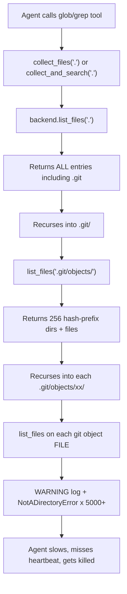

# Fix Workspace File Scanning -- Stop Scanning `.git/objects/`

## Root Cause

Three compounding defects produce the flood of `"Path '...' is a file, not a directory"` warnings and the eventual heartbeat timeout crash:




| Layer   | File                                                                                                         | Problem                                                                                                |
| ------- | ------------------------------------------------------------------------------------------------------------ | ------------------------------------------------------------------------------------------------------ |
| Backend | `[filesystem.py](backend/libs/python/graphton/src/graphton/core/backends/filesystem.py)` L322-360            | `list_files()` returns raw `iterdir()` without filtering `_SKIP_DIR_NAMES` or hidden entries           |
| Tools   | `[tool_wrappers.py](backend/libs/python/graphton/src/graphton/core/tool_wrappers.py)` L1215-1231, L1324-1343 | `glob` and `grep` call `list_files()` on every item (files included), using exceptions as control flow |
| Logging | `[filesystem.py](backend/libs/python/graphton/src/graphton/core/backends/filesystem.py)` L347                | `list_files()` logs WARNING for expected probe behavior (tools calling it on files)                    |


## Fix 1: Filter noise directories in `list_files()` (highest impact)

In `[filesystem.py](backend/libs/python/graphton/src/graphton/core/backends/filesystem.py)`, modify `list_files()` to filter out `_SKIP_DIR_NAMES` and hidden entries (names starting with `.`), consistent with how `_format_directory_listing()` already does it.

**Before** (line 350):

```python
entries = [item.name for item in dir_path.iterdir()]
```

**After**:

```python
entries = [
    item.name for item in dir_path.iterdir()
    if not item.name.startswith(".") and item.name not in self._SKIP_DIR_NAMES
]
```

The virtual `.stigmer` injection on lines 352-358 remains unchanged (it only applies at workspace root and is explicitly appended).

## Fix 2: Replace exception-driven traversal in `glob` and `grep`

In `[tool_wrappers.py](backend/libs/python/graphton/src/graphton/core/tool_wrappers.py)`:

**a) Add a helper to distinguish files from directories.** Since `list_files()` raises `NotADirectoryError` for files, we can use a try/except pattern but only at the recursion boundary, or better, add a lightweight `is_directory()` method to `FilesystemBackend`:

```python
def is_directory(self, path: str) -> bool:
    """Check if path points to a directory."""
    try:
        resolved = self._resolve_sandbox_path(path)
        return resolved.is_dir()
    except (ValueError, OSError):
        return False
```

**b) Refactor `collect_files()` in `glob` tool** (~line 1215) to only recurse into directories:

```python
def collect_files(dir_path: str) -> None:
    try:
        items = backend.list_files(dir_path)
    except Exception:
        return
    for item in items:
        item_path = os.path.join(dir_path, item) if dir_path != "." else item
        item_path = item_path.replace("\\", "/")
        all_files.append(item_path)
        if hasattr(backend, 'is_directory') and backend.is_directory(item_path):
            collect_files(item_path)
        elif not hasattr(backend, 'is_directory'):
            try:
                collect_files(item_path)
            except Exception:
                pass
```

**c) Refactor `collect_and_search()` in `grep` tool** (~line 1324) with the same pattern -- only recurse into directories, search files.

## Fix 3: Downgrade log level for expected probe behavior

In `[filesystem.py](backend/libs/python/graphton/src/graphton/core/backends/filesystem.py)` line 347, change the log level from `WARNING` to `DEBUG`:

```python
logger.debug(msg)  # was: logger.warning(msg)
```

Tools legitimately probe paths they don't know the type of. This should not produce WARNING-level noise.

## Fix 4 (optional, defense-in-depth): Add recursion depth limit

Add a `max_depth` parameter to `collect_files()` and `collect_and_search()` to prevent unbounded recursion:

```python
def collect_files(dir_path: str, depth: int = 0) -> None:
    if depth > 10:
        return
    ...
    collect_files(item_path, depth + 1)
```

## Test Updates

Existing tests in `[test_filesystem_backend.py](backend/libs/python/graphton/src/graphton/core/tests/core/test_filesystem_backend.py)` that call `list_files()` and expect to see hidden entries or `.git` will need adjustment to reflect the new filtering. Specifically:

- Tests creating `.git/config` and expecting `.git` in listings should be updated
- Add a new test verifying `.git` is excluded from `list_files()` results
- Add a test for the new `is_directory()` method
- Add tests for `glob`/`grep` not recursing into `.git`

## Files to Modify

- `[backend/libs/python/graphton/src/graphton/core/backends/filesystem.py](backend/libs/python/graphton/src/graphton/core/backends/filesystem.py)` -- `list_files()` filtering + `is_directory()` + log level
- `[backend/libs/python/graphton/src/graphton/core/tool_wrappers.py](backend/libs/python/graphton/src/graphton/core/tool_wrappers.py)` -- `glob` and `grep` traversal logic
- `[backend/libs/python/graphton/src/graphton/core/backends/daytona.py](backend/libs/python/graphton/src/graphton/core/backends/daytona.py)` -- Add `is_directory()` delegation
- Test files for updated behavior

