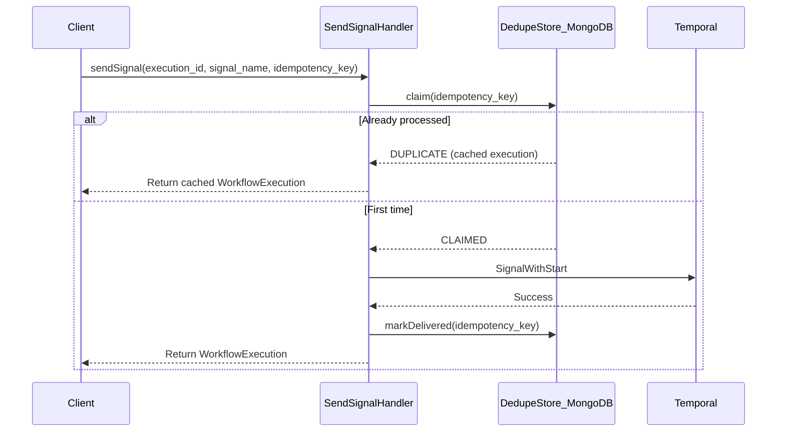

# Gap B2: Event Deduplication for Durable Signal Delivery

## Problem Statement

External events (webhooks, API callbacks, human approvals) can be delivered multiple times due to:

- Network retries from webhook providers (Stripe, GitHub, etc.)
- Client-side retries on timeout
- At-least-once delivery semantics

Without deduplication, the same signal could unblock a LISTEN task multiple times or cause race conditions.

## Design Decision: MongoDB-First Dedupe Store

Based on the [tool idempotency research](stigmer/_projects/2026-02/20260208.01.durable-agentic-workflows/research.tool-idempotency-storage-patterns/04.report.gpt.md), I recommend MongoDB as the dedupe store because:

1. **Durability**: Redis HA can lose acknowledged writes due to async replication
2. **Consistency**: MongoDB provides atomic single-document updates with unique constraints
3. **Existing infrastructure**: Already using MongoDB for LangGraph checkpoints
4. **TTL support**: MongoDB TTL indexes handle automatic expiration

Redis will NOT be used for dedupe (per research recommendation) - it's acceptable for caching but not as the sole correctness mechanism for preventing duplicate side effects.

## Architecture




## API Changes

### Proto: Add `idempotency_key` to SendSignalInput

Location: [apis/ai/stigmer/agentic/workflowexecution/v1/io.proto](stigmer/apis/ai/stigmer/agentic/workflowexecution/v1/io.proto)

```protobuf
message SendSignalInput {
  string execution_id = 1;
  string signal_name = 2;
  google.protobuf.Struct payload = 3;
  
  // NEW: Idempotency key for deduplication
  // Optional - if not provided, signal is processed without dedupe protection.
  // Format recommendations:
  // - Webhook: "{source}:{event_id}" (e.g., "stripe:evt_123abc")
  // - API caller: UUID generated client-side
  // Scope: Keys are scoped to organization to prevent cross-org collisions.
  // TTL: Keys expire after 24 hours (configurable).
  string idempotency_key = 4;
}
```

## Data Model: Signal Dedupe Record

MongoDB collection: `signal_dedupe`

```json
{
  "_id": "{org}:{idempotency_key}",
  "org": "org-abc123",
  "idempotency_key": "stripe:evt_123abc",
  "execution_id": "wfx-xyz789",
  "signal_name": "payment_confirmed",
  "status": "DELIVERED",
  "created_at": "2026-02-08T12:00:00Z",
  "delivered_at": "2026-02-08T12:00:01Z",
  "expires_at": "2026-02-09T12:00:00Z"
}
```

- **Status**: `CLAIMED` (in-progress) or `DELIVERED` (complete)
- **TTL**: `expires_at` field with MongoDB TTL index (default 24 hours)
- **Unique constraint**: `_id` ensures only one record per org+key

## Implementation Components

### 1. Proto API Update (stigmer)

File: [apis/ai/stigmer/agentic/workflowexecution/v1/io.proto](stigmer/apis/ai/stigmer/agentic/workflowexecution/v1/io.proto)

- Add `idempotency_key` field (field number 4)
- Add documentation explaining format, scope, and TTL

### 2. Go Implementation (stigmer)

Files to modify/create:

- [backend/services/stigmer-server/pkg/domain/workflowexecution/controller/send_signal.go](stigmer/backend/services/stigmer-server/pkg/domain/workflowexecution/controller/send_signal.go) - Add dedupe step to pipeline
- NEW: `backend/services/stigmer-server/pkg/domain/workflowexecution/dedupe/signal_dedupe_store.go` - MongoDB-backed store

Pipeline changes:

```go
// Updated pipeline with dedupe step
pipeline.NewPipeline[*workflowexecutionv1.SendSignalInput]("workflowexecution-send-signal").
    AddStep(NewValidateSignalInputStep()).
    AddStep(NewLoadExecutionByExecutionIdStep(store)).
    AddStep(NewValidateSignalableStep()).
    AddStep(NewDedupeClaimStep(dedupeStore)).  // NEW
    AddStep(NewSendSignalToWorkflowStep(workflowCreator)).
    AddStep(NewDedupeMarkDeliveredStep(dedupeStore)).  // NEW
    Build()
```

### 3. Java Implementation (stigmer-cloud)

Files to modify/create:

- [backend/services/stigmer-service/src/main/java/ai/stigmer/domain/agentic/workflowexecution/request/handler/WorkflowExecutionSendSignalHandler.java](stigmer-cloud/backend/services/stigmer-service/src/main/java/ai/stigmer/domain/agentic/workflowexecution/request/handler/WorkflowExecutionSendSignalHandler.java) - Add dedupe step
- NEW: `backend/services/stigmer-service/src/main/java/ai/stigmer/domain/agentic/workflowexecution/dedupe/SignalDedupeStore.java` - MongoDB-backed store
- NEW: `backend/services/stigmer-service/src/main/java/ai/stigmer/domain/agentic/workflowexecution/dedupe/SignalDedupeRecord.java` - Document model

Pipeline changes (5-step becomes 7-step):

```java
.addStep(validateInputStep)
.addStep(loadExistingStep)
.addStep(authorizeStep)
.addStep(validateSignalableStep)
.addStep(dedupeClaimStep)           // NEW
.addStep(sendSignalToTemporalStep)
.addStep(dedupeMarkDeliveredStep)   // NEW
```

### 4. Stub Regeneration

Run proto compilation to regenerate stubs for all languages (Go, Java, Python, TypeScript, Dart).

## Key Design Decisions


| Decision           | Choice                  | Rationale                                                 |
| ------------------ | ----------------------- | --------------------------------------------------------- |
| Store              | MongoDB only            | Redis HA can lose writes; MongoDB is durable              |
| Key scope          | Per-organization        | Prevents cross-org collisions                             |
| TTL                | 24 hours default        | Matches Stripe idempotency window; covers retry scenarios |
| Idempotency key    | Optional                | Backward compatible; callers opt-in to dedupe protection  |
| Duplicate response | Return cached execution | Idempotent behavior - same response for same key          |


## Edge Cases

1. **No idempotency_key provided**: Skip dedupe entirely (backward compatible)
2. **Claim succeeds but signal delivery fails**: Record stays in CLAIMED state; cleanup via TTL
3. **Concurrent requests with same key**: First to insert wins; others get DUPLICATE response
4. **Key expired and re-sent**: New record created; signal delivered again (acceptable - TTL means old request is stale)

## Files Changed Summary

**stigmer (proto + Go)**:

- `apis/ai/stigmer/agentic/workflowexecution/v1/io.proto` - Add idempotency_key field
- `backend/services/stigmer-server/pkg/domain/workflowexecution/controller/send_signal.go` - Add dedupe steps
- NEW: `backend/services/stigmer-server/pkg/domain/workflowexecution/dedupe/signal_dedupe_store.go`
- NEW: `backend/services/stigmer-server/pkg/domain/workflowexecution/dedupe/signal_dedupe_record.go`

**stigmer-cloud (Java)**:

- `backend/services/stigmer-service/.../WorkflowExecutionSendSignalHandler.java` - Add dedupe steps
- NEW: `backend/services/stigmer-service/.../dedupe/SignalDedupeStore.java`
- NEW: `backend/services/stigmer-service/.../dedupe/SignalDedupeRecord.java`
- NEW: `backend/services/stigmer-service/.../dedupe/SignalDedupeRepo.java` (Spring Data MongoDB)

## Testing Strategy

Unit tests:

- DedupeStore claim/markDelivered logic
- Pipeline with duplicate key returns cached response
- Pipeline without key skips dedupe

Integration tests (manual):

- Send signal with idempotency_key, verify stored in MongoDB
- Send duplicate signal, verify same response returned
- Wait for TTL expiration, verify key can be reused

