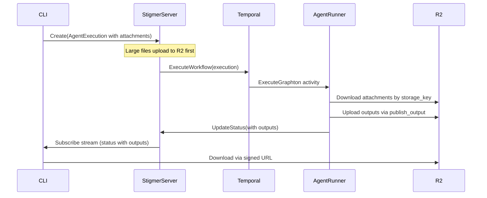

# Go Backend Artifact Implementation

## Context

- **Session 1**: Proto definitions complete (`Attachment`, `ExecutionOutput`, `ExecutionOutputKind`)
- **Session 2**: Python agent-runner complete (storage abstraction, attachment injection, `publish_output` tool)
- **This Task**: Go backend to connect CLI with Python agent-runner

## Architecture




## Implementation

### 1. R2 Artifact Storage Service

Reuse pattern from `[workflow-runner/pkg/claimcheck/r2_store.go](backend/services/workflow-runner/pkg/claimcheck/r2_store.go)`.

**New files:**

- `backend/services/stigmer-server/pkg/domain/artifact/storage/storage.go` - Interface
- `backend/services/stigmer-server/pkg/domain/artifact/storage/r2_storage.go` - R2 implementation
- `backend/services/stigmer-server/pkg/domain/artifact/storage/local_storage.go` - Local implementation

**Interface** (adapted from claimcheck `ObjectStore`):

```go
type ArtifactStorage interface {
    Upload(ctx context.Context, key string, data []byte, contentType string) error
    Download(ctx context.Context, key string) ([]byte, error)
    GetSignedURL(ctx context.Context, key string, expiresIn time.Duration) (string, error)
    Delete(ctx context.Context, key string) error
    Exists(ctx context.Context, key string) (bool, error)
}
```

**Config** - Add R2 env vars to server config (same as workflow-runner: `R2_BUCKET`, `R2_ENDPOINT`, `R2_ACCESS_KEY_ID`, `R2_SECRET_ACCESS_KEY`).

### 2. gRPC Controllers for Artifacts

**File:** `backend/services/stigmer-server/pkg/domain/artifact/controller/artifact_controller.go`

Add two RPCs to existing proto or create new `artifact.proto`:

- `UploadArtifact(key, content, content_type) -> storage_key` - For CLI large file uploads
- `GetArtifactDownloadUrl(storage_key) -> signed_url` - For CLI downloads

Wire into `[server.go](backend/services/stigmer-server/pkg/server/server.go)` following existing pattern:

```go
artifactStorage := artifactstorage.NewR2Storage(cfg.R2Config)
artifactController := artifactcontroller.NewArtifactController(artifactStorage)
```

### 3. Agent Execution Integration

**Modify:** `[controller/create.go](backend/services/stigmer-server/pkg/domain/agentexecution/controller/create.go)`

Add step to process attachments before starting workflow:

- If `attachment.content` is large (>4MB), upload to R2 and set `storage_key`
- Clear `content` field to avoid Temporal payload limits

**Modify:** `[controller/update_status.go](backend/services/stigmer-server/pkg/domain/agentexecution/controller/update_status.go)`

When Python agent-runner calls `UpdateStatus` with outputs:

- Outputs already have `download_url` from Python
- No additional processing needed (URLs generated by Python)

### 4. Key Files Reference


| Pattern Source                                                                                                      | Purpose                            |
| ------------------------------------------------------------------------------------------------------------------- | ---------------------------------- |
| `[claimcheck/r2_store.go](backend/services/workflow-runner/pkg/claimcheck/r2_store.go)`                             | R2 client setup with AWS SDK v2    |
| `[claimcheck/store.go](backend/services/workflow-runner/pkg/claimcheck/store.go)`                                   | Config struct pattern              |
| `[skill/storage/artifact_storage.go](backend/services/stigmer-server/pkg/domain/skill/storage/artifact_storage.go)` | Existing storage interface pattern |
| `[controller/create.go](backend/services/stigmer-server/pkg/domain/agentexecution/controller/create.go)`            | Pipeline step pattern              |


## Scope Decision

**Minimal MVP approach:**

- Skip creating new proto for artifact endpoints
- Use inline content for attachments <4MB initially
- CLI `--attach` can work without upload endpoint for small files
- Add upload endpoint only when needed for large files

This allows faster iteration: CLI `--attach` → inline content → Temporal → Python (already works).