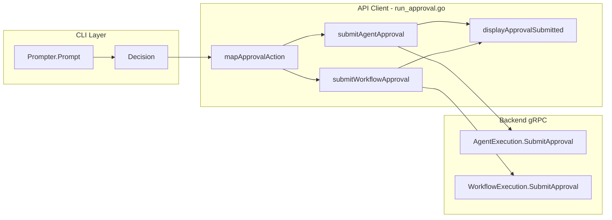

# Phase 6.3: HITL Approval API Client

## Objective

Create the approval submission layer that bridges the interactive prompt (Phase 6.2) with the backend gRPC APIs. This enables users to submit their approval decisions (Approve/Skip/Reject) to either the Agent or Workflow execution APIs.

## Architecture Context




## Files to Create

### 1. [run_approval.go](client-apps/cli/cmd/stigmer/root/run_approval.go) (~100 lines)

**Purpose**: gRPC submission functions and action mapping

**Functions**:

1. **mapApprovalAction** - Converts `pkg/approval.Action` to proto `ApprovalAction`

```go
func mapApprovalAction(action approval.Action) agentexecutionv1.ApprovalAction {
    switch action {
    case approval.ActionApprove:
        return agentexecutionv1.ApprovalAction_APPROVAL_ACTION_APPROVE
    case approval.ActionSkip:
        return agentexecutionv1.ApprovalAction_APPROVAL_ACTION_SKIP
    case approval.ActionReject:
        return agentexecutionv1.ApprovalAction_APPROVAL_ACTION_REJECT
    default:
        return agentexecutionv1.ApprovalAction_APPROVAL_ACTION_UNSPECIFIED
    }
}
```

1. **submitAgentApproval** - Submits approval via Agent API

```go
func submitAgentApproval(
    ctx context.Context,
    conn *grpc.ClientConn,
    executionID string,
    toolCallID string,
    decision *approval.Decision,
) (*agentexecutionv1.AgentExecution, error)
```

Key implementation details:

- Create `AgentExecutionCommandControllerClient`
- Build `SubmitApprovalInput` from parameters
- Use `context.WithTimeout` (10 seconds for quick RPC)
- Wrap errors with specific context

1. **submitWorkflowApproval** - Submits approval via Workflow API

```go
func submitWorkflowApproval(
    ctx context.Context,
    conn *grpc.ClientConn,
    executionID string,
    toolCallID string,
    decision *approval.Decision,
) (*workflowexecutionv1.WorkflowExecution, error)
```

Key implementation details:

- Create `WorkflowExecutionCommandControllerClient`
- Build `SubmitWorkflowApprovalInput` from parameters
- Same timeout and error handling pattern as agent

1. **displayApprovalSubmitted** - Displays confirmation after submission

```go
func displayApprovalSubmitted(action approval.Action)
```

Shows user-friendly confirmation:

- Approve: "Tool execution approved"
- Skip: "Tool execution skipped"
- Reject: "Tool execution rejected"

**Import Dependencies**:

```go
import (
    "context"
    "fmt"
    "time"

    agentexecutionv1 "github.com/stigmer/stigmer/apis/stubs/go/ai/stigmer/agentic/agentexecution/v1"
    workflowexecutionv1 "github.com/stigmer/stigmer/apis/stubs/go/ai/stigmer/agentic/workflowexecution/v1"
    "github.com/stigmer/stigmer/client-apps/cli/internal/cli/cliprint"
    "github.com/stigmer/stigmer/client-apps/cli/pkg/approval"
    "google.golang.org/grpc"
)
```

### 2. [run_approval_test.go](client-apps/cli/cmd/stigmer/root/run_approval_test.go) (~150 lines)

**Purpose**: Comprehensive unit tests for all functions

**Test Categories**:

1. **TestMapApprovalAction** (table-driven)
  - Test all 4 action mappings (Approve, Skip, Reject, Unspecified)
  - Verify correct proto enum values
2. **TestDisplayApprovalSubmitted** (capture stdout)
  - Test display output for each action type
  - Verify correct messages and formatting
3. **TestSubmitAgentApproval** (mock client - if feasible)
  - Test successful submission
  - Test error wrapping on failure
4. **TestSubmitWorkflowApproval** (mock client - if feasible)
  - Test successful submission
  - Test error wrapping on failure

**Testing Strategy**:

For `mapApprovalAction` and `displayApprovalSubmitted`:

- Direct unit tests using standard Go testing
- Use `captureStdout` helper from existing test file

For gRPC functions:

- Focus on testing the function logic, not actual gRPC calls
- Can use interface abstraction if needed for complex mocking
- Alternatively, test error paths and parameter handling

## Implementation Guidelines

### Error Handling

Follow existing CLI patterns:

- Wrap errors with `fmt.Errorf("failed to submit %s approval: %w", executionType, err)`
- Include execution ID in error context
- Use `cliprint.PrintError` for user-facing errors

### Timeouts

- Use 10-second timeout for approval submissions (quick unary RPC)
- Follow pattern from `run_resolve.go` for timeout handling

### File Size Constraints

- Keep under 250 lines (Stigmer CLI engineering standard)
- Functions under 50 lines
- Clear separation of concerns

### Code Quality

- Follow existing import ordering (stdlib, external, internal)
- Use consistent naming with other `run_*.go` files
- Add documentation comments for all exported functions

## Proto Reference

**Agent API**:

```go
client := agentexecutionv1.NewAgentExecutionCommandControllerClient(conn)
resp, err := client.SubmitApproval(ctx, &agentexecutionv1.SubmitApprovalInput{
    AgentExecutionId: executionID,
    ToolCallId:       toolCallID,
    Action:           mapApprovalAction(decision.Action),
    Comment:          decision.Comment,
})
```

**Workflow API**:

```go
client := workflowexecutionv1.NewWorkflowExecutionCommandControllerClient(conn)
resp, err := client.SubmitApproval(ctx, &workflowexecutionv1.SubmitWorkflowApprovalInput{
    ExecutionId: executionID,
    ToolCallId:  toolCallID,
    Action:      mapApprovalAction(decision.Action),
    Comment:     decision.Comment,
})
```

## Acceptance Criteria

- `mapApprovalAction()` correctly maps all 4 action types
- `submitAgentApproval()` calls correct gRPC endpoint with proper input
- `submitWorkflowApproval()` calls correct gRPC endpoint with proper input
- `displayApprovalSubmitted()` shows appropriate confirmation message
- Error messages include relevant context (execution ID, error details)
- All unit tests pass
- File stays under 250 lines
- All functions under 50 lines
- Ready for integration in Phase 6.4 streaming loop

## Dependency on Phase 6.2

Uses the following from `pkg/approval`:

- `approval.Action` type (ActionApprove, ActionSkip, ActionReject)
- `approval.Decision` struct (Action + Comment)

## What This Enables (Phase 6.4)

After this sub-task, the streaming loop can:

1. Detect approval requirement from stream
2. Display approval info (Phase 6.1)
3. Prompt user for decision (Phase 6.2)
4. Submit decision to backend (Phase 6.3 - THIS)
5. Continue streaming after approval processed

