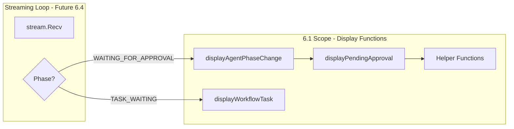

# Sub-Task 6.1: Approval Display Functions

## Objective

Add display functions to `run_display.go` that surface HITL approval requests to users during agent/workflow streaming. This is pure display logic - no streaming loop modifications, no interactive prompts, no API calls.

## Architecture




## Key Design Decisions

1. **Single Responsibility**: All approval display logic in `run_display.go` (display file stays focused on rendering)
2. **Interface-Ready**: Display functions accept proto types directly, enabling future abstraction for mock testing
3. **Zero Side Effects**: Pure display functions - no I/O beyond stdout, no state mutations
4. **Reusable Helpers**: Time formatting and JSON indentation extracted for testability

## Files to Modify

### [run_display.go](client-apps/cli/cmd/stigmer/root/run_display.go)

**Changes (~60 lines added)**:

1. **Add WAITING_FOR_APPROVAL case** to `displayAgentPhaseChange()` (lines 14-27):

```go
case agentexecutionv1.ExecutionPhase_EXECUTION_WAITING_FOR_APPROVAL:
    cliprint.PrintWarning("Approval required")
```

1. **Add WORKFLOW_TASK_WAITING_APPROVAL case** to `displayWorkflowTask()` (lines 71-101):

```go
case workflowexecutionv1.WorkflowTaskStatus_WORKFLOW_TASK_WAITING_APPROVAL:
    icon = "⏸"
    statusText = "Awaiting Approval"
```

1. **Create `displayPendingApproval()` function** (~35 lines):
  - Visual separator using `strings.Repeat("─", 60)`
  - Header: "APPROVAL REQUIRED" with warning color
  - Sub-agent indicator (if `from_sub_agent == true`)
  - Tool name display
  - Message display (the human-readable approval message)
  - Args preview (formatted/indented JSON)
  - Waiting duration since `requested_at`
  - Footer separator
2. **Create helper functions** (~20 lines):
  - `formatApprovalArgsPreview(argsPreview string) string` - Indent JSON lines with prefix
  - `formatWaitingDuration(requestedAt string) string` - Calculate and format duration

### [run_display_test.go](client-apps/cli/cmd/stigmer/root/run_display_test.go) (NEW)

**Test Coverage (~180 lines)**:

Tests use `bytes.Buffer` capture pattern for stdout verification (standard Go testing pattern for CLI output).

**Test Cases**:


| Test Function                                       | Purpose                                                   |
| --------------------------------------------------- | --------------------------------------------------------- |
| `TestDisplayPendingApproval_BasicFields`            | Verify tool name and message are displayed                |
| `TestDisplayPendingApproval_WithSubAgent`           | Verify sub-agent name is shown when `from_sub_agent=true` |
| `TestDisplayPendingApproval_WithArgsPreview`        | Verify JSON args are properly indented                    |
| `TestDisplayPendingApproval_FormatsWaitingDuration` | Verify "Waiting for: Xs" calculation                      |
| `TestDisplayPendingApproval_NoArgsPreview`          | Verify graceful handling of empty args                    |
| `TestDisplayAgentPhaseChange_WaitingForApproval`    | Verify phase case outputs correct message                 |
| `TestDisplayWorkflowTask_WaitingApproval`           | Verify task status case outputs correct icon/text         |
| `TestFormatWaitingDuration_Various`                 | Table-driven test for duration formatting edge cases      |
| `TestFormatApprovalArgsPreview_MultilineJSON`       | Verify JSON indentation with multiple lines               |


## Implementation Details

### `displayPendingApproval()` Output Format

```
────────────────────────────────────────────────────────────
⚠ APPROVAL REQUIRED

   Sub-agent: code-reviewer          (only if from_sub_agent)
   Tool: write_file
   Message: Write to protected file: /etc/hosts
   
   Arguments:
      {
        "path": "/etc/hosts",
        "content": "127.0.0.1 localhost"
      }
   
   Waiting for: 15s
────────────────────────────────────────────────────────────
```

### `formatWaitingDuration()` Logic

```go
func formatWaitingDuration(requestedAt string) string {
    if requestedAt == "" {
        return "unknown"
    }
    t, err := time.Parse(time.RFC3339, requestedAt)
    if err != nil {
        return "unknown"
    }
    duration := time.Since(t)
    if duration < time.Second {
        return "just now"
    }
    return duration.Truncate(time.Second).String()
}
```

### `formatApprovalArgsPreview()` Logic

```go
func formatApprovalArgsPreview(argsPreview string) string {
    if argsPreview == "" {
        return ""
    }
    const indent = "      "
    lines := strings.Split(argsPreview, "\n")
    var result strings.Builder
    for _, line := range lines {
        result.WriteString(indent)
        result.WriteString(line)
        result.WriteString("\n")
    }
    return result.String()
}
```

## Proto Types Reference

**PendingApproval** (from `agentexecutionv1`):

- `ToolCallId` - string
- `ToolName` - string  
- `Message` - string (human-readable approval message)
- `ArgsPreview` - string (sanitized JSON)
- `RequestedAt` - string (ISO 8601)
- `FromSubAgent` - bool
- `SubAgentName` - string
- `ChildAgentExecutionId` - string (for workflow-level)

## Acceptance Criteria

- `displayAgentPhaseChange()` handles `EXECUTION_WAITING_FOR_APPROVAL` phase
- `displayWorkflowTask()` handles `WORKFLOW_TASK_WAITING_APPROVAL` status  
- `displayPendingApproval()` displays all PendingApproval fields correctly
- Sub-agent context conditionally displayed when `from_sub_agent == true`
- Waiting duration calculated from `requested_at` timestamp
- JSON arguments properly indented for readability
- All edge cases handled gracefully (empty fields, invalid timestamps)
- Unit tests achieve 100% coverage of new functions
- All tests pass with `go test ./client-apps/cli/cmd/stigmer/root/...`
- Files comply with Stigmer CLI engineering standards (functions < 50 lines, files < 250 lines)

## Out of Scope (Future Sub-Tasks)

- Interactive prompt implementation (6.2)
- API submission functions (6.3)  
- Streaming loop integration (6.4)
- TTY detection for prompt eligibility (6.2)

## Dependencies

- Proto stubs already generated: `agentexecutionv1.ExecutionPhase_EXECUTION_WAITING_FOR_APPROVAL`
- Proto stubs already generated: `workflowexecutionv1.WorkflowTaskStatus_WORKFLOW_TASK_WAITING_APPROVAL`
- Existing: `cliprint` package for colored output
- Existing: `strings` and `time` standard library packages

