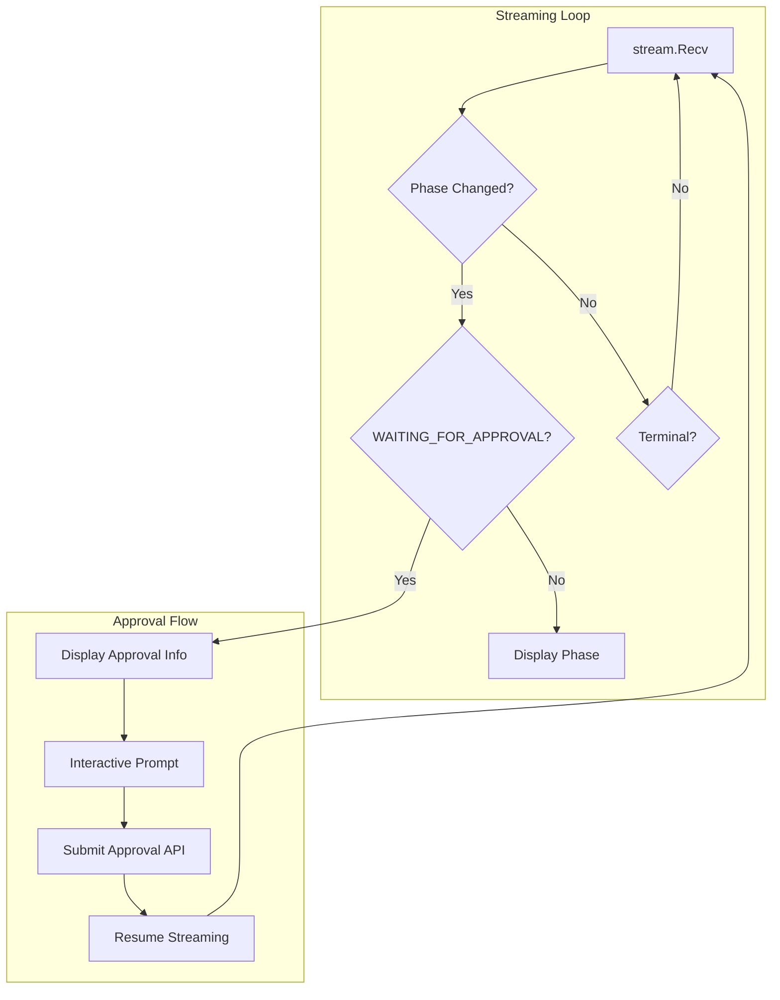

# Phase 6: CLI Support for HITL Approval Flow

## Architecture Overview




## Sub-Task Breakdown

---

## Sub-Task 6.1: Approval Display Functions (45-60 min)

**Goal**: Add display functions for approval state without modifying the streaming loop.

### Files to Modify

**[run_display.go](client-apps/cli/cmd/stigmer/root/run_display.go)** (~40 lines added):

- Add `EXECUTION_WAITING_FOR_APPROVAL` case to `displayAgentPhaseChange()` (line 14-27)
- Add `displayPendingApproval()` function to format `PendingApproval` info
- Add `WORKFLOW_TASK_WAITING_APPROVAL` case to `displayWorkflowTask()` (line 71-101)

### Key Implementation

```go
// displayPendingApproval shows the tool approval request details
func displayPendingApproval(approval *agentexecutionv1.PendingApproval) {
    // Header with separator
    fmt.Println(strings.Repeat("─", 60))
    cliprint.PrintWarning("🔐 APPROVAL REQUIRED")
    fmt.Println()
    
    // Sub-agent indicator if applicable
    if approval.FromSubAgent {
        fmt.Printf("   Sub-agent: %s\n", approval.SubAgentName)
    }
    
    // Tool info
    fmt.Printf("   Tool: %s\n", approval.ToolName)
    fmt.Printf("   Message: %s\n", approval.Message)
    
    // Args preview (formatted JSON or truncated)
    if approval.ArgsPreview != "" {
        fmt.Printf("   Arguments:\n%s\n", indentJSON(approval.ArgsPreview))
    }
    
    // Waiting duration
    if approval.RequestedAt != "" {
        fmt.Printf("   Waiting since: %s\n", formatWaitingDuration(approval.RequestedAt))
    }
    
    fmt.Println(strings.Repeat("─", 60))
}
```

### Tests to Add

**New file: [run_display_test.go**](client-apps/cli/cmd/stigmer/root/run_display_test.go) (~120 lines):

- `TestDisplayPendingApproval_BasicFields`
- `TestDisplayPendingApproval_WithSubAgent`
- `TestDisplayPendingApproval_WithArgsPreview`
- `TestDisplayPendingApproval_FormatsWaitingDuration`
- `TestDisplayAgentPhaseChange_WaitingForApproval`

### Acceptance Criteria

- `displayAgentPhaseChange()` handles `EXECUTION_WAITING_FOR_APPROVAL`
- `displayPendingApproval()` formats all `PendingApproval` fields
- Waiting duration calculated and displayed
- Sub-agent context displayed when applicable
- All tests pass

---

## Sub-Task 6.2: Interactive Approval Prompt (60-75 min)

**Goal**: Create a reusable approval prompt abstraction following interface segregation principle.

### Files to Create

**New package: `pkg/approval/**`

**[prompt.go](client-apps/cli/pkg/approval/prompt.go)** (~80 lines):

```go
package approval

// ApprovalDecision represents the user's decision
type ApprovalDecision struct {
    Action  Action
    Comment string
}

// Action represents the approval action
type Action int

const (
    ActionApprove Action = iota + 1
    ActionSkip
    ActionReject
)

// Prompter interface for approval prompts (enables testing)
type Prompter interface {
    // Prompt displays the approval options and returns the user's decision.
    // Returns error if prompt is cancelled or non-interactive mode without default.
    Prompt(ctx context.Context, opts PromptOptions) (*ApprovalDecision, error)
}

// PromptOptions configures the approval prompt
type PromptOptions struct {
    ToolName    string
    Message     string
    ArgsPreview string
    // NonInteractive mode auto-selects DefaultAction if set
    NonInteractive bool
    DefaultAction  Action
}
```

**[interactive.go](client-apps/cli/pkg/approval/interactive.go)** (~100 lines):

- Implement `InteractivePrompter` using Survey library
- Three options: Approve, Skip, Reject
- Optional comment input after selection
- TTY detection via `pkg/display/terminal.go`

**[doc.go](client-apps/cli/pkg/approval/doc.go)** (~15 lines):

- Package documentation

### Tests to Add

**[prompt_test.go](client-apps/cli/pkg/approval/prompt_test.go)** (~150 lines):

- `TestInteractivePrompter_Approve`
- `TestInteractivePrompter_Skip`
- `TestInteractivePrompter_Reject`
- `TestInteractivePrompter_WithComment`
- `TestInteractivePrompter_NonInteractiveWithDefault`
- `TestInteractivePrompter_NonInteractiveNoDefault_Error`
- `TestInteractivePrompter_Cancelled`

### Acceptance Criteria

- `Prompter` interface defined for testability
- `InteractivePrompter` uses Survey library
- Three-option selection (Approve/Skip/Reject)
- Optional comment collection
- Non-interactive mode support with `--force` pattern
- TTY detection prevents prompt on non-TTY
- All tests pass

---

## Sub-Task 6.3: Approval API Client (45-60 min)

**Goal**: Create approval submission functions with proper error handling.

### Files to Create

**[run_approval.go](client-apps/cli/cmd/stigmer/root/run_approval.go)** (~120 lines):

```go
// submitAgentApproval submits an approval decision for an agent execution
func submitAgentApproval(
    ctx context.Context,
    conn *grpc.ClientConn,
    executionID string,
    toolCallID string,
    action agentexecutionv1.ApprovalAction,
    comment string,
) (*agentexecutionv1.AgentExecution, error) {
    client := agentexecutionv1.NewAgentExecutionCommandControllerClient(conn)
    
    resp, err := client.SubmitApproval(ctx, &agentexecutionv1.SubmitApprovalInput{
        AgentExecutionId: executionID,
        ToolCallId:       toolCallID,
        Action:           action,
        Comment:          comment,
    })
    if err != nil {
        return nil, errors.Wrap(err, "failed to submit agent approval")
    }
    
    return resp, nil
}

// submitWorkflowApproval submits an approval decision for a workflow execution
func submitWorkflowApproval(
    ctx context.Context,
    conn *grpc.ClientConn,
    executionID string,
    toolCallID string,
    action agentexecutionv1.ApprovalAction,
    comment string,
) (*workflowexecutionv1.WorkflowExecution, error) {
    // Similar implementation for workflow
}

// mapApprovalAction converts pkg/approval.Action to proto enum
func mapApprovalAction(action approval.Action) agentexecutionv1.ApprovalAction {
    switch action {
    case approval.ActionApprove:
        return agentexecutionv1.ApprovalAction_APPROVAL_ACTION_APPROVE
    case approval.ActionSkip:
        return agentexecutionv1.ApprovalAction_APPROVAL_ACTION_SKIP
    case approval.ActionReject:
        return agentexecutionv1.ApprovalAction_APPROVAL_ACTION_REJECT
    default:
        return agentexecutionv1.ApprovalAction_APPROVAL_ACTION_UNSPECIFIED
    }
}
```

### Tests to Add

**[run_approval_test.go](client-apps/cli/cmd/stigmer/root/run_approval_test.go)** (~100 lines):

- `TestMapApprovalAction_AllCases`
- `TestSubmitAgentApproval_Success` (mock gRPC client)
- `TestSubmitAgentApproval_Error_WrapsContext`
- `TestSubmitWorkflowApproval_Success`

### Acceptance Criteria

- `submitAgentApproval()` calls correct RPC
- `submitWorkflowApproval()` calls correct RPC
- Error messages wrapped with specific context
- Action mapping handles all cases
- All tests pass

---

## Sub-Task 6.4: Streaming Integration (60-90 min)

**Goal**: Integrate approval flow into the streaming loop with clean pause/resume.

### Files to Modify

**[run_stream.go](client-apps/cli/cmd/stigmer/root/run_stream.go)** (~80 lines added):

```go
func streamAgentExecutionLogs(executionID string, conn *grpc.ClientConn) {
    // ... existing setup ...
    
    prompter := approval.NewInteractivePrompter()
    var lastPendingToolCallID string
    
    for {
        execution, err := stream.Recv()
        // ... existing error handling ...
        
        // Check for approval requirement BEFORE phase change display
        if needsApprovalPrompt(execution, lastPendingToolCallID) {
            // Display approval info
            displayPendingApproval(execution.Status.PendingApproval)
            
            // Prompt for decision
            decision, err := prompter.Prompt(ctx, approval.PromptOptions{
                ToolName:    execution.Status.PendingApproval.ToolName,
                Message:     execution.Status.PendingApproval.Message,
                ArgsPreview: execution.Status.PendingApproval.ArgsPreview,
            })
            if err != nil {
                cliprint.PrintError("Approval cancelled: %v", err)
                return
            }
            
            // Submit approval
            _, err = submitAgentApproval(
                ctx, conn, executionID,
                execution.Status.PendingApproval.ToolCallId,
                mapApprovalAction(decision.Action),
                decision.Comment,
            )
            if err != nil {
                cliprint.PrintError("Failed to submit approval: %v", err)
                return
            }
            
            // Track to avoid duplicate prompts
            lastPendingToolCallID = execution.Status.PendingApproval.ToolCallId
            displayApprovalSubmitted(decision.Action)
        }
        
        // ... existing phase/message handling ...
    }
}

// needsApprovalPrompt checks if we should show approval prompt
func needsApprovalPrompt(execution *agentexecutionv1.AgentExecution, lastToolCallID string) bool {
    if execution.Status.Phase != agentexecutionv1.ExecutionPhase_EXECUTION_WAITING_FOR_APPROVAL {
        return false
    }
    if execution.Status.PendingApproval == nil {
        return false
    }
    // Don't prompt for same tool call twice
    return execution.Status.PendingApproval.ToolCallId != lastToolCallID
}
```

### Similar Updates for Workflow Streaming

- Update `streamWorkflowExecutionLogs()` with same pattern
- Use `submitWorkflowApproval()` for workflow executions

### Tests to Add

**[run_stream_test.go](client-apps/cli/cmd/stigmer/root/run_stream_test.go)** (~180 lines):

- `TestNeedsApprovalPrompt_TrueWhenWaitingWithPending`
- `TestNeedsApprovalPrompt_FalseWhenNotWaiting`
- `TestNeedsApprovalPrompt_FalseWhenSameToolCall`
- `TestStreamingApproval_Integration` (mock stream + mock prompter)

### Acceptance Criteria

- Approval detected during streaming
- Prompt displayed with correct info
- User decision submitted to API
- Streaming resumes after approval
- Duplicate prompts prevented
- Workflow streaming also supports approval
- All tests pass

---

## File Organization Summary

```
client-apps/cli/
├── cmd/stigmer/root/
│   ├── run_display.go      (MODIFY - add approval display)
│   ├── run_display_test.go (NEW - display tests)
│   ├── run_approval.go     (NEW - API submission)
│   ├── run_approval_test.go(NEW - submission tests)
│   ├── run_stream.go       (MODIFY - integrate approval)
│   └── run_stream_test.go  (NEW - streaming tests)
└── pkg/approval/
    ├── doc.go              (NEW - package docs)
    ├── prompt.go           (NEW - interface + types)
    ├── interactive.go      (NEW - Survey implementation)
    └── prompt_test.go      (NEW - prompt tests)
```

## Testing Strategy

Each sub-task includes unit tests. Integration testing will use:

1. Mock gRPC clients for API calls
2. Mock `Prompter` interface for testing streaming without TTY
3. Table-driven tests for edge cases

## Non-Functional Requirements

- **TTY Detection**: Skip interactive prompt on non-TTY (CI/CD pipelines)
- **Timeout Handling**: Context with timeout for API calls
- **Error Messages**: All errors wrapped with actionable context
- **Observability**: Log approval actions for debugging

