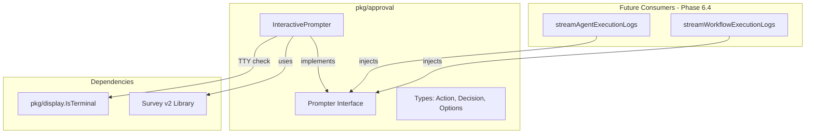

# Phase 6.2: Interactive Approval Prompt Implementation

## Architecture




## File Structure

```
client-apps/cli/pkg/approval/
  - BUILD.bazel        (~15 lines) - Bazel build configuration
  - doc.go             (~20 lines) - Package documentation
  - types.go           (~55 lines) - Action enum, Decision struct, Options struct
  - prompter.go        (~30 lines) - Prompter interface definition
  - interactive.go     (~90 lines) - InteractivePrompter implementation
  - interactive_test.go (~200 lines) - Comprehensive unit tests
```

**Total: ~410 lines across 6 files** (well within guidelines)

---

## Implementation Details

### 1. [types.go](client-apps/cli/pkg/approval/types.go) - Core Types (~55 lines)

**Purpose**: Define the domain types independent of any prompt implementation.

```go
package approval

// Action represents the user's approval decision.
// Maps directly to proto ApprovalAction enum for submission.
type Action int

const (
    ActionUnspecified Action = iota
    ActionApprove
    ActionSkip
    ActionReject
)

// String returns human-readable action name.
func (a Action) String() string {
    switch a {
    case ActionApprove:
        return "Approve"
    case ActionSkip:
        return "Skip"
    case ActionReject:
        return "Reject"
    default:
        return "Unspecified"
    }
}

// Decision represents the complete user decision.
type Decision struct {
    Action  Action
    Comment string // Optional reason/comment
}

// Options configures the approval prompt behavior.
type Options struct {
    ToolName       string // Tool requiring approval
    Message        string // Approval message/reason
    ArgsPreview    string // JSON preview of tool arguments
    NonInteractive bool   // Skip prompt, use DefaultAction
    DefaultAction  Action // Action when non-interactive
}
```

**Key Design Decisions**:

- `Action` is an int type (not proto enum) to keep `pkg/` domain-agnostic
- `String()` method enables clean display in prompts
- `Options.NonInteractive` enables CI/CD pipeline support

---

### 2. [prompter.go](client-apps/cli/pkg/approval/prompter.go) - Interface (~30 lines)

**Purpose**: Define the prompter contract for testability and future implementations.

```go
package approval

import "context"

// Prompter abstracts the approval prompt mechanism.
// Implementations may be interactive (TTY), non-interactive (CI), or mocks (tests).
type Prompter interface {
    // Prompt displays approval options and returns the user's decision.
    //
    // Behavior:
    //   - Interactive mode: Shows selection UI, waits for input
    //   - Non-interactive mode: Returns DefaultAction immediately
    //
    // Returns error if:
    //   - User cancels (Ctrl+C)
    //   - Non-interactive mode without DefaultAction
    //   - Context cancelled
    Prompt(ctx context.Context, opts Options) (*Decision, error)
}

// ErrPromptCancelled indicates user cancelled the prompt (Ctrl+C).
var ErrPromptCancelled = errors.New("prompt cancelled by user")

// ErrNonInteractiveNoDefault indicates non-interactive mode without default action.
var ErrNonInteractiveNoDefault = errors.New("non-interactive mode requires default action")
```

**Key Design Decisions**:

- `context.Context` enables timeout and cancellation support
- Sentinel errors for specific failure modes
- Interface enables mock injection in tests

---

### 3. [interactive.go](client-apps/cli/pkg/approval/interactive.go) - Implementation (~90 lines)

**Purpose**: Survey-based interactive implementation with TTY detection.

```go
package approval

import (
    "context"
    "github.com/AlecAivazis/survey/v2"
    "github.com/stigmer/stigmer/client-apps/cli/pkg/display"
)

// InteractivePrompter implements Prompter using the Survey library.
type InteractivePrompter struct {
    // askCommentOnReject controls whether to ask for rejection reason.
    askCommentOnReject bool
}

// NewInteractivePrompter creates a prompter for interactive TTY sessions.
func NewInteractivePrompter() *InteractivePrompter {
    return &InteractivePrompter{askCommentOnReject: true}
}

// Prompt implements the Prompter interface.
func (p *InteractivePrompter) Prompt(ctx context.Context, opts Options) (*Decision, error) {
    // Handle non-interactive mode
    if opts.NonInteractive {
        return p.handleNonInteractive(opts)
    }

    // Check for TTY - fallback to non-interactive if no TTY
    if !display.IsTerminal() {
        return p.handleNonInteractive(opts)
    }

    return p.showInteractivePrompt(ctx, opts)
}

func (p *InteractivePrompter) handleNonInteractive(opts Options) (*Decision, error) {
    if opts.DefaultAction == ActionUnspecified {
        return nil, ErrNonInteractiveNoDefault
    }
    return &Decision{Action: opts.DefaultAction}, nil
}

func (p *InteractivePrompter) showInteractivePrompt(ctx context.Context, opts Options) (*Decision, error) {
    // Three-option selection
    actionOptions := []string{
        "Approve - Execute the tool",
        "Skip - Continue without executing",
        "Reject - Fail the execution",
    }

    prompt := &survey.Select{
        Message: "What would you like to do?",
        Options: actionOptions,
    }

    var selectedIndex int
    if err := survey.AskOne(prompt, &selectedIndex); err != nil {
        return nil, ErrPromptCancelled
    }

    action := indexToAction(selectedIndex)
    decision := &Decision{Action: action}

    // Ask for comment on reject (optional)
    if action == ActionReject && p.askCommentOnReject {
        decision.Comment = p.askComment()
    }

    return decision, nil
}

func (p *InteractivePrompter) askComment() string {
    var comment string
    prompt := &survey.Input{
        Message: "Rejection reason (optional):",
    }
    _ = survey.AskOne(prompt, &comment) // Ignore error, comment is optional
    return comment
}

func indexToAction(index int) Action {
    switch index {
    case 0:
        return ActionApprove
    case 1:
        return ActionSkip
    case 2:
        return ActionReject
    default:
        return ActionUnspecified
    }
}
```

**Key Design Decisions**:

- TTY detection via `display.IsTerminal()` (existing utility)
- Auto-fallback to non-interactive when no TTY detected
- Optional comment only on reject (most common need)
- `askCommentOnReject` field enables future configurability

---

### 4. [interactive_test.go](client-apps/cli/pkg/approval/interactive_test.go) - Tests (~200 lines)

**Testing Strategy**:

- Unit tests for `handleNonInteractive()` (no Survey dependency)
- Unit tests for `indexToAction()` conversion
- Unit tests for `Action.String()` method
- Mock-based integration tests where practical

```go
// Test scenarios:
func TestAction_String(t *testing.T)
func TestIndexToAction_AllCases(t *testing.T)
func TestHandleNonInteractive_WithDefault(t *testing.T)
func TestHandleNonInteractive_NoDefault_Error(t *testing.T)
func TestPrompt_NonInteractiveMode_UsesDefault(t *testing.T)
func TestDecision_ZeroValue(t *testing.T)
func TestOptions_Defaults(t *testing.T)
```

**Note**: Interactive prompt behavior is difficult to unit test due to TTY requirements. Integration tests in Phase 6.4 will cover the full flow.

---

### 5. [doc.go](client-apps/cli/pkg/approval/doc.go) - Documentation (~20 lines)

```go
// Package approval provides interactive approval prompts for HITL (human-in-the-loop) flows.
//
// This package abstracts the approval prompt mechanism, enabling:
//   - Interactive TTY prompts using Survey library
//   - Non-interactive mode for CI/CD pipelines
//   - Mock implementations for testing
//
// Usage:
//
//     prompter := approval.NewInteractivePrompter()
//     decision, err := prompter.Prompt(ctx, approval.Options{
//         ToolName: "write_file",
//         Message:  "Write to protected file",
//     })
//     if err != nil {
//         // Handle cancellation or error
//     }
//     // Use decision.Action and decision.Comment
//
package approval
```

---

### 6. [BUILD.bazel](client-apps/cli/pkg/approval/BUILD.bazel) - Build Config (~15 lines)

```python
load("@rules_go//go:def.bzl", "go_library", "go_test")

go_library(
    name = "approval",
    srcs = [
        "doc.go",
        "interactive.go",
        "prompter.go",
        "types.go",
    ],
    importpath = "github.com/stigmer/stigmer/client-apps/cli/pkg/approval",
    visibility = ["//visibility:public"],
    deps = [
        "//client-apps/cli/pkg/display",
        "@com_github_alecaivazis_survey_v2//:survey",
    ],
)

go_test(
    name = "approval_test",
    srcs = ["interactive_test.go"],
    embed = [":approval"],
)
```

---

## Acceptance Criteria

- `Prompter` interface defined with clear contract
- `InteractivePrompter` implements Survey-based three-option selection
- Non-interactive mode support with `DefaultAction`
- TTY detection prevents prompt on non-TTY (CI/CD friendly)
- Optional comment input on reject action
- Sentinel errors for cancellation and missing default
- All functions under 50 lines
- All files under 150 lines
- Comprehensive unit tests (minimum 7 test functions)
- BUILD.bazel properly configured

---

## Quality Checklist

Following [Stigmer CLI Engineering Standards](client-apps/cli/.cursor/rules/coding-guidelines.mdc):

- Every file under 250 lines (targeting under 100)
- Every function under 50 lines
- Every error wrapped with specific context
- Interface defined for testability (Prompter)
- No business logic - pure utility package
- Domain-agnostic (no proto imports in pkg/)
- Clean separation of types, interface, implementation
- Comprehensive test coverage

---

## Dependencies

**Existing** (no new dependencies required):

- `github.com/AlecAivazis/survey/v2` - Already in go.mod
- `golang.org/x/term` - Already used via `pkg/display`
- `github.com/stigmer/stigmer/client-apps/cli/pkg/display` - TTY detection

---

## Future Integration (Phase 6.4)

The streaming functions in `run_stream.go` will inject `Prompter`:

```go
func streamAgentExecutionLogs(executionID string, conn *grpc.ClientConn, prompter approval.Prompter) {
    // ... detection and prompt flow ...
    decision, err := prompter.Prompt(ctx, approval.Options{
        ToolName: pending.ToolName,
        Message:  pending.Message,
    })
}
```

This enables testing with mock prompters:

```go
type MockPrompter struct {
    decision *approval.Decision
}

func (m *MockPrompter) Prompt(ctx context.Context, opts approval.Options) (*approval.Decision, error) {
    return m.decision, nil
}
```

