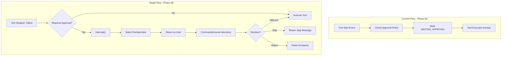
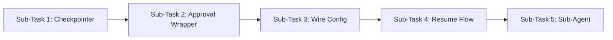

# Phase 3B: LangGraph Interrupt Mechanism

## Current State

- Phase 3A completed: Tools are correctly **marked** `WAITING_APPROVAL` but still execute
- `ApprovalConfig` is built and passed to `StatusBuilder`
- `StatusBuilder` sets `pending_approval` field for UI but does NOT interrupt execution
- LangGraph `thread_id` already used in config, but no checkpointer configured

## Architecture Overview




## Key Implementation Decisions

1. **Interrupt Location**: Inside tool wrappers (not graph-level `interrupt_before`)
  - Research confirms tools can call `interrupt()` directly
  - More granular control per-tool
  - Simpler than modifying graph compilation
2. **Checkpointer**: In-memory `MemorySaver` for MVP, PostgreSQL for production
  - Required for `interrupt()` to work
  - State persisted at exact interrupt point
3. **Approval Context Injection**: Via LangGraph config `configurable` dict
  - Already using this pattern for `thread_id` and `org`
  - Avoids modifying tool wrapper signatures

---

## Sub-Task 1: Checkpointer Infrastructure (45-60 min)

**Goal**: Configure LangGraph checkpointer to enable interrupt/resume

**Scope**:

- Add `MemorySaver` checkpointer to graph compilation in [agent.py](backend/libs/python/graphton/src/graphton/core/agent.py)
- Modify `create_deep_agent()` to accept optional `checkpointer` parameter
- Update [execute_graphton.py](backend/services/agent-runner/worker/activities/execute_graphton.py) to pass checkpointer

**Key Changes**:

```python
# In agent.py - add checkpointer parameter
from langgraph.checkpoint.memory import MemorySaver

def create_deep_agent(
    # ... existing params ...
    checkpointer: BaseCheckpointSaver | None = None,
) -> CompiledStateGraph:
    # ...
    agent = deepagents_create_deep_agent(
        model=model_instance,
        tools=tools_list,
        # ... other params ...
        checkpointer=checkpointer,  # Pass to deepagents
    )
```

**Testing**:

- Unit test: Verify graph compiles with checkpointer
- Unit test: Verify state persists across invocations with same thread_id
- Unit test: Verify different thread_ids have isolated state

**Files**:

- `backend/libs/python/graphton/src/graphton/core/agent.py`
- `backend/libs/python/graphton/tests/core/test_agent.py` (new tests)

---

## Sub-Task 2: Approval-Aware Tool Wrapper (75-90 min)

**Goal**: Create tool wrappers that call `interrupt()` when approval required

**Scope**:

- Create `create_approval_aware_tool_wrapper()` in [tool_wrappers.py](backend/libs/python/graphton/src/graphton/core/tool_wrappers.py)
- Wrapper checks approval policy before executing tool
- Calls `interrupt()` with approval request payload
- Handles resume response (approve/skip/reject)

**Key Design**:

```python
from langgraph.types import interrupt

def create_approval_aware_tool_wrapper(
    tool_name: str,
    middleware_instance: Any,
    approval_checker: Callable[[str, dict], ApprovalRequirement] | None = None,
) -> Callable[..., Any]:
    """Create wrapper that interrupts for approval before executing."""
    
    @tool
    async def wrapper(**kwargs: Any) -> Any:
        # Check if approval required
        if approval_checker:
            requirement = approval_checker(tool_name, kwargs)
            if requirement.requires_approval:
                # Interrupt execution - state is checkpointed here
                response = interrupt({
                    "tool_name": tool_name,
                    "args": kwargs,
                    "message": requirement.message,
                    "mcp_server": requirement.mcp_server,
                })
                
                # Handle decision (resume value)
                action = response.get("action")
                if action == "skip":
                    return f"Tool '{tool_name}' was skipped by user."
                elif action == "reject":
                    raise ToolExecutionRejectedError(
                        f"User rejected execution of '{tool_name}'"
                    )
                # action == "approve" - continue to execution
        
        # Execute the actual tool
        mcp_tool = middleware_instance.get_tool(tool_name)
        return await mcp_tool.ainvoke(kwargs)
    
    return wrapper
```

**Testing**:

- Unit test: Tool executes normally when no approval required
- Unit test: Tool calls `interrupt()` when approval required
- Unit test: Skip action returns skip message
- Unit test: Reject action raises exception
- Unit test: Approve action proceeds to execution
- Integration test with mock checkpointer

**Files**:

- `backend/libs/python/graphton/src/graphton/core/tool_wrappers.py`
- `backend/libs/python/graphton/tests/core/test_tool_wrappers.py` (new tests)

---

## Sub-Task 3: Wire Approval Config to Tool Wrappers (60-75 min)

**Goal**: Pass approval checking capability to tool wrapper creation

**Scope**:

- Modify `create_deep_agent()` to accept `approval_config` parameter
- Create approval checker function from `ApprovalConfig`
- Pass checker to `create_approval_aware_tool_wrapper()`
- Update [execute_graphton.py](backend/services/agent-runner/worker/activities/execute_graphton.py) to pass approval config

**Key Design**:

```python
# In agent.py
from graphton.core.approval_integration import create_approval_checker

def create_deep_agent(
    # ... existing params ...
    approval_config: ApprovalConfig | None = None,
) -> CompiledStateGraph:
    # Create approval checker from config
    approval_checker = None
    if approval_config:
        approval_checker = create_approval_checker(approval_config)
    
    # Use approval-aware wrappers when config provided
    if mcp_servers and mcp_tools:
        for server_name, tool_names in mcp_tools.items():
            for tool_name in tool_names:
                wrapper = create_approval_aware_tool_wrapper(
                    tool_name, 
                    mcp_middleware,
                    approval_checker=approval_checker,
                )
                mcp_tool_wrappers.append(wrapper)
```

**Testing**:

- Unit test: Agent with no approval_config uses standard wrappers
- Unit test: Agent with approval_config uses approval-aware wrappers
- Integration test: End-to-end approval check at tool invocation

**Files**:

- `backend/libs/python/graphton/src/graphton/core/agent.py`
- `backend/libs/python/graphton/src/graphton/core/approval_integration.py` (new file)
- `backend/services/agent-runner/worker/activities/execute_graphton.py`
- `backend/libs/python/graphton/tests/core/test_agent.py`

---

## Sub-Task 4: Resume Flow Implementation (60-75 min)

**Goal**: Handle resuming execution after approval decision

**Scope**:

- Detect pending approval state when execution starts
- Call graph with `Command(resume=decision)` to continue
- Update StatusBuilder after resume
- Handle error cases (invalid decision, expired state)

**Key Design**:

```python
# In execute_graphton.py
from langgraph.types import Command

async def _execute_graphton_impl(...):
    # Check if this is a resume from pending approval
    if execution.status.pending_approval.tool_call_id:
        # This is a resume - get the approval decision
        decision = execution.spec.approval_decision  # New field
        
        # Resume with the decision
        resume_input = Command(resume={
            "action": decision.action,  # approve/skip/reject
            "approved_by": decision.approved_by,
        })
        
        async for event in agent_graph.astream_events(
            resume_input,
            config=config,
            version="v2",
        ):
            await status_builder.process_event(event)
    else:
        # Normal execution - initial invocation
        async for event in agent_graph.astream_events(
            langgraph_input,
            config=config,
            version="v2",
        ):
            await status_builder.process_event(event)
```

**Testing**:

- Unit test: Initial execution starts normally
- Unit test: Resume with approve continues execution
- Unit test: Resume with skip returns skip message
- Unit test: Resume with reject fails execution
- Unit test: Resume without valid checkpoint fails gracefully

**Files**:

- `backend/services/agent-runner/worker/activities/execute_graphton.py`
- `backend/services/agent-runner/tests/test_execute_graphton.py` (new tests)

---

## Sub-Task 5: Sub-Agent Approval Propagation (45-60 min)

**Goal**: Ensure sub-agent interrupts surface to parent correctly

**Scope**:

- Verify LangGraph's natural checkpoint propagation works
- Update StatusBuilder to detect sub-agent pending approvals
- Add `from_sub_agent` and `sub_agent_name` to interrupt payload
- Test nested interrupt/resume scenarios

**Key Design**:

```python
# In tool_wrappers.py - enhanced interrupt payload
response = interrupt({
    "tool_name": tool_name,
    "args": kwargs,
    "message": requirement.message,
    "mcp_server": requirement.mcp_server,
    "from_sub_agent": is_sub_agent,  # Detect via context
    "sub_agent_name": sub_agent_name,  # From LangGraph context
})
```

**Testing**:

- Unit test: Main agent interrupt surfaces correctly
- Unit test: Sub-agent interrupt propagates to parent
- Unit test: Resume flows through to sub-agent
- Integration test: Full nested approval flow

**Files**:

- `backend/libs/python/graphton/src/graphton/core/tool_wrappers.py`
- `backend/libs/python/graphton/tests/core/test_tool_wrappers.py`
- `backend/services/agent-runner/tests/test_status_builder.py`

---

## Implementation Order




**Recommended order**: 1 -> 2 -> 3 -> 4 -> 5

Each sub-task builds on the previous, but is independently testable.

---

## Risk Mitigation

1. **deepagents library compatibility**: May not support checkpointer parameter
  - Mitigation: Compile graph ourselves if needed, or patch deepagents
2. **Interrupt context propagation**: May lose approval context in tool
  - Mitigation: Use LangGraph `configurable` dict which persists through graph
3. **State serialization**: ApprovalConfig may not serialize cleanly
  - Mitigation: Pass minimal serializable data, not full objects

---

## Success Criteria

After Phase 3B completion:

- Tools requiring approval actually pause execution
- Status correctly shows `WAITING_FOR_APPROVAL` phase
- Resume with `APPROVE` continues tool execution
- Resume with `SKIP` returns skip message to LLM
- Resume with `REJECT` fails execution with error
- Sub-agent approvals surface to main agent correctly
- All existing tests continue to pass
- 90%+ code coverage on new code

