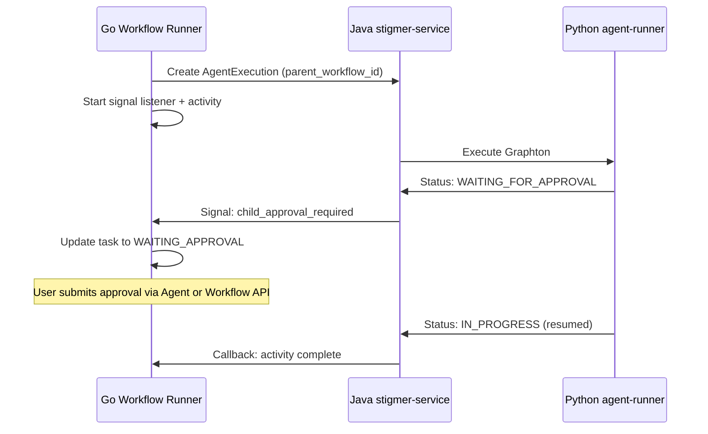

# HITL Phase 5.1: Events-Based Child Agent Approval Detection

## Architecture Overview




## Implementation Components

### 1. Proto Changes (stigmer repo)

**File**: [apis/ai/stigmer/agentic/agentexecution/v1/spec.proto](apis/ai/stigmer/agentic/agentexecution/v1/spec.proto)

Add parent workflow context field:

```protobuf
// Parent workflow context for events-based approval notification (optional).
//
// When a workflow invokes an agent via CallAgentActivity, this field captures
// the parent workflow's Temporal workflow ID. This enables the agent execution
// workflow to signal the parent when approval is required, eliminating polling.
//
// ## Signal Pattern
//
// 1. Go workflow passes its workflow ID when creating AgentExecution
// 2. Go workflow starts signal listener for "child_approval_required"
// 3. When agent enters WAITING_FOR_APPROVAL, Java sends signal to parent
// 4. Go workflow receives signal, updates task status to WAITING_APPROVAL
//
// ## Format
//
// Temporal workflow ID, typically: "stigmer/workflow-execution/invoke/{execution-id}"
// Example: "stigmer/workflow-execution/invoke/wfx-abc123xyz456"
//
// ## When Empty
//
// - Agent invoked directly (not from workflow) - no parent to notify
// - Older clients that don't support this field - fallback to polling
//
// @since Phase 5.1 (Events-Based Approval Notification)
string parent_workflow_id = 8;
```

**File**: [apis/ai/stigmer/agentic/agentexecution/v1/api.proto](apis/ai/stigmer/agentic/agentexecution/v1/api.proto)

Add signal payload message (near PendingApproval message):

```protobuf
// ChildApprovalNotification is the signal payload sent to parent workflows
// when a child agent enters WAITING_FOR_APPROVAL state.
//
// This enables events-based notification instead of polling, providing
// sub-100ms latency for approval state propagation.
//
// The parent workflow receives this via Temporal signal and can:
// 1. Update its task status to WORKFLOW_TASK_WAITING_APPROVAL
// 2. Populate WorkflowExecution.status.pending_approval
// 3. Surface the approval request to users
//
// @since Phase 5.1 (Events-Based Approval Notification)
message ChildApprovalNotification {
  // Child agent execution ID that requires approval.
  string execution_id = 1;
  
  // Tool call ID that needs approval (for correlation).
  string tool_call_id = 2;
  
  // Name of the tool requiring approval.
  string tool_name = 3;
  
  // Human-readable approval message for display.
  string message = 4;
  
  // Sanitized preview of tool arguments.
  string args_preview = 5;
  
  // ISO 8601 timestamp when approval was requested.
  string requested_at = 6;
}
```

### 2. Go Changes (stigmer repo - workflow-runner)

**File**: [backend/services/workflow-runner/pkg/zigflow/tasks/task_builder_call_agent.go](backend/services/workflow-runner/pkg/zigflow/tasks/task_builder_call_agent.go)

Modify `Build()` to implement signal-based approval detection:

```go
func (t *CallAgentTaskBuilder) Build() (TemporalWorkflowFunc, error) {
    // ... existing parseConfig() call ...
    
    return func(ctx workflow.Context, input any, state *utils.State) (any, error) {
        logger := workflow.GetLogger(ctx)
        
        // Evaluate expressions
        if err := t.evaluateExpressions(ctx, state); err != nil {
            return nil, err
        }
        
        // Get workflow execution info for parent context
        workflowInfo := workflow.GetInfo(ctx)
        parentWorkflowId := workflowInfo.WorkflowExecution.ID
        
        // Execute agent activity with parent workflow context
        var res any
        activityCtx := workflow.WithActivityOptions(ctx, getCallAgentActivityOptions())
        future := workflow.ExecuteActivity(activityCtx, 
            (*CallAgentActivities).CallAgentActivity,
            t.agentConfig, input, state.Env, parentWorkflowId)  // Pass parent ID
        
        // Setup signal channel for child approval notifications
        approvalSignalCh := workflow.GetSignalChannel(ctx, SignalChildApprovalRequired)
        
        // Use Await pattern with signal checking (follows task_builder_listen.go pattern)
        var approvalNotification *agentexecv1.ChildApprovalNotification
        activityDone := false
        
        for !activityDone {
            // Check for signal or activity completion using selector pattern
            selector := workflow.NewNamedSelector(ctx, "approval-or-completion")
            
            selector.AddFuture(future, func(f workflow.Future) {
                activityDone = true
            })
            
            selector.AddReceive(approvalSignalCh, func(c workflow.ReceiveChannel, more bool) {
                c.Receive(ctx, &approvalNotification)
                
                logger.Info("Received child approval notification",
                    "execution_id", approvalNotification.ExecutionId,
                    "tool_call_id", approvalNotification.ToolCallId,
                    "tool_name", approvalNotification.ToolName)
                
                // Update workflow task status to WAITING_APPROVAL
                if err := t.updateTaskApprovalStatus(ctx, state, approvalNotification); err != nil {
                    logger.Error("Failed to update task approval status", "error", err)
                }
                
                // Clear notification for next iteration
                approvalNotification = nil
            })
            
            selector.Select(ctx)
        }
        
        // Activity completed - get result
        if err := future.Get(ctx, &res); err != nil {
            if temporal.IsCanceledError(err) {
                return nil, nil
            }
            return nil, fmt.Errorf("agent call activity failed: %w", err)
        }
        
        // Clear any pending approval state on task completion
        t.clearTaskApprovalStatus(ctx, state)
        
        state.AddData(map[string]any{t.GetTaskName(): res})
        return res, nil
    }, nil
}

// updateTaskApprovalStatus updates the workflow task to WAITING_APPROVAL
// and sends status update to stigmer-service
func (t *CallAgentTaskBuilder) updateTaskApprovalStatus(
    ctx workflow.Context,
    state *utils.State,
    notification *agentexecv1.ChildApprovalNotification,
) error {
    // Build pending approval from notification
    pendingApproval := &workflowexecv1.PendingApproval{
        AgentExecutionId: notification.ExecutionId,
        ToolCallId:       notification.ToolCallId,
        ToolName:         notification.ToolName,
        Message:          notification.Message,
        ArgsPreview:      notification.ArgsPreview,
        RequestedAt:      notification.RequestedAt,
    }
    
    // Execute local activity to update status
    // Use local activity to avoid blocking workflow on RPC
    localCtx := workflow.WithLocalActivityOptions(ctx, getLocalActivityOptions())
    
    return workflow.ExecuteLocalActivity(localCtx,
        (*CallAgentActivities).UpdateWorkflowTaskApprovalStatus,
        state.ExecutionId,
        t.GetTaskName(),
        pendingApproval,
    ).Get(ctx, nil)
}
```

**File**: [backend/services/workflow-runner/pkg/zigflow/tasks/task_builder_call_agent_activities.go](backend/services/workflow-runner/pkg/zigflow/tasks/task_builder_call_agent_activities.go)

Add new activities and update existing:

```go
// Signal name constant
const SignalChildApprovalRequired = "child_approval_required"

// Update CallAgentActivity to pass parent_workflow_id
func (a *CallAgentActivities) CallAgentActivity(
    ctx context.Context,
    taskConfig *workflowtasks.AgentCallTaskConfig,
    input any,
    runtimeEnv map[string]any,
    parentWorkflowId string,  // NEW parameter
) (any, error) {
    // ... existing code up to createAgentExecution ...
    
    // Pass parent workflow ID for signal-based notification
    execution, err := a.createAgentExecution(ctx, agentId, resolvedConfig, taskToken, parentWorkflowId)
    // ...
}

// Update createAgentExecution to include parent_workflow_id
func (a *CallAgentActivities) createAgentExecution(
    ctx context.Context,
    agentId string,
    config *workflowtasks.AgentCallTaskConfig,
    callbackToken []byte,
    parentWorkflowId string,  // NEW parameter
) (*agentexecv1.AgentExecution, error) {
    spec := &agentexecv1.AgentExecutionSpec{
        AgentId:          agentId,
        Message:          config.Message,
        RuntimeEnv:       runtimeEnv,
        CallbackToken:    callbackToken,
        ParentWorkflowId: parentWorkflowId,  // NEW field
    }
    // ...
}

// NEW: Local activity for updating workflow task approval status
func (a *CallAgentActivities) UpdateWorkflowTaskApprovalStatus(
    ctx context.Context,
    executionId string,
    taskName string,
    pendingApproval *workflowexecv1.PendingApproval,
) error {
    logger := activity.GetLogger(ctx)
    
    client, err := getWorkflowExecutionClient()
    if err != nil {
        return fmt.Errorf("failed to get workflow execution client: %w", err)
    }
    
    // Build status update with task in WAITING_APPROVAL state
    status := &workflowexecv1.WorkflowExecutionStatus{
        PendingApproval: pendingApproval,
        // Note: Task status update happens through existing task tracking
    }
    
    _, err = client.UpdateStatus(ctx, executionId, status)
    if err != nil {
        logger.Error("Failed to update workflow task approval status",
            "execution_id", executionId,
            "task_name", taskName,
            "error", err)
        return err
    }
    
    logger.Info("Updated workflow task to WAITING_APPROVAL",
        "execution_id", executionId,
        "task_name", taskName,
        "tool_name", pendingApproval.ToolName)
    
    return nil
}
```

### 3. Java Changes (stigmer-cloud repo)

**File**: [backend/services/stigmer-service/src/main/java/ai/stigmer/domain/agentic/workflowexecution/temporal/WorkflowExecutionTemporalWorkflowTypes.java](backend/services/stigmer-service/src/main/java/ai/stigmer/domain/agentic/workflowexecution/temporal/WorkflowExecutionTemporalWorkflowTypes.java) (NEW or existing)

Add signal constant:

```java
/**
 * Signal for notifying parent workflow when child agent requires approval.
 * Sent by agent execution workflow when phase changes to WAITING_FOR_APPROVAL.
 */
public static final String SIGNAL_CHILD_APPROVAL_REQUIRED = "child_approval_required";
```

**File**: [backend/services/stigmer-service/src/main/java/ai/stigmer/domain/agentic/agentexecution/temporal/workflow/InvokeAgentExecutionWorkflowImpl.java](backend/services/stigmer-service/src/main/java/ai/stigmer/domain/agentic/agentexecution/temporal/workflow/InvokeAgentExecutionWorkflowImpl.java)

Add method to notify parent workflow:

```java
/**
 * Notifies the parent workflow that this agent requires approval.
 * Called when the agent enters WAITING_FOR_APPROVAL phase.
 */
private void notifyParentWorkflowOfApproval(
        AgentExecution execution,
        AgentExecutionStatus status) {
    
    String parentWorkflowId = execution.getSpec().getParentWorkflowId();
    
    // Skip if no parent workflow (direct invocation)
    if (parentWorkflowId == null || parentWorkflowId.isEmpty()) {
        var logger = Workflow.getLogger(InvokeAgentExecutionWorkflowImpl.class);
        logger.debug("No parent workflow to notify - agent invoked directly");
        return;
    }
    
    PendingApproval pendingApproval = status.getPendingApproval();
    
    // Build notification payload
    ChildApprovalNotification notification = ChildApprovalNotification.newBuilder()
            .setExecutionId(execution.getMetadata().getId())
            .setToolCallId(pendingApproval.getToolCallId())
            .setToolName(pendingApproval.getToolName())
            .setMessage(pendingApproval.getMessage())
            .setArgsPreview(pendingApproval.getArgsPreview())
            .setRequestedAt(pendingApproval.getRequestedAt())
            .build();
    
    // Execute as local activity to send signal
    // Using local activity because Workflow code cannot make external calls
    notifyParentActivities.signalParentWorkflow(
            parentWorkflowId,
            WorkflowExecutionTemporalWorkflowTypes.SIGNAL_CHILD_APPROVAL_REQUIRED,
            notification);
}
```

**File**: NEW [backend/services/stigmer-service/src/main/java/ai/stigmer/domain/agentic/agentexecution/activities/NotifyParentActivities.java](backend/services/stigmer-service/src/main/java/ai/stigmer/domain/agentic/agentexecution/activities/NotifyParentActivities.java)

Create new activity interface and implementation for signaling parent workflows:

```java
/**
 * Activities for notifying parent workflows of child agent state changes.
 * Used for events-based HITL approval propagation (Phase 5.1).
 */
@ActivityInterface
public interface NotifyParentActivities {
    
    /**
     * Sends a Temporal signal to the parent workflow.
     * 
     * @param parentWorkflowId The Temporal workflow ID of the parent
     * @param signalName The signal name (e.g., "child_approval_required")
     * @param payload The signal payload (protobuf message)
     */
    void signalParentWorkflow(String parentWorkflowId, String signalName, Message payload);
}
```

**Implementation**: [NotifyParentActivitiesImpl.java](backend/services/stigmer-service/src/main/java/ai/stigmer/domain/agentic/agentexecution/activities/NotifyParentActivitiesImpl.java)

```java
@Slf4j
@RequiredArgsConstructor
public class NotifyParentActivitiesImpl implements NotifyParentActivities {
    
    private final WorkflowClient workflowClient;
    
    @Override
    public void signalParentWorkflow(String parentWorkflowId, String signalName, Message payload) {
        log.info("Signaling parent workflow: workflow_id={}, signal={}",
                parentWorkflowId, signalName);
        
        try {
            var stub = workflowClient.newUntypedWorkflowStub(parentWorkflowId);
            stub.signal(signalName, payload);
            
            log.info("Successfully sent signal to parent workflow: workflow_id={}", 
                    parentWorkflowId);
        } catch (WorkflowNotFoundException e) {
            // Parent workflow may have completed or been cancelled
            log.warn("Parent workflow not found - may have completed: workflow_id={}", 
                    parentWorkflowId);
            // Non-fatal: agent can still process approval via direct API
        } catch (Exception e) {
            log.error("Failed to signal parent workflow: workflow_id={}, error={}",
                    parentWorkflowId, e.getMessage());
            // Non-fatal: fallback to polling or direct approval
            throw ApplicationFailure.newNonRetryableFailure(
                    "Failed to notify parent workflow: " + e.getMessage(),
                    "PARENT_SIGNAL_FAILED");
        }
    }
}
```

**Update**: [InvokeAgentExecutionWorkflowImpl.java](backend/services/stigmer-service/src/main/java/ai/stigmer/domain/agentic/agentexecution/temporal/workflow/InvokeAgentExecutionWorkflowImpl.java)

In the HITL approval loop, add parent notification:

```java
// In executeGraphtonFlow(), inside the while loop for WAITING_FOR_APPROVAL
while (finalStatus.getPhase() == ExecutionPhase.EXECUTION_WAITING_FOR_APPROVAL) {
    // ... existing cycle count check ...
    
    // NEW: Notify parent workflow of approval requirement
    notifyParentWorkflowOfApproval(currentExecution, finalStatus);
    
    // Clear any previous approval decision before waiting
    this.pendingApprovalDecision = null;
    
    // ... rest of existing code ...
}
```

### 4. Proto Stub Generation

After proto changes, regenerate stubs:

```bash
# In stigmer repo
make buf-generate

# Verify generated files:
# - apis/stubs/go/ai/stigmer/agentic/agentexecution/v1/spec.pb.go
# - apis/stubs/go/ai/stigmer/agentic/agentexecution/v1/api.pb.go
# - apis/stubs/java/.../agentexecution/v1/AgentExecutionSpec.java
# - apis/stubs/java/.../agentexecution/v1/ChildApprovalNotification.java
```

### 5. WorkflowExecutionStatus Proto Update

**File**: [apis/ai/stigmer/agentic/workflowexecution/v1/api.proto](apis/ai/stigmer/agentic/workflowexecution/v1/api.proto)

Add `pending_approval` field to WorkflowExecutionStatus:

```protobuf
message WorkflowExecutionStatus {
  // ... existing fields 1-7 ...
  
  // Pending approval from a child agent's tool execution (HITL Phase 5).
  //
  // Populated when a workflow task invokes an agent that enters
  // EXECUTION_WAITING_FOR_APPROVAL phase. This surfaces the approval
  // request at the workflow level for UI visibility.
  //
  // When this is set:
  // - At least one task has status WORKFLOW_TASK_WAITING_APPROVAL
  // - UI should display the approval prompt to the user
  // - User can submit approval via WorkflowExecution or AgentExecution API
  //
  // Lifecycle:
  // 1. Child agent enters WAITING_FOR_APPROVAL
  // 2. Child signals parent workflow via Temporal
  // 3. Workflow updates task status and populates this field
  // 4. User submits approval (via either API)
  // 5. This field is cleared, task returns to IN_PROGRESS
  //
  // The PendingApproval type is imported from agentexecution/v1/api.proto.
  ai.stigmer.agentic.agentexecution.v1.PendingApproval pending_approval = 8;
}
```

### 6. Test Strategy

**Unit Tests (Go)**:

- Test signal channel receives ChildApprovalNotification correctly
- Test task status updated to WAITING_APPROVAL on signal
- Test approval status cleared on activity completion
- Test fallback behavior when no parent_workflow_id

**Unit Tests (Java)**:

- Test NotifyParentActivitiesImpl sends signal correctly
- Test signal error handling (parent not found, signal failed)
- Test no signal sent when parent_workflow_id is empty

**Integration Tests**:

- End-to-end: Workflow -> Agent -> Approval Required -> Signal -> Task Status Update
- Verify sub-100ms latency from Python status update to Go signal receipt
- Verify backward compatibility (agents without parent_workflow_id)

## File Summary


| File                                                     | Repo          | Change                                       |
| -------------------------------------------------------- | ------------- | -------------------------------------------- |
| `apis/ai/stigmer/agentic/agentexecution/v1/spec.proto`   | stigmer       | Add `parent_workflow_id` field               |
| `apis/ai/stigmer/agentic/agentexecution/v1/api.proto`    | stigmer       | Add `ChildApprovalNotification` message      |
| `apis/ai/stigmer/agentic/workflowexecution/v1/api.proto` | stigmer       | Add `pending_approval` to status             |
| `task_builder_call_agent.go`                             | stigmer       | Signal listener + task status update         |
| `task_builder_call_agent_activities.go`                  | stigmer       | Pass parent_workflow_id + new local activity |
| `WorkflowExecutionTemporalWorkflowTypes.java`            | stigmer-cloud | Add signal constant                          |
| `NotifyParentActivities.java`                            | stigmer-cloud | New activity interface                       |
| `NotifyParentActivitiesImpl.java`                        | stigmer-cloud | New activity implementation                  |
| `InvokeAgentExecutionWorkflowImpl.java`                  | stigmer-cloud | Call notification on approval                |
| `AgentExecutionTemporalWorkerConfig.java`                | stigmer-cloud | Register new activity                        |


## Success Criteria

1. When child agent enters WAITING_FOR_APPROVAL, parent workflow receives signal within 100ms
2. Workflow task status transitions to WORKFLOW_TASK_WAITING_APPROVAL
3. WorkflowExecution.status.pending_approval is populated with approval details
4. Backward compatible: Agents without parent_workflow_id continue to work
5. Graceful degradation: If signal fails, system remains functional
6. All existing tests continue to pass
7. New tests achieve 80%+ coverage for new code

