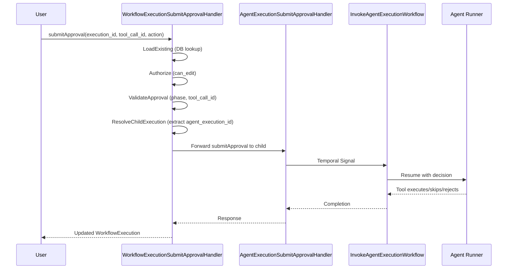

# Phase 5.3: Workflow Approval Forwarding Mechanism

This phase adds the `submitApproval` RPC to `WorkflowExecutionCommandController`, enabling users to submit approvals at the workflow level. The approval is forwarded to the underlying child `AgentExecution`.

---

## Architecture Overview




---

## Implementation Tasks

### Task 1: Proto Changes (stigmer repo)

**File**: `[apis/ai/stigmer/agentic/agentexecution/v1/api.proto](apis/ai/stigmer/agentic/agentexecution/v1/api.proto)`

Add `child_agent_execution_id` field to `PendingApproval` message (field 8):

```protobuf
message PendingApproval {
  // ... existing fields 1-7 ...
  
  // ID of the child agent execution (for workflow-level approvals only).
  // Populated when this PendingApproval is surfaced at WorkflowExecution level.
  // Empty when pending_approval is on AgentExecution directly.
  //
  // Use this ID to forward approvals from workflow to child agent.
  // Format: "aex_abc123xyz456"
  //
  // @since Phase 5.3 (Approval Forwarding)
  string child_agent_execution_id = 8;
}
```

**File**: `[apis/ai/stigmer/agentic/workflowexecution/v1/command.proto](apis/ai/stigmer/agentic/workflowexecution/v1/command.proto)`

Add `submitApproval` RPC:

```protobuf
service WorkflowExecutionCommandController {
  // ... existing RPCs ...
  
  // Submit approval for a child agent's tool execution (HITL Phase 5.3).
  //
  // ## Behavior
  //
  // This RPC forwards the approval to the child AgentExecution identified by
  // status.pending_approval.child_agent_execution_id. The workflow execution
  // must have pending_approval set with a matching tool_call_id.
  //
  // ## Preconditions
  //
  // - status.pending_approval must be populated
  // - tool_call_id must match status.pending_approval.tool_call_id
  // - User must have can_edit permission on the workflow execution
  //
  // ## State Transitions
  //
  // After successful approval:
  // - Approval forwarded to child AgentExecution
  // - Child agent resumes execution
  // - WorkflowExecution.status.pending_approval eventually cleared
  // - Workflow task returns to IN_PROGRESS
  rpc submitApproval(SubmitWorkflowApprovalInput) returns (WorkflowExecution) {
    option (ai.stigmer.iam.iampolicy.v1.rpcauthorization.config).resource_kind = workflow_execution;
    option (ai.stigmer.iam.iampolicy.v1.rpcauthorization.config).permission = can_edit;
    option (ai.stigmer.iam.iampolicy.v1.rpcauthorization.config).field_path = "execution_id";
    option (ai.stigmer.iam.iampolicy.v1.rpcauthorization.config).error_msg = "unauthorized to submit approval for workflow execution";
  }
}
```

**File**: `[apis/ai/stigmer/agentic/workflowexecution/v1/io.proto](apis/ai/stigmer/agentic/workflowexecution/v1/io.proto)`

Add `SubmitWorkflowApprovalInput` message:

```protobuf
import "ai/stigmer/agentic/agentexecution/v1/enum.proto";

// Input for workflow-level approval submission (HITL Phase 5.3).
//
// Forwards approval to the child AgentExecution that requires it.
// The child execution ID is resolved from status.pending_approval.child_agent_execution_id.
message SubmitWorkflowApprovalInput {
  // Workflow execution ID.
  string execution_id = 1 [(buf.validate.field).string.min_len = 1];
  
  // Tool call ID from pending_approval.
  string tool_call_id = 2 [(buf.validate.field).string.min_len = 1];
  
  // Approval action: APPROVE, SKIP, or REJECT.
  ai.stigmer.agentic.agentexecution.v1.ApprovalAction action = 3 [(buf.validate.field).enum = {
    defined_only: true
    not_in: [0]
  }];
  
  // Optional reason for the decision.
  string comment = 4;
}
```

### Task 2: Update Go Code (stigmer repo)

**File**: `[backend/services/workflow-runner/pkg/zigflow/tasks/task_builder_call_agent_activities.go](backend/services/workflow-runner/pkg/zigflow/tasks/task_builder_call_agent_activities.go)`

Update `UpdateWorkflowTaskApprovalStatus` to include `child_agent_execution_id`:

```go
pendingApproval := &agentexecv1.PendingApproval{
    ToolCallId:              notification.ToolCallId,
    ToolName:                notification.ToolName,
    Message:                 notification.Message,
    ArgsPreview:             notification.ArgsPreview,
    RequestedAt:             notification.RequestedAt,
    ChildAgentExecutionId:   notification.ExecutionId,  // NEW: Enable workflow-level forwarding
}
```

### Task 3: Java Handler Implementation (stigmer-cloud repo)

**New File**: `WorkflowExecutionSubmitApprovalHandler.java`

Location: `backend/services/stigmer-service/src/main/java/ai/stigmer/domain/agentic/workflowexecution/request/handler/`

Pipeline structure (following `AgentExecutionSubmitApprovalHandler` pattern):

```java
@Override
protected RequestPipelineV2<...> pipeline() {
    return RequestPipelineV2.builder(...)
        .addStep(loadExistingStep)           // Load workflow execution from DB
        .addStep(authorizeStep)              // Check can_edit permission
        .addStep(validateApprovalStep)       // Validate pending_approval and tool_call_id
        .addStep(forwardToChildStep)         // Forward to AgentExecution.submitApproval
        .addStep(buildResponseStep)          // Build response with audit logging
        .build();
}
```

**Key Steps**:

1. **LoadExistingStep**: Load `WorkflowExecution` by ID from MongoDB
2. **AuthorizeStep**: Verify `can_edit` permission via `RequestAuthorizationService`
3. **ValidateApprovalStep**:
  - Check `status.pending_approval` is populated
  - Verify `tool_call_id` matches `status.pending_approval.tool_call_id`
  - Verify `child_agent_execution_id` is not empty
  - Handle idempotency (if approval already submitted)
4. **ForwardToChildStep**:
  - Build `SubmitApprovalInput` for child AgentExecution
  - Call `AgentExecutionCommandController.submitApproval` (gRPC)
  - Handle errors: NOT_FOUND, FAILED_PRECONDITION, etc.
5. **BuildResponseStep**: Return updated WorkflowExecution with audit logging

### Task 4: Regenerate Stubs

Run proto generation for all languages:

- Go stubs (stigmer repo)
- Java stubs (stigmer-cloud repo)  
- Python stubs (both repos)
- TypeScript stubs (stigmer-cloud repo)
- Dart stubs (stigmer-cloud repo)

### Task 5: Unit Tests (stigmer-cloud repo)

**New File**: `WorkflowExecutionSubmitApprovalHandlerTest.java`

Test cases:

- **LoadExistingStep**: NOT_FOUND when execution doesn't exist
- **AuthorizeStep**: PERMISSION_DENIED when unauthorized
- **ValidateApprovalStep**:
  - FAILED_PRECONDITION when no pending_approval
  - INVALID_ARGUMENT when tool_call_id mismatch
  - INVALID_ARGUMENT when child_agent_execution_id is empty
  - Idempotent request handling
- **ForwardToChildStep**:
  - Successful forwarding
  - Child execution NOT_FOUND
  - Child in wrong phase (FAILED_PRECONDITION)
- **BuildResponseStep**: Correct response construction

---

## Key Files Summary

**stigmer repo (proto + Go)**:

- `apis/ai/stigmer/agentic/agentexecution/v1/api.proto` - Add field 8 to PendingApproval
- `apis/ai/stigmer/agentic/workflowexecution/v1/command.proto` - Add submitApproval RPC
- `apis/ai/stigmer/agentic/workflowexecution/v1/io.proto` - Add SubmitWorkflowApprovalInput
- `backend/services/workflow-runner/pkg/zigflow/tasks/task_builder_call_agent_activities.go` - Populate child_agent_execution_id

**stigmer-cloud repo (Java)**:

- `WorkflowExecutionSubmitApprovalHandler.java` (NEW ~350 lines)
- `WorkflowExecutionSubmitApprovalHandlerTest.java` (NEW ~400 lines)

---

## Error Handling


| Error Condition         | gRPC Status           | Message                              |
| ----------------------- | --------------------- | ------------------------------------ |
| Execution not found     | NOT_FOUND             | Workflow execution not found         |
| Unauthorized            | PERMISSION_DENIED     | User lacks can_edit permission       |
| No pending approval     | FAILED_PRECONDITION   | No pending approval on workflow      |
| Tool call ID mismatch   | INVALID_ARGUMENT      | Tool call ID does not match          |
| No child execution ID   | INTERNAL              | Invalid state: no child execution ID |
| Child forwarding failed | UNAVAILABLE/NOT_FOUND | Failed to forward to child           |


---

## Design Decisions

1. **Why add `child_agent_execution_id` to PendingApproval?**
  - Makes the API explicit and type-safe
  - Avoids JSON parsing of task metadata
  - Follows the pattern of putting all approval info in one place
2. **Why forward via gRPC instead of direct DB update?**
  - Reuses existing validation logic in `AgentExecutionSubmitApprovalHandler`
  - Ensures Temporal workflow signal is properly sent
  - Maintains single source of truth for approval logic
3. **Why not use Temporal workflow signal directly?**
  - Workflow execution doesn't know the child's Temporal workflow ID
  - The child agent handler has this logic already
  - Separation of concerns: workflow handles forwarding, agent handles signaling

---

## Estimated Effort

- Task 1 (Proto changes): 20 min
- Task 2 (Go update): 10 min  
- Task 3 (Java handler): 60 min
- Task 4 (Stub regeneration): 15 min
- Task 5 (Unit tests): 45 min

**Total: ~2.5 hours**