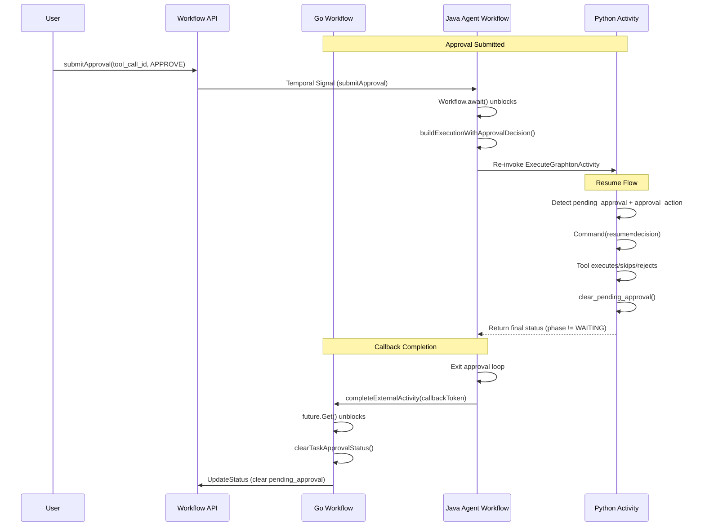

# Phase 5.4: Approval Resumption Verification

This phase verifies and hardens the approval resumption flow - the critical path from approval submission to workflow completion.

---

## Architectural Overview

The approval resumption flow spans three languages and two Temporal workflows:




---

## Current State Analysis

### What's Already Implemented


| Component          | Status   | Details                                             |
| ------------------ | -------- | --------------------------------------------------- |
| Go Signal Listener | COMPLETE | `SignalChildApprovalRequired` handling in `Build()` |
| Go Status Clearing | COMPLETE | `clearTaskApprovalStatus()` on activity completion  |
| Java Approval Loop | COMPLETE | `while (WAITING_FOR_APPROVAL)` with signal await    |
| Java Callback      | COMPLETE | `systemActivities.completeExternalActivity()`       |
| Python Resume      | COMPLETE | Detects `pending_approval` + `approval_action`      |
| Python Clearing    | COMPLETE | `clear_pending_approval()` in StatusBuilder         |


### Gaps to Address

1. **Java: Missing defensive validation** - No check that `pending_approval` is actually cleared after approval loop exits
2. **Java: Missing explicit status update** - Final status not persisted to DB after approval flow completes
3. **Integration tests** - No end-to-end tests validating the complete flow
4. **Observability gaps** - Limited logging for tracking approval → completion latency

---

## Implementation Tasks

### Task 1: Java Approval Loop Validation (20 min)

Add defensive checks and explicit status clearing after the HITL approval loop completes.

**File**: `[InvokeAgentExecutionWorkflowImpl.java](backend/services/stigmer-service/src/main/java/ai/stigmer/domain/agentic/agentexecution/temporal/workflow/InvokeAgentExecutionWorkflowImpl.java)`

**Location**: After line 410 (end of approval loop)

```java
// After approval loop completes, verify pending_approval is cleared
if (approvalCycleCount > 0) {
    logger.info("HITL approval flow completed after {} cycle(s)", approvalCycleCount);
    
    // Defensive check: pending_approval should be cleared by Python
    PendingApproval pendingAfterLoop = finalStatus.getPendingApproval();
    if (pendingAfterLoop != null && !pendingAfterLoop.getToolCallId().isEmpty()) {
        logger.warn("pending_approval not cleared after approval flow - clearing explicitly. " +
            "tool_call_id={}", pendingAfterLoop.getToolCallId());
        
        // Clear pending_approval from final status
        finalStatus = finalStatus.toBuilder()
            .clearPendingApproval()
            .build();
    }
    
    // Persist final status to ensure DB reflects resolved state
    updateStatusActivity.updateExecutionStatus(executionId, finalStatus);
}
```

**Why this matters**: The Python activity should clear `pending_approval` when processing the approval decision, but we add defensive validation to catch edge cases where it might persist.

---

### Task 2: Enhanced Observability Logging (15 min)

Add structured logging to track approval resumption latency and status transitions.

**File**: `[InvokeAgentExecutionWorkflowImpl.java](backend/services/stigmer-service/src/main/java/ai/stigmer/domain/agentic/agentexecution/temporal/workflow/InvokeAgentExecutionWorkflowImpl.java)`

**Additions**:

1. **Log approval decision timestamp** (line ~375):

```java
long approvalWaitMs = Workflow.currentTimeMillis() - waitStartTime;
logger.info("Approval received: tool_call_id={}, action={}, wait_ms={}",
    approvalInput.getToolCallId(), action, approvalWaitMs);
```

1. **Log activity re-invocation result** (line ~406):

```java
logger.info("Activity returned after approval: phase={}, pending_approval_cleared={}, cycle={}",
    finalStatus.getPhase(),
    !finalStatus.hasPendingApproval() || finalStatus.getPendingApproval().getToolCallId().isEmpty(),
    approvalCycleCount);
```

**File**: `[task_builder_call_agent.go](backend/services/workflow-runner/pkg/zigflow/tasks/task_builder_call_agent.go)`

Add logging when clearing approval status (line ~254):

```go
logger.Info("Clearing workflow approval status after agent completion",
    "task", t.GetTaskName(),
    "execution_id", executionId,
    "had_approval_signal", hadApprovalSignal)  // Track if any approval was processed
```

---

### Task 3: Unit Tests for Approval Resumption (30 min)

Add comprehensive unit tests verifying the approval → completion flow.

**File**: `[InvokeAgentExecutionWorkflowSignalTest.java](backend/services/stigmer-service/src/test/java/ai/stigmer/domain/agentic/agentexecution/temporal/workflow/InvokeAgentExecutionWorkflowSignalTest.java)`

**New tests to add**:

```java
@Test
void testApprovalLoop_ClearsStatusAfterApprove() {
    // Verify pending_approval is cleared when approval is APPROVE
}

@Test  
void testApprovalLoop_ClearsStatusAfterSkip() {
    // Verify pending_approval is cleared when approval is SKIP
}

@Test
void testApprovalLoop_SetsFailedStatusOnReject() {
    // Verify execution fails on REJECT with proper error
}

@Test
void testApprovalLoop_MultipleApprovalCycles() {
    // Test workflow handling multiple sequential approvals
}

@Test
void testApprovalLoop_CallsUpdateStatusAfterCompletion() {
    // Verify updateStatusActivity is called after approval flow
}
```

**File**: `[task_builder_call_agent_test.go](backend/services/workflow-runner/pkg/zigflow/tasks/task_builder_call_agent_test.go)`

**New tests to add**:

```go
func TestClearTaskApprovalStatus_CalledOnCompletion(t *testing.T) {
    // Verify clearTaskApprovalStatus is called when activity completes
}

func TestSignalReceived_ThenCleared(t *testing.T) {
    // Verify approval signal updates status, then cleared on completion
}
```

---

### Task 4: Python Clearing Verification (15 min)

Verify and document Python's approval clearing behavior with explicit tests.

**File**: `[test_status_builder.py](backend/services/agent-runner/tests/test_status_builder.py)`

**New tests to add** (in `TestToolApprovalDecision` class):

```python
def test_approve_clears_pending_approval(self):
    """Verify APPROVE action clears pending_approval from status."""
    # Setup: tool in WAITING_APPROVAL with pending_approval set
    # Action: set_tool_approval_decision(run_id, APPROVE, ...)
    # Verify: status.pending_approval is empty/cleared

def test_skip_clears_pending_approval(self):
    """Verify SKIP action clears pending_approval from status."""
    
def test_reject_clears_pending_approval(self):  
    """Verify REJECT action clears pending_approval from status."""

def test_clear_pending_approval_restores_phase(self):
    """Verify clear_pending_approval restores previous phase."""
```

---

### Task 5: Integration Test Scenario (20 min)

Document the manual integration test scenario for Phase 5.5.

**File**: `[_projects/2026-01/20260130.03.hitl-approval-flow/integration-test-scenarios.md](NEW FILE)`

**Content**: Document the complete test matrix:


| Scenario                 | Steps                                                        | Expected Result                         |
| ------------------------ | ------------------------------------------------------------ | --------------------------------------- |
| Approve via Workflow API | Submit approval, verify agent resumes, workflow completes    | Status cleared at all levels            |
| Approve via Agent API    | Submit directly to agent, verify workflow detects completion | Status cleared at workflow level        |
| Skip via Workflow API    | Submit skip, verify agent returns skip message               | Tool marked SKIPPED, workflow continues |
| Reject via Workflow API  | Submit reject, verify agent fails                            | Workflow task FAILED, execution FAILED  |
| Multiple Approvals       | Workflow with 2 agents needing approval                      | Both handled sequentially               |


---

## Files to Modify

### stigmer-cloud repo (Java)


| File                                          | Changes                            | Lines |
| --------------------------------------------- | ---------------------------------- | ----- |
| `InvokeAgentExecutionWorkflowImpl.java`       | Add defensive validation + logging | +40   |
| `InvokeAgentExecutionWorkflowSignalTest.java` | Add resumption tests               | +150  |


### stigmer repo (Go)


| File                              | Changes                | Lines |
| --------------------------------- | ---------------------- | ----- |
| `task_builder_call_agent.go`      | Add completion logging | +10   |
| `task_builder_call_agent_test.go` | Add clearing tests     | +60   |


### stigmer repo (Python)


| File                     | Changes                         | Lines |
| ------------------------ | ------------------------------- | ----- |
| `test_status_builder.py` | Add clearing verification tests | +80   |


**Total: ~340 lines of production code and tests**

---

## Success Criteria

1. All approval actions (APPROVE, SKIP, REJECT) correctly clear `pending_approval`
2. Workflow task transitions from WAITING_APPROVAL to COMPLETED/FAILED
3. No stale `pending_approval` remains in AgentExecution or WorkflowExecution status
4. Callback token completion works reliably
5. All new tests pass
6. Approval → completion latency logged for observability

---

## Verification Checklist

- Java: Defensive validation after approval loop
- Java: Explicit status update after approval completion
- Java: 5 new unit tests for approval resumption
- Go: Enhanced logging for status clearing
- Go: 2 new unit tests for clearing behavior
- Python: 4 new tests verifying clearing behavior
- Documentation: Integration test scenarios for Phase 5.5
- All linters pass
- All tests pass

