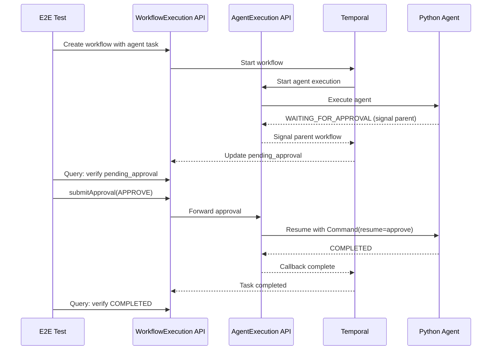

# Phase 5.5: End-to-End Integration Testing for HITL Approval Flow

## Context

This plan implements comprehensive E2E integration tests for the Human-in-the-Loop (HITL) approval flow that spans three languages:

- **Go (workflow-runner)**: Workflow execution with signal handling
- **Java (stigmer-service)**: Agent execution orchestration with Temporal
- **Python (agent-runner)**: Agent execution with LangGraph interrupt/resume

The test scenarios are documented in `[_projects/2026-01/20260130.03.hitl-approval-flow/integration-test-scenarios.md](_projects/2026-01/20260130.03.hitl-approval-flow/integration-test-scenarios.md)`.

---

## Architecture Overview




---

## Implementation Plan

### Part 1: Test Infrastructure Foundation

**Location**: `[test/e2e/](test/e2e/)`

#### 1.1 Create Approval Test Constants

Create `approval_test_constants.go` with test configuration:

```go
// Test timeout for approval operations
const ApprovalTestTimeout = 60 * time.Second
const ApprovalPollingInterval = 500 * time.Millisecond
const SignalLatencyThreshold = 100 * time.Millisecond

// Test fixture names
const ApprovalTestWorkflowName = "hitl-approval-test-workflow"
const ApprovalTestAgentName = "hitl-approval-test-agent"
const ApprovalTestMcpServerSlug = "hitl-test-mcp-server"
```

#### 1.2 Create Approval Test Helpers

Create `approval_test_helpers.go` with reusable functions:

**Key helpers to implement:**

- `SubmitWorkflowApproval()` - Submit approval via WorkflowExecution API
- `SubmitAgentApproval()` - Submit approval via AgentExecution API
- `WaitForPendingApproval()` - Wait until `pending_approval` is populated
- `WaitForApprovalCleared()` - Wait until `pending_approval` is cleared
- `VerifyPendingApprovalFields()` - Validate all PendingApproval fields
- `VerifyToolCallStatus()` - Verify ToolCall has expected status/action
- `MeasureSignalLatency()` - Measure time between agent approval and workflow update

**Design principle**: Follow existing patterns in `[helpers_test.go](test/e2e/helpers_test.go)` - use gRPC clients directly, handle timeouts gracefully, provide detailed error messages.

#### 1.3 Create Test Fixtures

Create test fixtures in `test/e2e/testdata/hitl-approval/`:

**Required fixtures:**

1. `workflow.yaml` - Workflow definition with agent task
2. `agent.yaml` - Agent with MCP tool requiring approval
3. `mcp-server.yaml` - MCP server with `default_tool_approvals` configured
4. `multi-agent-workflow.yaml` - Workflow with 3 agent tasks for Scenario 5

**MCP tool approval configuration example:**

```yaml
# In mcp-server.yaml
spec:
  default_tool_approvals:
    - tool_name: "dangerous_operation"
      requires_approval: true
      approval_message: "This operation will {{args.action}} on {{args.target}}"
```

---

### Part 2: Core Test Scenarios

**Location**: `test/e2e/hitl_approval_*.go`

#### 2.1 Scenario 1: Approve via Workflow API

**File**: `hitl_approval_workflow_approve_test.go`

Test steps:

1. Apply workflow and agent fixtures
2. Start workflow execution
3. Wait for `pending_approval` to be populated (streaming RPC)
4. Verify `pending_approval` fields (tool_call_id, tool_name, message, child_agent_execution_id)
5. Call `WorkflowExecution.submitApproval(APPROVE)`
6. Wait for workflow completion
7. Verify `pending_approval` is cleared
8. Verify tool status is `TOOL_CALL_COMPLETED`

**Critical assertion**: Workflow must complete successfully after approval.

#### 2.2 Scenario 2: Approve via Agent API

**File**: `hitl_approval_agent_approve_test.go`

Test steps:

1. Apply fixtures and start workflow
2. Wait for `pending_approval` at workflow level
3. Extract `child_agent_execution_id` from `pending_approval`
4. Call `AgentExecution.submitApproval(APPROVE)` directly
5. Wait for workflow completion
6. Verify workflow `pending_approval` is cleared

**Critical assertion**: Both submission paths must work interchangeably.

#### 2.3 Scenario 3: Skip via Workflow API

**File**: `hitl_approval_workflow_skip_test.go`

Test steps:

1. Start workflow with approval-required tool
2. Call `WorkflowExecution.submitApproval(SKIP)`
3. Verify tool status is `TOOL_CALL_SKIPPED`
4. Verify workflow completes (not failed)
5. Verify agent received "Tool skipped by user" message

**Critical assertion**: Skip must NOT fail the workflow.

#### 2.4 Scenario 4: Reject via Workflow API

**File**: `hitl_approval_workflow_reject_test.go`

Test steps:

1. Start workflow with approval-required tool
2. Call `WorkflowExecution.submitApproval(REJECT)`
3. Verify tool status is `TOOL_CALL_FAILED`
4. Verify agent execution phase is `EXECUTION_FAILED`
5. Verify workflow task status is `WORKFLOW_TASK_FAILED`
6. Verify workflow phase is `EXECUTION_FAILED`
7. Verify error message contains "rejected"

**Critical assertion**: Reject must fail the entire workflow with clear error.

---

### Part 3: Advanced Test Scenarios

#### 3.1 Scenario 5: Multiple Agents in Workflow

**File**: `hitl_approval_multi_agent_test.go`

Test steps:

1. Create workflow with 3 agent tasks (only task 2 requires approval)
2. Start execution
3. Verify task 1 completes first
4. Verify task 2 enters `WAITING_APPROVAL`
5. Verify task 3 is `PENDING` (not started yet)
6. Submit approval for task 2
7. Wait for all tasks to complete
8. Verify final workflow status is `COMPLETED`

**Critical assertion**: Only the approval-required task should block; others should not be affected.

#### 3.2 Scenario 6: Approval Timeout (Optional)

**File**: `hitl_approval_timeout_test.go`

Test steps:

1. Start workflow with approval-required tool
2. Do NOT submit approval
3. Wait for activity timeout (configurable, default 10 min)
4. Verify execution fails with timeout error

**Note**: This test is optional due to long timeout. Consider adding a test-specific short timeout configuration.

#### 3.3 Scenario 7: Signal Latency Verification

**File**: `hitl_approval_latency_test.go`

Test steps:

1. Start workflow with approval-required tool
2. Record timestamp when agent enters `WAITING_FOR_APPROVAL`
3. Record timestamp when workflow `pending_approval` is populated
4. Calculate latency: T2 - T1
5. Assert latency < 100ms

**Implementation approach**: Use streaming RPC to capture real-time state changes. Extract timestamps from:

- Agent execution status update timestamp
- Workflow execution `pending_approval.requested_at` field

---

### Part 4: Test Utilities Implementation

#### 4.1 Submit Approval Helpers

```go
// SubmitWorkflowApproval submits an approval decision via the WorkflowExecution API
func SubmitWorkflowApproval(
    serverPort int,
    executionID string,
    toolCallID string,
    action agentexecutionv1.ApprovalAction,
    comment string,
) (*workflowexecutionv1.WorkflowExecution, error) {
    // Connect to gRPC server
    // Call WorkflowExecutionCommandController.submitApproval
    // Return updated workflow execution
}

// SubmitAgentApproval submits an approval decision via the AgentExecution API
func SubmitAgentApproval(
    serverPort int,
    executionID string,
    toolCallID string,
    action agentexecutionv1.ApprovalAction,
) (*agentexecutionv1.AgentExecution, error) {
    // Connect to gRPC server
    // Call AgentExecutionCommandController.submitApproval
    // Return updated agent execution
}
```

#### 4.2 Wait Helpers with Streaming Support

```go
// WaitForPendingApproval waits until workflow has a pending_approval
func WaitForPendingApproval(
    serverPort int,
    executionID string,
    timeout time.Duration,
) (*workflowexecutionv1.WorkflowExecution, error) {
    // Use streaming RPC for real-time updates
    // Return when pending_approval is populated
    // Timeout with clear error if not found
}

// WaitForPendingApprovalCleared waits until pending_approval is cleared
func WaitForPendingApprovalCleared(
    serverPort int,
    executionID string,
    timeout time.Duration,
) (*workflowexecutionv1.WorkflowExecution, error) {
    // Use streaming RPC
    // Return when pending_approval is nil/empty
}
```

#### 4.3 Verification Helpers

```go
// VerifyPendingApprovalFields validates all fields of PendingApproval
func VerifyPendingApprovalFields(
    t *testing.T,
    approval *agentexecutionv1.PendingApproval,
    expectedToolName string,
) {
    assert.NotEmpty(t, approval.ToolCallId, "tool_call_id should be set")
    assert.Equal(t, expectedToolName, approval.ToolName)
    assert.NotEmpty(t, approval.Message, "approval message should be set")
    assert.NotNil(t, approval.RequestedAt, "requested_at should be set")
    assert.NotEmpty(t, approval.ChildAgentExecutionId, "child_agent_execution_id should be set")
}

// VerifyToolCallApprovalStatus verifies a tool call has the expected approval status
func VerifyToolCallApprovalStatus(
    t *testing.T,
    execution *agentexecutionv1.AgentExecution,
    toolCallID string,
    expectedStatus agentexecutionv1.ToolCallStatus,
    expectedAction agentexecutionv1.ApprovalAction,
) {
    // Find tool call by ID
    // Verify status and approval_action fields
}
```

---

### Part 5: Test Fixtures Creation

**Directory**: `test/e2e/testdata/hitl-approval/`

#### 5.1 Basic Approval Test Fixtures

**workflow.yaml**:

```yaml
kind: Workflow
metadata:
  name: hitl-approval-test-workflow
  org: default
spec:
  input_schema: {}
  tasks:
    - call: agent
      name: approval_task
      with:
        agent: hitl-approval-test-agent
        message: "Execute the dangerous operation"
```

**agent.yaml**:

```yaml
kind: Agent
metadata:
  name: hitl-approval-test-agent
  org: default
spec:
  model: qwen2.5-coder:7b
  system_prompt: "You are a test agent. When asked to execute a dangerous operation, use the dangerous_operation tool."
  mcp_server_usages:
    - mcp_server_id: "<mcp-server-id>"
```

**mcp-server.yaml**:

```yaml
kind: McpServer
metadata:
  name: hitl-test-mcp-server
  org: default
spec:
  transport: stdio
  command: "python"
  args: ["-m", "hitl_test_mcp_server"]
  default_tool_approvals:
    - tool_name: "dangerous_operation"
      requires_approval: true
      approval_message: "Approve dangerous operation: {{args.operation}}"
```

#### 5.2 Multi-Agent Workflow Fixture

**multi-agent-workflow.yaml** (for Scenario 5):

```yaml
kind: Workflow
metadata:
  name: hitl-multi-agent-workflow
  org: default
spec:
  tasks:
    - call: agent
      name: research_task
      with:
        agent: safe-research-agent
        message: "Research the topic"
    - call: agent
      name: dangerous_task
      with:
        agent: hitl-approval-test-agent
        message: "Execute the dangerous operation"
    - call: agent
      name: summary_task
      with:
        agent: safe-summary-agent
        message: "Summarize the results"
```

---

## Key Files to Create/Modify

### New Files (stigmer repo)


| File                                              | Purpose                          | Lines (est.) |
| ------------------------------------------------- | -------------------------------- | ------------ |
| `test/e2e/approval_test_constants.go`             | Test constants and configuration | ~50          |
| `test/e2e/approval_test_helpers.go`               | Approval-specific test helpers   | ~350         |
| `test/e2e/hitl_approval_workflow_approve_test.go` | Scenario 1: Approve via Workflow | ~100         |
| `test/e2e/hitl_approval_agent_approve_test.go`    | Scenario 2: Approve via Agent    | ~90          |
| `test/e2e/hitl_approval_workflow_skip_test.go`    | Scenario 3: Skip                 | ~100         |
| `test/e2e/hitl_approval_workflow_reject_test.go`  | Scenario 4: Reject               | ~110         |
| `test/e2e/hitl_approval_multi_agent_test.go`      | Scenario 5: Multi-agent          | ~150         |
| `test/e2e/hitl_approval_latency_test.go`          | Scenario 7: Signal latency       | ~80          |
| `test/e2e/testdata/hitl-approval/*.yaml`          | Test fixtures                    | ~150         |


**Total Estimated**: ~1,200 lines

### Modified Files


| File                       | Changes                                       |
| -------------------------- | --------------------------------------------- |
| `test/e2e/helpers_test.go` | Add generic streaming wait helper (if needed) |


---

## Test Execution Strategy

### Prerequisites Check

Before running tests, verify:

1. stigmer server running on port 7234
2. Temporal server running on port 7233
3. Ollama running on port 11434
4. MongoDB running (for checkpointer)

### Running the Tests

```bash
# Run all HITL approval tests
go test -tags=e2e -v -run "TestHitlApproval" ./test/e2e/...

# Run specific scenario
go test -tags=e2e -v -run "TestHitlApprovalWorkflowApprove" ./test/e2e/...

# Run with timeout (for long-running tests)
go test -tags=e2e -v -timeout 10m -run "TestHitlApproval" ./test/e2e/...
```

### Test Isolation

Each test should:

1. Create unique resource names (append timestamp/random suffix)
2. Clean up resources after completion (or use separate org)
3. Not depend on state from other tests

---

## Quality Criteria

### Must Pass

- All 7 scenarios execute successfully
- All approval actions work (APPROVE, SKIP, REJECT)
- Both submission paths work (Workflow API, Agent API)
- Signal latency is < 100ms (Scenario 7)
- No orphaned `pending_approval` states
- Clear error messages for all failure cases

### Code Quality

- Follow existing test patterns in `test/e2e/`
- Use descriptive test names and logging
- Include step-by-step comments for complex flows
- Handle timeouts gracefully with informative errors
- No code duplication (use helpers)

---

## Risks and Mitigations


| Risk                      | Mitigation                                                   |
| ------------------------- | ------------------------------------------------------------ |
| Flaky tests due to timing | Use streaming RPC instead of polling; add buffer to timeouts |
| Test fixtures not found   | Auto-copy from SDK examples pattern; clear setup docs        |
| MCP server not available  | Create simple test MCP server in Python                      |
| Long test execution time  | Parallelize independent tests; skip timeout test by default  |


