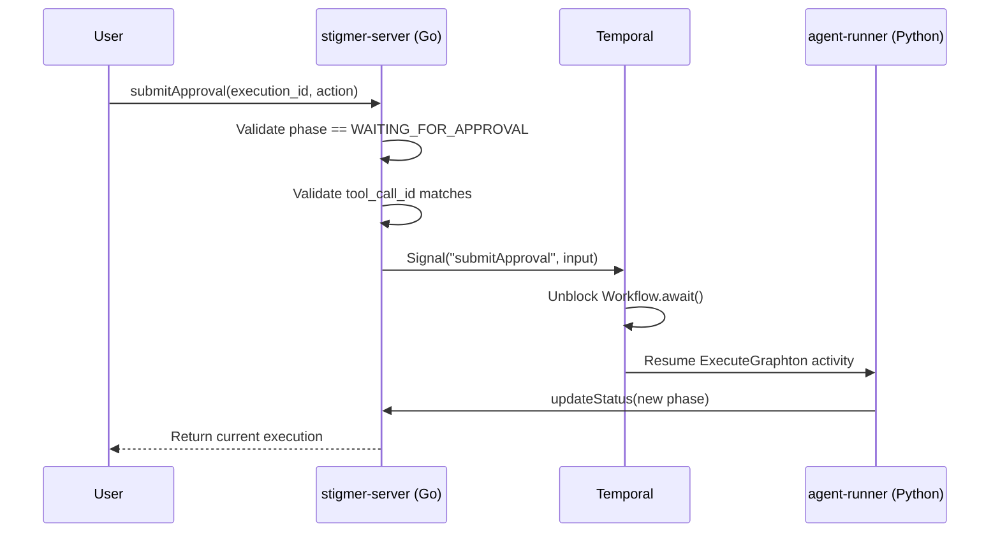

# HITL RPC Implementation Plan

This plan implements the missing RPCs for the Human-In-The-Loop (HITL) approval flow and aligns the Go OSS service with the Java Cloud service.

## Architecture Overview




---

## Part 1: Remove Extra Implementation

### Task 1.1: Delete Session.GetByReference

The `GetByReference` RPC is **not defined** in `[apis/ai/stigmer/agentic/session/v1/query.proto](apis/ai/stigmer/agentic/session/v1/query.proto)` but is implemented in Go.

**Action:** Delete the file and remove references.

- Delete: `[backend/services/stigmer-server/pkg/domain/session/controller/get_by_reference.go](backend/services/stigmer-server/pkg/domain/session/controller/get_by_reference.go)`
- Verify: The session controller embeds `UnimplementedSessionQueryControllerServer`, so unimplemented RPCs will return `Unimplemented` status automatically

---

## Part 2: Implement Missing RPCs

### Task 2.1: AgentExecution.SubmitApproval

**Proto:** `[apis/ai/stigmer/agentic/agentexecution/v1/command.proto](apis/ai/stigmer/agentic/agentexecution/v1/command.proto)` (lines 51-90)

**Input:** `SubmitApprovalInput` with fields:

- `agent_execution_id` (required)
- `tool_call_id` (required)
- `action` (required: APPROVE/SKIP/REJECT)
- `comment` (optional)

**Implementation Pattern:** 5-step pipeline (following Java handler)

```
Pipeline Steps:
1. ValidateProto       - Validate input constraints
2. LoadExisting        - Load AgentExecution from store
3. ValidateApproval    - Validate phase, tool_call_id, idempotency
4. SignalWorkflow      - Send Temporal signal to workflow
5. BuildResponse       - Return current execution state
```

**Key Implementation Details:**

1. **ValidateApproval Step:**
  - Check idempotency: If tool call already has approval action, return success (no-op)
  - Validate phase: Must be `EXECUTION_WAITING_FOR_APPROVAL`
  - Validate tool_call_id: Must match `status.pending_approval.tool_call_id`
2. **SignalWorkflow Step:**
  - Workflow ID format: `stigmer/agent-execution/invoke/{execution-id}`
  - Signal name: `submitApproval` (constant from `[workflow_types.go](backend/services/stigmer-server/pkg/domain/agentexecution/temporal/workflow_types.go)`)
  - Use untyped workflow stub: `workflowClient.SignalWorkflow(ctx, workflowId, "", signalName, input)`
3. **Temporal Workflow Signal Handler:**
  - Add signal handler to `[invoke_workflow_impl.go](backend/services/stigmer-server/pkg/domain/agentexecution/temporal/workflows/invoke_workflow_impl.go)`
  - Store approval decision in workflow state
  - Implement approval loop with `Workflow.await()` pattern

**Files to Create/Modify:**

- Create: `backend/services/stigmer-server/pkg/domain/agentexecution/controller/submit_approval.go`
- Modify: `backend/services/stigmer-server/pkg/domain/agentexecution/temporal/workflow_types.go` (add signal constant)
- Modify: `backend/services/stigmer-server/pkg/domain/agentexecution/temporal/workflows/invoke_workflow.go` (add interface method)
- Modify: `backend/services/stigmer-server/pkg/domain/agentexecution/temporal/workflows/invoke_workflow_impl.go` (add signal handler + approval loop)

---

### Task 2.2: WorkflowExecution.SubmitApproval

**Proto:** `[apis/ai/stigmer/agentic/workflowexecution/v1/command.proto](apis/ai/stigmer/agentic/workflowexecution/v1/command.proto)` (lines 261-323)

**Input:** `SubmitWorkflowApprovalInput` with fields:

- `execution_id` (required)
- `tool_call_id` (required)
- `action` (required)
- `comment` (optional)

**Implementation Pattern:** 5-step pipeline (delegating to child AgentExecution)

```
Pipeline Steps:
1. ValidateProto       - Validate input constraints
2. LoadExisting        - Load WorkflowExecution from store
3. ValidateApproval    - Validate pending_approval exists, tool_call_id matches
4. ForwardToChild      - Call AgentExecution.SubmitApproval for child execution
5. BuildResponse       - Return current execution state
```

**Key Implementation Details:**

1. **ValidateApproval Step:**
  - Check `status.pending_approval` is populated
  - Validate `tool_call_id` matches `status.pending_approval.tool_call_id`
  - Extract `child_agent_execution_id` from `status.pending_approval`
2. **ForwardToChild Step:**
  - Build `SubmitApprovalInput` for child agent execution
  - Call `AgentExecutionController.SubmitApproval()` directly (in-process)
  - Map child errors to appropriate gRPC status codes

**Files to Create:**

- Create: `backend/services/stigmer-server/pkg/domain/workflowexecution/controller/submit_approval.go`

**Dependencies:**

- Requires AgentExecution.SubmitApproval to be implemented first (Task 2.1)
- Add `agentExecutionController` dependency to `WorkflowExecutionController`

---

### Task 2.3: WorkflowExecution.ListByWorkflow

**Proto:** `[apis/ai/stigmer/agentic/workflowexecution/v1/query.proto](apis/ai/stigmer/agentic/workflowexecution/v1/query.proto)` (lines 181-254)

**Input:** `ListWorkflowExecutionsByWorkflowRequest` with fields:

- `workflow_id` (required)
- `page_size` (optional, default 50, max 100)
- `page_token` (optional)

**Implementation Pattern:** 3-step pipeline (simple query)

```
Pipeline Steps:
1. ValidateProto       - Validate input constraints
2. QueryByWorkflowId   - Query store by spec.workflow_instance_id
3. BuildResponse       - Build paginated WorkflowExecutionList
```

**Key Implementation Details:**

1. **QueryByWorkflowId Step:**
  - Query store with filter: `spec.workflow_instance_id = workflow_id`
  - Apply pagination (page_size, page_token)
  - Sort by `status.audit.created_at` descending (newest first)
2. **Store Query:**
  - Use existing store interface pattern
  - Filter by `spec.workflowInstanceId` field in BadgerDB

**Files to Create:**

- Create: `backend/services/stigmer-server/pkg/domain/workflowexecution/controller/list_by_workflow.go`

---

### Task 2.4: ExecutionContext.GetByExecutionId

**Proto:** `[apis/ai/stigmer/agentic/executioncontext/v1/query.proto](apis/ai/stigmer/agentic/executioncontext/v1/query.proto)` (lines 33-48)

**Input:** `ExecutionContextExecutionIdInput` with fields:

- `execution_id` (required)

**Implementation Pattern:** 2-step pipeline (simple lookup)

```
Pipeline Steps:
1. ValidateProto       - Validate input constraints
2. LoadByExecutionId   - Query store by spec.execution_id
```

**Key Implementation Details:**

1. **LoadByExecutionId Step:**
  - Query store with filter: `spec.execution_id = execution_id`
  - Return `NOT_FOUND` if no context exists
2. **Store Query:**
  - Add `FindByExecutionID` method to store interface
  - Query by `spec.executionId` field in BadgerDB

**Files to Create:**

- Create: `backend/services/stigmer-server/pkg/domain/executioncontext/controller/get_by_execution_id.go`

**Note:** OSS version does not need decryption step (no encryption in OSS)

---

## Part 3: Store Interface Updates

### Task 3.1: Add FindByExecutionID to Store

The store interface needs a new method to support `ExecutionContext.GetByExecutionId`:

**Location:** `[backend/libs/go/store/interface.go](backend/libs/go/store/interface.go)`

```go
// FindByField finds a single resource by a specific field value
FindByField(ctx context.Context, apiResourceKind string, fieldPath string, value string) (proto.Message, error)
```

**Implementation in SQLite:** Query with `WHERE json_extract(data, fieldPath) = value`

---

## Implementation Order

Execute tasks in this order to manage dependencies:

1. **Task 1.1** - Remove Session.GetByReference (no dependencies)
2. **Task 3.1** - Add FindByField to store interface (needed by Task 2.4)
3. **Task 2.4** - ExecutionContext.GetByExecutionId (simple, no Temporal)
4. **Task 2.3** - WorkflowExecution.ListByWorkflow (simple, no Temporal)
5. **Task 2.1** - AgentExecution.SubmitApproval (complex, Temporal signals)
6. **Task 2.2** - WorkflowExecution.SubmitApproval (depends on Task 2.1)

---

## Quality Standards

Each implementation must follow these standards (per existing codebase patterns):

1. **Pipeline Pattern:** Use `pipeline.Pipeline` with discrete steps
2. **Error Handling:** Return appropriate gRPC status codes (NOT_FOUND, FAILED_PRECONDITION, INVALID_ARGUMENT)
3. **Logging:** Use `zerolog` with structured fields at appropriate levels
4. **Documentation:** Comprehensive doc comments explaining purpose, parameters, and behavior
5. **Idempotency:** Handle duplicate requests gracefully (especially for approval operations)
6. **Testing:** Unit tests for pipeline steps (following existing test patterns)

---

## Files Summary

**Delete (1 file):**

- `backend/services/stigmer-server/pkg/domain/session/controller/get_by_reference.go`

**Create (4 files):**

- `backend/services/stigmer-server/pkg/domain/agentexecution/controller/submit_approval.go`
- `backend/services/stigmer-server/pkg/domain/workflowexecution/controller/submit_approval.go`
- `backend/services/stigmer-server/pkg/domain/workflowexecution/controller/list_by_workflow.go`
- `backend/services/stigmer-server/pkg/domain/executioncontext/controller/get_by_execution_id.go`

**Modify (4 files):**

- `backend/libs/go/store/interface.go` - Add FindByField method
- `backend/libs/go/store/sqlite/store.go` - Implement FindByField
- `backend/services/stigmer-server/pkg/domain/agentexecution/temporal/workflow_types.go` - Add signal constant
- `backend/services/stigmer-server/pkg/domain/agentexecution/temporal/workflows/invoke_workflow_impl.go` - Add signal handler + approval loop

