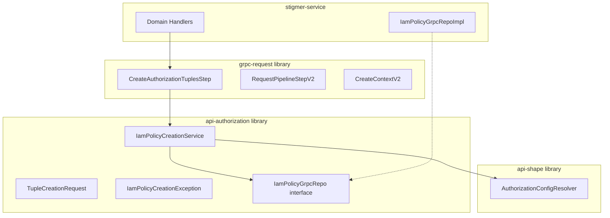

# IAM Policy Creation Service Migration Plan

## Current State Analysis

The `apiauthorization` package in `stigmer-service` contains foundational authorization components that should be in shared libraries:


| File                                 | Lines | Current Location | Target Location           |
| ------------------------------------ | ----- | ---------------- | ------------------------- |
| `IamPolicyCreationService.java`      | 442   | stigmer-service  | api-authorization library |
| `TupleCreationRequest.java`          | 192   | stigmer-service  | api-authorization library |
| `IamPolicyCreationException.java`    | 132   | stigmer-service  | api-authorization library |
| `CreateAuthorizationTuplesStep.java` | 340   | stigmer-service  | grpc-request library      |
| `IamPolicyCreationServiceTest.java`  | 621   | stigmer-service  | api-authorization library |


## Architecture Rationale

### Why Split Between Two Libraries?

`**api-authorization` Library** - Core authorization logic:

- `IamPolicyCreationService` - Configuration-driven FGA tuple creation
- `TupleCreationRequest` - Request data class
- `IamPolicyCreationException` - Exception for policy creation failures

This library already contains:

- `IamPolicyGrpcRepo` (interface that `IamPolicyCreationService` depends on)
- `RequestAuthorizationService` (for checking authorization)
- `AuthorizationCheckFailedException`

`**grpc-request` Library** - Pipeline integration:

- `CreateAuthorizationTuplesStep` - Factory for pipeline steps

This library:

- Already depends on `api-authorization` ([BUILD.bazel line 31](backend/libs/java/grpc/grpc-request/BUILD.bazel))
- Contains all pipeline framework classes (`RequestPipelineStepV2`, `CreateContextV2`, etc.)
- Moving `CreateAuthorizationTuplesStep` here avoids circular dependencies




## Migration Steps

### Phase 1: Move Core Classes to api-authorization

1. **Move `IamPolicyCreationException.java**`
  - From: `stigmer-service/.../apiauthorization/exception/`
  - To: `api-authorization/.../exception/`
  - No changes needed - self-contained
2. **Move `TupleCreationRequest.java**`
  - From: `stigmer-service/.../apiauthorization/service/`
  - To: `api-authorization/.../service/`
  - No changes needed - only depends on protobuf types
3. **Move `IamPolicyCreationService.java**`
  - From: `stigmer-service/.../apiauthorization/service/`
  - To: `api-authorization/.../service/`
  - Remove `@Service` annotation (library classes shouldn't be Spring components)
  - Add factory/builder pattern for instantiation

### Phase 2: Move Pipeline Step to grpc-request

1. **Move `CreateAuthorizationTuplesStep.java**`
  - From: `stigmer-service/.../apiauthorization/service/`
  - To: `grpc-request/.../pipeline/step/common/`
  - Update package declaration
  - Remove `@Component` annotation - callers will instantiate directly

### Phase 3: Move Test File

1. **Move `IamPolicyCreationServiceTest.java**`
  - From: `stigmer-service/.../apiauthorization/service/`
  - To: `api-authorization/.../service/`
  - No changes expected

### Phase 4: Update BUILD.bazel Files

1. **Update `api-authorization/BUILD.bazel**`
  - Add dependency on `api-shape` library (for `AuthorizationConfigResolver`)
  - This is already a dependency based on the current `IamPolicyCreationService` imports
2. **Verify `grpc-request/BUILD.bazel**`
  - Already depends on `api-authorization` - no changes needed
3. **Clean up `stigmer-service**`
  - Remove the now-empty `apiauthorization` package
  - Update any domain handlers that directly import the moved classes

### Phase 5: Update Imports Across Codebase

1. **Update all import statements**
  - Search for imports from `ai.stigmer.apiauthorization` in stigmer-service
  - Update to new locations:
    - `ai.stigmer.apiauthorization.service.IamPolicyCreationService` (api-authorization)
    - `ai.stigmer.apiauthorization.service.TupleCreationRequest` (api-authorization)
    - `ai.stigmer.apiauthorization.exception.IamPolicyCreationException` (api-authorization)
    - `ai.stigmer.grpcrequest.pipeline.step.common.CreateAuthorizationTuplesStep` (grpc-request)

## Key Design Decisions

### 1. Remove Spring Annotations from Library Classes

The library classes should not have `@Service` or `@Component` annotations because:

- Libraries shouldn't assume how they're instantiated
- Services that use these classes can create beans themselves
- Enables use in non-Spring contexts

**Before:**

```java
@Service
@RequiredArgsConstructor
public class IamPolicyCreationService {
    private final IamPolicyGrpcRepo iamPolicyGrpcRepo;
```

**After:**

```java
@RequiredArgsConstructor
public class IamPolicyCreationService {
    private final IamPolicyGrpcRepo iamPolicyGrpcRepo;
```

### 2. Service Registration in stigmer-service

Add a configuration class in stigmer-service to register the library beans:

```java
@Configuration
public class IamPolicyConfig {
    @Bean
    public IamPolicyCreationService iamPolicyCreationService(IamPolicyGrpcRepo repo) {
        return new IamPolicyCreationService(repo);
    }
    
    @Bean
    public CreateAuthorizationTuplesStep createAuthorizationTuplesStep(IamPolicyCreationService service) {
        return new CreateAuthorizationTuplesStep(service);
    }
}
```

### 3. Package Structure After Migration

**api-authorization library:**

```
ai/stigmer/apiauthorization/
├── exception/
│   ├── AuthorizationCheckFailedException.java (existing)
│   └── IamPolicyCreationException.java (NEW)
├── library/
│   └── ApiRequestAuthorizationResourceIdExtractor.java (existing)
├── repo/
│   └── IamPolicyGrpcRepo.java (existing)
└── service/
    ├── RequestAuthorizationService.java (existing)
    ├── IamPolicyCreationService.java (NEW)
    └── TupleCreationRequest.java (NEW)
```

**grpc-request library:**

```
ai/stigmer/grpcrequest/pipeline/step/common/
├── ... (existing steps)
└── CreateAuthorizationTuplesStep.java (NEW)
```

## Testing Strategy

1. **Unit Tests**: Migrate `IamPolicyCreationServiceTest.java` to api-authorization
2. **Integration Tests**: Verify stigmer-service still compiles and runs
3. **Bazel Build**: Run `bazel build //...` to verify no circular dependencies
4. **Runtime Verification**: Start service and verify authorization tuple creation works

## Rollback Plan

If issues arise:

1. Revert file moves
2. Restore original package locations
3. No data migration involved - pure code refactoring

## Files to Modify Summary


| Action | File                                          |
| ------ | --------------------------------------------- |
| MOVE   | `IamPolicyCreationService.java`               |
| MOVE   | `TupleCreationRequest.java`                   |
| MOVE   | `IamPolicyCreationException.java`             |
| MOVE   | `CreateAuthorizationTuplesStep.java`          |
| MOVE   | `IamPolicyCreationServiceTest.java`           |
| MODIFY | `api-authorization/BUILD.bazel`               |
| CREATE | `stigmer-service/config/IamPolicyConfig.java` |
| UPDATE | Domain handler imports (if any)               |


