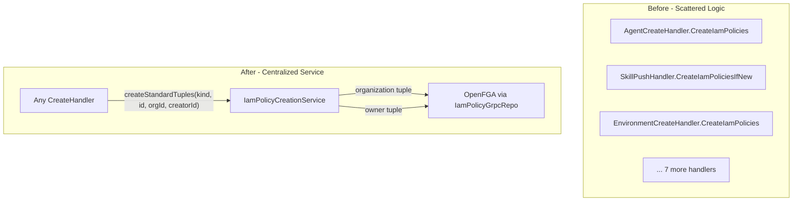

# Phase 3 Sub-Task 1: IamPolicyCreationService Implementation

## Current State Analysis

Each of the 10 create handlers has a duplicated `CreateIamPolicies` inner class (~50-80 lines each) with the same core pattern but scattered implementation details:

```java
// Example from EnvironmentCreateHandler.java - DUPLICATED in 10 handlers
@Component
@RequiredArgsConstructor
static class CreateIamPolicies implements RequestPipelineStepV2<CreateContextV2<Environment>> {
    private final IamPolicyGrpcRepo iamPolicyGrpcRepo;
    
    @Override
    public RequestPipelineStepResultV2 execute(...) {
        // 1. Extract resourceId, creatorId, ownerScope
        // 2. Switch on ownerScope (platform/organization/identity_account)
        // 3. Create scope link based on type
        // 4. Create owner relation
    }
}
```

Problems with current approach:

- **500+ lines of duplicated code** across 10 handlers
- **Complex branching** for owner scope types
- **Inconsistent error handling** patterns
- **Hard to audit** - changes require modifying 10 files

## Target Architecture




## Implementation Details

### File to Create

[backend/services/stigmer-service/src/main/java/ai/stigmer/apiauthorization/service/IamPolicyCreationService.java](backend/services/stigmer-service/src/main/java/ai/stigmer/apiauthorization/service/IamPolicyCreationService.java)

### Service Design

```java
@Slf4j
@Service
@RequiredArgsConstructor
public class IamPolicyCreationService {
    private final IamPolicyGrpcRepo iamPolicyGrpcRepo;

    /**
     * Creates standard IAM tuples for a new resource.
     * Every resource gets exactly 2 tuples:
     * 1. Organization relation: resource#organization@organization:orgId
     * 2. Owner relation: resource#owner@identity_account:creatorId
     *
     * @param resourceKind The type of resource being created
     * @param resourceId   The unique ID of the resource
     * @param orgId        The organization the resource belongs to
     * @param creatorId    The identity account creating the resource
     */
    public void createStandardTuples(
        ApiResourceKind resourceKind,
        String resourceId,
        String orgId,
        String creatorId
    ) { ... }

    /**
     * Creates tuples for a new organization.
     * Organizations are special - they link to platform instead of another org:
     * 1. Platform link: organization#platform@platform:stigmer
     * 2. Owner relation: organization#owner@identity_account:creatorId
     *
     * @param orgId     The organization ID (same as slug)
     * @param creatorId The identity account creating the organization
     */
    public void createOrganizationTuples(String orgId, String creatorId) { ... }
}
```

### Key Design Decisions

1. **Two public methods, not one**
  - `createStandardTuples()` - For all regular resources (Agent, Skill, Workflow, etc.)
  - `createOrganizationTuples()` - For Organization creation (links to platform, not org)
  - Why: Organization is fundamentally different (root of hierarchy)
2. **Uses `bootstrapPolicy()` exclusively**
  - `bootstrapPolicy()` is designed for resource creation scenarios
  - Uses operator-level permissions (safe because creation already authorized)
  - Handles "tuple already exists" gracefully (idempotent)
3. **Fail-fast with clear exceptions**
  - Validates all inputs (non-null, non-empty)
  - Wraps FGA exceptions with context
  - Uses `IamPolicyCreationException` (new runtime exception)
4. **Comprehensive logging**
  - INFO: Start/success of tuple creation
  - DEBUG: Individual tuple details
  - ERROR: Failure details with context

### Exception Handling

Create a new exception class for clean error propagation:

[backend/services/stigmer-service/src/main/java/ai/stigmer/apiauthorization/exception/IamPolicyCreationException.java](backend/services/stigmer-service/src/main/java/ai/stigmer/apiauthorization/exception/IamPolicyCreationException.java)

```java
public class IamPolicyCreationException extends RuntimeException {
    private final ApiResourceKind resourceKind;
    private final String resourceId;
    
    public IamPolicyCreationException(
        String message, 
        ApiResourceKind resourceKind, 
        String resourceId, 
        Throwable cause
    ) { ... }
}
```

### Testing Strategy

Create comprehensive unit tests:

[backend/services/stigmer-service/src/test/java/ai/stigmer/apiauthorization/service/IamPolicyCreationServiceTest.java](backend/services/stigmer-service/src/test/java/ai/stigmer/apiauthorization/service/IamPolicyCreationServiceTest.java)

Test cases:

- **Happy path**: Verify both tuples created for each method
- **Input validation**: Null/empty resourceId, orgId, creatorId
- **FGA failure**: Service handles `bootstrapPolicy()` exceptions correctly
- **Idempotency**: Second call with same parameters succeeds
- **Logging verification**: Proper log levels for success/failure

### Dependencies

Uses existing interfaces - no new dependencies:

- `IamPolicyGrpcRepo` - Existing repo interface (lines 21-121 of [IamPolicyGrpcRepo.java](backend/libs/java/api/api-authorization/src/main/java/ai/stigmer/apiauthorization/repo/IamPolicyGrpcRepo.java))
- `ApiResourceKind` - Existing enum from proto stubs
- `ApiResourceRef`, `IamPolicySpec` - Existing proto types

### Proto References

Key enums/types used:

- `ApiResourceKind` - Resource type enum (agent, skill, workflow, etc.)
- `ApiResourceIamPermission` - Permission/relation enum (organization, owner, platform)
- `PlatformIdValue` - Platform singleton ID (`stigmer`)

## Files Changed Summary


| File                                                         | Action | Size       |
| ------------------------------------------------------------ | ------ | ---------- |
| `apiauthorization/service/IamPolicyCreationService.java`     | Create | ~150 lines |
| `apiauthorization/exception/IamPolicyCreationException.java` | Create | ~40 lines  |
| `apiauthorization/service/IamPolicyCreationServiceTest.java` | Create | ~200 lines |


**Total: 3 new files, ~390 lines**

## Verification Steps

1. **Compile check**: `./gradlew :stigmer-service:compileJava`
2. **Unit tests**: `./gradlew :stigmer-service:test --tests "ai.stigmer.apiauthorization.service.IamPolicyCreationServiceTest"`
3. **Linting**: Verify no warnings in new files

## Quality Standards

This service is a critical foundation piece. Quality requirements:

- **100% input validation**: All public methods validate parameters
- **Complete Javadoc**: Document purpose, parameters, exceptions, FGA tuples created
- **Structured logging**: Use SLF4J with proper log levels and context
- **Single responsibility**: Only handles tuple creation, no authorization checks
- **Immutable inputs**: Parameters are primitives/enums, no state mutation
- **Thread-safe**: Stateless service, safe for concurrent use

