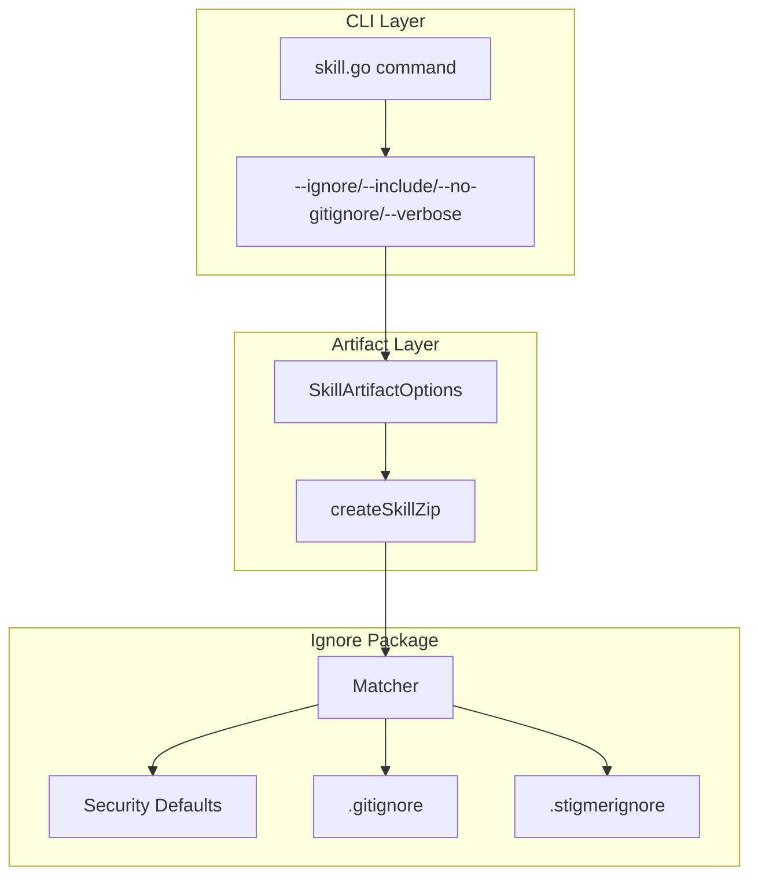

# Integrate pkg/ignore with Skill Push

## Architecture Overview



## Files to Modify

### 1. CLI Command Layer: [client-apps/cli/cmd/stigmer/root/skill.go](client-apps/cli/cmd/stigmer/root/skill.go)

Add new CLI flags and pass them through options:

```go
// New flags to add
var ignorePatterns []string      // --ignore (repeatable)
var includePatterns []string     // --include (repeatable)  
var noGitignore bool             // --no-gitignore
var verbose bool                 // --verbose
```

Update `skillPushOptions` and `remotePushOptions` structs to carry ignore configuration.

### 2. Artifact Layer: [client-apps/cli/internal/cli/artifact/skill.go](client-apps/cli/internal/cli/artifact/skill.go)

**Key Changes:**

1. **Add IgnoreOptions to SkillArtifactOptions struct:**
```go
type IgnoreOptions struct {
    RespectGitignore bool     // default: true
    ExtraIgnore      []string // CLI --ignore patterns
    ExtraInclude     []string // CLI --include patterns
    Verbose          bool     // Show detailed ignore info
}
```

2. **Replace `shouldExclude()` with Matcher integration** in `createSkillZip()`:

   - Create Matcher once at the start of zip creation
   - Use `matcher.Match()` for file filtering
   - Return `filepath.SkipDir` for matched directories (performance optimization)
   - Track statistics (files included, files ignored, directories skipped)

3. **Add `ZipStats` return type** for transparency:
```go
type ZipStats struct {
    FilesIncluded   int
    FilesIgnored    int
    DirsSkipped     int
    TotalSize       int64
    IgnoredBySource map[string]int // e.g., {"defaults": 5, ".gitignore": 3}
}
```

4. **Enhance dry-run output** to show what would be included/excluded with reasons

### 3. BUILD.bazel: [client-apps/cli/internal/cli/artifact/BUILD.bazel](client-apps/cli/internal/cli/artifact/BUILD.bazel)

Add dependency on `//client-apps/cli/pkg/ignore`

## Detailed Implementation Design

### createSkillZip Signature Change

```go
// BEFORE
func createSkillZip(sourceDir string, zipWriter io.Writer) (int64, error)

// AFTER  
func createSkillZip(sourceDir string, zipWriter io.Writer, opts IgnoreOptions) (*ZipStats, error)
```

### Directory-Level Optimization

Critical for performance with large codebases:

```go
err := filepath.Walk(sourceDir, func(path string, info os.FileInfo, err error) error {
    // ... get relPath ...
    
    if info.IsDir() {
        if matcher.Match(relPath, true) {
            return filepath.SkipDir  // Skip entire directory tree
        }
        return nil  // Continue into directory
    }
    
    if matcher.Match(relPath, false) {
        stats.FilesIgnored++
        return nil  // Skip this file
    }
    
    // Include file in ZIP
    // ...
})
```

### Verbose Output Format

When `--verbose` is enabled, show detailed ignore decisions:

```
ℹ Filtering files with ignore patterns...
  Sources: defaults (60 patterns), .gitignore (12 patterns), .stigmerignore (3 patterns)
  
  SKIP DIR  node_modules/       (excluded by security default: node_modules/)
  SKIP DIR  .venv/              (excluded by security default: .venv/)
  IGNORE    .env                (excluded by security default: .env)
  IGNORE    build/output.js     (excluded by .gitignore: build/)
  INCLUDE   src/main.py         (no pattern matched)
  INCLUDE   SKILL.md            (no pattern matched)
  
✓ Artifact created: 15 files (124.5 KB), 47 ignored, 8 directories skipped
```

### Statistics Summary

Always show a summary (even in non-verbose mode):

```
✓ Artifact created (124.5 KB)
  Files: 15 included, 47 ignored
  Skipped: 8 directories
```

## Backward Compatibility

- Default behavior unchanged: security defaults ON, .gitignore respected, .stigmerignore loaded
- No new required flags
- `shouldExclude()` function removed entirely (fully replaced)

## Error Handling Strategy

- Invalid patterns in ignore files: log warning, skip pattern (lenient like Git)
- Missing .gitignore/.stigmerignore: silently continue (normal case)
- Matcher creation errors: fail fast with clear message

## Testing Strategy

After implementation, verify with:

1. Basic push without any ignore files (defaults apply)
2. Push with .gitignore only
3. Push with .stigmerignore overriding .gitignore
4. CLI flags: `--ignore "*.tmp" --include ".env.example"`
5. Dry-run showing detailed ignore breakdown
6. Verbose mode output formatting