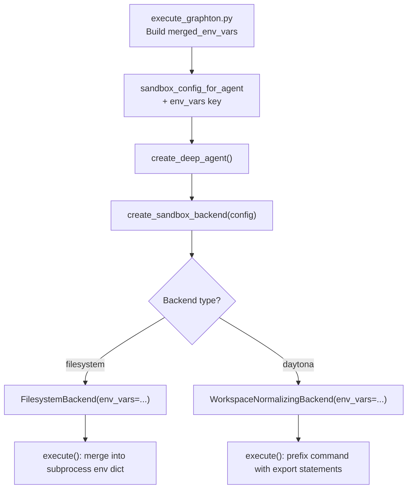

# Inject `env_spec` Variables into Agent Shell Environment

## Root Cause

There are **two compounding bugs** that make `$OUTPUT_DIR` empty at runtime.

### Bug 1 -- Legacy merge gates `env_spec` behind `environment_refs`

In `[execute_graphton.py](backend/services/agent-runner/worker/activities/execute_graphton.py)` lines 1249-1288, the entire merge block -- including `agent.spec.env_spec` defaults **and** `execution.spec.runtime_env` CLI overrides -- is nested inside `if environment_refs:`. The `skill-creator` agent has no `environment_refs`, so:

- `env_spec.data["OUTPUT_DIR"]` with default `"."` is never read
- Even `--env OUTPUT_DIR=foo` from the CLI is silently dropped
- `merged_env_vars` stays `{}`

```1249:1251:backend/services/agent-runner/worker/activities/execute_graphton.py
        if use_legacy_env_merge:
            environment_refs = agent_instance.spec.environment_refs
            if environment_refs:
```

Everything inside that `if environment_refs:` guard -- lines 1256-1288 -- only runs when refs exist.

### Bug 2 -- `merged_env_vars` never reaches the subprocess

Even if Bug 1 were fixed, `merged_env_vars` is only consumed for:

- Display/approval humanization (`status_builder.set_display_env_vars`)
- MCP config placeholder resolution
- Workspace provisioning credentials

It is **never** added to `sandbox_config_for_agent` or passed to the backend. The execute tool's subprocess only gets `os.environ` + `STIGMER_PLATFORM_DIR`:

```230:233:backend/libs/python/graphton/src/graphton/core/backends/filesystem.py
        try:
            env = {**os.environ, "PYTHONUNBUFFERED": "1"}
            if self._platform_root is not None:
                env[STIGMER_PLATFORM_DIR_ENV] = str(self._platform_root)
```

`STIGMER_PLATFORM_DIR` works because it is special-cased. No other env vars from `env_spec` or `--env` reach the shell.

## Design

Follow the exact pattern that `platform_dir` already uses: store env vars on the backend at construction time, apply to every `execute()` call. The data flows through the existing `sandbox_config` dict, which already carries `root_dir` and `platform_dir` from `execute_graphton.py` through `create_sandbox_backend()` to backend constructors.




Credential safety: `merged_env_vars` is added to `sandbox_config_for_agent` at line ~1880, which is **after** provisioning credential stripping (lines 1333-1344). So consumed keys like `GITHUB_TOKEN` are already removed before they reach the backend.

---

## Changes

### 1. Fix legacy merge: always apply `env_spec` and `runtime_env`

**File:** `[execute_graphton.py](backend/services/agent-runner/worker/activities/execute_graphton.py)` (lines 1249-1288)

Restructure the legacy merge so `env_spec` defaults and `runtime_env` overrides are applied **unconditionally**, while `environment_refs` resolution remains gated behind its own check:

```python
if use_legacy_env_merge:
    # Layer 1: agent env_spec defaults (always applied)
    if agent.spec.env_spec and agent.spec.env_spec.data:
        for key, env_value in agent.spec.env_spec.data.items():
            merged_env_vars[key] = env_value.value
            if env_value.is_secret:
                secret_keys.add(key)

    # Layer 2: environment_refs (only when present)
    environment_refs = agent_instance.spec.environment_refs
    if environment_refs:
        environment_client = EnvironmentClient(api_key)
        environments = await environment_client.list_by_refs(...)
        for env in environments:
            ...  # override merged_env_vars

    # Layer 3: runtime_env CLI overrides (always applied, highest priority)
    if execution.spec.runtime_env:
        for key, value in execution.spec.runtime_env.items():
            merged_env_vars[key] = value.value
            if value.is_secret:
                secret_keys.add(key)
```

### 2. Add `env_vars` to `sandbox_config_for_agent`

**File:** `[execute_graphton.py](backend/services/agent-runner/worker/activities/execute_graphton.py)` (after line ~1888)

After building `sandbox_config_for_agent` (post-provisioning), inject the cleaned env vars:

```python
if merged_env_vars:
    sandbox_config_for_agent["env_vars"] = dict(merged_env_vars)
```

### 3. Thread `env_vars` through `sandbox_factory.py`

**File:** `[sandbox_factory.py](backend/libs/python/graphton/src/graphton/core/sandbox_factory.py)` (lines 91-102)

Read `env_vars` from the config dict and pass to backend constructors:

```python
if backend_type == "filesystem":
    env_vars = config.get("env_vars")
    return FilesystemBackend(root_dir=root_dir, platform_dir=platform_dir, env_vars=env_vars)

elif backend_type == "daytona":
    return create_daytona_backend(config)  # config already carries env_vars
```

### 4. `FilesystemBackend` -- accept and apply `env_vars`

**File:** `[filesystem.py](backend/libs/python/graphton/src/graphton/core/backends/filesystem.py)`

**Constructor** (line ~75): Add `env_vars: dict[str, str] | None = None` parameter, store as `self._env_vars`.

`**execute()` method** (line ~230): Merge stored env vars into the subprocess `env` dict. Layering order: `os.environ` < `self._env_vars` < `STIGMER_PLATFORM_DIR` (platform dir wins over user env vars, which win over inherited process env).

```python
env = {**os.environ, "PYTHONUNBUFFERED": "1"}
if self._env_vars:
    env.update(self._env_vars)
if self._platform_root is not None:
    env[STIGMER_PLATFORM_DIR_ENV] = str(self._platform_root)
```

### 5. Daytona backend -- accept and apply `env_vars`

**File:** `[daytona.py](backend/libs/python/graphton/src/graphton/core/backends/daytona.py)`

`**WorkspaceNormalizingBackend.__init__`** (line ~75): Add `env_vars: dict[str, str] | None = None`, store as `self._env_vars`.

`**WorkspaceNormalizingBackend.execute()`** (line ~293): When env vars are present, prefix the command with shell `export` statements so variables are available in the remote sandbox shell:

```python
def execute(self, command: str, **kwargs):
    self._invalidate_cache()
    if self._env_vars:
        exports = "; ".join(
            f"export {k}={shlex.quote(v)}" for k, v in self._env_vars.items()
        )
        command = f"{exports}; {command}"
    return self._inner.execute(command, **kwargs)
```

`**create_daytona_backend()**` (line ~309): Read `env_vars` from config and pass to `WorkspaceNormalizingBackend`.

---

## Scope Boundaries

- **In scope**: The five files above -- fixing both bugs so `env_spec` and `--env` variables are available in the execute tool's shell environment for both local (filesystem) and cloud (Daytona) modes.
- **Out of scope**: `LocalWorkspaceBackend` (`local.py`) -- used only for workspace provisioning, which already receives `merged_env` directly via `provisioner.provision(merged_env=merged_env_vars)`. No execute calls through it need agent env vars.
- **Out of scope**: Sub-agent env var inheritance -- sub-agents receive `sandbox_config` from the parent. Once `env_vars` is in `sandbox_config`, sub-agents automatically inherit parent env vars through the existing plumbing.

