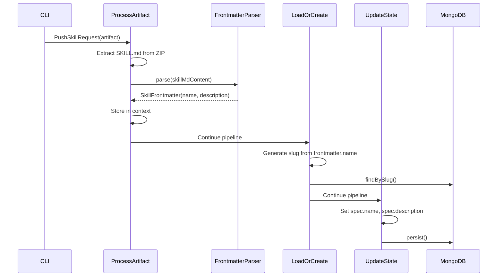

# Phase 3: Java Backend Frontmatter Parsing

## Current State Analysis

The Java `SkillPushHandler` currently:

- Extracts `SKILL.md` from ZIP artifacts (lines 153-164)
- Uses `request.getName()` directly for slug generation and `spec.name` (lines 137, 276, 311)
- Has **no frontmatter parsing** - the comment at line 309 mentions "extracted from SKILL.md YAML frontmatter" but it's not implemented

This means the CLI is still sending `name` in the request for the Java backend, while the Go backend now parses it from frontmatter.

## Architecture Decision

**Location for new code**: Create skill-specific utilities in a new package rather than polluting the generic YAML utilities:

```
backend/libs/java/utils/src/main/java/ai/stigmer/utils/skill/
├── SkillFrontmatter.java          # Immutable record for parsed frontmatter
├── SkillFrontmatterParser.java    # Parser with validation logic
└── BUILD.bazel                    # Bazel build file
```

**Rationale**: The frontmatter format is skill-specific (name kebab-case validation, specific required fields) and should not be mixed with generic YAML utilities.

## Implementation Details

### 1. SkillFrontmatter Record

```java
public record SkillFrontmatter(
    String name,        // Required, kebab-case validated
    String description, // Optional
    String version      // Optional, informational only
) {}
```

### 2. SkillFrontmatterParser

Port the Go logic from [`frontmatter.go`](backend/services/stigmer-server/pkg/domain/skill/storage/frontmatter.go):

**Key validation rules**:

- Name pattern: `^[a-z0-9]+(-[a-z0-9]+)*$`
- First line must be `---`
- Must have closing `---` on its own line
- Name is required, description is optional

**Error messages**: Match the Go format with helpful examples:

```
SKILL.md must start with YAML frontmatter (---)

Expected format:
---
name: my-skill-name
description: A brief description of what this skill does
---
# Skill Title
...
```

### 3. Modify SkillPushHandler.java

**Current flow**:

```
ProcessArtifact → extract SKILL.md → use request.getName() for slug
```

**New flow**:

```
ProcessArtifact → extract SKILL.md → parse frontmatter → use frontmatter.name() for slug
```

**Changes to `ProcessArtifact` class** (lines 100-171):

- After extracting `skillMdContent`, parse frontmatter
- Store extracted name and description in context
- Remove dependency on `request.getName()` for slug generation

**New context keys**:

```java
private static final String CTX_FRONTMATTER_NAME = "frontmatterName";
private static final String CTX_FRONTMATTER_DESCRIPTION = "frontmatterDescription";
```

**Changes to `LoadOrCreateSkill` class** (lines 176-213):

- Use `CTX_FRONTMATTER_NAME` instead of `request.getName()` for slug lookup

**Changes to `UpdateSkillState` class** (lines 254-358):

- Use `CTX_FRONTMATTER_NAME` for `metadata.name`, `metadata.slug`, and `spec.name`
- Use `CTX_FRONTMATTER_DESCRIPTION` for `spec.description`

## Files to Create

| File | Purpose |

|------|---------|

| `backend/libs/java/utils/src/main/java/ai/stigmer/utils/skill/SkillFrontmatter.java` | Immutable record for parsed frontmatter |

| `backend/libs/java/utils/src/main/java/ai/stigmer/utils/skill/SkillFrontmatterParser.java` | Parser with validation, matching Go logic |

| `backend/libs/java/utils/src/main/java/ai/stigmer/utils/skill/BUILD.bazel` | Bazel build configuration |

## Files to Modify

| File | Changes |

|------|---------|

| [`SkillPushHandler.java`](backend/services/stigmer-service/src/main/java/ai/stigmer/domain/agentic/skill/request/handler/SkillPushHandler.java) | Add frontmatter parsing in ProcessArtifact, update all steps to use extracted values |

| [`backend/services/stigmer-service/BUILD.bazel`](backend/services/stigmer-service/BUILD.bazel) | Add dependency on new skill utils package |

## Data Flow (After Implementation)



## Validation Parity with Go

The Java implementation must match the Go validation exactly:

| Validation | Go Implementation | Java Implementation |

|------------|-------------------|---------------------|

| Name pattern | `^[a-z0-9]+(-[a-z0-9]+)*$` | Same regex |

| Empty content | `"SKILL.md is empty"` | Same message |

| Missing opening `---` | Format example included | Same format |

| Missing closing `---` | `"missing closing ---"` | Same message |

| Empty frontmatter | Format example included | Same format |

| Missing name | Format example included | Same format |

| Invalid name format | Example names included | Same examples |

## Dependencies

Use Jackson YAML (already available in `MODULE.bazel`):

```
com.fasterxml.jackson.dataformat:jackson-dataformat-yaml:2.17.2
```

## Testing Considerations

- Unit tests for `SkillFrontmatterParser` with all edge cases
- Valid frontmatter parsing
- Missing delimiters
- Empty frontmatter
- Invalid name format
- Missing required fields