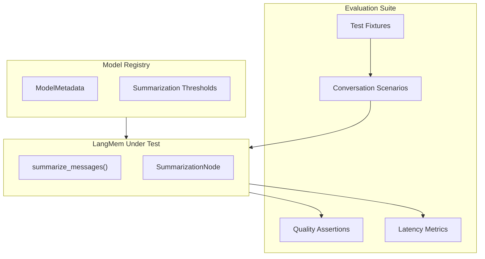

# LangMem Evaluation Implementation Plan

## Objective

Evaluate LangMem's `SummarizationNode` against Stigmer's requirements for context window management. This evaluation determines whether to proceed with LangMem integration (Phase 2) or fall back to the custom three-layer memory architecture (DD001).

## Decision Criteria


| Criterion             | Target                                    | Go   | No-Go |
| --------------------- | ----------------------------------------- | ---- | ----- |
| Key Fact Retention    | >90% of critical facts preserved          | Pass | Fail  |
| Summarization Latency | <2s p95                                   | Pass | Fail  |
| Tool Call Handling    | Tool calls preserved/summarized correctly | Pass | Fail  |
| Multi-Cycle Stability | Running summaries don't degrade           | Pass | Fail  |


---

## Architecture Overview




---

## Implementation Details

### 1. Add LangMem Dependency

**File**: [backend/services/agent-runner/pyproject.toml](backend/services/agent-runner/pyproject.toml)

Add to `[tool.poetry.dependencies]`:

```toml
# LangMem for context summarization (evaluation)
langmem = ">=0.1.0"
```

---

### 2. Create Evaluation Module

**File**: `backend/services/agent-runner/tests/langmem_evaluation.py`

Structure following established test patterns from [test_integration_skill_pipeline.py](backend/services/agent-runner/tests/test_integration_skill_pipeline.py):

```python
"""LangMem Summarization Evaluation Suite.

Production-grade evaluation of LangMem's SummarizationNode for Stigmer integration.

Evaluation Categories:
- Quality: Key fact retention across summarization cycles
- Performance: Latency benchmarks against <2s p95 target
- Tool Handling: Correct summarization of tool calls and results
- Multi-Cycle: Stability of running summaries over time

Success Criteria:
- >90% key fact retention
- <2s p95 summarization latency
- Tool calls preserved or correctly summarized
- No degradation across multiple summarization cycles
"""
```

---

### 3. Test Class Structure

Following the class-based organization pattern:

**Class 1: `TestConversationFixtures**`

- Factory methods for realistic conversation scenarios
- Database configuration conversations (PostgreSQL, SSL, connection strings)
- API integration conversations (authentication, rate limits, endpoints)
- Infrastructure conversations (Kubernetes, Docker, networking)

**Class 2: `TestSummarizationQuality**`

- Verify key facts preserved after summarization
- Test with 50+ message conversations
- Assert specific facts appear in summaries (hostnames, credentials, configuration values)
- Test edge cases: empty conversations, single message, system-message-only

**Class 3: `TestToolCallHandling**`

- Conversations with AIMessage containing tool_calls
- Conversations with ToolMessage results
- Mixed patterns: tool call -> result -> human follow-up
- Verify tool call context preserved in summary

**Class 4: `TestMultiCycleSummarization**`

- Run 3-5 summarization cycles on growing conversation
- Verify earliest facts still accessible after multiple cycles
- Test running_summary integration
- Verify summarized_message_ids tracking

**Class 5: `TestPerformanceBenchmarks**`

- Measure summarization latency
- Test with economy-tier model (gpt-4o-mini)
- Compute p50, p95, p99 latencies
- Fail-fast if p95 > 2s

**Class 6: `TestModelRegistryIntegration**`

- Verify Model Registry provides correct thresholds
- Test `get_summarization_model()` selection
- Validate token counting method mapping

---

### 4. Conversation Fixtures

Create realistic, fact-dense conversations that test summarization quality:

**Fixture 1: Database Configuration (60+ messages)**

- User asks about PostgreSQL setup
- Discussion of connection pooling, SSL modes, timeouts
- Key facts: `host=db.prod.example.com`, `ssl_mode=verify-full`, `pool_size=20`
- Tool calls: `execute_sql`, `check_connection`

**Fixture 2: API Integration (55+ messages)**

- OAuth2 setup discussion
- Rate limiting configuration
- Key facts: `client_id=abc123`, `rate_limit=1000/hour`, `token_endpoint=/oauth/token`

**Fixture 3: Infrastructure Setup (50+ messages)**

- Kubernetes deployment discussion
- Resource limits, replicas, namespaces
- Key facts: `namespace=production`, `replicas=3`, `memory_limit=2Gi`

---

### 5. Key Fact Assertion Pattern

```python
CRITICAL_FACTS = {
    "database": ["db.prod.example.com", "verify-full", "pool_size=20"],
    "api": ["client_id=abc123", "1000/hour"],
    "infra": ["namespace=production", "replicas=3"],
}

def assert_facts_preserved(summary: str, fact_category: str) -> float:
    """Return retention percentage of critical facts."""
    facts = CRITICAL_FACTS[fact_category]
    preserved = sum(1 for fact in facts if fact in summary)
    return preserved / len(facts)
```

---

### 6. Latency Measurement Pattern

```python
import time
from dataclasses import dataclass
from statistics import mean, quantiles

@dataclass
class LatencyResults:
    samples: list[float]
    
    @property
    def p50(self) -> float:
        return quantiles(self.samples, n=100)[49]
    
    @property
    def p95(self) -> float:
        return quantiles(self.samples, n=100)[94]
    
    @property
    def p99(self) -> float:
        return quantiles(self.samples, n=100)[98]
```

---

### 7. Model Registry Integration

Use the existing Model Registry for threshold configuration:

```python
from graphton.core import ModelRegistry, ModelMetadata

# Get summarization model for primary model
primary = "claude-sonnet-4.5"
summarization_model_id = ModelRegistry.get_summarization_model(primary)
metadata = ModelRegistry.get(primary)

# Use registry thresholds
config = {
    "max_tokens": metadata.summarization_target_tokens,
    "max_tokens_before_summary": metadata.summarization_trigger_threshold,
    "max_summary_tokens": metadata.max_summary_tokens,
}
```

---

### 8. Evaluation Report Output

Generate structured evaluation report:

```
=== LangMem Evaluation Report ===

Quality Results:
  Database Conversation: 95% fact retention (19/20 facts)
  API Conversation: 92% fact retention (23/25 facts)
  Infrastructure Conversation: 100% fact retention (15/15 facts)
  Overall: 95.7% (PASS - target >90%)

Tool Handling:
  Tool calls preserved: 12/12 (100%)
  Tool results summarized: 12/12 (100%)
  PASS

Multi-Cycle Stability:
  Cycle 1: 100% retention
  Cycle 2: 98% retention
  Cycle 3: 96% retention
  Cycle 4: 95% retention
  Trend: -1.67%/cycle (ACCEPTABLE)
  PASS

Performance (n=20 samples):
  p50: 0.8s
  p95: 1.4s (PASS - target <2s)
  p99: 1.7s

=== RECOMMENDATION: GO ===
```

---

## Files to Create/Modify


| File                                                            | Action | Purpose                        |
| --------------------------------------------------------------- | ------ | ------------------------------ |
| `backend/services/agent-runner/pyproject.toml`                  | Modify | Add langmem dependency         |
| `backend/services/agent-runner/tests/langmem_evaluation.py`     | Create | Main evaluation suite          |
| `backend/services/agent-runner/tests/fixtures/conversations.py` | Create | Reusable conversation fixtures |
| `_projects/.../evaluation_report.md`                            | Create | Evaluation findings document   |


---

## Testing Strategy

**Execution Environment**:

- Use `gpt-4o-mini` as summarization model (economy tier, fast)
- Run with real LLM calls (not mocked) for quality evaluation
- Mock LLM for latency-sensitive unit tests

**Test Execution**:

```bash
cd backend/services/agent-runner
poetry install  # Install langmem
poetry run pytest tests/langmem_evaluation.py -v --tb=short
```

---

## Success Criteria

Phase 2 integration proceeds if ALL of the following are met:

- Key fact retention >90% across all conversation types
- p95 latency <2s with economy-tier model
- Tool calls correctly handled (preserved or summarized with context)
- Running summaries stable over 4+ cycles

If ANY criterion fails, document specific failure mode and evaluate:

1. Whether it can be mitigated with custom prompts
2. Whether fallback to DD001 custom architecture is needed

---

## Risk Mitigation


| Risk                    | Mitigation                                            |
| ----------------------- | ----------------------------------------------------- |
| LangMem API changes     | Pin specific version in pyproject.toml                |
| Quality below threshold | Custom prompts via `initial_summary_prompt` parameter |
| Latency exceeds target  | Test with smaller `max_summary_tokens`                |
| Tool call handling gaps | Document gaps, evaluate wrapper approach              |


---

## Known LangMem Limitation

**Issue**: Running summaries may not merge correctly when `max_tokens` increases (GitHub issue #118). 

**Mitigation**: Test multi-cycle behavior explicitly and document any workarounds needed.