# Live Streaming for Agent Messages in CLI

## Diagnosis

The problem is in `run_stream.go` lines 88-96. The message display logic uses a simple `messageCount` integer and only renders each message **once** when it first appears in the array:

```go
if len(execution.Status.Messages) > messageCount {
    for i := messageCount; i < len(execution.Status.Messages); i++ {
        displayAgentMessage(execution.Status.Messages[i])
    }
    messageCount = len(execution.Status.Messages)
}
```

This checks whether the **array length** grew, not whether existing messages' **content** changed. For AI messages being generated (`is_streaming=True`), the content grows incrementally over time (the backend appends tokens every ~500ms), but the CLI never re-renders the growing content. The message is displayed once — either partially (if caught early) or fully (if the batch arrives all at once).

**The backend already supports this perfectly.** The Python `status_builder.py` sets `is_streaming=True` on AI messages being generated, accumulates tokens (`content += token`), and sends status updates every ~500ms via `update_scheduler.py`. The Go `StreamBroker` broadcasts these updates to all Subscribe clients. The CLI just never uses the `is_streaming` field or computes content deltas.

## Data Flow (Current vs. Proposed)

```mermaid
sequenceDiagram
    participant LLM
    participant Backend as Backend StatusBuilder
    participant Broker as StreamBroker
    participant CLI as CLI StreamLoop

    LLM->>Backend: token "I'll"
    Backend->>Backend: msg.content = "I'll", is_streaming=true
    Note over Backend: 500ms scheduler fires
    Backend->>Broker: updateStatus(messages=[msg])
    Broker->>CLI: Recv() -> execution

    rect rgb(40,40,40)
    Note over CLI: CURRENT: displays msg once, never updates
    end

    rect rgb(20,60,20)
    Note over CLI: PROPOSED: prints "Agent: I'll", tracks streamedBytes=4
    end

    LLM->>Backend: token " help you"
    Backend->>Backend: msg.content = "I'll help you", is_streaming=true
    Note over Backend: 500ms scheduler fires
    Backend->>Broker: updateStatus(messages=[msg])
    Broker->>CLI: Recv() -> execution

    rect rgb(20,60,20)
    Note over CLI: PROPOSED: prints " help you" (delta), streamedBytes=14
    end

    LLM->>Backend: generation complete
    Backend->>Backend: msg.is_streaming = false
    Backend->>Broker: updateStatus(messages=[msg])
    Broker->>CLI: Recv() -> execution

    rect rgb(20,60,20)
    Note over CLI: PROPOSED: prints remaining delta, newline, tool calls
    end
```




## Solution: Message Stream Renderer

Create a `messageStreamRenderer` struct that replaces the `messageCount` integer. It tracks two pieces of state:

- `displayedCount int` — messages fully rendered and done
- `streamedBytes int` — bytes of the current streaming AI message already printed to terminal

On each `stream.Recv()`, the renderer:

1. If a streaming message is in progress: compute delta (`content[streamedBytes:]`), print it
2. If streaming message completed (`is_streaming` became false): print remaining delta, finalize with newline and tool calls
3. Render any new complete messages using existing `displayAgentMessage()` (no change to existing rendering)
4. If a new streaming AI message appeared: print prefix ("Agent: "), print available content, start tracking

**Only AI messages stream** — Human, Tool, and System messages are always complete when they appear.

## Files to Change

### New: [run_display_stream.go](client-apps/cli/cmd/stigmer/root/run_display_stream.go) (~100-130 lines)

- `messageStreamRenderer` struct (accepts `io.Writer` for testability)
- `newMessageStreamRenderer(w io.Writer)` constructor
- `render(messages []*agentexecutionv1.AgentMessage) (rendered, streaming bool)` — core delta logic
- `beginAIStream(msg)` — prints "Agent: " prefix with initial content
- `printDelta(content string)` — prints new characters, flushes writer
- `finalizeAIStream(msg)` — prints remaining delta, newline, tool calls if any

The renderer reuses existing `displayAgentMessage()` for complete (non-streaming) messages, keeping the change minimal.

### New: [run_display_stream_test.go](client-apps/cli/cmd/stigmer/root/run_display_stream_test.go) (~150 lines)

- Test: complete messages render as before (delegates to existing functions)
- Test: streaming AI message renders incrementally across multiple `render()` calls
- Test: delta computation is correct (only new bytes printed)
- Test: finalization prints remaining content + tool calls
- Test: mixed sequence (complete Human -> streaming AI -> complete Tool -> complete AI)
- Test: late subscription (first render receives multiple complete messages)

### Modified: [run_stream.go](client-apps/cli/cmd/stigmer/root/run_stream.go) (simplification)

Replace in `streamAgentExecution`:

```go
// BEFORE (lines 49, 88-96):
messageCount := 0
// ...
if len(execution.Status.Messages) > messageCount {
    sp.Stop()
    for i := messageCount; i < len(execution.Status.Messages); i++ {
        displayAgentMessage(execution.Status.Messages[i])
    }
    messageCount = len(execution.Status.Messages)
    sp.Start("Agent is thinking...")
}
```

With:

```go
// AFTER:
renderer := newMessageStreamRenderer(os.Stdout)
// ...
rendered, streaming := renderer.render(execution.Status.Messages)
if rendered {
    sp.Stop()
}
if rendered && !streaming {
    sp.Start("Agent is thinking...")
}
```

The spinner stays stopped while streaming is active (the flowing text IS the progress indicator). It restarts when a non-streaming render completes and we're waiting for the next message.

### Modified: BUILD.bazel

Add new source files to the `go_library` and `go_test` targets.

## Key Design Decisions

1. **Renderer lives in `cmd/stigmer/root/**`, not `pkg/` — it directly uses proto types (`agentexecutionv1.AgentMessage`), following the existing pattern where `run_display_tools.go` handles proto-specific logic in the command layer.
2. `**io.Writer` injection** — the renderer accepts an `io.Writer` instead of writing to `os.Stdout` directly. This follows the coding guidelines (dependency injection) and enables testing without stdout capture.
3. **500ms burst granularity is acceptable** — text appears in ~500ms bursts matching the backend's update scheduler. This is visually smooth and requires zero backend changes.
4. **No ANSI cursor manipulation** — pure typewriter-style output (print characters as they arrive). Simple, robust, works in all terminals. No line rewriting, no escape codes for content.
5. **Existing `displayAgentMessage()` reused for complete messages** — the renderer only handles the streaming path for AI messages. All other message types pass through unchanged.
6. **Workflow streaming is not affected** — `streamWorkflowExecution` tracks tasks, not messages, so it needs no change.

## What NOT to Change

- **Backend** — already sends incremental updates with `is_streaming=True/False` correctly
- **Proto definitions** — `is_streaming` field already exists on `AgentMessage`
- `**run_display.go**` — existing display functions stay as-is for complete messages
- `**run_display_tools.go**` — tool call rendering unchanged
- `**run_display_summary.go**` — completion panel unchanged
- **Approval flow** — `run_stream_approval.go` and `run_display_approval.go` unchanged
- **Spinner package** — `pkg/spinner/` unchanged

## Risks and Assumptions

- **Assumption**: The backend sends multiple `Subscribe` updates during a single agent execution (not just the final state). This is confirmed by the `update_scheduler.py` (500ms interval, 5s keepalive). If for some reason updates aren't being sent mid-execution, the CLI change alone won't help — but this would be a backend bug, not a design issue.
- **Assumption**: AI message content is append-only (tokens are only added, never removed or replaced). Confirmed by `status_builder.py` line 513: `ai_message.content += token`.
- **Risk**: UTF-8 byte slicing — we slice `content[streamedBytes:]` by byte offset. This is safe because LLM tokens are complete UTF-8 sequences (never split mid-character).

