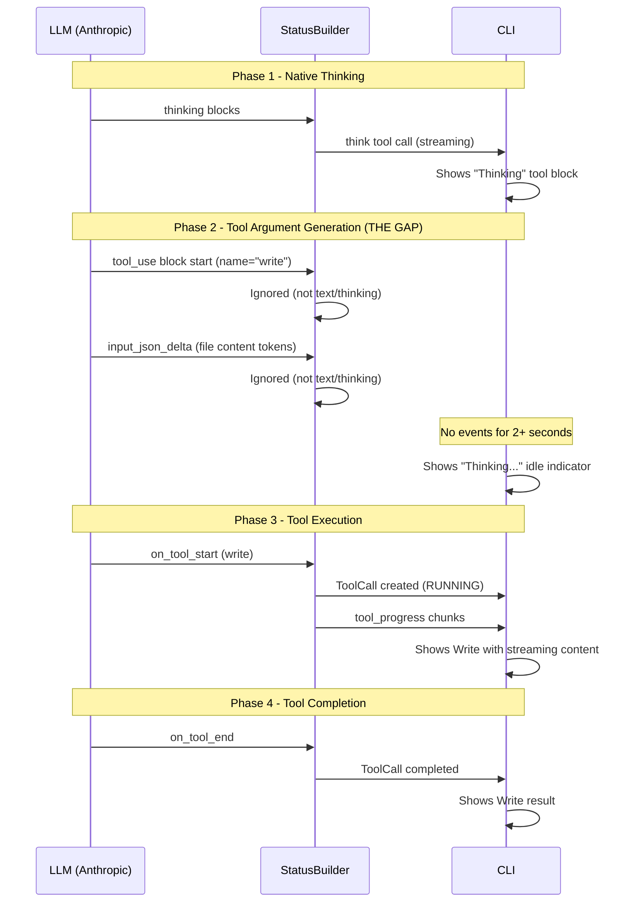

# Live Write Content Streaming in CLI

## The Problem (What You're Seeing)

The "Thinking..." you see in the CLI is actually an **idle indicator** -- it appears after 2 seconds of no meaningful CLI events. It is NOT connected to the synthetic "think" tool call or native thinking.

Here is the timeline of what happens during a write operation:

The gap is **Phase 2**: the LLM is generating the file content token by token (this can take 10-20 seconds for a 170-line file), but the status builder ignores `tool_use` and `input_json_delta` blocks. No CLI events fire. After 2 seconds of silence, the idle indicator shows "Thinking..."

Phase 3 (tool execution) happens almost instantly -- the actual file write is fast. So the existing `_stream_write_content` mechanism barely has time to show its streaming effect.

## What Already Exists

- **Write tool streaming** ([tool_wrappers.py](backend/libs/python/graphton/src/graphton/core/tool_wrappers.py) line 908): `_stream_write_content` already emits `tool_progress` events with chunked file content during tool execution
- **StatusBuilder handler** ([status_builder.py](backend/services/agent-runner/worker/activities/graphton/status_builder.py) line 470): `_handle_tool_progress_event` already appends chunks to `tool_call.result` and sets `is_streaming=True`
- **CLI streaming detection** (`run_stream_events.go` line 343): Already detects `IsStreaming && Result` changes and emits `ToolStreamDeltaEvent`
- **CLI streaming renderer** (`render_blocks.go` line 106): Already renders streaming tools with last 8 lines, gutter borders, and a cursor

## Options

### Option A: Early Tool Call on `tool_use` Block Start (Recommended)

When the LLM stream produces a `tool_use` block, the status builder already sees it (currently logged as `[STREAM_DIAG] block_types=['tool_use']`). We can extract the tool name and create a "generating" tool call immediately.

**What the user sees**:

- "Thinking..." ends immediately when the model starts producing the tool call
- "Write: generating arguments..." appears (with a spinner badge)
- When `on_tool_start` fires, transitions to "Write: file.md (running)" with streaming content
- On completion: "Write: file.md (7.0 KB, 170 lines)"

**Changes required**:

- `status_builder.py`: In `_handle_chat_model_stream_event`, when a `tool_use` block is detected, flush the thinking buffer and create a "pending" ToolCall with `status=TOOL_CALL_RUNNING` and `is_streaming=True`. Store a mapping from the Anthropic tool_use ID to later reconcile with `on_tool_start`.
- `status_builder.py`: In `_handle_tool_start_event`, check if a pending tool call exists for this invocation and transition it rather than creating a new one.
- CLI: Minimal or no changes -- the existing streaming tool renderer already handles this.

**Complexity**: Medium. Requires careful reconciliation between the pre-created tool call and the `on_tool_start` event.

### Option B: Stream `input_json_delta` Content (Cursor-Like, Future Enhancement)

On top of Option A, also process `input_json_delta` blocks to show the file content as the model generates it.

**What the user sees**:

- "Write: file.md" appears immediately
- File content streams line by line in the tool call's result area (like Cursor showing code changes)

**Changes required**:

- `status_builder.py`: Accumulate `input_json_delta` partial JSON, parse it incrementally to extract the `contents` field for write tools
- Requires a streaming JSON parser or heuristic extraction (the `contents` field is usually the last and largest field)

**Complexity**: High. Partial JSON parsing is fragile. Best done as a follow-up.

### Option C: Improved Idle Indicator (Minimal)

Instead of showing "Thinking..." during Phase 2, show "Generating response..." or "Agent is working..." -- a more accurate label.

**What the user sees**:

- "Generating response..." instead of "Thinking..."
- No early visibility into what tool is being called

**Changes required**:

- CLI only: Change the idle indicator text

**Complexity**: Very low, but poor UX compared to A.

## Recommendation

I recommend **Option A** as the primary implementation, with **Option B** as an optional follow-up. Option A gives 80% of the value at 30% of the complexity.

Here is why:

- It immediately tells the user the model has stopped thinking and started generating a tool call
- It shows WHICH tool is being generated (Write, Read, Shell, etc.)
- It leverages the existing streaming renderer in the CLI
- It sets up the architecture for Option B (streaming content) later

Option C is a quick win but doesn't address the core problem -- the user still has no visibility into what the agent is doing during Phase 2.

## Key Design Decisions Needed

Before implementation, I need your input on:

1. **Scope**: Should we implement Option A alone, or also tackle Option B (streaming file content during generation)?
2. **Status naming**: What should the tool call show during argument generation? Options: "generating...", "preparing...", "composing...", or something else?
3. **Priority**: Is this a "do it now" feature or a "plan it for later" item? Given the content-drop bugs we just fixed, would you prefer to stabilize first?

