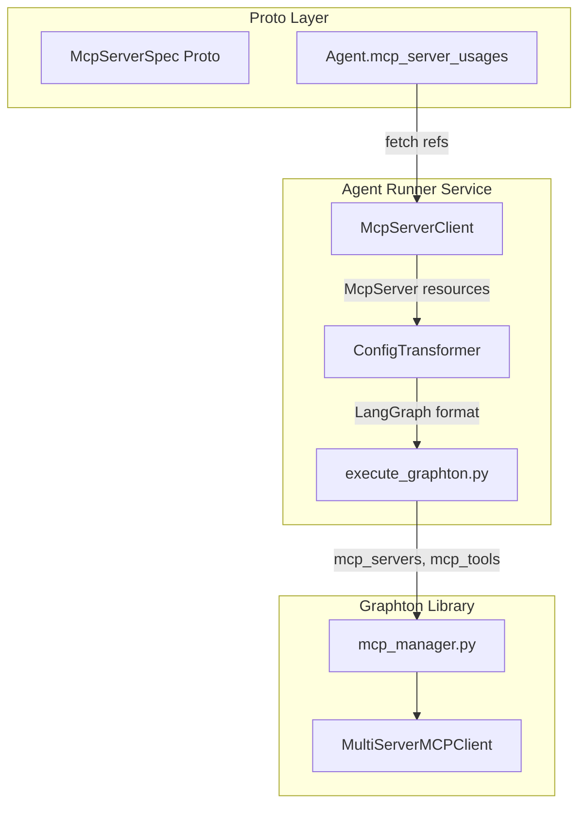
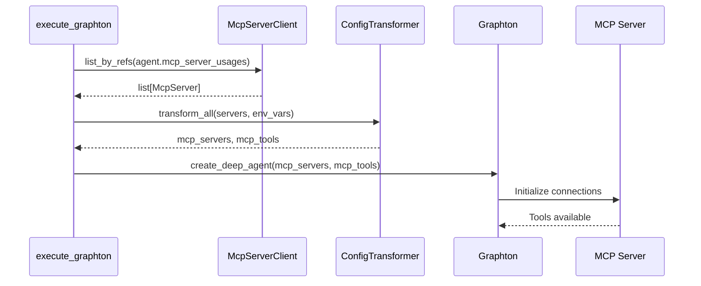

# MCP Server Integration Implementation

## Architecture Overview



## Key Design Principles

1. **Leverage existing infrastructure**: Graphton already has `mcp_manager.py` with `load_mcp_tools()` - we only need to transform configuration
2. **Follow established patterns**: Mirror `SkillClient` and `SkillWriter` patterns for consistency
3. **Clean separation of concerns**: Configuration transformation is isolated from lifecycle management
4. **Type safety**: Full type hints with Protocol definitions for testability

## Implementation Phases

### Phase 1: Configuration Transformer Module

Create `worker/mcp/config_transformer.py` - the core transformation logic.

**Key responsibilities:**

- Transform `StdioServerConfig` proto to LangGraph stdio format
- Transform `HttpServerConfig` proto to LangGraph HTTP format  
- Resolve `${VAR_NAME}` placeholders in HTTP headers/query params
- Handle tool filtering from `McpServerUsage.enabled_tools`

**LangGraph expected formats:**

```python
# Stdio transport
{
    "command": "npx",
    "args": ["-y", "@modelcontextprotocol/server-github"],
    "transport": "stdio",
    "env": {"GITHUB_TOKEN": "..."}
}

# HTTP transport  
{
    "url": "https://mcp.example.com/v1",
    "transport": "streamable_http",
    "headers": {"Authorization": "Bearer ..."}
}
```

**Files to create:**

- [`backend/services/agent-runner/worker/mcp/__init__.py`](backend/services/agent-runner/worker/mcp/__init__.py)
- [`backend/services/agent-runner/worker/mcp/config_transformer.py`](backend/services/agent-runner/worker/mcp/config_transformer.py)

### Phase 2: MCP Server gRPC Client

Create `grpc_client/mcp_server_client.py` following the `SkillClient` pattern.

**Key responsibilities:**

- Fetch `McpServer` resources by `ApiResourceReference`
- Parallel fetching for multiple servers
- Error handling with clear messages

**Pattern from existing `SkillClient`:**

```python
async def list_by_refs(self, refs: list[ApiResourceReference]) -> list[McpServer]:
    # Parallel fetch using asyncio.gather
    servers = await asyncio.gather(*[self.get_by_reference(ref) for ref in refs])
    return list(servers)
```

**Files to create:**

- [`backend/services/agent-runner/grpc_client/mcp_server_client.py`](backend/services/agent-runner/grpc_client/mcp_server_client.py)

### Phase 3: Integration with execute_graphton

Modify [`execute_graphton.py`](backend/services/agent-runner/worker/activities/execute_graphton.py) to:

1. **Fetch MCP servers** from agent's `mcp_server_usages` (similar to skill fetching)
2. **Merge environments** for MCP servers (combine agent env with MCP server env requirements)
3. **Transform configurations** using `ConfigTransformer`
4. **Pass to Graphton** via `mcp_servers` and `mcp_tools` parameters

**Integration point at line 420-428:**

```python
# Current (placeholder):
agent_graph = create_deep_agent(
    mcp_servers={},  # MCP support will be added later
    mcp_tools=None,
    ...
)

# After integration:
mcp_servers, mcp_tools = await prepare_mcp_config(
    agent.spec.mcp_server_usages,
    merged_env_vars,
    mcp_server_client
)
agent_graph = create_deep_agent(
    mcp_servers=mcp_servers,
    mcp_tools=mcp_tools,
    ...
)
```

### Phase 4: Dockerfile Update

Modify [`Dockerfile`](backend/services/agent-runner/Dockerfile) to add Node.js 20.x for npm-based MCP servers.

**Current state** (line 52-65):

```dockerfile
FROM python:3.11-slim
RUN apt-get install ... git ca-certificates
```

**Updated** (add Node.js):

```dockerfile
FROM python:3.11-slim
RUN apt-get update && \
    apt-get install -y --no-install-recommends \
        git ca-certificates curl && \
    curl -fsSL https://deb.nodesource.com/setup_20.x | bash - && \
    apt-get install -y nodejs && \
    apt-get clean && rm -rf /var/lib/apt/lists/*
```

### Phase 5: Unit Tests

Create comprehensive tests following existing patterns in `tests/`.

**Files to create:**

- [`backend/services/agent-runner/tests/mcp/__init__.py`](backend/services/agent-runner/tests/mcp/__init__.py)
- [`backend/services/agent-runner/tests/mcp/test_config_transformer.py`](backend/services/agent-runner/tests/mcp/test_config_transformer.py)

**Test coverage:**

- Stdio config transformation
- HTTP config transformation with placeholder resolution
- Tool filtering from `enabled_tools`
- Edge cases: missing fields, empty configs, malformed placeholders

## Data Flow



## Success Criteria

- [ ] stdio MCP servers work (e.g., `npx @modelcontextprotocol/server-github`)
- [ ] HTTP MCP servers work (e.g., remote/managed MCP services)
- [ ] `${VAR_NAME}` placeholder resolution works for HTTP headers
- [ ] Tool filtering via `enabled_tools` works correctly
- [ ] Agent runner Dockerfile includes Node.js 20.x
- [ ] All unit tests pass
- [ ] No breaking changes to existing agent execution flow

## Files Summary

| File | Action | Purpose |

|------|--------|---------|

| `worker/mcp/__init__.py` | Create | Module init |

| `worker/mcp/config_transformer.py` | Create | Proto to LangGraph config |

| `grpc_client/mcp_server_client.py` | Create | Fetch MCP servers via gRPC |

| `worker/activities/execute_graphton.py` | Modify | Integrate MCP config |

| `Dockerfile` | Modify | Add Node.js 20.x |

| `tests/mcp/__init__.py` | Create | Test module init |

| `tests/mcp/test_config_transformer.py` | Create | Unit tests |