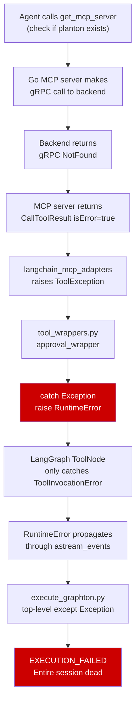

# MCP Tool Error Resilience: Complete the Unfinished Fix

## Domain Analysis (Architect Role)

### The Failure Chain




### What was Fixed vs What was Missed

On **Feb 24** ([changelog](backend/libs/python/graphton/src/graphton/core/tool_wrappers.py)), all 8 **platform tools** (read, write, edit, execute, ls, glob, grep, search) were changed from `raise RuntimeError` to `return enrich_error_message(...)`. This was documented in `_changelog/2026-02/2026-02-24-223911-tool-error-resilience.md`.

**MCP tools were not included in that fix.** Both wrapper functions still raise `RuntimeError`:

- `create_tool_wrapper` (line 211-219 of [tool_wrappers.py](backend/libs/python/graphton/src/graphton/core/tool_wrappers.py))
- `create_approval_aware_tool_wrapper` (line 367-375 of [tool_wrappers.py](backend/libs/python/graphton/src/graphton/core/tool_wrappers.py))

### Why This is Architecturally Wrong

A "resource not found" from `get_mcp_server` is an **expected operational outcome**, not a system error. The agent was checking whether an MCP server named "planton" already exists on the platform -- it does not, and that is perfectly valid information the agent needs to proceed with creating it. This is the equivalent of `ls` returning "file not found" -- the LLM should receive that information and decide what to do next.

The correct pattern already exists in two places in the codebase:

1. **Platform tools** -- return `enrich_error_message(tool_name, str(e))` (the Feb 24 fix)
2. `**AuthenticatedMcpToolNode`** (line 229-245 of [authenticated_tool_node.py](backend/libs/python/graphton/src/graphton/core/authenticated_tool_node.py)) -- catches exceptions, returns `ToolMessage(status="error")` with enriched content

### The Fix

The fix is surgical and follows the established pattern exactly.

---

## Changes

### 1. `tool_wrappers.py` -- MCP tool wrappers (2 locations)

**File:** [backend/libs/python/graphton/src/graphton/core/tool_wrappers.py](backend/libs/python/graphton/src/graphton/core/tool_wrappers.py)

**Location 1: `create_tool_wrapper`** (lines 211-219)

Change from:

```python
except Exception as e:
    cause = _unwrap_exception(e)
    logger.error(
        f"MCP tool '{tool_name}' invocation failed: {cause}",
        exc_info=True,
    )
    raise RuntimeError(
        f"MCP tool '{tool_name}' invocation failed: {cause}"
    ) from e
```

To:

```python
except Exception as e:
    cause = _unwrap_exception(e)
    logger.warning(
        f"MCP tool '{tool_name}' invocation failed: {cause}",
        exc_info=True,
    )
    return enrich_error_message(tool_name, str(cause))
```

**Location 2: `create_approval_aware_tool_wrapper`** (lines 367-375)

Identical change -- replace `raise RuntimeError(...)` with `return enrich_error_message(tool_name, str(cause))` and downgrade log level from `error` to `warning`.

Note: `ToolExecutionRejectedError` (from HITL approval) is raised *before* we reach `ainvoke()`, so it is unaffected by this change.

### 2. `error_hints.py` -- Add MCP-specific recovery hints

**File:** [backend/libs/python/graphton/src/graphton/core/error_hints.py](backend/libs/python/graphton/src/graphton/core/error_hints.py)

Add hints for common MCP tool error patterns:

- **gRPC NotFound**: "The resource does not exist yet. This is expected for new resources -- proceed with creating it."
- **gRPC PermissionDenied / Unauthenticated**: "Check API key validity and permissions."
- **gRPC Unavailable**: "The backend service may be temporarily unreachable. Wait and retry."

The existing generic "not found" hint (line 43) covers files/paths. MCP errors need domain-specific hints about API resources and services.

### 3. Docstring/comment updates

Update the docstrings for `create_tool_wrapper` and `create_approval_aware_tool_wrapper` -- currently the `Raises` section documents `RuntimeError` for invocation failures. That should be removed since we no longer raise.

---

## Secondary Architectural Observation (Not in Scope, but Flagged)

The Go MCP server (`mcp-server-planton`) sets `isError=true` in the `CallToolResult` for gRPC `NotFound`. Under the MCP specification, `isError` means "the tool failed to execute." A NotFound is a valid, successful execution that returned informational content ("this resource does not exist"). The MCP server should arguably return `isError=false` with a content message like `"McpServer 'planton' not found in org 'default'."` This is analogous to HTTP: a 404 is a valid response, not a server error.

However, this is in a different repository and is a separate concern. The agent runner fix above makes the system resilient regardless of MCP server behavior -- which is the correct defensive posture.

---

## What This Does NOT Change

- `ToolExecutionRejectedError` (HITL rejection) -- still raises, still fatal. This is correct: a user rejecting a tool is a deliberate action, not an operational error.
- Platform tools -- already fixed, no changes needed.
- `AuthenticatedMcpToolNode` -- already correct, not in the execution path for this flow anyway.
- `execute_graphton.py` top-level handler -- still catches true system errors. No change needed.

## Verification

After the fix, the same `get_mcp_server` call that returns NotFound will:

1. Return an enriched error string to the LLM (not raise)
2. The LLM sees "McpServer not found" + recovery hints
3. The LLM proceeds with drafting the YAML (the intended behavior)
4. Execution completes successfully

