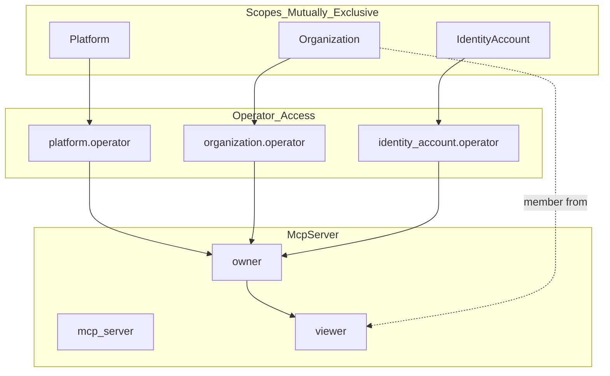

# Phase 3: McpServer FGA Authorization Model

## Overview

McpServer will be the **first resource in Stigmer to support all three scopes simultaneously**. This requires careful attention to permission inheritance and visibility patterns that correctly handle:

- **Platform scope**: Public marketplace MCP servers (GitHub, Slack, AWS integrations)
- **Organization scope**: Private team-shared MCP servers
- **Identity Account scope**: Personal development tools and local integrations

## Architecture



## Permission Matrix by Scope

| Permission | Platform | Organization | Identity Account |

|------------|----------|--------------|------------------|

| `can_view` | All users | Org members | Owner only |

| `can_use` | All users | Org members | Owner only |

| `can_edit` | Operators | Owner + Org admins | Owner only |

| `can_delete` | Operators | Owner + Org admins | Owner only |

| `can_clone` | All users | Org members | Owner only |

## Files to Create/Modify

### 1. Create: `agentic/mcp_server.fga`

**Location**: `backend/services/stigmer-service/src/main/resources/fga/model/agentic/mcp_server.fga`

The model will follow established patterns with key innovations for 3-scope support:

```fga
module agentic

# ========================================
# MCP_SERVER TYPE (Platform/Org/User-scoped)
# ========================================
# MCP (Model Context Protocol) servers that provide tools to AI agents.
# First resource in Stigmer with tri-scope support for maximum flexibility.
#
# Scope levels (mutually exclusive):
# 1. Platform-scoped: Curated MCP servers visible to ALL users (marketplace)
#    - Example: "GitHub", "Slack", "AWS S3", "Filesystem"
#    - Managed by platform operators
#    - FGA tuple: mcp_server:github#platform@platform:stigmer
#
# 2. Organization-scoped: Team MCP servers visible to org members
#    - Example: Internal API servers, org-specific integrations
#    - Owned by creator, visible to org members
#    - FGA tuple: mcp_server:internal-api#organization@organization:acme
#
# 3. User-scoped: Personal MCP servers visible only to owner
#    - Example: Local dev servers, personal integrations, WIP configs
#    - Private to single user
#    - FGA tuple: mcp_server:my-local-server#identity_account@identity_account:alice
#
# Agent usage flow:
# - Agent.spec.mcp_server_usages references McpServer by slug
# - At runtime, system checks can_use permission
# - SubAgent inherits access from parent Agent (cannot expand, only restrict)

type mcp_server
  relations
    # ========================================
    # SCOPE (Mutually Exclusive)
    # ========================================
    # Platform-scoped: Public marketplace MCP servers
    define platform: [platform]
    
    # Organization-scoped: Team-shared MCP servers
    define organization: [organization]
    
    # User-scoped: Personal MCP servers
    define identity_account: [identity_account]
    
    # ========================================
    # OPERATOR SUPERUSER ACCESS
    # ========================================
    # Operators get access from any scope for troubleshooting
    # - Platform operators: Can manage all platform-scoped servers
    # - Org operators: Can manage org-scoped servers in their org
    # - User operators: Derived from identity_account's org membership
    define operator: operator from platform or operator from organization or operator from identity_account
    
    # ========================================
    # OWNERSHIP
    # ========================================
    # Owner hierarchy:
    # - Direct identity_account assignment (creator)
    # - Org admins (for org-scoped servers)
    # - Operators (superuser fallback)
    define owner: [identity_account] or admin from organization or operator
    
    # ========================================
    # VISIBILITY
    # ========================================
    # Viewers depend on scope:
    # - User-scoped: Only owner
    # - Org-scoped: Owner + org members
    # - Platform-scoped: Everyone (via platform relation check)
    define viewer: owner or member from organization
    
    # ========================================
    # CRUD OPERATIONS
    # ========================================
    # View: Viewer access, PLUS anyone for platform-scoped (marketplace)
    # The 'or platform' allows unauthenticated/any-user access to marketplace items
    define can_view: viewer or platform
    
    # Edit: Only owners can modify MCP server configuration
    define can_edit: owner
    
    # Delete: Only owners can delete
    define can_delete: owner
    
    # ========================================
    # USAGE & REFERENCE
    # ========================================
    # Use: Permission to reference this MCP server in an Agent
    # Same visibility rules as can_view - if you can see it, you can use it
    define can_use: viewer or platform
    
    # Clone: Create personal copy of this MCP server configuration
    # Available to anyone who can view (enables learning from marketplace)
    define can_clone: viewer or platform
    
    # ========================================
    # IAM POLICY MANAGEMENT
    # ========================================
    # Grant access: Owners can share their MCP servers
    define can_grant_access: owner
    
    # View access: Viewers can see who has access (transparency)
    define can_view_access: viewer
```

### 2. Modify: `fga.mod`

**Location**: `backend/services/stigmer-service/src/main/resources/fga/model/fga.mod`

Add `mcp_server.fga` to the agentic section (after `skill.fga` for logical ordering):

```yaml
schema: '1.2'
contents:
  # Core root types
  - platform.fga
  
  # IAM
  - iam/identity_account.fga
  - iam/iam_policy.fga
  - iam/api_key.fga
  
  # Tenancy
  - tenancy/organization.fga
  
  # Agentic
  - agentic/agent.fga
  - agentic/agent_instance.fga
  - agentic/agent_execution.fga
  - agentic/environment.fga
  - agentic/mcp_server.fga       # NEW
  - agentic/session.fga
  - agentic/skill.fga
  - agentic/workflow.fga
  - agentic/workflow_instance.fga
  - agentic/workflow_execution.fga
```

## Key Design Decisions

### 1. Tri-Scope Operator Pattern

Unlike existing resources (2 scopes), McpServer needs operator access from all three scope types:

```fga
define operator: operator from platform or operator from organization or operator from identity_account
```

### 2. Platform Visibility for Marketplace

Platform-scoped MCP servers should be discoverable by all users:

```fga
define can_view: viewer or platform
define can_use: viewer or platform
```

The `or platform` clause allows any user to view/use marketplace items.

### 3. Owner Hierarchy with Org Admin

Following the `environment.fga` pattern, org admins can manage org-scoped servers:

```fga
define owner: [identity_account] or admin from organization or operator
```

### 4. Clone Permission for Knowledge Sharing

Enables users to learn from marketplace and create personal copies:

```fga
define can_clone: viewer or platform
```

## Validation Steps

After creating the FGA model:

1. **Syntax validation**: Use `fga model validate` to check syntax
2. **Apply model**: Run `tools/local-dev/fga/apply_and_sync_fga_model.sh`
3. **Verify registration**: Confirm new model ID is set in configuration

## FGA Tuple Examples

For reference, here are example tuples that would be created:

**Platform-scoped (Marketplace):**

```
mcp_server:github#platform@platform:stigmer
mcp_server:github#owner@identity_account:platform-operator-1
```

**Organization-scoped (Team):**

```
mcp_server:internal-api#organization@organization:acme-corp
mcp_server:internal-api#owner@identity_account:alice
```

**User-scoped (Personal):**

```
mcp_server:my-local-dev#identity_account@identity_account:bob
mcp_server:my-local-dev#owner@identity_account:bob
```

## Quality Checklist

- [ ] Module declaration matches existing pattern (`module agentic`)
- [ ] Comprehensive header documentation explaining all scopes
- [ ] FGA tuple examples in comments for each scope
- [ ] All three scopes defined as relations
- [ ] Operator access from all three scope types
- [ ] Owner includes org admin for org-scoped resources
- [ ] Viewer pattern supports all visibility requirements
- [ ] Platform visibility for marketplace discoverability
- [ ] Standard CRUD permissions (can_view, can_edit, can_delete)
- [ ] Usage permission (can_use) for agent references
- [ ] Clone permission for knowledge sharing
- [ ] IAM policy management permissions
- [ ] Added to fga.mod in correct alphabetical position