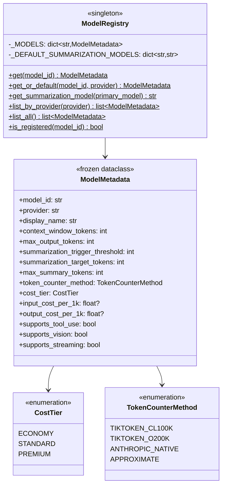

# Model Registry Implementation Plan

## Architecture Overview




## Design Principles

1. **Frozen Dataclass** for `ModelMetadata` - immutable, hashable, prevents accidental mutations
2. **Python Enum** for categorical values - type-safe, IDE autocomplete, exhaustive matching
3. **Class Methods on Registry** - no instantiation needed, singleton-like behavior
4. **Conservative Defaults** - unknown models get 8K context, economy tier
5. **Provider-Aware Summarization** - uses economy model from same provider

## Files to Create/Modify


| File                                                                                    | Action | Purpose                                                 |
| --------------------------------------------------------------------------------------- | ------ | ------------------------------------------------------- |
| `[model_registry.py](backend/libs/python/graphton/src/graphton/core/model_registry.py)` | Create | Core registry with enums, dataclass, and registry class |
| `[core/__init__.py](backend/libs/python/graphton/src/graphton/core/__init__.py)`        | Modify | Export `ModelRegistry`, `ModelMetadata`, enums          |
| `[__init__.py](backend/libs/python/graphton/src/graphton/__init__.py)`                  | Modify | Export from package level                               |
| `[test_model_registry.py](backend/libs/python/graphton/tests/test_model_registry.py)`   | Create | Comprehensive unit tests                                |


## Implementation Details

### 1. Enums - Type-Safe Categorical Values

```python
class CostTier(Enum):
    """Cost tier classification for model selection."""
    ECONOMY = "economy"      # Cheapest - prefer for summarization
    STANDARD = "standard"    # Balanced cost/quality
    PREMIUM = "premium"      # Highest quality, highest cost

class TokenCounterMethod(Enum):
    """Strategy for counting tokens - critical for accurate thresholds."""
    TIKTOKEN_CL100K = "tiktoken_cl100k"    # GPT-4, GPT-3.5
    TIKTOKEN_O200K = "tiktoken_o200k"      # GPT-4o, o1 family
    ANTHROPIC_NATIVE = "anthropic_native"  # Claude models (API-based)
    APPROXIMATE = "approximate"            # chars/4 fallback
```

### 2. ModelMetadata - Frozen Dataclass

Key design decisions:

- `frozen=True` prevents mutations after creation
- `slots=True` reduces memory footprint (17 models × 15 fields)
- Optional cost fields (`float | None`) for local models with zero cost
- Capability flags for feature detection

```python
@dataclass(frozen=True, slots=True)
class ModelMetadata:
    """Immutable metadata for a supported model."""
    
    # Identity (3 fields)
    model_id: str
    provider: str
    display_name: str
    
    # Context Window (2 fields)  
    context_window_tokens: int
    max_output_tokens: int
    
    # Summarization Thresholds (3 fields)
    summarization_trigger_threshold: int  # ~90% of context
    summarization_target_tokens: int      # ~80% of context
    max_summary_tokens: int               # Budget for summary
    
    # Token Counting (1 field)
    token_counter_method: TokenCounterMethod
    
    # Economics (3 fields)
    cost_tier: CostTier
    input_cost_per_1k: float | None = None
    output_cost_per_1k: float | None = None
    
    # Capabilities (3 fields)
    supports_tool_use: bool = True
    supports_vision: bool = False
    supports_streaming: bool = True
```

### 3. ModelRegistry - Class with Class Methods

```python
class ModelRegistry:
    """Central registry for all supported model metadata."""
    
    _MODELS: ClassVar[dict[str, ModelMetadata]] = {...}
    
    _DEFAULT_SUMMARIZATION_MODELS: ClassVar[dict[str, str]] = {
        "anthropic": "claude-haiku-4",
        "openai": "gpt-4o-mini",
        "ollama": None,  # Use same model
    }
    
    @classmethod
    def get(cls, model_id: str) -> ModelMetadata:
        """Get metadata - raises KeyError if not found."""
        
    @classmethod
    def get_or_default(cls, model_id: str, provider: str = "unknown") -> ModelMetadata:
        """Get metadata or conservative defaults."""
        
    @classmethod
    def get_summarization_model(cls, primary_model: str) -> str:
        """Get economy-tier model from same provider."""
        
    @classmethod
    def list_by_provider(cls, provider: str) -> list[ModelMetadata]:
        """List all models for a provider."""
        
    @classmethod
    def list_all(cls) -> list[ModelMetadata]:
        """List all registered models."""
        
    @classmethod
    def is_registered(cls, model_id: str) -> bool:
        """Check if model is in registry."""
```

### 4. Complete Model Data

17 models across 3 providers with accurate metadata:

**Anthropic (5 models)**:

- claude-opus-4: 200K context, Premium, $15/$75
- claude-sonnet-4.5: 200K context, Standard, $3/$15
- claude-haiku-4: 200K context, Economy, $1/$5
- claude-sonnet-3.5: 200K context, Standard
- claude-haiku-3.5: 200K context, Economy

**OpenAI (7 models)**:

- gpt-4: 8K context, Premium, $30/$60
- gpt-4-turbo: 128K context, Standard, $10/$30
- gpt-4o: 128K context, Standard, $5/$15
- gpt-4o-mini: 128K context, Economy, $0.15/$0.60
- gpt-3.5-turbo: 16K context, Economy
- o1: 200K context, Premium
- o1-mini: 128K context, Standard

**Ollama (5 models)** - all Economy tier, no cost:

- qwen2.5-coder:7b: 32K context
- qwen2.5-coder:14b: 32K context
- codellama:7b/13b: 16K context
- deepseek-coder-v2:16b: 128K context
- llama3.2:3b: 128K context
- mistral:7b: 32K context

### 5. Default Behavior for Unknown Models

```python
_DEFAULT_METADATA = ModelMetadata(
    model_id="unknown",
    provider="unknown",
    display_name="Unknown Model",
    context_window_tokens=8192,      # Conservative 8K
    max_output_tokens=4096,
    summarization_trigger_threshold=7000,   # ~85%
    summarization_target_tokens=6000,       # ~73%
    max_summary_tokens=500,
    token_counter_method=TokenCounterMethod.APPROXIMATE,
    cost_tier=CostTier.ECONOMY,
)
```

## Test Coverage

Unit tests will verify:

- All 17 models return correct metadata via `get()`
- `get_or_default()` returns defaults for unknown models
- `get_summarization_model()` returns correct economy-tier model
- `list_by_provider()` returns correct models per provider
- `is_registered()` returns correct boolean
- Metadata is truly immutable (frozen dataclass)
- Enums are used correctly (not string comparisons)

## Integration Points

The registry will be consumed by:

1. `SummarizationConfig.for_model()` - Phase 2
2. Context management in `execute_graphton.py` - Phase 2
3. Future cost estimation features - Phase 3

## Quality Standards

- **Type hints**: 100% coverage with modern Python 3.11+ syntax
- **Docstrings**: Google-style with Args/Returns/Raises/Examples
- **Immutability**: `frozen=True` on dataclass, no mutable state
- **Error messages**: Helpful messages with recovery suggestions
- **Logging**: Module-level logger for debugging
- **Exports**: Explicit `__all__` in module

