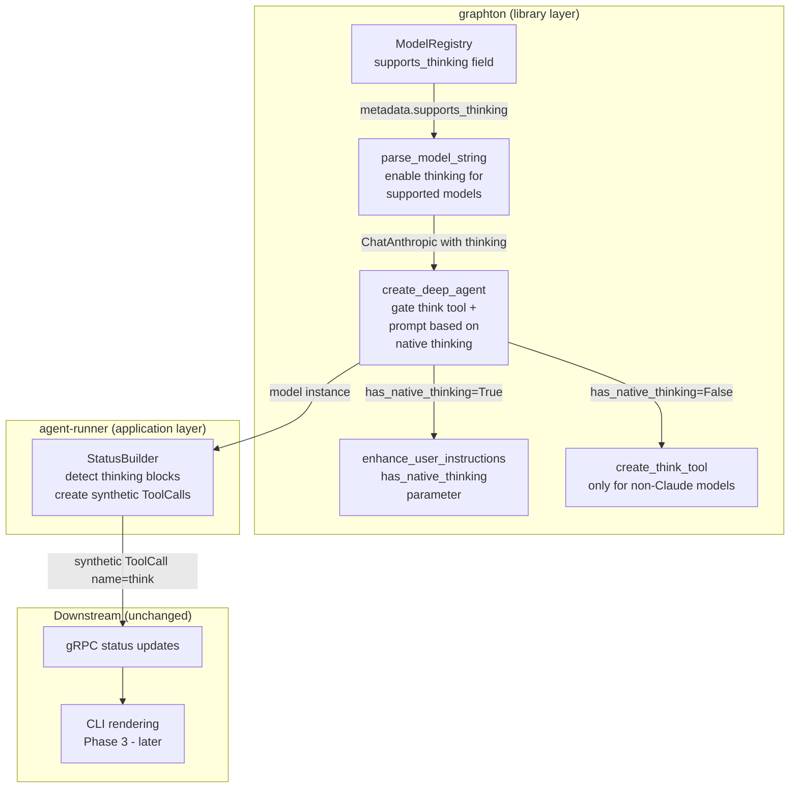

# Enable Native Extended Thinking with Synthetic Think Tool Translation

## Context

The platform currently has an explicit "think tool" (Phase 2 of this project) that gives agents a no-op tool to externalize reasoning. Anthropic provides a native extended thinking API that produces higher-quality reasoning for supported Claude models. The goal is to enable native thinking at the model layer and translate thinking content blocks into synthetic think tool calls in the status builder, so the entire downstream pipeline (gRPC, CLI) treats them identically to explicit think tool calls.

## Architecture




## Anthropic API Constraints (verified from docs)

- **Temperature**: thinking is NOT compatible with `temperature` or `top_k`. When thinking is enabled, these parameters must NOT be present in the request. The API will reject them.
- **Budget**: `budget_tokens` must be less than `max_tokens`. With `max_tokens=20000` (current default) and `budget_tokens=10000`, this is satisfied.
- **Summarized thinking**: Claude 4 models return summarized thinking (not full internal reasoning). The summary is concise and readable -- good for the think tool UX.
- **Supported models in our registry** (manual `type: "enabled"` mode): `claude-sonnet-4.6`, `claude-opus-4.5`, `claude-sonnet-4.5`, `claude-opus-4`. NOT `claude-opus-4.6` (manual thinking is DEPRECATED on Opus 4.6; it requires `type: "adaptive"` with effort parameter -- a different code path, deferred to future work). NOT `claude-haiku-4` (only Haiku 4.5 supports it, which isn't in our registry). NOT `claude-sonnet-3.5` or `claude-haiku-3.5` (older generation).
- **Opus 4.6 adaptive thinking**: Anthropic deprecated manual `type: "enabled"` on Opus 4.6 and recommends `type: "adaptive"` with the effort parameter instead. This is a fundamentally different API shape. We set `supports_thinking=False` for Opus 4.6 now and will add adaptive thinking support as a separate future enhancement.

## Changes by File

### 1. ModelMetadata: Add `supports_thinking` capability flag

**File**: [backend/libs/python/graphton/src/graphton/core/model_registry.py](backend/libs/python/graphton/src/graphton/core/model_registry.py)

Add `supports_thinking: bool = False` to the `ModelMetadata` dataclass alongside the existing capability fields (`supports_tool_use`, `supports_vision`, `supports_streaming`) at line ~168.

Update registry entries (8 Anthropic models, ordered by generation as they appear in the registry):

- `claude-opus-4.6`: `supports_thinking=False` (manual thinking DEPRECATED; needs adaptive -- future work)
- `claude-sonnet-4.6`: `supports_thinking=True` (supports manual extended thinking)
- `claude-opus-4.5`: `supports_thinking=True`
- `claude-sonnet-4.5`: `supports_thinking=True`
- `claude-opus-4`: `supports_thinking=True`
- `claude-haiku-4`: `supports_thinking=False` (not in Anthropic's supported list)
- `claude-sonnet-3.5`: `supports_thinking=False` (older generation)
- `claude-haiku-3.5`: `supports_thinking=False` (older generation)

Also update `_DEFAULT_METADATA` to include `supports_thinking=False` (explicit default for unknown models).

Note: The registry now has corrected `max_output_tokens` values (Opus 4: 32768, Sonnet 4.5: 65536) and is ordered by generation (4.6 > 4.5 > 4 > 3.5). The `ANTHROPIC_DEFAULTS["max_tokens"]` of 20,000 satisfies `budget_tokens (10,000) < max_tokens (20,000)` for all models.

### 2. Model Parser: Enable thinking for supported models

**File**: [backend/libs/python/graphton/src/graphton/core/models.py](backend/libs/python/graphton/src/graphton/core/models.py)

Add constant:

```python
DEFAULT_THINKING_BUDGET = 10_000
```

In the Anthropic branch of `parse_model_string` (currently lines 161-177):

- After resolving `api_model_id` and `_metadata` (line 155-158), rename `_metadata` to `metadata` so it's usable.
- After building `model_params` from `ANTHROPIC_DEFAULTS` and applying user overrides, add thinking configuration for supported models:
  - Check `metadata.supports_thinking`
  - If True: set `model_params["thinking"] = {"type": "enabled", "budget_tokens": DEFAULT_THINKING_BUDGET}`
  - **Remove** `temperature` and `top_k` from `model_params` (Anthropic API rejects these when thinking is enabled). Log a warning if the caller had explicitly provided temperature.
  - If a user passes `thinking` explicitly via `**model_kwargs`, respect that (don't override their explicit choice)

Key code structure:

```python
if metadata.supports_thinking and "thinking" not in model_params:
    model_params["thinking"] = {
        "type": "enabled",
        "budget_tokens": DEFAULT_THINKING_BUDGET,
    }
    if "temperature" in model_params:
        logger.warning(
            "Removing temperature=%.1f (incompatible with extended thinking)",
            model_params["temperature"],
        )
        del model_params["temperature"]
    model_params.pop("top_k", None)
```

### 3. Agent Factory: Gate think tool and prompt enhancement

**File**: [backend/libs/python/graphton/src/graphton/core/agent.py](backend/libs/python/graphton/src/graphton/core/agent.py)

After the model instance is created (line ~340), detect whether native thinking is active:

```python
from langchain_anthropic import ChatAnthropic
has_native_thinking = (
    isinstance(model_instance, ChatAnthropic)
    and getattr(model_instance, "thinking", None) is not None
)
```

This works for both paths:

- String model: `parse_model_string` sets `thinking` on supported models, so detection works
- Instance model: the caller explicitly configured `thinking`, so detection works

**Gate think tool injection** (currently lines 523-533): wrap in `if not has_native_thinking:` guard. When native thinking is active, the model reasons natively and doesn't need the tool.

**Gate prompt enhancement** (currently lines 478-485): pass `has_native_thinking` to `enhance_user_instructions()`.

### 4. Prompt Enhancement: Conditional THINK_CAPABILITY

**File**: [backend/libs/python/graphton/src/graphton/core/prompt_enhancement.py](backend/libs/python/graphton/src/graphton/core/prompt_enhancement.py)

Add `has_native_thinking: bool = False` parameter to `enhance_user_instructions()`.

At line ~312 where `THINK_CAPABILITY` is unconditionally appended:

```python
# Currently:
capabilities.append(THINK_CAPABILITY.strip())

# Change to:
if not has_native_thinking:
    capabilities.append(THINK_CAPABILITY.strip())
```

When native thinking is on, the model thinks automatically -- no prompt guidance needed for a think tool that isn't injected.

### 5. Status Builder: Translate thinking blocks to synthetic think tool calls

**File**: [backend/services/agent-runner/worker/activities/graphton/status_builder.py](backend/services/agent-runner/worker/activities/graphton/status_builder.py)

This is the core of the translation layer. The approach:

**New instance state** (add to `__init`__):

```python
self._thinking_buffers: dict[str, str] = {}
self._thinking_started_at: dict[str, datetime] = {}
```

Keyed by namespace string (empty string for main agent, namespace string for sub-agents).

**Modify `_handle_chat_model_stream_event`** (lines 575-639):

Before the existing text extraction logic (before `if not token: return`), add thinking block detection:

1. Check if `chunk_content` is a list and contains blocks with `type: "thinking"`
2. If thinking block found: extract `block["thinking"]` text, append to `_thinking_buffers[ns_key]`, record `_thinking_started_at[ns_key]` if not already set, then `return` (skip AI message creation)
3. If non-thinking content found AND `_thinking_buffers[ns_key]` has accumulated content: call `_flush_thinking_buffer(ns_key, namespace)` to create the synthetic ToolCall, then continue with normal text handling

**Modify `_handle_chat_model_end_event`** (lines 641-792):

After existing processing, add a flush check: if `_thinking_buffers[ns_key]` has remaining content (edge case: thinking without subsequent text), call `_flush_thinking_buffer(ns_key, namespace)`.

**New method `_flush_thinking_buffer`**:

```python
def _flush_thinking_buffer(self, ns_key: str, namespace: str) -> None:
    thinking_text = self._thinking_buffers.pop(ns_key, "")
    started_at = self._thinking_started_at.pop(ns_key, None)
    if not thinking_text:
        return

    now = datetime.utcnow()
    args_struct = Struct()
    args_struct.update({"thought": thinking_text})

    component_type = infer_component_type("think")
    tool_call = ToolCall(
        id=f"think-native-{uuid4()}",
        name="think",
        args=args_struct,
        result="ok",
        status=ToolCallStatus.TOOL_CALL_COMPLETED,
        component_metadata=ComponentMetadata(
            component_type=component_type,
            component_group="main-agent-tools",
        ),
        started_at=_utc_timestamp(started_at or now),
        completed_at=_utc_timestamp(now),
    )

    context, sub_agent = self._get_execution_context(namespace)
    if sub_agent:
        sub_agent.tool_calls.append(tool_call)
    else:
        self.current_status.tool_calls.append(tool_call)
```

**Add helper `_extract_thinking_content`** (alongside `_extract_string_content`):

```python
def _extract_thinking_content(self, content_blocks: list) -> str:
    parts = []
    for block in content_blocks:
        if isinstance(block, dict) and block.get("type") == "thinking":
            parts.append(block.get("thinking", ""))
    return "".join(parts)
```

**Why this ordering works**: Thinking blocks stream BEFORE text blocks. By accumulating thinking and flushing when the first text block arrives, the synthetic ToolCall is created in the `tool_calls` list before the AI message content is populated. The timeline in the status correctly shows: thinking (tool call) -> response (message).

### 6. Tests

**Model Registry tests** ([backend/libs/python/graphton/tests/core/test_model_registry.py](backend/libs/python/graphton/tests/core/test_model_registry.py)):

- Test `supports_thinking` field defaults to False
- Test `supports_thinking=True` for claude-sonnet-4.6, claude-opus-4.5, claude-sonnet-4.5, claude-opus-4
- Test `supports_thinking=False` for claude-opus-4.6, claude-haiku-4, claude-sonnet-3.5, claude-haiku-3.5

**Model parser tests** (test file for `parse_model_string`):

- Test that `parse_model_string("claude-sonnet-4.5")` returns a ChatAnthropic with `thinking` set
- Test that `parse_model_string("claude-haiku-3.5")` returns a ChatAnthropic WITHOUT thinking
- Test that temperature is removed when thinking is enabled
- Test that explicit `thinking` in `model_kwargs` is respected (not overridden)

**Prompt enhancement tests** ([backend/libs/python/graphton/tests/core/test_prompt_enhancement.py](backend/libs/python/graphton/tests/core/test_prompt_enhancement.py)):

- Update `test_think_capability_always_included` to only assert when `has_native_thinking=False`
- Add `test_think_capability_excluded_with_native_thinking`
- Update `test_all_features_enabled` if it checks for think capability content

**Status builder tests** ([backend/services/agent-runner/tests/test_status_builder.py](backend/services/agent-runner/tests/test_status_builder.py)):

- Test that thinking content blocks in `on_chat_model_stream` are accumulated (not added to AI message)
- Test that a synthetic ToolCall is created when thinking transitions to text
- Test that the synthetic ToolCall has `name="think"`, `args.thought=<content>`, `result="ok"`, `status=COMPLETED`
- Test that remaining thinking buffer is flushed on `on_chat_model_end`
- Test that non-thinking streams (no thinking blocks) work unchanged

## What is NOT in scope

- Phase 3 (CLI UX rendering for think tool calls) -- separate conversation
- Phase 4 (end-to-end validation) -- separate conversation
- `component_type_inference.py` -- "think" currently falls through to `"tool"` default, which is fine; Phase 3 can add a dedicated entry
- Approval policy -- "think" is already exempt; synthetic think tool calls don't go through the approval flow since they're created directly by the status builder (not through the agent's tool execution path)
- **Adaptive thinking for Opus 4.6** -- requires `type: "adaptive"` with effort parameter, fundamentally different API shape. Will be a separate enhancement when needed. Opus 4.6 agents will get the explicit think tool as fallback for now.

## Risks and Mitigations

- **LangGraph message history**: `langchain-anthropic` 1.3.x handles thinking block stripping/redaction in multi-turn conversations automatically. If issues arise, we'll surface them during Phase 4 (E2E validation).
- **Cost increase**: Extended thinking uses output tokens. The 10,000 budget is a ceiling, not a floor -- Claude may use less. Monitor during Phase 4.
- **Non-thinking turns**: In multi-turn tool-use conversations, thinking blocks typically appear in the first response. Subsequent responses after tool results may not include thinking. The status builder handles this naturally (empty buffer = no synthetic ToolCall).

