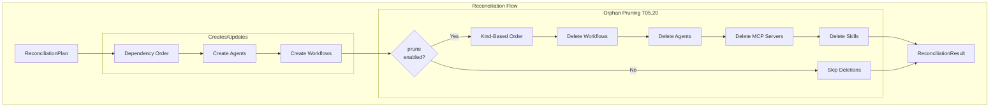

# T05.20: Orphan Pruning with Safety Controls

## Current State Assessment

**Important Discovery**: Both T05.19 (Dependency-Ordered Apply) and T05.20 (Orphan Pruning) have been implemented in uncommitted changes. The git diff shows:

- `ProjectReconciliationService.java`: +312 lines (full `executePlan()` implementation)
- `ProjectReconciliationServiceTest.java`: +509 lines (comprehensive test coverage)

However, these changes need verification, enhancement, and proper documentation before being committed.

## Architecture Overview




## Key Files

**Modify:**

- [ProjectReconciliationService.java](backend/services/stigmer-service/src/main/java/ai/stigmer/domain/agentic/project/reconcile/ProjectReconciliationService.java) - Enhance orphan pruning with kind-based fallback ordering
- [ReconciliationPlan.java](backend/services/stigmer-service/src/main/java/ai/stigmer/domain/agentic/project/reconcile/ReconciliationPlan.java) - Add kind-based deletion ordering
- [ProjectReconciliationServiceTest.java](backend/services/stigmer-service/src/test/java/ai/stigmer/domain/agentic/project/reconcile/ProjectReconciliationServiceTest.java) - Add comprehensive orphan pruning tests

## Implementation Plan

### Step 1: Verify Current Implementation

Review uncommitted changes to confirm:

- `executePlan()` properly executes creates/updates in dependency order
- Orphan deletion respects `pruneEnabled()` option
- Log warnings appear before each deletion
- Deleted resources tracked in result

### Step 2: Enhance Kind-Based Deletion Ordering

The Phase 5 plan specifies orphans should be deleted in this order: **Workflows -> Agents -> MCP Servers -> Skills**

Current implementation uses dependency graph ordering, which is correct for dependent resources. However, for orphans without explicit dependencies, we need a deterministic kind-based fallback.

**Enhancement in `ReconciliationPlan.getDeletesInReverseDependencyOrder()`:**

```java
// If no dependency graph or for resources without edges, use kind-based ordering
// Deletion order: workflows -> agents -> mcp_servers -> skills
private static final List<ApiResourceKind> DELETION_KIND_ORDER = List.of(
    ApiResourceKind.workflow,
    ApiResourceKind.agent,
    ApiResourceKind.mcp_server,
    ApiResourceKind.skill
);

public List<ResourceChange> getDeletesInReverseDependencyOrder() {
    if (deletes.isEmpty()) {
        return List.of();
    }
    
    // Sort by kind hierarchy first (workflows before agents, etc.)
    List<ResourceChange> sorted = new ArrayList<>(deletes);
    sorted.sort(Comparator.comparingInt(
        c -> DELETION_KIND_ORDER.indexOf(c.kind())
    ));
    
    // Then apply dependency graph ordering within same kind
    // ... existing topological sort logic
    
    return sorted;
}
```

### Step 3: Add Comprehensive Orphan Pruning Tests

Add new test methods in `ExecutePlanDeletesTests`:

1. **shouldDeleteOrphansInKindOrder** - Verify Workflows -> Agents -> MCP -> Skills order
2. **shouldHandleMultipleOrphansOfSameKind** - Multiple orphaned agents deleted consistently
3. **shouldLogWarningBeforeEachDeletion** - Verify log output (using log capture)
4. **shouldContinueDeletingAfterPartialFailure** - One delete fails, others succeed
5. **shouldSkipOrphansWithMissingResourceId** - Gracefully handle edge case
6. **shouldHandleLargeOrphanCount** - Performance test with 50+ orphans

### Step 4: Add Safety Documentation

Add prominent warnings in:

- `ReconciliationOptions.java` - Document prune flag behavior
- `ProjectReconciliationService.java` - Document orphan deletion risks
- Service JavaDoc explaining orphan detection algorithm

### Step 5: Build Verification and Linting

1. Run full test suite to ensure all existing tests pass
2. Check for linter errors
3. Verify Bazel build succeeds

### Step 6: Create Commits and Changelog

Create two commits to properly document the work:

**Commit 1 (T05.19)**: `feat(backend/project): implement dependency-ordered apply for reconciliation (T05.19)`

- executePlan() full implementation
- Helper methods for resource operations
- Basic test coverage

**Commit 2 (T05.20)**: `feat(backend/project): add orphan pruning with safety controls (T05.20)`

- Kind-based deletion ordering enhancement
- Comprehensive orphan pruning tests
- Safety documentation

## Safety Controls Verification

Per Phase 5 plan requirements, verify:


| Control              | Implementation                         | Status  |
| -------------------- | -------------------------------------- | ------- |
| `--prune=false` flag | `ReconciliationOptions.noPrune()`      | Verify  |
| Log warnings         | `log.warn("Pruning orphaned...")`      | Verify  |
| Audit trail          | `resultBuilder.addDeleted()`           | Verify  |
| Reverse order        | `getDeletesInReverseDependencyOrder()` | Enhance |


## Success Criteria

- Orphans deleted when pruning enabled
- Orphans preserved when pruning disabled  
- Correct deletion order: Workflows -> Agents -> MCP Servers -> Skills
- All deleted resources tracked in result
- Prominent warnings logged before each deletion
- Partial failures don't halt other deletions
- Comprehensive test coverage (10+ orphan-specific tests)
- Zero linter errors
- All existing tests continue to pass

## Risk Mitigation

1. **Data Loss Prevention**: Prune is enabled by default per Kubernetes conventions, but users can disable with `--prune=false`
2. **Deletion Ordering**: Kind-based ordering prevents accidental foreign key violations even without explicit dependency edges
3. **Audit Trail**: Every deletion is logged and returned in result for debugging

## Estimated Duration

45-60 minutes (as specified in Phase 5 plan):

- Step 1-2: 15 minutes (verification + enhancement)
- Step 3: 20 minutes (comprehensive tests)
- Step 4-6: 10 minutes (documentation + commits)

