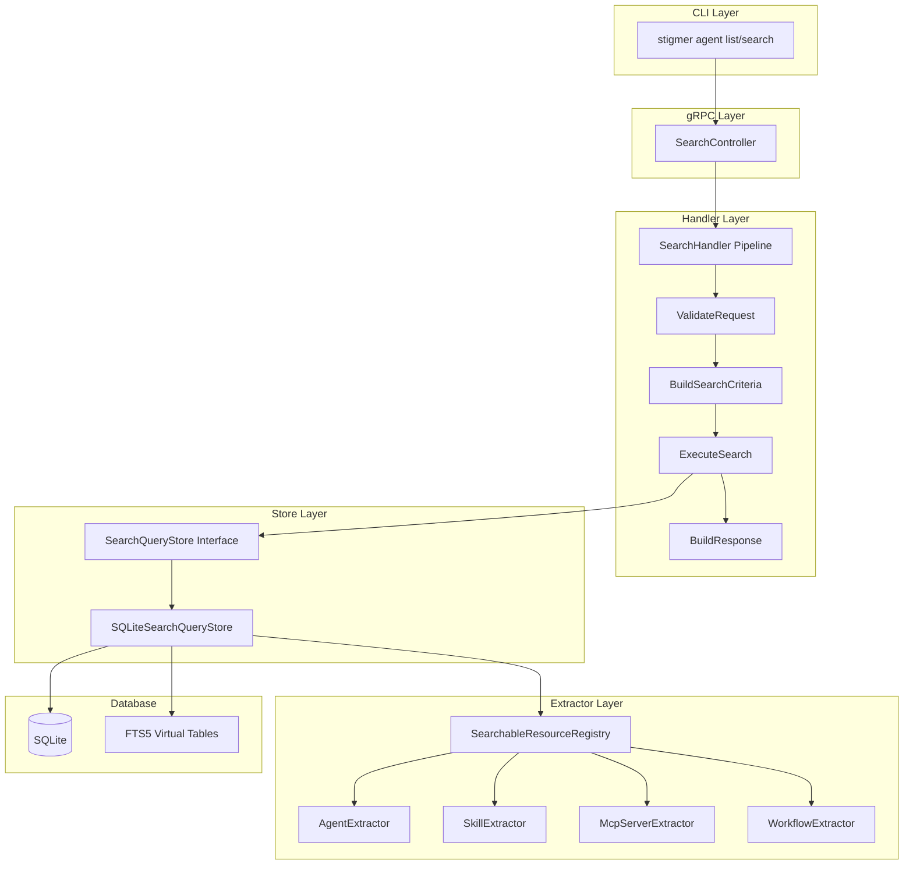

# OSS Backend SearchService Implementation

## Architecture Overview

Port the cloud Java/MongoDB search implementation to Go/SQLite while:

- Following existing OSS backend patterns (pipeline, controller structure)
- Using SQLite FTS5 for full-text search instead of MongoDB text indexes
- Simplifying authorization (OSS is single-user, no FGA)




## Package Structure

```
backend/services/stigmer-server/pkg/
└── query/
    └── search/
        ├── README.md                           # Architecture documentation
        ├── BUILD.bazel
        ├── controller/
        │   ├── BUILD.bazel
        │   └── search_controller.go            # gRPC handler
        ├── handler/
        │   ├── BUILD.bazel
        │   ├── search_handler.go               # Pipeline orchestration
        │   └── search_handler_test.go
        ├── extractor/
        │   ├── BUILD.bazel
        │   ├── extractor.go                    # Interface definition
        │   ├── registry.go                     # Auto-discovery registry
        │   ├── registry_test.go
        │   ├── agent_extractor.go
        │   ├── skill_extractor.go
        │   ├── mcpserver_extractor.go
        │   └── workflow_extractor.go
        ├── store/
        │   ├── BUILD.bazel
        │   ├── search_query_store.go           # Interface
        │   ├── sqlite_search_query_store.go    # SQLite + FTS5 impl
        │   └── sqlite_search_query_store_test.go
        └── valueobject/
            ├── BUILD.bazel
            ├── search_criteria.go              # Validated search params
            ├── search_criteria_test.go
            ├── search_paged_result.go          # Result container
            └── search_paged_result_test.go
```

## Key Components

### 1. SQLite Schema Migration (V3)

Add FTS5 virtual tables for full-text search to [backend/libs/go/store/sqlite/store.go](backend/libs/go/store/sqlite/store.go):

```go
// New migration: migrateToV3()
// Creates FTS5 virtual tables synced with resources table
CREATE VIRTUAL TABLE search_fts USING fts5(
    kind,                    -- For filtering (UNINDEXED won't help FTS5)
    resource_id UNINDEXED,   -- Join key, not searchable
    name,                    -- Weight: 10 (via ranking)
    description,             -- Weight: 5
    tags,                    -- Weight: 5
    org UNINDEXED,           -- For filtering
    visibility UNINDEXED,    -- For filtering
    created_at UNINDEXED,    -- For sorting
    tokenize='porter unicode61'  -- Stemming + Unicode support
);
```

FTS5 triggers to keep sync with resources table (extract JSON fields on insert/update/delete).

### 2. Value Objects

**SearchCriteria** - Immutable, validated search parameters:

- Kinds filtering (empty = discover mode)
- Query normalization (trim, max 500 chars)
- Org filter validation
- Pagination bounds (1-100 page size)
- `EffectiveKinds()` returns all searchable kinds when empty

**SearchPagedResult** - Immutable result container:

- Results slice with defensive copying
- CountsByKind map for UI tabs
- TotalCount and TotalPages calculation
- Factory methods: `Empty()`, `Of(...)`

### 3. Extractor Pattern

**SearchableExtractor interface**:

```go
type SearchableExtractor interface {
    Kind() apiresourcekind.ApiResourceKind
    GetSearchSummary(msg proto.Message) string
    ToSearchResult(msg proto.Message, score float32) *searchv1.SearchResult
    GetSearchableFields(msg proto.Message) SearchableFields
}

type SearchableFields struct {
    Name        string
    Description string
    Tags        []string
    Org         string
    Visibility  string
    CreatedAt   int64
}
```

**Registry**: Auto-registers extractors at init time, provides `GetExtractor(kind)`.

### 4. SQLiteSearchQueryStore

Core query logic:

```go
func (s *SQLiteSearchQueryStore) Search(
    ctx context.Context,
    criteria *valueobject.SearchCriteria,
) (*valueobject.SearchPagedResult, error)
```

**With Query (FTS5 search)**:

```sql
SELECT r.data, f.rank
FROM search_fts f
JOIN resources r ON f.resource_id = r.id AND f.kind = r.kind
WHERE search_fts MATCH ?
  AND f.kind IN (?, ?, ?, ?)
  AND (? = '' OR f.org = ?)
  AND (? = 0 OR f.visibility != 'visibility_public')
ORDER BY rank  -- FTS5 BM25 ranking
LIMIT ? OFFSET ?
```

**Without Query (list mode)**:

```sql
SELECT r.data
FROM search_fts f
JOIN resources r ON f.resource_id = r.id AND f.kind = r.kind
WHERE f.kind IN (?, ?, ?, ?)
  AND (? = '' OR f.org = ?)
  AND (? = 0 OR f.visibility != 'visibility_public')
ORDER BY f.created_at DESC
LIMIT ? OFFSET ?
```

### 5. SearchHandler Pipeline

Steps (simpler than cloud - no FGA):

1. **ValidateRequest** - Proto field validation via buf.validate
2. **BuildSearchCriteria** - Convert request to validated value object
3. **ExecuteSearch** - Call SearchQueryStore.Search()
4. **BuildResponse** - Convert SearchPagedResult to SearchResponse proto

### 6. Server Registration

Update [backend/services/stigmer-server/pkg/server/server.go](backend/services/stigmer-server/pkg/server/server.go):

```go
import searchv1 "github.com/stigmer/stigmer/apis/stubs/go/ai/stigmer/search/v1"
import searchcontroller "github.com/stigmer/stigmer/backend/services/stigmer-server/pkg/query/search/controller"

// After store initialization
searchController := searchcontroller.NewSearchController(store)
searchv1.RegisterSearchServiceServer(grpcServer, searchController)
```

## Design Decisions


| Decision               | Rationale                                                                 |
| ---------------------- | ------------------------------------------------------------------------- |
| FTS5 over LIKE queries | Production-grade text search with BM25 ranking, stemming, Unicode support |
| Separate FTS table     | Avoids BLOB storage issues, enables efficient filtering + search          |
| No FGA in OSS          | Single-user local mode - all resources accessible                         |
| Triggers for sync      | Automatic FTS index maintenance on resource changes                       |
| Pipeline pattern       | Consistent with existing codebase, testable, composable                   |
| Extractors             | Open-Closed Principle - add resources without modifying core              |


## Testing Strategy

1. **Value Object Tests**: Validation, normalization, edge cases
2. **Extractor Tests**: Each extractor correctly extracts fields
3. **Registry Tests**: Registration, lookup, supported kinds
4. **Store Tests**: FTS5 queries, pagination, filtering, ranking
5. **Handler Tests**: Pipeline execution, error handling
6. **Integration Test**: End-to-end search flow

## Files to Create


| File                                              | Purpose                      |
| ------------------------------------------------- | ---------------------------- |
| `query/search/README.md`                          | Architecture documentation   |
| `query/search/controller/search_controller.go`    | gRPC entry point             |
| `query/search/handler/search_handler.go`          | Pipeline orchestration       |
| `query/search/extractor/extractor.go`             | Interface + SearchableFields |
| `query/search/extractor/registry.go`              | Extractor registry           |
| `query/search/extractor/agent_extractor.go`       | Agent extraction             |
| `query/search/extractor/skill_extractor.go`       | Skill extraction             |
| `query/search/extractor/mcpserver_extractor.go`   | McpServer extraction         |
| `query/search/extractor/workflow_extractor.go`    | Workflow extraction          |
| `query/search/store/search_query_store.go`        | Interface                    |
| `query/search/store/sqlite_search_query_store.go` | SQLite FTS5 impl             |
| `query/search/valueobject/search_criteria.go`     | Search params VO             |
| `query/search/valueobject/search_paged_result.go` | Result container VO          |


## Files to Modify


| File                                                   | Change                    |
| ------------------------------------------------------ | ------------------------- |
| `backend/libs/go/store/sqlite/store.go`                | Add V3 migration for FTS5 |
| `backend/services/stigmer-server/pkg/server/server.go` | Register SearchService    |
| `backend/services/stigmer-server/BUILD.bazel`          | Add search dependencies   |


## Success Criteria

- `stigmer agent list` returns agents sorted by created_at DESC
- `stigmer agent search "kubernetes"` returns relevance-ranked results
- FTS5 search handles stemming ("deploy" matches "deployment")
- Pagination works correctly with total counts
- All unit tests pass
- No linter errors
- Code follows existing patterns and conventions

