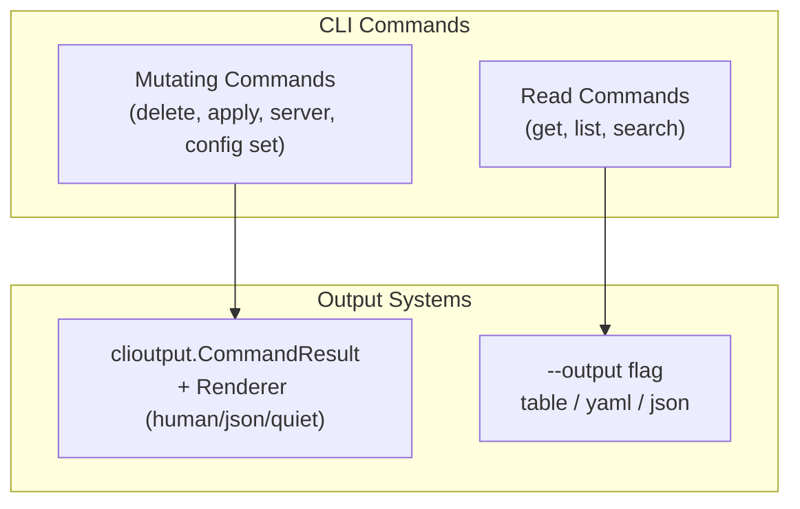

# Design Decision: Output Format Architecture

## The Question

The project flagged a design decision as a prerequisite before Phase 4:

> `--output table/yaml/json` on get/list = data serialization format
> `clioutput.OutputFormat` = CLI chrome format (human/json/quiet)
> Need to decide how these coexist before migrating get/list commands

## Analysis: These Are Two Non-Overlapping Systems

After reading every relevant file, I believe the original framing overstates the problem. These are **two separate concerns that serve different command categories and should never coexist on the same command.** Here is why:

### System 1: `clioutput.CommandResult` + `Renderer` (human/json/quiet)

**Purpose**: Operational feedback for mutating/action commands.

**Used by**: delete, apply, server stop, server status, backend, config set

**What it outputs**: "Did my action succeed?" — status, message, structured sections, hints.

**Example JSON output** (`clioutput.JSONRenderer`):

```json
{
  "status": "success",
  "message": "Agent deleted successfully",
  "sections": [{"title": "Deleted Agent", "fields": [{"key": "ID", "value": "agt_123"}]}]
}
```

**Key trait**: The output schema is always `CommandResult` — a fixed structure defined by clioutput.

### System 2: `--output table/yaml/json` on get/list/search commands

**Purpose**: Data inspection. The user wants to see the resource itself.

**Used by**: get, list, search

**What it outputs**: The raw API resource (protobuf message) in the requested serialization.

**Example JSON output** (`--output json`):

```json
{
  "metadata": {"id": "agt_123", "name": "my-agent", "slug": "my-agent", "org": "stigmer"},
  "spec": {"description": "...", "instructions": "...", "mcp_server_usages": [...]}
}
```

**Key trait**: The output schema is the protobuf resource schema — different per resource type.

### Why They Must Not Merge


| Dimension     | CommandResult                    | Get/List --output                             |
| ------------- | -------------------------------- | --------------------------------------------- |
| Consumer      | Operator checking action results | Developer scripting with resource data        |
| Output schema | Fixed (status/message/sections)  | Per-resource protobuf schema                  |
| JSON meaning  | Operational metadata             | Raw API resource                              |
| Pipeable data | Not meaningful to pipe           | Core use case: `stigmer get agent foo -o json |
| Table format  | Key-value pairs (sections)       | Multi-column rows (NAME, STATUS, CREATED...)  |


Migrating get/list to `CommandResult` would:

- **Break piping**: `stigmer get agent my-agent -o json | jq '.spec'` would stop working because the JSON envelope would change from the raw protobuf to `{"status":"success","sections":[...]}`
- **Lose YAML**: There is no YAML renderer in clioutput (nor should there be — YAML is a data serialization format, not a CLI chrome format)
- **Force a square peg into a round hole**: CommandResult sections with Key-Value pairs cannot represent the multi-row list tables (ID, AGENT, STATUS, STARTED, DURATION columns)

### Recommendation: Acknowledge Separation, Skip to Phase 4

The "design decision" is: **these are two separate systems by design, not by accident.** No coexistence mechanism is needed because they apply to non-overlapping command categories:




## What This Means for Phase 4

Phase 4 ("Consolidate Display Files") should **not** attempt to merge these systems. Instead, it should eliminate the massive boilerplate duplication within the get/list display system (System 2).

### The Duplication Problem

All 8 display.go files repeat identical boilerplate:

- `displayXxxYAML(resource)` — 15-line function, identical logic across all resources (protojson -> yaml)
- `displayXxxJSON(resource)` — 10-line function, identical logic across all resources (protojson -> json)
- `DisplayGetResult(resource, format)` — 7-line switch, identical structure
- `displayXxxTable(resource)` — custom per resource, but uses same cliprint pattern

**Files**: [agent/display.go](client-apps/cli/internal/cli/agent/display.go), [workflow/display.go](client-apps/cli/internal/cli/workflow/display.go), [mcpserver/display.go](client-apps/cli/internal/cli/mcpserver/display.go), [skill/display.go](client-apps/cli/internal/cli/skill/display.go), [project/display.go](client-apps/cli/internal/cli/project/display.go), [execution/display.go](client-apps/cli/internal/cli/execution/display.go), [session/display.go](client-apps/cli/internal/cli/session/display.go), [search/display.go](client-apps/cli/internal/cli/search/display.go)

### Phase 4 Consolidation Approach (High-Level)

**Step 1**: Extract generic YAML/JSON rendering into a `protorender` utility (or extend `pkg/display`):

```go
func RenderProtoYAML(w io.Writer, msg proto.Message) error { ... }
func RenderProtoJSON(w io.Writer, msg proto.Message) error { ... }
```

This eliminates ~120 lines of identical boilerplate across the 8 files (each has its own copy of protojson -> yaml and protojson -> json conversion).

**Step 2**: Create a format dispatcher that each display.go file can use:

```go
func DisplayProto(msg proto.Message, format string, tableFunc func()) {
    switch format {
    case "yaml":
        RenderProtoYAML(os.Stdout, msg)
    case "json":
        RenderProtoJSON(os.Stdout, msg)
    default:
        tableFunc()
    }
}
```

**Step 3**: Each resource's `DisplayGetResult` collapses from ~40 lines to ~5 lines. The table rendering remains resource-specific (since each resource has different fields to show).

**What NOT to do in Phase 4**:

- Do NOT create a `Displayable` interface that tries to generalize table rendering. Each resource's table view is genuinely different (agent shows MCP servers count, execution shows phases/duration, project shows resource counts). A `Displayable` interface would either be too generic to be useful or too complex to justify.
- Do NOT migrate get/list to `clioutput.CommandResult`.
- Do NOT add `--quiet` or `clioutput.OutputFormat` to get/list commands.

## Deliverables

1. Write design decision document to `_projects/.../design-decisions/`
2. Update `next-task.md` to reflect that this decision is resolved and Phase 4 scope is clarified
3. Optionally update the Phase 4 task definition with the refined scope

## Open Question for You

Before I finalize, one thing I want to flag:

The `table` view in `displayAgentTable()` currently uses `cliprint.PrintInfo()` (cyan-colored lines). After Phase 4, should these table views:

- **(A)** Stay as-is with `cliprint.PrintInfo()` — they're data display, not action results, so the cyan info style is fine
- **(B)** Move to plain `fmt.Fprintf` with no color — since this is data, not status messaging
- **(C)** Get their own lightweight styling via the `display` package — consistent but distinct from `clioutput`

This affects how we approach the table rendering in Phase 4 but does not affect the core architecture decision above.