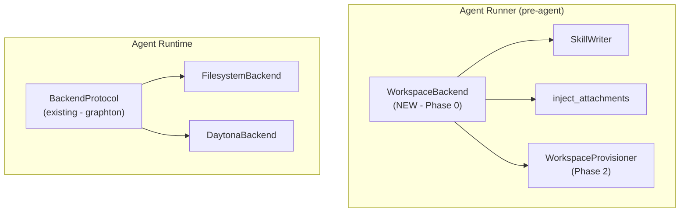
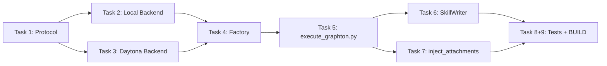

# Phase 0: WorkspaceBackend Extraction — Complete Refactor

## Domain Analysis (per Principal Architect mandate)

### The Critique

`execute_graphton.py` is a 2800+ line function with **10 `is_local_mode()` conditionals** creating parallel code paths for local filesystem vs Daytona sandbox operations. The workspace concept — "the place where an agent operates" — has no domain representation. It is scattered across:

- `sandbox_config["root_dir"]` / `daytona_workspace_root` (two different variables for the same concept)
- `sandbox.fs.`* / `pathlib.Path` (two file I/O stacks, chosen per-call-site)
- `sandbox.process.exec()` / `subprocess.run()` (two execution stacks)
- `SkillWriter(local_root=...)` / `SkillWriter(sandbox=..., workspace_root=...)` (parallel constructors)
- `inject_attachments(sandbox=..., local_root=..., workspace_root=...)` (three mode-discriminating params)

Additionally, `SkillWriter` and `inject_attachments` each maintain their **own** dual-mode implementations internally (36+ and 34 tests respectively), duplicating the same mode-switching pattern.

### The Fix

Introduce `WorkspaceBackend` as a **domain port** (Protocol) representing "a workspace where agents operate." Two adapters — `LocalWorkspaceBackend` and `DaytonaWorkspaceBackend` — encapsulate all mode-specific I/O. A single factory function concentrates the mode decision. All downstream code operates through the protocol, never branching on deployment mode.

### Architectural Findings (Surprises from Exploration)

**1. The protocol needs `execute()` — not just file operations.**
SkillWriter uses `sandbox.process.exec()` for directory creation, zip extraction, and chmod. inject_attachments uses it for extraction. Phase 2's workspace provisioner needs it for `git clone`. Without it, Phase 2 would require a breaking protocol change. Graphton's `FilesystemBackend` already has `execute()`. Adding it now is consistent and forward-looking.

**2. Batch file writing matters for cloud performance.**
Daytona uploads are batched via `sandbox.fs.upload_files([FileUpload(...), ...])` — one HTTP call for N files. The protocol includes `write_files()` (batch variant) so the Daytona adapter can preserve this optimization.

**3. Graphton already has a separate backend abstraction.**
`BackendProtocol` (from deepagents) and `create_sandbox_backend()` in [sandbox_factory.py](backend/libs/python/graphton/src/graphton/core/sandbox_factory.py) handle the **agent's** runtime file operations. Our `WorkspaceBackend` handles the **runner's** pre-agent setup operations. These are different layers:




**4. The `sandbox` object persists beyond WorkspaceBackend's scope.**
Even after creating the backend, the Daytona `sandbox` object is needed for: agent configuration (`sandbox.id`), auto-publish operations, and sandbox lifecycle (cleanup). The factory returns both the backend AND the sandbox.

---

## Protocol Design

New file: [backend/services/agent-runner/worker/workspace/backend.py](backend/services/agent-runner/worker/workspace/backend.py)

```python
@dataclass(frozen=True)
class ExecuteResult:
    exit_code: int
    stdout: str
    stderr: str

class WorkspaceBackend(Protocol):
    @property
    def root_dir(self) -> str: ...
    def write_file(self, rel_path: str, content: bytes) -> None: ...
    def write_files(self, files: Sequence[tuple[str, bytes]]) -> None: ...
    def read_file(self, rel_path: str) -> bytes: ...
    def file_exists(self, rel_path: str) -> bool: ...
    def mkdir(self, rel_path: str) -> None: ...
    def execute(self, command: str, *, cwd: str | None = None, timeout: int = 30) -> ExecuteResult: ...
```

Design constraints:

- **Domain purity**: Protocol uses only stdlib types (`str`, `bytes`, `bool`, `int`, `Sequence`) + our `ExecuteResult`. Zero framework imports.
- **Invalid states are bugs**: `LocalWorkspaceBackend(root_dir="")` raises. `DaytonaWorkspaceBackend(sandbox=None, ...)` raises. Constructors enforce invariants.
- `**write_file` auto-creates parent directories**: Callers never need explicit `mkdir` for file writes. `mkdir` exists for creating empty directories or pre-creating structures.
- `**write_files` preserves batch semantics**: Local adapter loops; Daytona adapter batches into one `upload_files()` call.
- `**execute` cwd is relative to root_dir**: `execute("ls", cwd="src")` runs in `{root_dir}/src/`.
- `**ExecuteResult` mirrors graphton's `ExecutionResult`** (stdout/stderr/exit_code) for consistency, but is our own type (no cross-layer dependency).

---

## Package Structure

```
backend/services/agent-runner/worker/workspace/
    __init__.py          # Public API: WorkspaceBackend, ExecuteResult, initialize_workspace
    backend.py           # Protocol + ExecuteResult dataclass
    local.py             # LocalWorkspaceBackend
    daytona.py           # DaytonaWorkspaceBackend
```

Phase 2 will add `provisioner.py` and `sources/` alongside these files.

---

## Implementation Plan

### Task 1: Protocol + ExecuteResult

- [backend.py](backend/services/agent-runner/worker/workspace/backend.py): `WorkspaceBackend` Protocol, `ExecuteResult` dataclass
- [init.py](backend/services/agent-runner/worker/workspace/__init__.py): Re-export public API

### Task 2: LocalWorkspaceBackend

- [local.py](backend/services/agent-runner/worker/workspace/local.py)
- Uses `pathlib.Path` for file ops, `subprocess.run` for execute
- Constructor takes `root_dir: str | Path`, resolves to absolute, creates if needed
- Path traversal protection (same chroot-like pattern as graphton's [FilesystemBackend._resolve_sandbox_path](backend/libs/python/graphton/src/graphton/core/backends/filesystem.py))
- `write_files()` = loop over `write_file()` (no batching needed locally)

### Task 3: DaytonaWorkspaceBackend

- [daytona.py](backend/services/agent-runner/worker/workspace/daytona.py)
- Uses `sandbox.fs.upload_files()` / `download_file()` / `get_file_info()` for file ops
- Uses `sandbox.process.exec()` for execute
- Constructor takes `sandbox` + `workspace_root: str`. Validates both non-None/non-empty.
- `write_file()`: mkdir parent + single upload (auto-creates dirs)
- `write_files()`: collect unique parent dirs → one `mkdir -p` call → one `upload_files()` call
- `file_exists()`: `sandbox.process.exec(f"test -e {abs_path}")` (same pattern as existing `_check_workspace_file_exists`)
- Does NOT expose `sandbox` publicly. Callers that need the raw sandbox keep their own reference.

### Task 4: Factory function `initialize_workspace`

- Lives in [init.py](backend/services/agent-runner/worker/workspace/__init__.py)
- Signature: `async def initialize_workspace(...) -> tuple[WorkspaceBackend, Sandbox | None, bool]`
- **Single mode check** — replaces the sandbox init block (lines 1264-1307 of execute_graphton.py):
  - Local mode: creates `LocalWorkspaceBackend(root_dir=sandbox_config["root_dir"])`
  - Cloud mode: calls `sandbox_manager.get_or_create_daytona_sandbox()`, computes workspace root (volume mount or `get_work_dir()` fallback), creates `DaytonaWorkspaceBackend`
- Returns `(backend, sandbox_or_none, is_new_sandbox)` — sandbox returned separately for operations not covered by the protocol (agent config via `sandbox.id`, auto-publish, cleanup)

### Task 5: Refactor execute_graphton.py

Replace these mode checks with backend usage:


| Line(s)   | Current                                                  | After                                                |
| --------- | -------------------------------------------------------- | ---------------------------------------------------- |
| 1264-1307 | Sandbox init + root computation (2 checks)               | `initialize_workspace()` factory call                |
| 1365-1375 | Sentinel file check via `_check_workspace_file_exists()` | `workspace_backend.file_exists(sentinel)`            |
| 1436-1457 | SkillWriter dual-constructor                             | `SkillWriter(backend=workspace_backend)`             |
| 1507-1542 | Post-write verification config                           | Derive verify config from backend                    |
| 1615-1622 | inject_attachments mode params                           | `inject_attachments(backend=workspace_backend, ...)` |
| 1929-1954 | Agent sandbox config                                     | Helper derives from backend + sandbox                |
| 2020-2030 | Subagent skill writer kwargs                             | Same pattern as SkillWriter                          |


Delete `_check_workspace_file_exists()` helper (lines 138-197) — replaced entirely by `WorkspaceBackend.file_exists()`.

**Remaining mode checks (2 of 10, deferred):**

- Line 1469: Cloud-only diagnostic listing (`sandbox.process.exec("ls ...")`) — observability concern, not workspace operation
- Line 2806: Auto-publish `local_root` parameter — output delivery concern, addressed in Phase 3

### Task 6: Refactor SkillWriter

- [skill_writer.py](backend/services/agent-runner/worker/activities/graphton/skill_writer.py): Replace `__init__(sandbox=None, local_root=None, workspace_root=None)` with `__init__(backend: WorkspaceBackend)`
- Merge `_write_skills_local()` and `_write_skills_daytona()` into a single `_write_skills()`:
  - Directory creation: `backend.mkdir(skill_dir)`
  - File writing: `backend.write_files([(path, content), ...])` — single batch per skill
  - Artifact extraction: extract zip in memory using `zipfile` (existing validation logic stays), write extracted files via `backend.write_files()`
  - Permissions: `backend.execute("chmod +x ...")` when scripts are extracted
- Delete `_write_skills_local()`, `_write_skills_daytona()`, `_extract_artifact_local()`, `_extract_artifact_daytona()`
- `_resolve_workspace_root()` deleted — replaced by `backend.root_dir`
- Update all 36+ tests in [test_skill_writer.py](backend/services/agent-runner/tests/test_skill_writer.py)

### Task 7: Refactor inject_attachments

- [execute_graphton.py](backend/services/agent-runner/worker/activities/execute_graphton.py): Replace signature `inject_attachments(sandbox, ..., local_root, workspace_root)` with `inject_attachments(backend: WorkspaceBackend, ...)`
- Single file write: `backend.write_file(mount_path, content)` (replaces both Path.write_bytes and FileUpload paths)
- Zip extraction: extract in memory → `backend.write_files(extracted_files)` (replaces both `_extract_zip_local` and `_prepare_daytona_extraction` + post-upload unzip)
- Delete `_extract_zip_local()`, `_prepare_daytona_extraction()`, and the post-upload extraction loop
- Keep `_validate_zip_for_extraction()` unchanged (mode-independent, safety-critical)
- Batch upload accumulation and `sandbox.fs.upload_files()` call removed — handled by `backend.write_files()`
- Update all 34 tests in [test_inject_attachments.py](backend/services/agent-runner/tests/test_inject_attachments.py)

### Task 8: Tests for backend implementations

- `tests/workspace/test_local_backend.py`: Real filesystem (pytest `tmp_path`), ~10 tests
- `tests/workspace/test_daytona_backend.py`: Mocked sandbox (follow existing patterns from [test_workspace_integrity_check.py](backend/services/agent-runner/tests/test_workspace_integrity_check.py)), ~10 tests
- Update [test_workspace_integrity_check.py](backend/services/agent-runner/tests/test_workspace_integrity_check.py) — tests for deleted `_check_workspace_file_exists` replaced with backend.file_exists tests

### Task 9: BUILD.bazel

- New BUILD.bazel for `worker/workspace/` package
- Update existing BUILD.bazel files for changed imports

---

## Execution Order




Tasks 6 and 7 can proceed in parallel once Task 5 lands.

---

## Risk Mitigation

1. **Behavioral equivalence**: Each task must produce identical observable behavior. No new features, no changed semantics. Tests validate this.
2. **SkillWriter test suite (36+ tests)**: Tests rewritten to construct `LocalWorkspaceBackend` or mock `WorkspaceBackend` instead of mock sandbox. Test assertions remain identical — same files at same paths.
3. **inject_attachments test suite (34 tests)**: Same approach. Test contracts unchanged.
4. **Zip extraction behavior change**: Moving from "upload zip → unzip in sandbox" to "extract in memory → write files" is a semantic change for cloud mode. Acceptable because: safety limits cap at 1000 files / 100MB uncompressed, well within runner memory. If this concerns you, I can preserve the sandbox-side extraction path in DaytonaWorkspaceBackend.
5. **Incremental reviewability**: Tasks 1-4 can be reviewed independently before Tasks 5-7 touch the critical path.

---

## Collaboration Checkpoints

I will pause and consult you at these points:

- **After Task 4** (factory complete): Review the protocol API surface before it's consumed by execute_graphton.py
- **Before Task 6**: Confirm the SkillWriter merge strategy (in-memory extraction vs sandbox-side extraction)
- **Before Task 7**: Confirm the inject_attachments merge strategy
- **On any surprise**: Undiscovered mode-specific behavior, test failures that suggest behavioral divergence, or scope creep

