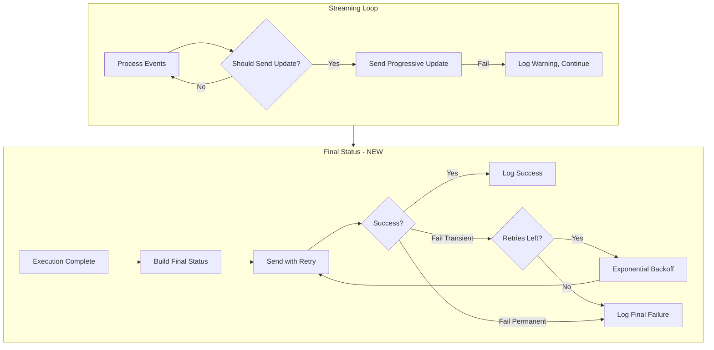

# Phase 1.3: Reliable Final Status Persistence with Retry

## Problem Statement

The current implementation sends final status updates with a single attempt and no retry. If the gRPC call fails due to transient network issues (UNAVAILABLE, DEADLINE_EXCEEDED), the execution status is not persisted to the database. While the status is returned to the Temporal workflow as a fallback, this creates a data loss risk if the workflow also encounters issues.

**Current code (lines 662-671 in execute_graphton.py):**

```python
try:
    await execution_client.update_status(execution_id, status)
except Exception as e:
    activity_logger.error(f"Failed to send final status update: {e}")
    # Continue - no retry, data loss risk
```

## Solution Architecture

Create a dedicated **resilience module** following the established pattern of `worker/streaming/update_scheduler.py`. This approach provides:

- Reusable retry logic for any gRPC operation
- Configuration via environment variables
- Clear separation of concerns (retry policy vs business logic)
- Testable in isolation
- gRPC status code classification (retryable vs permanent errors)



## Key Files

**New files to create:**

- [worker/resilience/__init__.py](backend/services/agent-runner/worker/resilience/__init__.py)
- [worker/resilience/grpc_retry.py](backend/services/agent-runner/worker/resilience/grpc_retry.py)
- [tests/test_grpc_retry.py](backend/services/agent-runner/tests/test_grpc_retry.py)

**Files to modify:**

- [worker/activities/execute_graphton.py](backend/services/agent-runner/worker/activities/execute_graphton.py) - Use retry for final updates

## Detailed Design

### 1. RetryConfig Dataclass

```python
@dataclass(frozen=True)
class RetryConfig:
    """Configuration for retry with exponential backoff.
    
    Attributes:
        max_attempts: Maximum number of attempts (including initial).
        initial_delay_ms: Initial delay between retries in milliseconds.
        backoff_multiplier: Multiplier for exponential backoff.
        max_delay_ms: Maximum delay cap in milliseconds.
    
    Environment Variables:
        GRPC_RETRY_MAX_ATTEMPTS (default: 3)
        GRPC_RETRY_INITIAL_DELAY_MS (default: 1000)
        GRPC_RETRY_BACKOFF_MULTIPLIER (default: 2.0)
        GRPC_RETRY_MAX_DELAY_MS (default: 10000)
    """
    max_attempts: int = 3           # 3 attempts total
    initial_delay_ms: int = 1000    # Start with 1 second
    backoff_multiplier: float = 2.0 # 1s -> 2s -> 4s
    max_delay_ms: int = 10000       # Cap at 10 seconds
```

### 2. gRPC Status Code Classification

```python
# Retryable: Transient network/server issues
RETRYABLE_STATUS_CODES = frozenset([
    grpc.StatusCode.UNAVAILABLE,       # Service temporarily unavailable
    grpc.StatusCode.DEADLINE_EXCEEDED, # Timeout
    grpc.StatusCode.ABORTED,           # Operation aborted (retry may succeed)
    grpc.StatusCode.RESOURCE_EXHAUSTED,# Rate limited (with backoff)
    grpc.StatusCode.INTERNAL,          # Server error (may be transient)
])

# Non-retryable: Client errors or permanent failures
NON_RETRYABLE_STATUS_CODES = frozenset([
    grpc.StatusCode.NOT_FOUND,         # Resource doesn't exist
    grpc.StatusCode.INVALID_ARGUMENT,  # Bad request
    grpc.StatusCode.PERMISSION_DENIED, # Auth failure
    grpc.StatusCode.UNAUTHENTICATED,   # Auth failure
    grpc.StatusCode.ALREADY_EXISTS,    # Duplicate
    grpc.StatusCode.FAILED_PRECONDITION, # State conflict
    grpc.StatusCode.UNIMPLEMENTED,     # Method not supported
])
```

### 3. GrpcRetryExecutor Class

```python
class GrpcRetryExecutor:
    """Executes gRPC calls with retry and exponential backoff.
    
    Example:
        executor = GrpcRetryExecutor(RetryConfig.load_from_env())
        result = await executor.execute(
            operation=lambda: client.update_status(id, status),
            operation_name="update_status",
            context={"execution_id": id}
        )
    """
    
    async def execute(
        self,
        operation: Callable[[], Awaitable[T]],
        operation_name: str,
        context: Optional[Dict[str, str]] = None,
    ) -> T:
        """Execute operation with retry logic."""
```

### 4. Integration with execute_graphton.py

Replace the simple try/except with retry-enabled call:

```python
# Before (current)
try:
    await execution_client.update_status(execution_id, status)
except Exception as e:
    activity_logger.error(f"Failed: {e}")

# After (with retry)
from worker.resilience import GrpcRetryExecutor, RetryConfig

retry_executor = GrpcRetryExecutor(RetryConfig.load_from_env())
try:
    await retry_executor.execute(
        operation=lambda: execution_client.update_status(execution_id, status),
        operation_name="final_status_update",
        context={"execution_id": execution_id, "phase": "COMPLETED"}
    )
except GrpcRetryExhaustedError as e:
    activity_logger.error(f"[FINAL] All retries exhausted: {e}")
except GrpcNonRetryableError as e:
    activity_logger.error(f"[FINAL] Non-retryable error: {e}")
```

## Logging Strategy

Structured logging with `[RETRY]` prefix for observability:

```
[RETRY] operation=final_status_update execution_id=abc123 attempt=1/3 status=starting
[RETRY] operation=final_status_update execution_id=abc123 attempt=1/3 status=failed error=UNAVAILABLE delay_ms=1000
[RETRY] operation=final_status_update execution_id=abc123 attempt=2/3 status=starting
[RETRY] operation=final_status_update execution_id=abc123 attempt=2/3 status=success elapsed_ms=245
```

## Test Coverage Plan

**Unit tests (test_grpc_retry.py):**

1. RetryConfig validation and defaults
2. RetryConfig environment variable loading
3. Status code classification (retryable vs non-retryable)
4. Successful execution on first attempt
5. Successful execution after transient failure
6. Exhausted retries on persistent transient failures
7. Immediate failure on non-retryable errors
8. Backoff timing verification (1s, 2s, 4s progression)
9. Max delay cap enforcement
10. Context logging verification
11. Mixed error scenarios (transient then permanent)
12. Edge cases: zero delay, single attempt

**Target: 25-30 comprehensive tests** matching Phase 1.1/1.2 quality standards.

## Implementation Notes

- **No external dependencies**: Use `asyncio.sleep()` instead of tenacity to avoid adding dependencies
- **Monotonic time**: Use `time.monotonic()` for reliable duration tracking (established pattern)
- **Frozen dataclass**: Immutable configuration (established pattern)
- **Custom exceptions**: `GrpcRetryExhaustedError`, `GrpcNonRetryableError` for clear error handling
- **Type hints**: Full typing with generics for the executor

## Files Summary

| File | Action | Lines (est.) |

|------|--------|--------------|

| `worker/resilience/__init__.py` | Create | ~20 |

| `worker/resilience/grpc_retry.py` | Create | ~300 |

| `tests/test_grpc_retry.py` | Create | ~400 |

| `worker/activities/execute_graphton.py` | Modify | +15 |