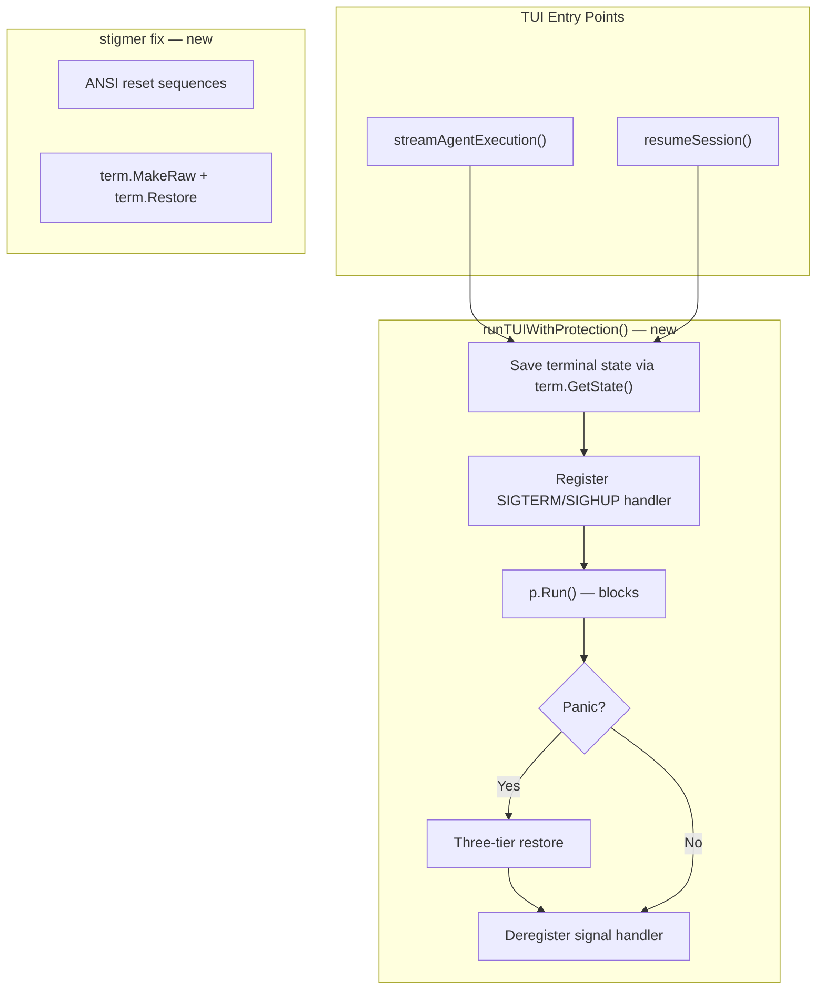

# Phase 1.4: Emergency Terminal Restore on Crash

## Problem

When the execution TUI panics or the process receives SIGTERM/SIGHUP, the alt-screen terminal state is not restored. The user is left with an invisible cursor, no echo, and garbled output. Claude Code had real user complaints about exactly this class of bug.

## Current State

- **Two TUI entry points** both call `p.Run()` with zero protection:
  - `[run_stream.go:124-125](client-apps/cli/cmd/stigmer/root/run_stream.go)` in `streamAgentExecution`
  - `[run_session.go:144-145](client-apps/cli/cmd/stigmer/root/run_session.go)` in `resumeSession`
- **No `defer`/`recover`** around either call
- **No signal handling** for SIGTERM or SIGHUP around the TUI (existing signal handlers are only in daemon/MCP/Temporal — unrelated)
- **No escape hatch command** exists
- Bubbletea v1.2.4 provides `p.Kill()`, `p.Quit()`, and `p.RestoreTerminal()` — all available for use
- `golang.org/x/term` is already a dependency (used in `pkg/display/terminal.go`)

## Architecture

Three components, one shared wrapper:




### Component A: `runTUIWithProtection` — new file `[run_tui.go](client-apps/cli/cmd/stigmer/root/run_tui.go)`

A single wrapper function that both TUI entry points call instead of `p.Run()` directly. Eliminates duplication.

**Panic recovery** (defer/recover):

- Before `p.Run()`: save terminal state with `term.GetState(fd)`
- On panic, three-tier restoration:
  1. `p.RestoreTerminal()` — Bubbletea's own cleanup (knows exactly what it changed)
  2. `term.Restore(fd, origState)` — fallback to saved state
  3. Raw ANSI sequences to stderr (`\033[?1049l\033[?25h\033[0m`) — belt-and-suspenders
- Convert panic to a returned `error` with actionable message (not a re-panic — per the UX mandate, no raw stack traces for users)

**Signal handling** (SIGTERM/SIGHUP):

- Register `signal.Notify` for SIGTERM and SIGHUP before `p.Run()`
- On signal: call `p.Kill()` (not `p.Quit()`) because the event loop may be stuck — `Kill()` bypasses it entirely and restores terminal state
- Deregister signal handler via `signal.Stop()` after `p.Run()` returns (normal or panic path)
- Signal goroutine is stopped via a `done` channel closed in the defer

**Why `p.Kill()` over `p.Quit()`**: `Quit()` sends a message through the event loop. If the TUI is stuck (which is why we're receiving SIGTERM in the first place), the message never gets processed. `Kill()` calls `p.shutdown(true)` which cancels the internal context immediately and restores terminal state — guaranteed to unblock `p.Run()`.

**Scope limitation**: We are NOT wrapping the non-alt-screen Bubbletea programs (progress spinner in `cliprint/progress.go`, approval prompt in `pkg/approval/interactive.go`). They don't use alt-screen, so a panic there causes only raw-mode damage (easily recoverable with `reset`). We can extend later if needed.

### Component B: Integration — one-line change at each call site

In `[run_stream.go](client-apps/cli/cmd/stigmer/root/run_stream.go)` (line 125):

```go
// Before:
finalModel, err := p.Run()
// After:
finalModel, err := runTUIWithProtection(p)
```

In `[run_session.go](client-apps/cli/cmd/stigmer/root/run_session.go)` (line 145):

```go
// Before:
finalModel, err := p.Run()
// After:
finalModel, err := runTUIWithProtection(p)
```

No other changes to these files. `streamCancel()` and all downstream logic remain untouched.

### Component C: `stigmer fix` command — new file `[fix.go](client-apps/cli/cmd/stigmer/root/fix.go)`

A bare `stigmer fix` command that restores terminal sanity. Designed to be typed blind when the terminal is broken.

What it does:

1. Write ANSI reset sequences to stdout: exit alt-screen (`\033[?1049l`), show cursor (`\033[?25h`), reset attributes (`\033[0m`), reset scrolling region (`\033[r`)
2. Restore terminal to cooked mode via `term.MakeRaw(fd)` + immediate `term.Restore(fd, state)` (this forces the terminal driver to recalculate its state), OR use `stty sane` via exec as a more portable approach
3. Print a confirmation: "Terminal restored." to stderr

Registered in `[root.go](client-apps/cli/cmd/stigmer/root.go)` under the "config" group (utility commands).

## Design Decisions

- **Panics become errors, not re-panics**: The UX mandate says "every error must be translated into a human-actionable message." A raw stack trace is not actionable. We log the panic value in the error message and suggest `stigmer fix` as a fallback.
- **Per-TUI signal registration**: Signal handlers are registered only while the TUI is active and deregistered when it exits. No global state, no interference with daemon or MCP signal handlers.
- `**p.Kill()` for both SIGTERM and SIGHUP**: SIGHUP means the terminal is gone (no visual restore needed, but resource cleanup still matters). SIGTERM means "please stop." In both cases, `Kill()` is appropriate because it's immediate and guaranteed.
- **Three-tier restore order**: Bubbletea first (it knows what it changed), saved state second (pure terminal state), ANSI third (raw bytes as final fallback).

## Tests

- **Panic recovery**: Unit test with a model that panics in `Update`. Verify `runTUIWithProtection` returns an error (not a panic) and the error message contains `stigmer fix`. Requires a pty or `tea.WithInput`/`tea.WithOutput` to avoid real terminal interaction.
- **Signal handler goroutine lifecycle**: Verify that after `runTUIWithProtection` returns normally, the signal handler goroutine has exited (no leak). Can use a channel-based approach.
- `**stigmer fix`**: Test that the command runs without error and writes expected ANSI sequences to stdout.
- **Signal handling end-to-end**: Skip unit test — `syscall.Kill(getpid, SIGTERM)` is fragile and process-wide. Rely on code review and manual testing.

## Files Changed


| File                                               | Change                                               |
| -------------------------------------------------- | ---------------------------------------------------- |
| `client-apps/cli/cmd/stigmer/root/run_tui.go`      | **New** — `runTUIWithProtection` wrapper             |
| `client-apps/cli/cmd/stigmer/root/run_stream.go`   | One-line: `p.Run()` -> `runTUIWithProtection(p)`     |
| `client-apps/cli/cmd/stigmer/root/run_session.go`  | One-line: `p.Run()` -> `runTUIWithProtection(p)`     |
| `client-apps/cli/cmd/stigmer/root/fix.go`          | **New** — `stigmer fix` command                      |
| `client-apps/cli/cmd/stigmer/root.go`              | One-line: register `NewFixCommand()`                 |
| `client-apps/cli/cmd/stigmer/root/run_tui_test.go` | **New** — panic recovery + goroutine lifecycle tests |


