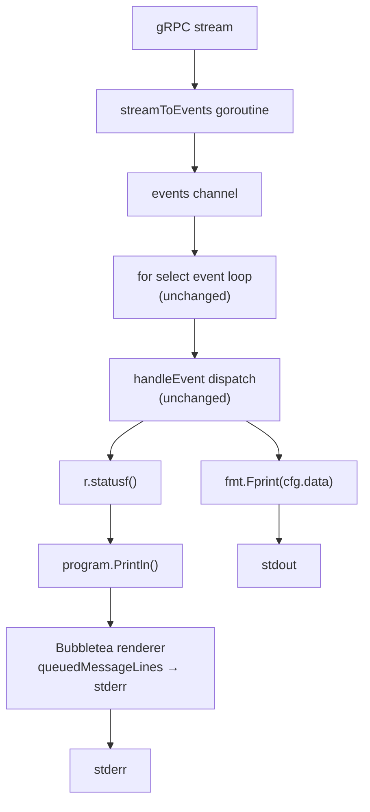

# Phase 1: Bubbletea Program Shell -- Foundation

## Context

The T01 architecture plan defined 7 migration phases. Phase 1 was described as "View() returns empty, all output through tea.Println()". Deep exploration revealed three constraints that require a revised approach (see surprises discussion above). This plan defines the actual implementation for Phase 1.

## Architectural Constraints (from exploration)

- **tea.Println is line-based**: always appends `\r\n`. AI streaming (token-by-token stdout) cannot use it.
- **Update() cannot block**: approval flow blocks for raw terminal input. Event loop stays as `for { select {} }` until Phase 4.
- **stdout/stderr split is the natural boundary**: `tea.WithOutput(os.Stderr)` + `tea.WithInput(nil)` lets Bubbletea own stderr. AI content stays on direct stdout writes. No stdin conflict with InlinePrompter or follow-up scanner.

## Design

### Two sub-steps

**Step 1A -- Infrastructure (types + lifecycle, no output rerouting)**

Create the Bubbletea model, wire the Program into the rendering pipeline, prove it can run alongside existing rendering without interference. All output stays as direct writes. View() returns "". This is a strict additive no-op.

**Step 1B -- Status output migration (stderr through Program.Println)**

Reroute `r.statusf()` through `program.Println()` when a Program is present. This makes Bubbletea the owner of stderr rendering and row tracking -- the prerequisite for all subsequent phases. Tests use a fallback path (no Program, direct writes) so they pass unchanged.

### Data flow after Phase 1




### Key files


| File                             | Action        | Purpose                                                                          |
| -------------------------------- | ------------- | -------------------------------------------------------------------------------- |
| `run_stream_inline_bubbletea.go` | **New**       | `inlineBubbleModel` struct, `Init`, `Update`, `View`                             |
| `run_stream_inline.go`           | **Modify**    | Add `program *tea.Program` to `inlineRenderer`; conditional routing in `statusf` |
| `run_stream.go`                  | **Modify**    | Wire Program creation/lifecycle in `streamAgentInline`                           |
| `run_stream_inline_test.go`      | **No change** | Existing tests pass (no Program in tests = direct write fallback)                |


### Bubbletea Program configuration

```go
program := tea.NewProgram(
    newInlineBubbleModel(),
    tea.WithOutput(statusW),  // Bubbletea renders to stderr
    tea.WithInput(nil),       // disable stdin capture
)
```

- `tea.WithOutput(statusW)` -- Bubbletea's View() and Println() write to the status writer (stderr)
- `tea.WithInput(nil)` -- Bubbletea does not read from stdin. InlinePrompter and follow-up scanner continue using os.Stdin directly.
- No alt screen (inline mode is the default).

### Program lifecycle

1. `streamAgentInline` creates the Program
2. Starts `program.Run()` in a goroutine (blocks until quit)
3. Passes `program` pointer into `inlineRenderConfig`
4. `runInlineFollowUpLoop` runs (potentially multiple `renderInline` calls)
5. On return, sends `tea.Quit` to the Program and waits for the goroutine to exit

### statusf routing (Step 1B)

```go
func (r *inlineRenderer) statusf(format string, args ...interface{}) {
    msg := fmt.Sprintf(format, args...)
    if r.program != nil {
        r.program.Println(strings.TrimRight(msg, "\n"))
        return
    }
    fmt.Fprint(r.cfg.status, msg)
    r.flushWriter(r.cfg.status)
}
```

- `program.Println` is thread-safe (sends to channel) and handles multi-line content (splits on `\n`)
- Trailing newline is trimmed because Println adds its own `\r\n`
- When `r.program` is nil (unit tests, non-TTY), falls back to direct write
- Existing unit tests never set `r.program`, so they use the fallback -- zero test changes needed

### What about the spinner?

The thinking spinner writes `\r` + frame + `\r\033[K` directly to stderr via its own goroutine. In Phase 1, the spinner continues as-is. Since View() returns "" (0 rows), Bubbletea has no active view to track -- spinner writes don't corrupt any cursor state.

However, the spinner and `program.Println` both write to stderr. The spinner is always stopped before any event processing (and thus before any Println calls), so they never write concurrently. The sequence is: spinner.Stop() (clears line) -> handleEvent -> statusf/Println -> resetThinkTimer. This is safe.

Phase 2 will migrate the spinner into View(), eliminating the direct writes entirely.

### What about the follow-up prompt?

`readFollowUpInput` writes directly to `cfg.status` (separator + hint + prompt) then blocks on stdin. After the user submits, `termctl.EraseLines` removes the prompt.

In Phase 1, this stays as-is. The direct writes to `cfg.status` bypass Bubbletea, but since View() returns "" (0 rows tracked), EraseLines can only miscount if Println output hasn't flushed yet. Since Println flushes happen on the renderer's ticker (~16ms) and the follow-up prompt only appears after DoneEvent (no more events coming), all Println output will have flushed before the prompt appears.

Phase 6 will migrate the follow-up prompt into View().

### What about the approval flow?

`handleApproval` writes expanded view to `cfg.status` (will go through Println in Step 1B), then blocks for user input via InlinePrompter (reads from os.Stdin in raw mode). After the user decides, `termctl.EraseLines` removes the expanded view.

In Phase 1, the InlinePrompter continues using os.Stdin directly (no conflict since `tea.WithInput(nil)`). The concern is EraseLines: after Step 1B, approval display output goes through Println (asynchronous, ~16ms flush). If EraseLines fires before the render cycle flushes the Println content, it would erase the wrong rows.

Mitigation: the approval display is rendered via `r.statusf()` calls, which in Step 1B go through `program.Println()`. Then `promptForDecision` is called, which puts the terminal in raw mode. Between the Println calls and the raw mode switch, the Bubbletea render cycle will fire (16ms is much faster than human reaction). For additional safety, we can add a brief `time.Sleep(20ms)` before entering raw mode, or better yet, keep the approval-specific writes as direct (bypass Println) until Phase 4 migrates the entire approval flow into View().

**Decision: In Step 1B, approval-related `statusf` calls continue using direct writes (skip Println routing). A sentinel field `r.inApprovalFlow` gates this.** This is surgically safe and avoids the async-flush-before-raw-mode timing issue entirely. Phase 4 removes this workaround.

## Testing Strategy

- **All existing tests pass unchanged** (no Program in tests = direct write fallback)
- **New test: Program lifecycle** -- validates Program starts, runs with View() returning "", and shuts down cleanly
- **New test: Println ordering** -- sends multiple events through the Program and verifies stderr output order matches expectation
- **Manual smoke test** -- run a real agent execution and verify visual output is identical to pre-Phase-1

## Success Criteria

1. All existing `run_stream_inline*_test.go` tests pass without modification
2. `go vet` and `go build` clean
3. New `run_stream_inline_bubbletea.go` file with `inlineBubbleModel`
4. Program starts and stops cleanly in `streamAgentInline`
5. Status output appears identically on stderr (no visual regression)
6. AI content on stdout is unaffected
7. Approval flow works (no timing issues with EraseLines)
8. Follow-up prompt works
9. Spinner works
10. `--json` mode is untouched

