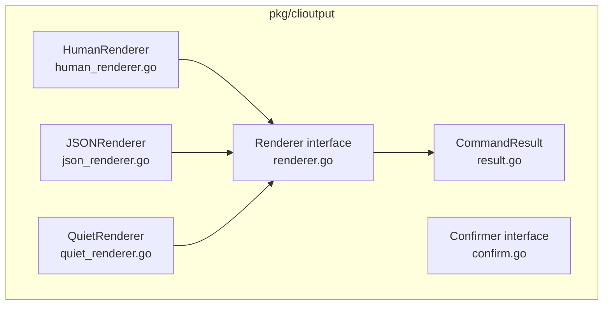

# Phase 1: Core `clioutput` Package Foundation

## Scope Decision

The original T01 plan included three sub-phases under Phase 1. After analysis, **Phase 1 is scoped to sub-phase 1.1 only** (the core `pkg/clioutput/` package):

- **1.2 (`Displayable` interface)** deferred to Phase 4 -- designing it without actual migration produces speculative abstractions
- **1.3 (`--output` flag)** deferred to Phase 5 -- adding a flag no command responds to creates dead code

## Package Location

`client-apps/cli/pkg/clioutput/` -- this is a `pkg/` package per the [coding guidelines](client-apps/cli/.cursor/rules/client-apps/cli/coding-guidelines.mdc):

- Zero Stigmer-specific business logic
- Zero imports from `internal/`
- Reusable by any CLI wanting structured output
- Visibility: `//visibility:public` (Bazel)

## Architecture




## Files to Create (7 source + 5 test + 1 build = 13 files)

### 1. `result.go` -- CommandResult value object (~90 lines)

The core domain type. A structured representation of any command's output.

```go
type ResultStatus int
const (
    StatusSuccess ResultStatus = iota
    StatusWarning
    StatusError
)

type CommandResult struct {
    Status   ResultStatus
    Message  string
    Sections []Section
    Hints    []string
}

type Section struct {
    Title  string
    Fields []KeyValue
    Items  []string
}

type KeyValue struct {
    Key   string
    Value string
}
```

Builder API:

- `Success(msg, args...)`, `Warning(msg, args...)`, `Error(msg, args...)` -- constructors
- `result.AddSection(title)` returns `*Section` (pointer into the result's slice)
- `section.Field(key, value)`, `section.Fieldf(key, fmt, args...)` -- chainable, return `*Section`
- `section.Item(text)`, `section.Itemf(fmt, args...)` -- chainable
- `result.Hint(text)`, `result.Hintf(fmt, args...)` -- chainable, return `*CommandResult`

**Critical**: `AddSection` returns a pointer to the section within the slice. This avoids the builder needing to return two types and keeps chaining ergonomic:

```go
r := clioutput.Success("Agent deleted")
r.AddSection("Resource Details").
    Field("ID", agent.Metadata.Id).
    Field("Name", agent.Metadata.Name)
r.Hint("View agents: stigmer list agents")
```

### 2. `renderer.go` -- Renderer interface + factory (~40 lines)

```go
type OutputFormat string
const (
    FormatHuman OutputFormat = "human"
    FormatJSON  OutputFormat = "json"
    FormatQuiet OutputFormat = "quiet"
)

type Renderer interface {
    Render(result *CommandResult)
}

func NewRenderer(format OutputFormat, stdout, stderr io.Writer) Renderer
```

The factory takes **both** stdout and stderr because:

- HumanRenderer writes to stderr (all decorative)
- JSONRenderer writes data to stdout, status to stderr
- QuietRenderer writes to stderr

### 3. `human_renderer.go` -- Human-readable renderer (~120 lines)

Strict semantic vocabulary (from the plan):

- Success: `✓ Message` (green bold)
- Warning: `⚠ Message` (yellow bold)
- Error: `✗ Message` (red bold)
- Section title: `Title:` (bold, no icon, no color)
- Key-value:   `Key    Value` (dim key, normal value, padded to max key width + 4 spaces)
- Bullet item:   `- Item text` (normal)
- Hint:   `hint text` (dim)

Uses `fatih/color` with `Fprint`* methods to write to the injected `io.Writer` (not stdout). Blank lines between status/sections/hints for visual breathing room.

**Key detail**: Key alignment is per-section. We compute `maxKeyWidth` for each section independently, then pad all keys in that section to `maxKeyWidth` before adding the 4-space gap.

### 4. `json_renderer.go` -- Machine-readable renderer (~50 lines)

Outputs the CommandResult as JSON to stdout. Structure:

```json
{
  "status": "success",
  "message": "Agent deleted successfully",
  "sections": [...],
  "hints": [...]
}
```

Status is serialized as a lowercase string (`"success"`, `"warning"`, `"error"`), not an integer.
Uses `encoding/json` with indent formatting. No external dependencies.

### 5. `quiet_renderer.go` -- Minimal renderer (~35 lines)

Only prints the status line (same formatting as human: `✓ Message` etc.). Suppresses sections, hints, and fields entirely. Useful for scripting where you only need pass/fail.

### 6. `confirm.go` -- Confirmer interface + implementations (~70 lines)

```go
type Confirmer interface {
    Confirm(prompt string) (bool, error)
}
```

Two implementations:

- `**InteractiveConfirmer**`: Takes `In io.Reader` + `Out io.Writer`. Checks if `In` is a terminal via `term.IsTerminal()`. If not a terminal, returns `(false, nil)` (safe default -- user agreed). Writes prompt to `Out`, reads line from `In`, accepts only "y" or "Y" as confirmation. Default (Enter) = no.
- `**AlwaysYesConfirmer**`: Returns `(true, nil)` always. Used when `--force` is set.

### 7. `BUILD.bazel` -- Bazel build file

Following the [existing convention](client-apps/cli/pkg/display/BUILD.bazel):

- Library target named `clioutput`
- Import path: `github.com/stigmer/stigmer/client-apps/cli/pkg/clioutput`
- Visibility: `["//visibility:public"]`
- Deps: `@com_github_fatih_color//:color`, `@org_golang_x_term//:term`
- Test target with `embed` and `stretchr/testify` deps

### 8-12. Test files

One test file per source file:

- `result_test.go` -- builder construction, chaining, empty results
- `human_renderer_test.go` -- captures output to `bytes.Buffer`, verifies formatting, alignment, icon usage
- `json_renderer_test.go` -- verifies valid JSON output, correct field names, status string representation
- `quiet_renderer_test.go` -- verifies only status line appears, no sections/hints
- `confirm_test.go` -- tests interactive confirmation with mocked reader, non-terminal detection, AlwaysYes

## Dependencies (external)

- `github.com/fatih/color` -- already in go.mod, for colored terminal output
- `golang.org/x/term` -- already in go.mod, for terminal detection in Confirmer
- `encoding/json` -- stdlib, for JSON renderer
- No new dependencies required

## Execution Order

Files are created in dependency order. Each file is followed immediately by its test.

1. `result.go` + `result_test.go` (foundation -- no internal deps)
2. `renderer.go` (interface depends on CommandResult)
3. `human_renderer.go` + `human_renderer_test.go` (implements Renderer)
4. `json_renderer.go` + `json_renderer_test.go` (implements Renderer)
5. `quiet_renderer.go` + `quiet_renderer_test.go` (implements Renderer)
6. `confirm.go` + `confirm_test.go` (independent of Renderer)
7. `BUILD.bazel`
8. Verify: `go build`, `go test`, check lints

## Quality Checklist (from coding guidelines)

- Every file under 150 lines (targeting 50-120)
- Every function under 50 lines
- Every error wrapped with specific context
- Interfaces for behavior abstraction (Renderer, Confirmer)
- No business logic -- pure output infrastructure
- No `internal/` imports
- Descriptive file names
- Full test coverage for all public API

