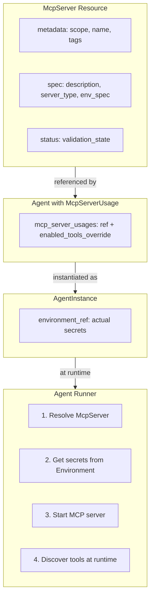

# Phase 1: McpServer Proto Definitions

## Overview

Create a first-class `McpServer` API resource by extracting MCP server configuration from `AgentSpec` into a standalone, reusable resource. This enables:

- **Reusability**: Define once, use across multiple agents
- **Multi-Scope Support**: Platform (marketplace), Organization (private), Identity Account (personal)
- **FGA Authorization**: Proper access control with scope-based permissions
- **Marketplace Discoverability**: Tags, descriptions, categorization

## Architecture



## Key Design Decisions

| Decision | Choice | Rationale |

|----------|--------|-----------|

| ApiResourceKind | `mcp_server = 44` | Already defined in enum |

| Scope support | All three scopes | Platform, Org, Identity Account |

| Environment handling | Reuse `EnvironmentSpec` | Consistency with Agent/Workflow |

| Tool discovery | Runtime only | Requires valid credentials |

| Versioning | Mutable (no versioning) | Start simple, add later if needed |

| Status | Validation only | No health checks (runtime concern) |

## Target Directory Structure

```
apis/ai/stigmer/agentic/mcpserver/v1/
  api.proto          # McpServer resource definition
  spec.proto         # McpServerSpec (configuration)
  status.proto       # McpServerStatus (validation state)
  io.proto           # McpServerId wrapper
  query.proto        # McpServerQueryController (get, getByReference)
  command.proto      # McpServerCommandController (apply, create, update, delete)
```

---

## File 1: spec.proto

**Purpose**: Define `McpServerSpec` with server type configurations (stdio, http, docker).

**Key elements**:

- Extract and refine `StdioServer`, `HttpServer`, `DockerServer` from [agent/v1/spec.proto](apis/ai/stigmer/agentic/agent/v1/spec.proto)
- Rename to `*Config` suffix (e.g., `StdioServerConfig`) for clarity
- Replace `env_placeholders` with `env_spec` using `EnvironmentSpec` from [environment/v1/spec.proto](apis/ai/stigmer/agentic/environment/v1/spec.proto)
- Add marketplace fields: `description`, `icon_url`, `tags`
- Add `default_enabled_tools` for tool filtering

**Message structure**:

```protobuf
message McpServerSpec {
  string description = 1;                    // Marketplace description
  string icon_url = 2;                       // UI icon
  repeated string tags = 3;                  // Categorization (git, aws, slack)
  
  oneof server_type {
    StdioServerConfig stdio = 4;
    HttpServerConfig http = 5;
    DockerServerConfig docker = 6;
  }
  
  repeated string default_enabled_tools = 7; // Empty = all tools
  EnvironmentSpec env_spec = 8;              // Required env vars (schema only)
}
```

**Validation rules**:

- `server_type` oneof is required (at least one must be set)
- `StdioServerConfig.command` is required
- `HttpServerConfig.url` is required with URL pattern validation
- `DockerServerConfig.image` is required with container image pattern

---

## File 2: status.proto

**Purpose**: Define `McpServerStatus` for validation state tracking.

**Key decision**: Status is deliberately simple - tool discovery happens at runtime (in agent-runner) because it requires valid credentials.

**Message structure**:

```protobuf
message McpServerStatus {
  ApiResourceAudit audit = 99;              // Standard audit (field 99 convention)
  ValidationState validation_state = 1;
  string validation_message = 2;            // Error details if invalid
}

enum ValidationState {
  VALIDATION_STATE_UNSPECIFIED = 0;
  VALIDATION_STATE_VALID = 1;
  VALIDATION_STATE_INVALID = 2;
}
```

**What's NOT in status (by design)**:

- `discovered_tools` - requires runtime credentials
- `health_state` - requires runtime credentials
- `last_health_check` - requires runtime credentials

---

## File 3: api.proto

**Purpose**: Define the main `McpServer` resource.

**Key elements**:

- Follow the [skill/v1/api.proto](apis/ai/stigmer/agentic/skill/v1/api.proto) pattern
- Support all three scopes (platform, organization, identity_account) - unlike Skill which restricts to platform/org
- Use `const` validation for `api_version` and `kind`

**Message structure**:

```protobuf
message McpServer {
  string api_version = 1 [(buf.validate.field).string.const = 'agentic.stigmer.ai/v1'];
  string kind = 2 [(buf.validate.field).string.const = 'McpServer'];
  ApiResourceMetadata metadata = 3 [(buf.validate.field).required = true];
  McpServerSpec spec = 4;
  McpServerStatus status = 5;
}
```

**Scope validation**: Unlike Skill (platform/org only), McpServer supports all three scopes - NO CEL constraint on `owner_scope`.

---

## File 4: io.proto

**Purpose**: Define ID wrapper and any request/response messages.

**Message structure**:

```protobuf
message McpServerId {
  string value = 1 [(buf.validate.field).required = true];
}
```

---

## File 5: query.proto

**Purpose**: Define `McpServerQueryController` for read operations.

**Pattern**: Follow [environment/v1/query.proto](apis/ai/stigmer/agentic/environment/v1/query.proto)

**Service structure**:

```protobuf
service McpServerQueryController {
  option (api_resource_kind) = mcp_server;
  
  rpc get(ApiResourceId) returns (McpServer) {
    // Authorization: mcp_server.can_view on resource ID
  }
  
  rpc getByReference(ApiResourceReference) returns (McpServer);
    // Custom authorization in handler (scope-aware resolution)
}
```

---

## File 6: command.proto

**Purpose**: Define `McpServerCommandController` for write operations.

**Pattern**: Follow [environment/v1/command.proto](apis/ai/stigmer/agentic/environment/v1/command.proto)

**Service structure**:

```protobuf
service McpServerCommandController {
  option (api_resource_kind) = mcp_server;
  
  rpc apply(McpServer) returns (McpServer);
    // Custom authorization in handler (determines create vs update)
  
  rpc create(McpServer) returns (McpServer);
    // Authorization handled in handler (scope-aware)
  
  rpc update(McpServer) returns (McpServer) {
    // Authorization: mcp_server.can_edit on metadata.id
  }
  
  rpc delete(ApiResourceDeleteInput) returns (McpServer) {
    // Authorization: mcp_server.can_delete on resource_id
  }
}
```

---

## Migration from AgentSpec

**Current state** in [agent/v1/spec.proto](apis/ai/stigmer/agentic/agent/v1/spec.proto):

```protobuf
message AgentSpec {
  repeated McpServerDefinition mcp_servers = 4;  // Inline definitions
}
```

**Phase 2 will add** (not in this phase):

```protobuf
message AgentSpec {
  repeated McpServerDefinition mcp_servers = 4 [deprecated = true];
  repeated McpServerUsage mcp_server_usages = 8;  // NEW: References
}

message McpServerUsage {
  ApiResourceReference mcp_server_ref = 1;
  repeated string enabled_tools_override = 2;
  string alias = 3;
}
```

---

## Build and Verification

After creating all proto files:

1. **Generate stubs**: Run `make build-protos` from the `apis/` directory
2. **Verify generation**: Check `stubs/` directory for generated files:

   - `stubs/go/ai/stigmer/agentic/mcpserver/v1/*.go`
   - `stubs/python/ai/stigmer/agentic/mcpserver/v1/*.py`

---

## Quality Standards

- Every field MUST have documentation comments explaining purpose and constraints
- Every required field MUST have `buf.validate` rules
- Follow existing naming conventions exactly (e.g., `ValidationState` not `McpServerValidationState`)
- Use `EnvironmentSpec` for env vars - do NOT create new env var handling
- Status audit field MUST be at position 99 (Stigmer convention)

---

## Files to Reference During Implementation

| File | Purpose |

|------|---------|

| [skill/v1/api.proto](apis/ai/stigmer/agentic/skill/v1/api.proto) | Resource pattern |

| [skill/v1/spec.proto](apis/ai/stigmer/agentic/skill/v1/spec.proto) | Spec pattern |

| [skill/v1/status.proto](apis/ai/stigmer/agentic/skill/v1/status.proto) | Status pattern with audit |

| [environment/v1/query.proto](apis/ai/stigmer/agentic/environment/v1/query.proto) | Query controller pattern |

| [environment/v1/command.proto](apis/ai/stigmer/agentic/environment/v1/command.proto) | Command controller pattern |

| [agent/v1/spec.proto](apis/ai/stigmer/agentic/agent/v1/spec.proto) | Extract MCP definitions from here |

| [environment/v1/spec.proto](apis/ai/stigmer/agentic/environment/v1/spec.proto) | EnvironmentSpec to import |