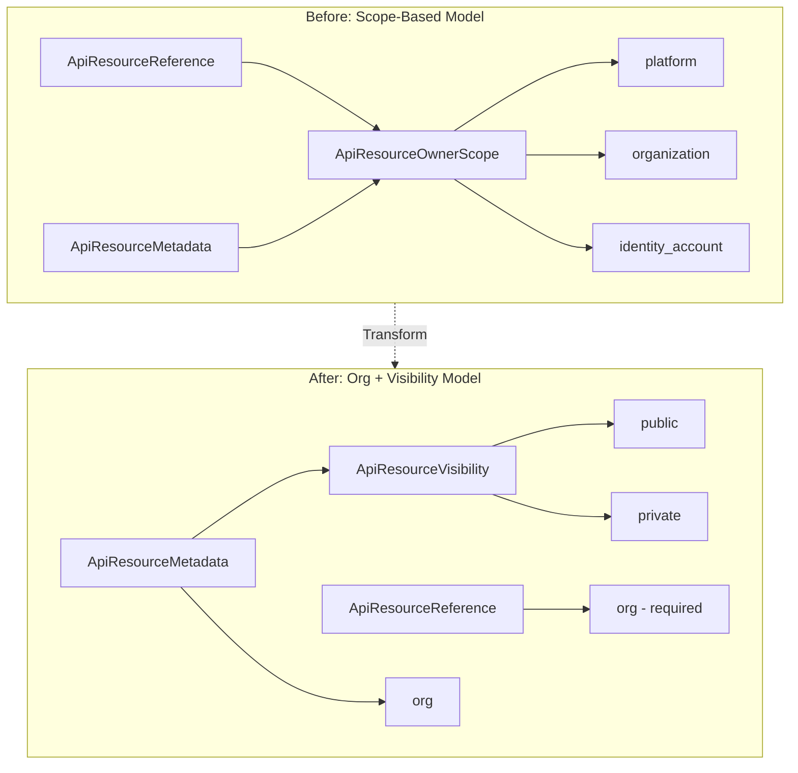

# Phase 1: API Resource Scope Redesign - Proto Changes

This is foundational work that replaces the three-scope model (platform/organization/identity_account) with the simpler GitHub model: every resource belongs to an organization, with visibility (public/private) as an orthogonal concern.

---

## Architecture Overview




---

## Core Proto Files

### 1. Add ApiResourceVisibility Enum

File: [apis/ai/stigmer/commons/apiresource/enum.proto](apis/ai/stigmer/commons/apiresource/enum.proto)

Add new enum following proto3 naming conventions:

```protobuf
// Visibility controls who can access a resource.
// Orthogonal to ownership - visibility is about access, not ownership.
enum ApiResourceVisibility {
  // Default/unspecified - backend infers from context.
  // For new resources: defaults to PRIVATE.
  API_RESOURCE_VISIBILITY_UNSPECIFIED = 0;

  // Only members of the owning organization can access.
  // This is the default for most resources.
  API_RESOURCE_VISIBILITY_PRIVATE = 1;

  // Anyone can access (read) this resource.
  // Used for marketplace-published resources.
  API_RESOURCE_VISIBILITY_PUBLIC = 2;
}
```

Then **delete** the `ApiResourceOwnerScope` enum (lines 28-51).

### 2. Update ApiResourceMetadata

File: [apis/ai/stigmer/commons/apiresource/metadata.proto](apis/ai/stigmer/commons/apiresource/metadata.proto)

Replace `owner_scope` (field 5) with `visibility`:

```protobuf
message ApiResourceMetadata {
  string name = 1;
  string slug = 2;
  string id = 3;
  
  // Organization that owns this resource. Required in Cloud Mode.
  // In Local Mode: defaults to "default" org.
  string org = 4;
  
  // Visibility controls who can access this resource.
  // Private: only org members. Public: anyone.
  // Default: PRIVATE for new resources.
  ApiResourceVisibility visibility = 5 [(buf.validate.field).enum.defined_only = true];
  
  // ... fields 6-9 unchanged
}
```

### 3. Update ApiResourceReference

File: [apis/ai/stigmer/commons/apiresource/io.proto](apis/ai/stigmer/commons/apiresource/io.proto)

Remove `scope` field, make `org` required:

```protobuf
message ApiResourceReference {
  // Organization that owns the referenced resource. Required.
  // Format: lowercase alphanumeric with hyphens (e.g., "stigmer", "acme-corp").
  string org = 1 [(buf.validate.field).required = true];

  // Kind of the referenced resource.
  ai.stigmer.commons.apiresource.apiresourcekind.ApiResourceKind kind = 2;

  // Resource slug (user-friendly identifier).
  string slug = 3;

  // Version reference (optional).
  string version = 4 [(buf.validate.field).string.pattern = "^$|^latest$|^[a-zA-Z0-9._-]+$|^[a-f0-9]{64}$"];
  
  // Field 5 reserved for future use (previously scope-related)
  reserved 5;
}
```

**Important**: Field numbers are renumbered for cleaner API (org=1, kind=2, slug=3, version=4). This is acceptable for a clean break as the plan specifies.

---

## Domain-Specific Proto Files

Each domain resource has CEL validations that reference `owner_scope`. These must be updated to use `visibility` or removed entirely.

### 4. Skill API

File: [apis/ai/stigmer/agentic/skill/v1/api.proto](apis/ai/stigmer/agentic/skill/v1/api.proto)

- Remove CEL validation `skill.owner_scope.platform_or_org_only`
- Update metadata field to allow any visibility

File: [apis/ai/stigmer/agentic/skill/v1/io.proto](apis/ai/stigmer/agentic/skill/v1/io.proto)

- Remove `scope` field from `PushSkillRequest`
- Keep `org` field as required

### 5. Workflow Task (Agent Call)

File: [apis/ai/stigmer/agentic/workflow/v1/tasks/agent_call.proto](apis/ai/stigmer/agentic/workflow/v1/tasks/agent_call.proto)

- Remove `scope` field from `AgentCallTaskConfig`
- Add `org` field for explicit org reference (optional, defaults to workflow's org)

### 6. Other Domain Resources

Update CEL validations in these files - remove `owner_scope` checks:

- [apis/ai/stigmer/agentic/workflowexecution/v1/api.proto](apis/ai/stigmer/agentic/workflowexecution/v1/api.proto)
- [apis/ai/stigmer/agentic/agentexecution/v1/api.proto](apis/ai/stigmer/agentic/agentexecution/v1/api.proto)
- [apis/ai/stigmer/agentic/executioncontext/v1/api.proto](apis/ai/stigmer/agentic/executioncontext/v1/api.proto)
- [apis/ai/stigmer/agentic/session/v1/api.proto](apis/ai/stigmer/agentic/session/v1/api.proto)
- [apis/ai/stigmer/agentic/environment/v1/api.proto](apis/ai/stigmer/agentic/environment/v1/api.proto)
- [apis/ai/stigmer/agentic/workflowinstance/v1/api.proto](apis/ai/stigmer/agentic/workflowinstance/v1/api.proto)
- [apis/ai/stigmer/agentic/workflowinstance/v1/command.proto](apis/ai/stigmer/agentic/workflowinstance/v1/command.proto)
- [apis/ai/stigmer/agentic/workflowexecution/v1/command.proto](apis/ai/stigmer/agentic/workflowexecution/v1/command.proto)
- [apis/ai/stigmer/agentic/workflowexecution/v1/query.proto](apis/ai/stigmer/agentic/workflowexecution/v1/query.proto)
- [apis/ai/stigmer/agentic/mcpserver/v1/api.proto](apis/ai/stigmer/agentic/mcpserver/v1/api.proto)
- [apis/ai/stigmer/agentic/agent/v1/api.proto](apis/ai/stigmer/agentic/agent/v1/api.proto)
- [apis/ai/stigmer/agentic/workflow/v1/api.proto](apis/ai/stigmer/agentic/workflow/v1/api.proto)

---

## Documentation Updates

Update all comments and doc-strings that reference:

- "platform scope" -> explain org-based ownership instead
- "owner_scope" -> "visibility"
- Scope semantics in API documentation

---

## Stub Regeneration

After all proto changes:

```bash
cd /Users/suresh/scm/github.com/stigmer/stigmer
make protos
```

This regenerates:

- Go stubs in `apis/stubs/go/`
- Python stubs in `apis/stubs/python/`

---

## Validation Checklist

After implementation:

- `buf lint` passes
- `buf build` succeeds
- `make protos` generates stubs without errors
- No references to `ApiResourceOwnerScope` remain in `.proto` files
- All CEL validations updated or removed
- Go stubs compile
- Python stubs import without errors

---

## Breaking Change Summary


| Component                       | Change Type | Impact                      |
| ------------------------------- | ----------- | --------------------------- |
| ApiResourceOwnerScope           | Deleted     | All consumers must migrate  |
| ApiResourceReference.scope      | Removed     | Field no longer exists      |
| ApiResourceReference.org        | Required    | Was optional, now required  |
| ApiResourceMetadata.owner_scope | Replaced    | Now `visibility` enum       |
| Domain CEL validations          | Removed     | No scope-based restrictions |


