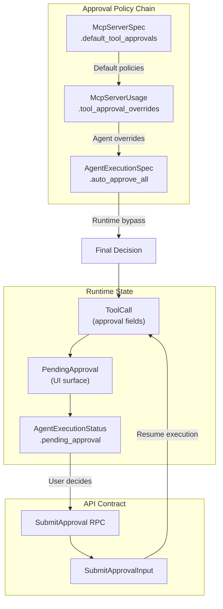

# Phase 1: HITL Approval Flow - Proto Contracts

## Scope

This phase establishes the foundational proto contracts for the approval system. Every field, enum, and message must be designed with the understanding that this will be the backbone of tool approval across direct agent calls, sub-agents, and workflows.

## Architecture Overview



## File Changes Summary

| File | Changes |

|------|---------|

| `agentexecution/v1/enum.proto` | Add `TOOL_CALL_WAITING_APPROVAL`, `TOOL_CALL_SKIPPED`, `EXECUTION_WAITING_FOR_APPROVAL` |

| `agentexecution/v1/api.proto` | Add `ApprovalAction` enum, approval fields to `ToolCall`, `PendingApproval` message |

| `agentexecution/v1/spec.proto` | Add `auto_approve_all` to `AgentExecutionSpec` |

| `agentexecution/v1/command.proto` | Add `SubmitApproval` RPC, `SubmitApprovalInput` message |

| `mcpserver/v1/spec.proto` | Add `ToolApprovalPolicy`, `default_tool_approvals` field |

| `agent/v1/spec.proto` | Add `ToolApprovalOverride`, `tool_approval_overrides` field |

| `workflowexecution/v1/enum.proto` | Add `WORKFLOW_TASK_WAITING_APPROVAL` |

---

## Detailed Proto Specifications

### 1. ToolCallStatus Enum Extension

**File**: [`apis/ai/stigmer/agentic/agentexecution/v1/enum.proto`](apis/ai/stigmer/agentic/agentexecution/v1/enum.proto)

Add two new statuses following the existing pattern:

```protobuf
enum ToolCallStatus {
  TOOL_CALL_STATUS_UNSPECIFIED = 0;
  TOOL_CALL_PENDING = 1;    // Waiting to execute
  TOOL_CALL_RUNNING = 2;    // Currently executing
  TOOL_CALL_COMPLETED = 3;  // Successfully completed
  TOOL_CALL_FAILED = 4;     // Failed with error
  TOOL_CALL_WAITING_APPROVAL = 5;  // NEW: Blocked on user approval
  TOOL_CALL_SKIPPED = 6;           // NEW: User skipped this tool
}
```

**Design rationale**:

- `WAITING_APPROVAL` represents a distinct lifecycle state (not failed, not pending)
- `SKIPPED` is a terminal state like COMPLETED/FAILED, but indicates user chose not to execute

### 2. ExecutionPhase Enum Extension

**File**: [`apis/ai/stigmer/agentic/agentexecution/v1/enum.proto`](apis/ai/stigmer/agentic/agentexecution/v1/enum.proto)

```protobuf
enum ExecutionPhase {
  // ... existing values 0-5 ...
  EXECUTION_WAITING_FOR_APPROVAL = 6;  // NEW: Blocked on tool approval
}
```

**Design rationale**:

- Execution-level phase allows UI to show distinct state (different from IN_PROGRESS)
- Enables filtering/querying for executions awaiting action

### 3. ApprovalAction Enum

**File**: [`apis/ai/stigmer/agentic/agentexecution/v1/api.proto`](apis/ai/stigmer/agentic/agentexecution/v1/api.proto)

New enum defining user's decision:

```protobuf
// ApprovalAction represents the user's decision on an approval request.
//
// ## Action Semantics
//
// - APPROVE: Execute the tool normally, continue execution
// - SKIP: Return "skipped by user" message to LLM, continue execution
// - REJECT: Fail the execution immediately with rejection error
//
// ## LLM Behavior on Skip
//
// When a tool is skipped, the LLM receives a message like:
// "Tool 'delete_repository' was skipped by user. Please proceed without this operation."
// This allows the LLM to adapt its plan while preserving execution continuity.
enum ApprovalAction {
  APPROVAL_ACTION_UNSPECIFIED = 0;
  APPROVAL_ACTION_APPROVE = 1;  // Execute the tool
  APPROVAL_ACTION_SKIP = 2;     // Skip tool, continue execution
  APPROVAL_ACTION_REJECT = 3;   // Stop execution with error
}
```

### 4. ToolCall Approval Fields

**File**: [`apis/ai/stigmer/agentic/agentexecution/v1/api.proto`](apis/ai/stigmer/agentic/agentexecution/v1/api.proto)

Add approval fields to existing `ToolCall` message (after field 9):

```protobuf
message ToolCall {
  // ... existing fields 1-9 ...

  // ─────────────────────────────────────────────────────────────────────────────
  // Approval Fields (HITL Phase 1)
  //
  // These fields track the approval state for tools that require user consent
  // before execution. Populated only for tools where approval is configured.
  // ─────────────────────────────────────────────────────────────────────────────

  // True if this tool requires approval before execution.
  // Determined at runtime by merging:
  //   1. McpServer.default_tool_approvals (platform/org defaults)
  //   2. McpServerUsage.tool_approval_overrides (agent-specific)
  //   3. AgentExecutionSpec.auto_approve_all (runtime bypass)
  //
  // When true and status == TOOL_CALL_WAITING_APPROVAL, the tool is paused
  // awaiting user decision via SubmitApproval RPC.
  bool requires_approval = 10;

  // Human-readable message explaining what approval is being requested.
  // Populated from ToolApprovalPolicy.message with argument placeholders resolved.
  //
  // Examples:
  //   - "Delete repository: my-important-repo"
  //   - "Force push to branch: main"
  //   - "Send email to: customer@example.com"
  //
  // If no custom message configured, defaults to: "Execute tool: {tool_name}"
  string approval_message = 11;

  // ISO 8601 timestamp when approval was requested.
  // Set when status transitions to TOOL_CALL_WAITING_APPROVAL.
  // Used for tracking approval latency and potential timeout logic.
  // Example: "2026-01-30T15:30:00Z"
  string approval_requested_at = 12;

  // ISO 8601 timestamp when approval decision was made.
  // Set when user submits APPROVE, SKIP, or REJECT via SubmitApproval.
  // Example: "2026-01-30T15:32:15Z"
  string approval_decided_at = 13;

  // User ID of who made the approval decision.
  // Extracted from authentication context when SubmitApproval is called.
  // Important for audit trails and accountability.
  // Example: "usr_abc123xyz"
  string approved_by = 14;

  // The action taken by the user.
  // Only populated after approval decision is made (approval_decided_at is set).
  // Determines how the tool execution proceeds:
  //   - APPROVE: Tool executes normally
  //   - SKIP: Tool returns skip message, execution continues
  //   - REJECT: Execution fails with rejection error
  ApprovalAction approval_action = 15;
}
```

### 5. PendingApproval Message

**File**: [`apis/ai/stigmer/agentic/agentexecution/v1/api.proto`](apis/ai/stigmer/agentic/agentexecution/v1/api.proto)

New message for surfacing approval requests to UI:

```protobuf
// PendingApproval surfaces the current approval request for UI display.
//
// ## Purpose
//
// This message provides all information needed for a UI to render an approval
// dialog/card. It's populated when an execution enters WAITING_FOR_APPROVAL phase.
//
// ## Relationship to ToolCall
//
// While ToolCall contains the canonical approval state, PendingApproval provides
// a denormalized view optimized for UI consumption. The tool_call_id links back
// to the authoritative ToolCall record.
//
// ## Sub-Agent Approvals
//
// When a sub-agent's tool requires approval, the main agent's pending_approval
// is populated with from_sub_agent=true. This allows UI to show:
// "Sub-agent 'code-reviewer' needs approval to execute 'delete_file'"
message PendingApproval {
  // ID of the tool call waiting for approval.
  // Use this when calling SubmitApproval to identify which tool call to resume.
  // Format: Tool call ID from the agent runtime (e.g., "tc_abc123")
  string tool_call_id = 1;

  // Name of the tool requiring approval.
  // Matches ToolCall.name for correlation.
  // Example: "delete_repository", "send_email", "execute_sql"
  string tool_name = 2;

  // Human-readable approval message for display.
  // Copied from ToolCall.approval_message for UI convenience.
  // Contains resolved placeholders (e.g., "Delete repo: my-repo")
  string message = 3;

  // Sanitized preview of tool arguments for informed decision-making.
  // Sensitive values (passwords, tokens) are redacted.
  // Displayed as formatted JSON or key-value pairs in UI.
  //
  // Example:
  //   {
  //     "repository": "acme/important-repo",
  //     "force": true,
  //     "reason": "cleanup"
  //   }
  string args_preview = 4;

  // ISO 8601 timestamp when the approval was requested.
  // Enables UI to show waiting duration: "Waiting for 2 minutes"
  string requested_at = 5;

  // True if this approval originates from a sub-agent.
  // Enables differentiated UI treatment:
  //   - false: "Agent needs approval to..."
  //   - true: "Sub-agent 'name' needs approval to..."
  bool from_sub_agent = 6;

  // Name of the sub-agent if from_sub_agent is true.
  // Example: "code-reviewer", "researcher", "debugger"
  // Empty if from_sub_agent is false.
  string sub_agent_name = 7;
}
```

### 6. AgentExecutionStatus Extension

**File**: [`apis/ai/stigmer/agentic/agentexecution/v1/api.proto`](apis/ai/stigmer/agentic/agentexecution/v1/api.proto)

Add `pending_approval` field to `AgentExecutionStatus` (after field 12):

```protobuf
message AgentExecutionStatus {
  // ... existing fields 1-12 ...

  // ─────────────────────────────────────────────────────────────────────────────
  // Pending Approval (HITL Phase 1)
  //
  // When phase == EXECUTION_WAITING_FOR_APPROVAL, this field contains
  // details about the tool call awaiting user decision.
  // ─────────────────────────────────────────────────────────────────────────────

  // Current pending approval request, if any.
  //
  // Lifecycle:
  // 1. Populated when a tool with requires_approval=true is about to execute
  // 2. Phase changes to EXECUTION_WAITING_FOR_APPROVAL
  // 3. User submits decision via SubmitApproval RPC
  // 4. Field is cleared, phase returns to EXECUTION_IN_PROGRESS
  //
  // Only one pending approval at a time (tools execute sequentially in LangGraph).
  // If multiple tools need approval, they are handled one at a time.
  PendingApproval pending_approval = 13;
}
```

### 7. AgentExecutionSpec Extension

**File**: [`apis/ai/stigmer/agentic/agentexecution/v1/spec.proto`](apis/ai/stigmer/agentic/agentexecution/v1/spec.proto)

Add `auto_approve_all` field (after field 6):

```protobuf
message AgentExecutionSpec {
  // ... existing fields 1-6 ...

  // ─────────────────────────────────────────────────────────────────────────────
  // Approval Configuration (HITL Phase 1)
  //
  // Runtime control over approval behavior for this specific execution.
  // ─────────────────────────────────────────────────────────────────────────────

  // Auto-approve all tool executions for this execution.
  //
  // When true, tools that would normally require approval are automatically
  // approved without user intervention. This is the highest-priority override
  // in the approval policy chain.
  //
  // Use cases:
  // - Automated CI/CD pipelines where human approval isn't practical
  // - Trusted batch operations with pre-validated inputs
  // - Development/testing environments
  // - Scheduled jobs where approval would block automation
  //
  // Security consideration: This flag bypasses all approval checks.
  // Ensure appropriate access controls on who can set this flag.
  //
  // Default: false (approvals required as configured in policies)
  bool auto_approve_all = 7;
}
```

### 8. SubmitApproval RPC and Input

**File**: [`apis/ai/stigmer/agentic/agentexecution/v1/command.proto`](apis/ai/stigmer/agentic/agentexecution/v1/command.proto)

Add new RPC to `AgentExecutionCommandController`:

```protobuf
service AgentExecutionCommandController {
  // ... existing RPCs ...

  // Submit approval decision for a pending tool call.
  //
  // ## Preconditions
  //
  // - Execution must be in EXECUTION_WAITING_FOR_APPROVAL phase
  // - tool_call_id must match status.pending_approval.tool_call_id
  // - User must have permission to approve (authorization checked by handler)
  //
  // ## Behavior by Action
  //
  // - APPROVE: Tool executes normally, execution resumes
  // - SKIP: Tool returns skip message to LLM, execution continues
  // - REJECT: Execution fails with rejection error
  //
  // ## State Transitions
  //
  // On success:
  // - ToolCall.approval_action = submitted action
  // - ToolCall.approval_decided_at = current timestamp
  // - ToolCall.approved_by = authenticated user ID
  // - AgentExecutionStatus.pending_approval = cleared
  // - ExecutionPhase = EXECUTION_IN_PROGRESS (or FAILED if REJECT)
  //
  // ## Error Conditions
  //
  // - NOT_FOUND: Execution doesn't exist
  // - FAILED_PRECONDITION: Execution not in WAITING_FOR_APPROVAL phase
  // - INVALID_ARGUMENT: tool_call_id doesn't match pending approval
  // - PERMISSION_DENIED: User lacks approval permission
  rpc SubmitApproval(SubmitApprovalInput) returns (AgentExecution) {
    option (ai.stigmer.iam.iampolicy.v1.rpcauthorization.config).resource_kind = agent_execution;
    option (ai.stigmer.iam.iampolicy.v1.rpcauthorization.config).permission = can_edit;
    option (ai.stigmer.iam.iampolicy.v1.rpcauthorization.config).field_path = "agent_execution_id";
    option (ai.stigmer.iam.iampolicy.v1.rpcauthorization.config).error_msg = "unauthorized to submit approval for agent execution";
  }
}

// Input for submitting an approval decision.
//
// All fields are required. The handler validates that:
// 1. The execution exists and is in the correct phase
// 2. The tool_call_id matches the current pending approval
// 3. The action is a valid enum value (not UNSPECIFIED)
message SubmitApprovalInput {
  // ID of the agent execution.
  // Format: "aex_abc123xyz456"
  string agent_execution_id = 1 [(buf.validate.field).string.min_len = 1];

  // ID of the tool call to approve/skip/reject.
  // Must match status.pending_approval.tool_call_id.
  // Format: Tool call ID from agent runtime
  string tool_call_id = 2 [(buf.validate.field).string.min_len = 1];

  // User's decision: APPROVE, SKIP, or REJECT.
  // UNSPECIFIED is rejected by validation.
  ApprovalAction action = 3 [
    (buf.validate.field).enum.defined_only = true,
    (buf.validate.field).enum.not_in = [0]
  ];

  // Optional reason/comment for the decision.
  // Stored for audit purposes.
  // Examples:
  //   - "Verified safe to delete" (on APPROVE)
  //   - "Will handle manually" (on SKIP)
  //   - "Unexpected target repository" (on REJECT)
  string comment = 4;
}
```

### 9. McpServerSpec Extension - Default Policies

**File**: [`apis/ai/stigmer/agentic/mcpserver/v1/spec.proto`](apis/ai/stigmer/agentic/mcpserver/v1/spec.proto)

Add approval policy to `McpServerSpec` (after field 8):

```protobuf
message McpServerSpec {
  // ... existing fields 1-8 ...

  // ─────────────────────────────────────────────────────────────────────────────
  // Default Tool Approval Policies (HITL Phase 1)
  //
  // These policies define which tools require user approval by default.
  // Agents using this MCP server inherit these policies unless overridden.
  // ─────────────────────────────────────────────────────────────────────────────

  // Default tool approval policies for this MCP server.
  //
  // Tools listed here require user approval before execution by default.
  // This is the first layer in the approval policy chain:
  //   McpServer defaults → Agent overrides → Execution auto_approve_all
  //
  // Use cases:
  // - Mark destructive operations as requiring approval by default
  // - Protect sensitive data access across all agents using this server
  // - Establish organization-wide safety policies
  //
  // Example (GitHub MCP):
  //   default_tool_approvals:
  //     - tool_name: "delete_repository"
  //       message: "Delete repository: {{args.repo}}"
  //     - tool_name: "force_push"
  //       message: "Force push to {{args.branch}}"
  //     - tool_name: "add_collaborator"
  //       message: "Add {{args.user}} as collaborator to {{args.repo}}"
  //
  // Tools not listed here do not require approval by default.
  // Agents can still add approval requirements via tool_approval_overrides.
  repeated ToolApprovalPolicy default_tool_approvals = 9;
}

// ToolApprovalPolicy defines approval requirements for a specific tool.
//
// ## Message Templates
//
// The message field supports {{args.field}} placeholders that are resolved
// at runtime using the actual tool arguments. This enables contextual
// approval messages that help users make informed decisions.
//
// Placeholder syntax:
//   {{args.field_name}} - Replaced with the tool argument value
//   {{tool_name}} - Replaced with the tool name (always available)
//
// If a placeholder references a missing argument, it's replaced with "<unknown>".
//
// ## Examples
//
// Simple message:
//   tool_name: "send_email"
//   message: "Send email to {{args.recipient}}"
//   Result: "Send email to customer@example.com"
//
// Multiple placeholders:
//   tool_name: "delete_file"
//   message: "Delete {{args.path}} from {{args.repository}}"
//   Result: "Delete src/main.py from acme/webapp"
//
// Default message (empty):
//   tool_name: "dangerous_operation"
//   message: ""
//   Result: "Execute tool: dangerous_operation" (auto-generated)
message ToolApprovalPolicy {
  // Name of the tool (must match tools/list from MCP server exactly).
  // Case-sensitive matching against tool names reported by the MCP server.
  // Example: "delete_repository", "send_email", "execute_sql"
  string tool_name = 1 [(buf.validate.field).string.min_len = 1];

  // Human-readable message shown to user when approval is requested.
  // Supports {{args.field}} placeholders for dynamic content.
  //
  // If empty, a default message is generated: "Execute tool: {tool_name}"
  //
  // Guidelines for effective messages:
  //   - Be specific about what will happen
  //   - Include the most important argument values
  //   - Keep under 100 characters for UI display
  string message = 2;
}
```

### 10. McpServerUsage Extension - Agent Overrides

**File**: [`apis/ai/stigmer/agentic/agent/v1/spec.proto`](apis/ai/stigmer/agentic/agent/v1/spec.proto)

Add override capability to `McpServerUsage` (after field 2):

```protobuf
message McpServerUsage {
  // ... existing fields 1-2 ...

  // ─────────────────────────────────────────────────────────────────────────────
  // Tool Approval Overrides (HITL Phase 1)
  //
  // Per-agent customization of approval requirements.
  // Takes precedence over McpServer.default_tool_approvals.
  // ─────────────────────────────────────────────────────────────────────────────

  // Override approval requirements for specific tools.
  //
  // These overrides take precedence over McpServer.default_tool_approvals,
  // allowing per-agent customization of the approval policy.
  //
  // Use cases:
  // - Disable approval for a trusted automation agent
  // - Add approval for a tool that doesn't have default approval
  // - Customize the approval message for this agent's context
  //
  // Example (trusted deployment agent):
  //   tool_approval_overrides:
  //     - tool_name: "delete_repository"
  //       requires_approval: false  # Trust this agent for deletions
  //
  // Example (stricter approval for customer-facing agent):
  //   tool_approval_overrides:
  //     - tool_name: "send_email"
  //       requires_approval: true
  //       message: "Send customer communication: {{args.subject}}"
  repeated ToolApprovalOverride tool_approval_overrides = 3;
}

// ToolApprovalOverride allows per-agent customization of approval requirements.
//
// ## Override Semantics
//
// - requires_approval=true: Tool requires approval (even if MCP has no default)
// - requires_approval=false: Tool does NOT require approval (overrides MCP default)
//
// ## Message Inheritance
//
// When requires_approval=true and message is empty:
// - If McpServer has default_tool_approvals for this tool, uses that message
// - Otherwise, auto-generates: "Execute tool: {tool_name}"
//
// When message is provided, it overrides any McpServer default message.
//
// ## Validation
//
// The tool_name should match a tool in the referenced McpServer's tools/list.
// Invalid tool names are silently ignored (no approval applied).
message ToolApprovalOverride {
  // Name of the tool to override.
  // Must match exactly (case-sensitive) with MCP server's tool name.
  string tool_name = 1 [(buf.validate.field).string.min_len = 1];

  // Whether this tool requires approval for this agent.
  //
  // false: No approval needed (overrides any McpServer default)
  // true: Approval required (even if McpServer has no default)
  //
  // Note: This can be further overridden at execution time by
  // AgentExecutionSpec.auto_approve_all=true
  bool requires_approval = 2;

  // Optional: Custom approval message for this agent.
  // Supports {{args.field}} placeholders like ToolApprovalPolicy.message.
  //
  // If empty and requires_approval=true:
  // - Uses McpServer's default message for this tool (if exists)
  // - Otherwise auto-generates default message
  string message = 3;
}
```

### 11. WorkflowTaskStatus Extension

**File**: [`apis/ai/stigmer/agentic/workflowexecution/v1/enum.proto`](apis/ai/stigmer/agentic/workflowexecution/v1/enum.proto)

Add new status for workflow-level visibility:

```protobuf
enum WorkflowTaskStatus {
  // ... existing values 0-5 ...

  // Task is waiting for approval from child agent.
  //
  // This status is set when:
  // - task_type == WORKFLOW_TASK_AGENT_INVOCATION
  // - The invoked AgentExecution has phase == EXECUTION_WAITING_FOR_APPROVAL
  //
  // The workflow runner detects this by polling or watching the child execution.
  // When the child's approval is submitted, the task returns to IN_PROGRESS.
  //
  // UI can show: "Agent 'code-reviewer' is waiting for tool approval"
  //
  // Approval can be submitted through either:
  // - AgentExecution.SubmitApproval (direct)
  // - WorkflowExecution API (forwarded to child - future work)
  //
  // Next statuses: WORKFLOW_TASK_IN_PROGRESS, WORKFLOW_TASK_FAILED
  WORKFLOW_TASK_WAITING_APPROVAL = 6;
}
```

---

## Implementation Order

Execute changes in this order to maintain proto compilation validity:

1. **enum.proto** (agentexecution) - Add new enum values (no dependencies)
2. **api.proto** (agentexecution) - Add ApprovalAction, PendingApproval, ToolCall fields, status field
3. **spec.proto** (agentexecution) - Add auto_approve_all
4. **command.proto** (agentexecution) - Add SubmitApproval RPC (depends on api.proto for ApprovalAction)
5. **spec.proto** (mcpserver) - Add ToolApprovalPolicy, default_tool_approvals
6. **spec.proto** (agent) - Add ToolApprovalOverride, tool_approval_overrides
7. **enum.proto** (workflowexecution) - Add WORKFLOW_TASK_WAITING_APPROVAL

---

## Quality Checklist

Before considering Phase 1 complete:

- [ ] All field numbers are unique and follow existing patterns
- [ ] All enum values have explicit numbers (no implicit assignment)
- [ ] All messages have comprehensive doc comments explaining purpose, lifecycle, examples
- [ ] All fields have buf.validate annotations where appropriate
- [ ] Phase separator comments (─────) match existing style
- [ ] No breaking changes to existing field numbers
- [ ] Proto compiles successfully with `buf build`
- [ ] All stubs regenerated (Python, Go, Java, TypeScript, Dart)
- [ ] Stub changes committed to stigmer-cloud repo

---

## Backward Compatibility Notes

All changes are additive:

- New enum values extend existing enums (no renumbering)
- New fields use field numbers after existing highest
- New messages are independent additions
- No existing field semantics change

Clients that don't understand new fields will simply ignore them (proto3 behavior).