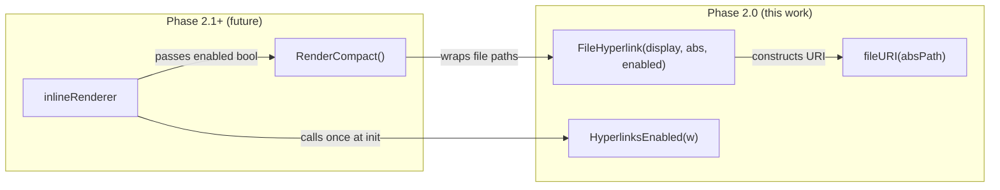

# Phase 2.0: OSC 8 File Hyperlinks

## What We're Building

A single new file — `[client-apps/cli/pkg/toolrender/hyperlink.go](client-apps/cli/pkg/toolrender/hyperlink.go)` — containing three exported functions and their internal helpers. Plus comprehensive tests and BUILD.bazel updates.

No integration into the rendering pipeline yet. Phase 2.0 is purely the building block; Phase 2.1 wires it in.

---

## Architecture




The inline renderer calls `HyperlinksEnabled(cfg.status)` once at initialization, stores the boolean, and passes it down to compact render functions. `FileHyperlink` is pure — no env var reads, no side effects.

---

## File: `pkg/toolrender/hyperlink.go`

### Constants

```go
const (
    osc8Open  = "\033]8;;"   // OSC 8 hyperlink open (params field empty)
    osc8Close = "\033]8;;\033\\" // OSC 8 hyperlink close (empty URI = end)
    st        = "\033\\"     // String Terminator (ESC + backslash)
)
```

Using ESC+backslash as the String Terminator per the modern OSC 8 spec (not BEL/\007).

### Exported Functions

**1. `FileHyperlink(displayPath, absolutePath string, enabled bool) string`**

Pure formatter. When `enabled` is true, wraps `displayPath` in an OSC 8 hyperlink pointing to `file://` + absolutePath. When false, returns `displayPath` unchanged.

- Does NOT read env vars (DI compliance)
- Does NOT check TTY status
- Caller is responsible for determining `enabled`

**2. `Hyperlink(displayText, uri string) string`**

Generic OSC 8 wrapper — not file-specific. `FileHyperlink` delegates to this after constructing the file URI. Exposed as a public function because future features (HTTP URLs in error messages, issue tracker links) will need non-file hyperlinks.

**3. `HyperlinksEnabled(w io.Writer) bool`**

Terminal capability detection. Returns false when:

- `w` is not an `*os.File` or not a TTY (piped output, buffers)
- `TERM` equals `"dumb"` (minimal terminal, no escape sequences)
- `NO_COLOR` env var is set (conservative: user wants plain output)

Returns true otherwise. Called once per renderer lifecycle, not per tool call.

Rationale for `NO_COLOR` disabling hyperlinks: while `NO_COLOR` technically targets color codes, it signals "I want clean text without escape sequences." OSC 8 is an escape sequence. Being conservative here is the right default — users who set `NO_COLOR` expect plain output.

### Internal Helpers

`**fileURI(absPath string) string**`

Converts an absolute filesystem path to a properly-encoded `file://` URI using `net/url.URL{Scheme: "file", Path: absPath}`. Handles spaces, unicode, and special characters correctly.

---

## File: `pkg/toolrender/hyperlink_test.go`

### Test Cases

`**FileHyperlink` tests:**

- `enabled=true` with simple path — verify exact OSC 8 byte sequence
- `enabled=false` — verify returns displayPath unchanged (graceful degradation)
- Path with spaces — verify URI percent-encoding (`/my dir/file.go` -> `file:///my%20dir/file.go` in the escape sequence)
- Path with unicode characters
- Empty displayPath / empty absolutePath — verify no panic, reasonable output
- Display path differs from absolute path (e.g., relative display, absolute URI)

`**Hyperlink` tests:**

- Generic URI (e.g., `https://...`) — verify OSC 8 wrapping

`**fileURI` tests:**

- Simple absolute path: `/Users/foo/bar.go` -> `file:///Users/foo/bar.go`
- Path with spaces: proper percent-encoding
- Path with `#`, `%`, `?` characters — these are URI-significant and must be encoded

`**HyperlinksEnabled` tests:**

- `bytes.Buffer` writer (not `*os.File`) -> false
- Pipe `*os.File` (not a TTY) -> false
- `t.Setenv("TERM", "dumb")` -> false
- `t.Setenv("NO_COLOR", "1")` -> false
- Default env (no TERM=dumb, no NO_COLOR) with non-TTY writer -> false (TTY check takes precedence)

Note: Testing the `true` path requires a real TTY fd, which isn't available in CI. The negative cases give us confidence that detection correctly rejects non-capable terminals. A manual verification step is included in the plan.

---

## File: `pkg/toolrender/BUILD.bazel`

Add `hyperlink.go` to `srcs`, `hyperlink_test.go` to test `srcs`, and `@org_golang_x_term//:term` to `deps` (for TTY detection in `HyperlinksEnabled`).

---

## Important: What Phase 2.0 Does NOT Do

- Does NOT modify any existing rendering functions (`Render`, `RenderWithBadge`, etc.)
- Does NOT create `RenderCompact` (that's Phase 2.1)
- Does NOT integrate hyperlinks into the inline renderer event loop
- Does NOT address the `display/colors.go` `stripANSI` limitation (it only handles CSI `\x1b[...m`, not OSC `\x1b]...`). This is a Phase 2.1 integration concern — when hyperlinked strings flow through `MeasureColorizedString` or `TrimColorizedString`, those functions will need OSC-awareness. Flagged here so we don't forget.

---

## Verification

1. `bazel build //client-apps/cli/pkg/toolrender:toolrender` — compiles
2. `bazel test //client-apps/cli/pkg/toolrender:toolrender_test` — all tests pass
3. Manual: write a small throwaway `main.go` that prints `FileHyperlink("render.go", "/absolute/path/render.go", true)` and verify the hyperlink is clickable in iTerm2/Ghostty/Wezterm (not committed, just local verification)

